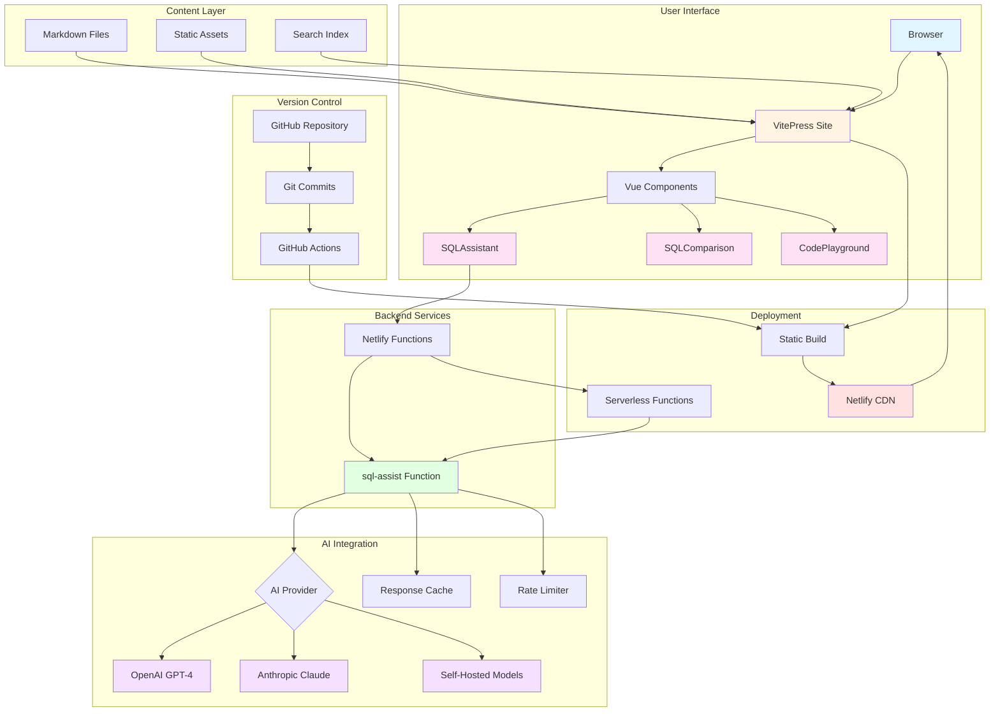

# SQLpedia - The SQL Knowledge Resource

> A comprehensive, Wikipedia-style SQL knowledge resource with AI-powered features

[](https://opensource.org/licenses/MIT)
[](https://app.netlify.com/sites/sqlpedia/deploys)

## Overview

SQLpedia is an open-source, community-driven SQL knowledge resource that provides comprehensive documentation, examples, and comparisons for multiple SQL dialects. Built with VitePress and enhanced with AI-powered tools, it helps developers, data engineers, and database administrators learn SQL, compare dialects, and solve real-world problems.

### Key Features

- 🗄️ **Multi-Database Coverage** - PostgreSQL, MySQL, SQL Server, Oracle, SQLite, BigQuery, Snowflake, DuckDB, and more
- 🔄 **Dialect Comparisons** - Side-by-side syntax comparisons and migration guides
- 🤖 **AI-Powered Assistance** - Generate, explain, optimize, and translate SQL queries
- 📚 **Comprehensive Patterns** - Real-world SQL patterns for analytics, ETL, and optimization
- 🚀 **StackQL Integration** - Query cloud infrastructure and APIs using SQL
- 🌐 **Community-Driven** - Open source with contributions via GitHub
- ⚡ **Fast & Modern** - Built with VitePress for lightning-fast performance
- 🎨 **Wikipedia-Inspired** - Familiar layout and intuitive navigation

## Architecture



### Architecture Components

1. **Frontend (VitePress)**
   - Static site generation with Vue 3
   - Markdown-based content
   - Custom Vue components for interactive features
   - Built-in search functionality

2. **Interactive Components**
   - `SQLAssistant`: AI-powered SQL generation, explanation, optimization, and translation
   - `SQLComparison`: Side-by-side dialect comparison
   - `CodePlayground`: Interactive SQL editor (coming soon)

3. **Backend (Netlify Functions)**
   - Serverless functions for AI integration
   - Response caching for performance
   - Rate limiting for API protection
   - Support for multiple AI providers

4. **AI Integration**
   - OpenAI (GPT-4, GPT-3.5)
   - Anthropic (Claude)
   - Self-hosted models (Llama, CodeLlama)
   - Automatic fallback and error handling

5. **Deployment**
   - Netlify CDN for global distribution
   - GitHub Actions for CI/CD
   - Automatic preview deploys for PRs

## Quick Start

### Prerequisites

- Node.js 18 or higher
- npm or yarn
- Git

### Local Development

1. **Clone the repository**

```bash
git clone https://github.com/stackql/sqlpedia.org.git
cd sqlpedia.org
```

2. **Install dependencies**

```bash
npm install
```

3. **Start development server**

```bash
npm run dev
```

The site will be available at `http://localhost:5173`

4. **Build for production**

```bash
npm run build
```

5. **Preview production build**

```bash
npm run preview
```

## Project Structure

```
sqlpedia.org/
├── docs/                          # Documentation content
│   ├── .vitepress/               # VitePress configuration
│   │   ├── config.mts            # Site configuration
│   │   └── theme/                # Custom theme
│   │       ├── index.ts          # Theme entry point
│   │       ├── style.css         # Custom styles
│   │       └── components/       # Vue components
│   │           ├── SQLAssistant.vue
│   │           ├── SQLComparison.vue
│   │           └── CodePlayground.vue
│   ├── index.md                  # Homepage
│   ├── databases/                # Database-specific docs
│   │   ├── postgresql/
│   │   ├── mysql/
│   │   ├── sqlserver/
│   │   └── ...
│   ├── concepts/                 # SQL concepts
│   │   ├── basics/
│   │   ├── joins/
│   │   ├── window-functions/
│   │   └── ...
│   ├── patterns/                 # SQL patterns
│   │   ├── analytics/
│   │   ├── etl/
│   │   └── ...
│   ├── comparisons/              # Dialect comparisons
│   │   ├── dialect-differences.md
│   │   └── migration-guides.md
│   └── stackql/                  # StackQL docs
│       ├── cloud-apis.md
│       └── infrastructure.md
├── netlify/
│   └── functions/                # Netlify Functions
│       └── sql-assist.mts        # AI assistance endpoint
├── netlify.toml                  # Netlify configuration
├── package.json                  # Dependencies
└── README.md                     # This file
```

## Configuration

### VitePress Configuration

The main configuration is in `docs/.vitepress/config.mts`. Key settings:

- **Site metadata**: Title, description, language
- **Navigation**: Top nav and sidebar menus
- **Search**: Local search configuration
- **Theme**: Colors, fonts, layout options
- **Markdown**: Code highlighting, plugins

### Netlify Configuration

Configuration is in `netlify.toml`:

- **Build settings**: Command, output directory
- **Functions**: Serverless function configuration
- **Redirects**: API routing
- **Headers**: Security and caching headers

### Environment Variables

For AI features to work, set these in Netlify dashboard or `.env` file:

```bash
# OpenAI (optional)
OPENAI_API_KEY=your-openai-api-key

# Anthropic (optional)
ANTHROPIC_API_KEY=your-anthropic-api-key

# At least one AI provider key is required for AI features
```

**Note**: If no API keys are provided, the system falls back to demo/mock responses.

## Deployment

### Deploy to Netlify

#### Option 1: One-Click Deploy

[](https://app.netlify.com/start/deploy?repository=https://github.com/stackql/sqlpedia.org)

#### Option 2: Manual Deploy

1. **Create Netlify account** at [netlify.com](https://www.netlify.com)

2. **Connect repository**
   - Click "Add new site" → "Import an existing project"
   - Connect your GitHub account
   - Select the `sqlpedia.org` repository

3. **Configure build settings**
   - Build command: `npm run build`
   - Publish directory: `docs/.vitepress/dist`
   - Functions directory: `netlify/functions`

4. **Set environment variables** (optional, for AI features)
   - Go to Site settings → Environment variables
   - Add `OPENAI_API_KEY` or `ANTHROPIC_API_KEY`

5. **Deploy**
   - Click "Deploy site"
   - Your site will be live at `https://your-site-name.netlify.app`

#### Option 3: CLI Deploy

```bash
# Install Netlify CLI
npm install -g netlify-cli

# Login to Netlify
netlify login

# Initialize Netlify (first time only)
netlify init

# Deploy
netlify deploy --prod
```

### Custom Domain

1. Go to Netlify dashboard → Domain settings
2. Add custom domain
3. Configure DNS according to Netlify instructions
4. SSL certificate is automatically provisioned

## Contributing

We welcome contributions from the community! Here's how you can help:

### Ways to Contribute

1. **Add Content**
   - Write new SQL guides and tutorials
   - Add database-specific documentation
   - Create pattern examples
   - Improve existing content

2. **Fix Issues**
   - Report bugs
   - Fix typos and errors
   - Improve code examples
   - Update outdated information

3. **Enhance Features**
   - Improve Vue components
   - Add new interactive features
   - Optimize performance
   - Improve accessibility

### Contribution Workflow

1. **Fork the repository**

```bash
# Click "Fork" on GitHub, then clone your fork
git clone https://github.com/YOUR-USERNAME/sqlpedia.org.git
cd sqlpedia.org
```

2. **Create a feature branch**

```bash
git checkout -b feature/your-feature-name
```

3. **Make your changes**
   - Edit markdown files in `docs/`
   - Test locally with `npm run dev`
   - Follow existing content structure and style

4. **Commit your changes**

```bash
git add .
git commit -m "Add: your descriptive commit message"
```

5. **Push to your fork**

```bash
git push origin feature/your-feature-name
```

6. **Create a Pull Request**
   - Go to the original repository on GitHub
   - Click "New Pull Request"
   - Select your fork and branch
   - Describe your changes
   - Submit the PR

### Content Guidelines

- Use clear, concise language
- Include code examples with explanations
- Add cross-references to related topics
- Follow existing page templates
- Test code examples before submitting
- Use proper SQL formatting

See [CONTRIBUTING.md](CONTRIBUTING.md) for detailed guidelines.

## Content Creation

### Page Template

Create new pages using this template:

```markdown
---
title: Your Topic Title
description: Brief description of the topic
databases: [PostgreSQL, MySQL, etc.]
difficulty: beginner|intermediate|advanced
tags: [relevant, tags]
---

# Your Topic Title

<div class="difficulty-badge difficulty-beginner">Beginner</div>

## Quick Reference

\`\`\`sql
-- Quick example code
SELECT * FROM table;
\`\`\`

## Overview

Brief explanation of the topic...

## Syntax

Detailed syntax information...

## Examples

### Basic Example
...

### Advanced Example
...

## Platform-Specific Notes

::: details PostgreSQL
PostgreSQL-specific information...
:::

## Performance Considerations

Tips and best practices...

## Common Pitfalls

What to avoid...

## See Also

- [Related Topic 1](/path/to/topic)
- [Related Topic 2](/path/to/topic)
```

### Using Components

#### SQL Assistant

```markdown
<SQLAssistant
  mode="generate|explain|optimize|translate"
  default-dialect="postgresql"
  :show-model-selector="true"
/>
```

#### SQL Comparison

```markdown
<SQLComparison
  :dialects="['postgresql', 'mysql', 'sqlserver']"
/>
```

## Development

### Running Tests

```bash
# Lint code
npm run lint

# Format code
npm run format
```

### Hot Module Replacement

VitePress supports HMR. Changes to markdown files and Vue components are reflected immediately without full page reload.

### Adding Dependencies

```bash
# Add production dependency
npm install package-name

# Add development dependency
npm install -D package-name
```

## Performance

### Build Optimization

- Static site generation for fast page loads
- Automatic code splitting
- Image optimization
- Minified CSS and JavaScript
- Tree-shaking for minimal bundle size

### Runtime Performance

- Lazy loading of components
- Virtual scrolling for long lists
- Response caching for AI features
- CDN distribution via Netlify

### Lighthouse Scores (Target)

- Performance: 95+
- Accessibility: 95+
- Best Practices: 95+
- SEO: 100

## SEO

- Semantic HTML structure
- Meta descriptions for all pages
- Open Graph tags
- Sitemap generation
- robots.txt
- Structured data
- Fast page loads
- Mobile-responsive design

## Browser Support

- Chrome (latest)
- Firefox (latest)
- Safari (latest)
- Edge (latest)
- Mobile browsers (iOS Safari, Chrome Mobile)

## Technology Stack

### Core

- [VitePress](https://vitepress.dev/) - Static site generator
- [Vue 3](https://vuejs.org/) - Progressive JavaScript framework
- [Vite](https://vitejs.dev/) - Fast build tool

### Deployment

- [Netlify](https://www.netlify.com/) - Hosting and serverless functions
- [Netlify Functions](https://docs.netlify.com/functions/overview/) - Serverless backend

### AI Integration

- [OpenAI API](https://platform.openai.com/) - GPT models (optional)
- [Anthropic API](https://www.anthropic.com/) - Claude models (optional)

### Development

- [TypeScript](https://www.typescriptlang.org/) - Type safety
- [ESLint](https://eslint.org/) - Code linting
- [Prettier](https://prettier.io/) - Code formatting

## Cost Breakdown

### Free Tier (Estimated)

- **Hosting**: Free (Netlify)
- **Functions**: Free tier (125K requests/month)
- **Bandwidth**: Free (100GB/month)
- **Build minutes**: Free (300 minutes/month)
- **Domain**: ~$12/year

**Total**: ~$1/month (essentially free)

### With AI (1000-10000 queries/day)

- **OpenAI API**: ~$10-30/month (GPT-3.5)
- **Anthropic API**: ~$15-40/month (Claude)
- **Self-hosted**: Free (but requires infrastructure)

**Recommendation**: Start with free tier, add AI keys as needed

## Roadmap

### Phase 1: Core Infrastructure ✅
- [x] VitePress setup
- [x] Basic theme and navigation
- [x] Initial content structure
- [x] Netlify deployment

### Phase 2: Content Development 🚧
- [x] Core SQL concepts (20+ pages)
- [ ] Database-specific guides (50+ pages)
- [ ] Pattern library (30+ pages)
- [ ] Migration guides

### Phase 3: AI Features ✅
- [x] SQL generation
- [x] Query explanation
- [x] Query optimization
- [x] Dialect translation

### Phase 4: Community & Growth 📅
- [ ] Community contributions system
- [ ] User accounts (optional)
- [ ] Bookmarking and favorites
- [ ] Learning paths

### Phase 5: Advanced Features 📅
- [ ] SQL playground with execution
- [ ] Interactive tutorials
- [ ] Video content
- [ ] Mobile app

## Troubleshooting

### Build Fails

```bash
# Clear cache and node_modules
rm -rf node_modules .vitepress/cache .vitepress/dist
npm install
npm run build
```

### AI Features Not Working

1. Check environment variables are set
2. Verify API keys are valid
3. Check function logs in Netlify dashboard
4. Test with mock responses (no API key)

### Search Not Working

1. Search is generated during build
2. Rebuild the site: `npm run build`
3. Check browser console for errors

## License

This project is licensed under the MIT License - see the [LICENSE](LICENSE) file for details.

## Credits

### Created By

- [StackQL](https://stackql.io/) - Infrastructure as Code with SQL

### Powered By

- VitePress - Static site generator
- Netlify - Hosting and serverless functions
- OpenAI & Anthropic - AI models

### Contributors

Thank you to all our contributors! See [CONTRIBUTORS.md](CONTRIBUTORS.md) for the full list.

## Support

### Documentation

- [VitePress Docs](https://vitepress.dev/)
- [Netlify Docs](https://docs.netlify.com/)
- [Vue 3 Docs](https://vuejs.org/)

### Community

- **Issues**: [GitHub Issues](https://github.com/stackql/sqlpedia.org/issues)
- **Discussions**: [GitHub Discussions](https://github.com/stackql/sqlpedia.org/discussions)
- **Twitter**: [@stackql](https://twitter.com/stackql)

### Getting Help

1. Check existing documentation
2. Search GitHub issues
3. Ask in GitHub Discussions
4. Create a new issue with detailed information

## Acknowledgments

Inspired by:
- Wikipedia - For the concept and layout
- MDN Web Docs - For documentation style
- SQL standards and communities worldwide

---

**Built with ❤️ by the SQL community**

[Website](https://sqlpedia.org) • [GitHub](https://github.com/stackql/sqlpedia.org) • [StackQL](https://stackql.io)
