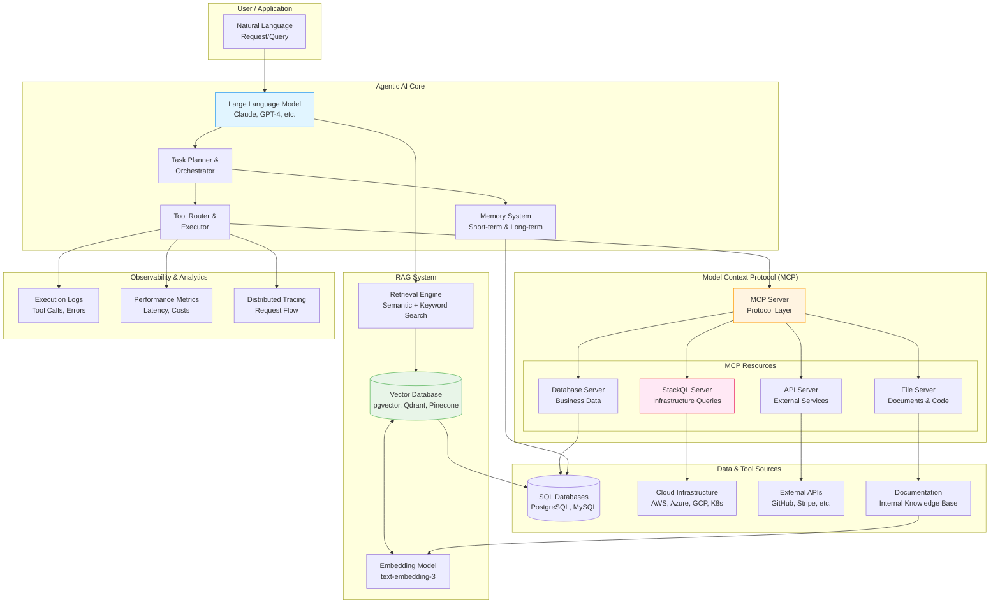

# Agentic AI Architecture

<div class="difficulty-badge difficulty-advanced">Advanced</div>

## Quick Reference

```sql
-- Agentic AI: Query infrastructure using StackQL MCP Server
-- Claude with MCP can query cloud resources via SQL

-- List all running AWS EC2 instances
SELECT
    instance_id,
    instance_type,
    state,
    public_ip_address,
    tags
FROM aws.ec2.instances
WHERE region = 'us-east-1'
  AND state = 'running';

-- Query Kubernetes pods across clusters
SELECT
    namespace,
    name,
    status,
    node_name,
    created_at
FROM k8s.core.pods
WHERE status != 'Running';

-- RAG Pattern: Vector similarity search for relevant context
-- Store embeddings in PostgreSQL with pgvector
CREATE TABLE document_embeddings (
    id SERIAL PRIMARY KEY,
    document_id INTEGER,
    content TEXT,
    embedding vector(1536),  -- OpenAI ada-002 dimension
    metadata JSONB,
    created_at TIMESTAMP DEFAULT CURRENT_TIMESTAMP
);

-- Create vector index for fast similarity search
CREATE INDEX ON document_embeddings
USING ivfflat (embedding vector_cosine_ops)
WITH (lists = 100);

-- Retrieve top-k similar documents for RAG
SELECT
    content,
    metadata,
    1 - (embedding <=> '[0.1, 0.2, ..., 0.5]'::vector) as similarity
FROM document_embeddings
WHERE 1 - (embedding <=> '[0.1, 0.2, ..., 0.5]'::vector) > 0.7
ORDER BY embedding <=> '[0.1, 0.2, ..., 0.5]'::vector
LIMIT 5;

-- Agent Memory: Store conversation history and tool calls
CREATE TABLE agent_sessions (
    session_id UUID PRIMARY KEY DEFAULT gen_random_uuid(),
    user_id INTEGER,
    started_at TIMESTAMP DEFAULT CURRENT_TIMESTAMP,
    ended_at TIMESTAMP,
    total_messages INTEGER DEFAULT 0,
    total_tool_calls INTEGER DEFAULT 0
);

CREATE TABLE agent_messages (
    message_id BIGSERIAL PRIMARY KEY,
    session_id UUID REFERENCES agent_sessions(session_id),
    role VARCHAR(20),  -- 'user', 'assistant', 'system'
    content TEXT,
    timestamp TIMESTAMP DEFAULT CURRENT_TIMESTAMP,
    tokens_used INTEGER,

    -- Tool use tracking
    tool_calls JSONB,  -- Array of tool calls made
    tool_results JSONB  -- Results from tool executions
);

CREATE INDEX idx_session_messages ON agent_messages(session_id, timestamp);

-- Track agent tool usage analytics
CREATE TABLE tool_usage_log (
    log_id BIGSERIAL PRIMARY KEY,
    session_id UUID,
    tool_name VARCHAR(200),
    tool_input JSONB,
    tool_output JSONB,
    execution_time_ms INTEGER,
    success BOOLEAN,
    error_message TEXT,
    timestamp TIMESTAMP DEFAULT CURRENT_TIMESTAMP
);

-- Query agent performance metrics
SELECT
    tool_name,
    COUNT(*) as total_calls,
    AVG(execution_time_ms) as avg_execution_time,
    SUM(CASE WHEN success THEN 1 ELSE 0 END)::FLOAT / COUNT(*) * 100 as success_rate,
    PERCENTILE_CONT(0.95) WITHIN GROUP (ORDER BY execution_time_ms) as p95_latency
FROM tool_usage_log
WHERE timestamp >= CURRENT_TIMESTAMP - INTERVAL '24 hours'
GROUP BY tool_name
ORDER BY total_calls DESC;

-- MCP Server Integration: Define available tools/resources
CREATE TABLE mcp_resources (
    resource_id SERIAL PRIMARY KEY,
    resource_uri TEXT UNIQUE,  -- e.g., 'stackql://aws/ec2/instances'
    resource_type VARCHAR(50),  -- 'query', 'mutation', 'subscription'
    description TEXT,
    schema JSONB,  -- JSON Schema for parameters
    enabled BOOLEAN DEFAULT TRUE
);

-- Register StackQL MCP resources
INSERT INTO mcp_resources (resource_uri, resource_type, description, schema) VALUES
('stackql://aws/ec2/instances', 'query', 'Query AWS EC2 instances',
 '{"type": "object", "properties": {"region": {"type": "string"}}}'),
('stackql://k8s/pods', 'query', 'Query Kubernetes pods',
 '{"type": "object", "properties": {"namespace": {"type": "string"}}}'),
('stackql://github/repos', 'query', 'Query GitHub repositories',
 '{"type": "object", "properties": {"org": {"type": "string"}}}');

-- Semantic Layer: Store entity relationships for RAG
CREATE TABLE entities (
    entity_id SERIAL PRIMARY KEY,
    entity_type VARCHAR(100),  -- 'person', 'organization', 'concept'
    entity_name VARCHAR(500),
    description TEXT,
    embedding vector(1536),
    metadata JSONB,
    created_at TIMESTAMP DEFAULT CURRENT_TIMESTAMP
);

CREATE TABLE entity_relationships (
    relationship_id SERIAL PRIMARY KEY,
    source_entity_id INTEGER REFERENCES entities(entity_id),
    target_entity_id INTEGER REFERENCES entities(entity_id),
    relationship_type VARCHAR(100),  -- 'works_for', 'located_in', 'related_to'
    confidence DECIMAL(3,2),
    metadata JSONB
);

-- Knowledge Graph Query: Find related entities
WITH RECURSIVE entity_graph AS (
    -- Start with a specific entity
    SELECT
        entity_id,
        entity_name,
        entity_type,
        0 as depth,
        ARRAY[entity_id] as path
    FROM entities
    WHERE entity_name = 'OpenAI'

    UNION ALL

    -- Recursively find connected entities
    SELECT
        e.entity_id,
        e.entity_name,
        e.entity_type,
        eg.depth + 1,
        eg.path || e.entity_id
    FROM entity_graph eg
    JOIN entity_relationships er ON eg.entity_id = er.source_entity_id
    JOIN entities e ON er.target_entity_id = e.entity_id
    WHERE eg.depth < 3
      AND NOT e.entity_id = ANY(eg.path)  -- Avoid cycles
)
SELECT DISTINCT
    entity_name,
    entity_type,
    depth
FROM entity_graph
ORDER BY depth, entity_name;

-- Agent Workflow: Multi-step task execution
CREATE TABLE agent_workflows (
    workflow_id UUID PRIMARY KEY DEFAULT gen_random_uuid(),
    workflow_name VARCHAR(200),
    workflow_type VARCHAR(50),  -- 'sequential', 'parallel', 'conditional'
    steps JSONB,  -- Array of workflow steps
    created_at TIMESTAMP DEFAULT CURRENT_TIMESTAMP
);

CREATE TABLE workflow_executions (
    execution_id UUID PRIMARY KEY DEFAULT gen_random_uuid(),
    workflow_id UUID REFERENCES agent_workflows(workflow_id),
    session_id UUID REFERENCES agent_sessions(session_id),
    status VARCHAR(20),  -- 'running', 'completed', 'failed', 'paused'
    current_step INTEGER,
    started_at TIMESTAMP DEFAULT CURRENT_TIMESTAMP,
    completed_at TIMESTAMP,
    execution_log JSONB
);

-- DuckDB: Fast analytical queries for agent metrics
-- Query conversation patterns
SELECT
    DATE_TRUNC('hour', timestamp) as hour,
    COUNT(*) as message_count,
    COUNT(DISTINCT session_id) as unique_sessions,
    AVG(tokens_used) as avg_tokens_per_message,
    SUM(CASE WHEN tool_calls IS NOT NULL THEN 1 ELSE 0 END) as messages_with_tools
FROM agent_messages
WHERE timestamp >= CURRENT_DATE - INTERVAL '7 days'
GROUP BY hour
ORDER BY hour;

-- Hybrid Search: Combine keyword and vector search
SELECT
    d.content,
    d.metadata,
    -- Vector similarity
    1 - (d.embedding <=> query_embedding.vec) as semantic_similarity,
    -- Keyword relevance (full-text search)
    ts_rank(to_tsvector('english', d.content),
            plainto_tsquery('english', 'kubernetes deployment')) as keyword_relevance,
    -- Combined score
    (0.7 * (1 - (d.embedding <=> query_embedding.vec)) +
     0.3 * ts_rank(to_tsvector('english', d.content),
                   plainto_tsquery('english', 'kubernetes deployment'))) as combined_score
FROM document_embeddings d,
     (SELECT '[0.1, 0.2, ...]'::vector as vec) query_embedding
WHERE to_tsvector('english', d.content) @@
      plainto_tsquery('english', 'kubernetes deployment')
ORDER BY combined_score DESC
LIMIT 10;
```

## Overview

**Agentic AI Architecture** represents the evolution from passive language models to autonomous agents that can perceive their environment, reason about tasks, use tools, and take actions to achieve goals. Unlike traditional AI systems that simply respond to prompts, agentic systems can:

- **Plan** multi-step solutions to complex problems
- **Use tools** like databases, APIs, and code interpreters
- **Retrieve information** from external knowledge bases (RAG)
- **Maintain memory** of conversations and past interactions
- **Reflect** on their actions and improve over time
- **Collaborate** with other agents and humans

### Core Components

Modern agentic AI systems consist of several interconnected components:

1. **Large Language Model (LLM)**: The reasoning engine (GPT-4, Claude, Llama)
2. **Model Context Protocol (MCP)**: Standardized way to connect AI to data sources and tools
3. **RAG (Retrieval-Augmented Generation)**: Augmenting LLM with external knowledge
4. **Tool Use**: Enabling AI to execute functions, query databases, call APIs
5. **Memory Systems**: Short-term (conversation) and long-term (persistent) memory
6. **Planning & Orchestration**: Breaking down complex tasks into steps
7. **Observability**: Tracking agent behavior, performance, and costs



## Core Principles

### 1. Model Context Protocol (MCP)

**Model Context Protocol (MCP)** is an open standard developed by Anthropic that provides a universal way to connect AI models to data sources, tools, and services. MCP acts as a "universal adapter" enabling LLMs to securely access and interact with various systems.

**MCP Architecture**:

```sql
-- MCP Server Definition: Expose resources and tools to AI agents

-- Resource: Query-able data sources
CREATE TABLE mcp_resources (
    resource_id SERIAL PRIMARY KEY,
    resource_uri TEXT UNIQUE NOT NULL,
    resource_name VARCHAR(200),
    resource_type VARCHAR(50),  -- 'query', 'mutation', 'stream'
    description TEXT,

    -- Schema definition (JSON Schema)
    input_schema JSONB,
    output_schema JSONB,

    -- Access control
    required_permissions TEXT[],
    rate_limit_per_minute INTEGER,

    -- Metadata
    provider VARCHAR(100),  -- 'stackql', 'postgres', 'api'
    enabled BOOLEAN DEFAULT TRUE,
    created_at TIMESTAMP DEFAULT CURRENT_TIMESTAMP
);

-- Tool: Executable functions
CREATE TABLE mcp_tools (
    tool_id SERIAL PRIMARY KEY,
    tool_name VARCHAR(200) UNIQUE NOT NULL,
    description TEXT,

    -- Function signature
    parameters JSONB,  -- JSON Schema for parameters
    returns JSONB,  -- JSON Schema for return value

    -- Implementation
    handler_type VARCHAR(50),  -- 'sql', 'python', 'api'
    handler_code TEXT,

    -- Observability
    total_calls INTEGER DEFAULT 0,
    last_called_at TIMESTAMP,
    avg_execution_time_ms INTEGER,

    enabled BOOLEAN DEFAULT TRUE
);

-- Prompt: Pre-defined prompt templates
CREATE TABLE mcp_prompts (
    prompt_id SERIAL PRIMARY KEY,
    prompt_name VARCHAR(200) UNIQUE,
    prompt_text TEXT,
    arguments JSONB,  -- Template variables
    description TEXT
);

-- Example: StackQL MCP Server Resources
INSERT INTO mcp_resources (resource_uri, resource_name, resource_type, description, input_schema, provider) VALUES
(
    'stackql://aws/ec2/instances',
    'AWS EC2 Instances',
    'query',
    'Query and analyze AWS EC2 instances across regions',
    '{
        "type": "object",
        "properties": {
            "region": {"type": "string", "default": "us-east-1"},
            "state": {"type": "string", "enum": ["running", "stopped", "terminated"]}
        }
    }',
    'stackql'
),
(
    'stackql://k8s/pods',
    'Kubernetes Pods',
    'query',
    'Query Kubernetes pods across namespaces and clusters',
    '{
        "type": "object",
        "properties": {
            "namespace": {"type": "string"},
            "cluster": {"type": "string"}
        }
    }',
    'stackql'
),
(
    'stackql://github/repos',
    'GitHub Repositories',
    'query',
    'Query GitHub repository metadata and statistics',
    '{
        "type": "object",
        "properties": {
            "org": {"type": "string", "required": true},
            "archived": {"type": "boolean", "default": false}
        }
    }',
    'stackql'
);

-- Example: MCP Tool for Infrastructure Analysis
INSERT INTO mcp_tools (tool_name, description, parameters, handler_type, handler_code) VALUES
(
    'analyze_infrastructure_costs',
    'Analyze cloud infrastructure costs across AWS, Azure, and GCP',
    '{
        "type": "object",
        "properties": {
            "cloud_provider": {"type": "string", "enum": ["aws", "azure", "gcp", "all"]},
            "time_range_days": {"type": "integer", "default": 30}
        },
        "required": ["cloud_provider"]
    }',
    'sql',
    'SELECT provider, service, SUM(cost) as total_cost, AVG(cost) as avg_daily_cost
     FROM stackql.cloud_costs
     WHERE date >= CURRENT_DATE - $time_range_days
       AND ($cloud_provider = ''all'' OR provider = $cloud_provider)
     GROUP BY provider, service
     ORDER BY total_cost DESC'
);

-- MCP Request/Response Tracking
CREATE TABLE mcp_request_log (
    request_id UUID PRIMARY KEY DEFAULT gen_random_uuid(),
    session_id UUID,
    resource_uri TEXT,
    tool_name VARCHAR(200),

    -- Request details
    input_params JSONB,
    requested_at TIMESTAMP DEFAULT CURRENT_TIMESTAMP,

    -- Response details
    output_data JSONB,
    execution_time_ms INTEGER,
    success BOOLEAN,
    error_message TEXT,
    responded_at TIMESTAMP,

    -- Context
    user_id INTEGER,
    agent_name VARCHAR(100)
);

CREATE INDEX idx_mcp_requests_time ON mcp_request_log(requested_at);
CREATE INDEX idx_mcp_requests_resource ON mcp_request_log(resource_uri);

-- Query MCP usage analytics
SELECT
    DATE_TRUNC('day', requested_at) as date,
    resource_uri,
    COUNT(*) as request_count,
    AVG(execution_time_ms) as avg_latency,
    SUM(CASE WHEN success THEN 1 ELSE 0 END)::FLOAT / COUNT(*) * 100 as success_rate
FROM mcp_request_log
WHERE requested_at >= CURRENT_DATE - 30
GROUP BY date, resource_uri
ORDER BY date DESC, request_count DESC;
```

**StackQL MCP Server Integration**:

StackQL provides an MCP server that enables AI agents to query cloud infrastructure, SaaS platforms, and services using SQL. This is particularly powerful for:

- **Infrastructure observability**: Query running resources, costs, configurations
- **Security analysis**: Identify misconfigurations, compliance issues
- **Operational insights**: Monitor resource utilization, performance metrics
- **Cost optimization**: Analyze spending patterns across cloud providers

```sql
-- Example: AI agent using StackQL MCP server

-- Agent receives request: "Show me all running EC2 instances in production"

-- Step 1: Agent calls StackQL MCP resource
-- Resource: stackql://aws/ec2/instances
-- Input: { "region": "us-east-1", "state": "running" }

SELECT
    instance_id,
    instance_type,
    instance_state_name as state,
    public_ip_address,
    private_ip_address,
    JSON_EXTRACT(tags, '$.Name') as name,
    JSON_EXTRACT(tags, '$.Environment') as environment,
    launch_time
FROM aws.ec2.instances
WHERE region = 'us-east-1'
  AND instance_state_name = 'running'
  AND JSON_EXTRACT(tags, '$.Environment') = 'production';

-- Step 2: Agent receives results and formats response
-- Returns: "Found 23 running EC2 instances in production environment..."

-- Example: Multi-cloud cost analysis
SELECT
    'aws' as provider,
    service_name,
    SUM(cost) as total_cost
FROM aws.ce.cost_and_usage
WHERE time_period_start >= CURRENT_DATE - 30
GROUP BY service_name

UNION ALL

SELECT
    'azure' as provider,
    service_name,
    SUM(cost) as total_cost
FROM azure.consumption.usage_details
WHERE usage_start >= CURRENT_DATE - 30
GROUP BY service_name

UNION ALL

SELECT
    'gcp' as provider,
    service_description as service_name,
    SUM(cost) as total_cost
FROM gcp.billing.gcp_billing_export_v1
WHERE usage_start_time >= CURRENT_DATE - 30
GROUP BY service_description

ORDER BY total_cost DESC;

-- Example: Kubernetes security audit
SELECT
    namespace,
    name as pod_name,
    JSON_EXTRACT(spec, '$.containers[0].securityContext.privileged') as is_privileged,
    JSON_EXTRACT(spec, '$.containers[0].securityContext.runAsUser') as run_as_user,
    JSON_EXTRACT(spec, '$.hostNetwork') as host_network
FROM k8s.core.pods
WHERE JSON_EXTRACT(spec, '$.containers[0].securityContext.privileged') = 'true'
   OR JSON_EXTRACT(spec, '$.hostNetwork') = 'true'
   OR JSON_EXTRACT(spec, '$.containers[0].securityContext.runAsUser') = '0';
-- AI agent can identify security risks and recommend fixes
```

### 2. Retrieval-Augmented Generation (RAG)

**RAG** enhances LLMs with external knowledge by retrieving relevant information from databases, documents, and knowledge bases before generating responses. This addresses LLM limitations like hallucination, outdated knowledge, and lack of domain-specific information.

**RAG Architecture Components**:

1. **Document Ingestion**: Parse, chunk, and embed documents
2. **Vector Storage**: Store embeddings in vector databases
3. **Retrieval**: Find relevant context using semantic search
4. **Augmentation**: Inject retrieved context into LLM prompt
5. **Generation**: LLM generates response with external knowledge

```sql
-- PostgreSQL with pgvector extension for RAG

-- Enable vector extension
CREATE EXTENSION IF NOT EXISTS vector;

-- Document storage with embeddings
CREATE TABLE documents (
    document_id SERIAL PRIMARY KEY,
    document_name VARCHAR(500),
    document_type VARCHAR(50),  -- 'pdf', 'markdown', 'html', 'code'
    source_url TEXT,
    full_text TEXT,
    metadata JSONB,
    indexed_at TIMESTAMP DEFAULT CURRENT_TIMESTAMP
);

-- Document chunks with embeddings (for better retrieval)
CREATE TABLE document_chunks (
    chunk_id SERIAL PRIMARY KEY,
    document_id INTEGER REFERENCES documents(document_id) ON DELETE CASCADE,
    chunk_index INTEGER,

    -- Text content
    chunk_text TEXT,
    chunk_size INTEGER,

    -- Vector embedding
    embedding vector(1536),  -- OpenAI text-embedding-3-small: 1536 dimensions

    -- Metadata for filtering
    section_title VARCHAR(500),
    chunk_metadata JSONB,

    -- Timestamps
    created_at TIMESTAMP DEFAULT CURRENT_TIMESTAMP
);

-- Vector similarity index (IVFFlat for large datasets)
CREATE INDEX idx_chunk_embedding_ivfflat
ON document_chunks
USING ivfflat (embedding vector_cosine_ops)
WITH (lists = 100);

-- Alternative: HNSW index for faster queries (requires more memory)
-- CREATE INDEX idx_chunk_embedding_hnsw
-- ON document_chunks
-- USING hnsw (embedding vector_cosine_ops);

-- Full-text search index for hybrid search
CREATE INDEX idx_chunk_text_fts
ON document_chunks
USING GIN (to_tsvector('english', chunk_text));

-- Embedding model tracking
CREATE TABLE embedding_models (
    model_id SERIAL PRIMARY KEY,
    model_name VARCHAR(100) UNIQUE,  -- 'text-embedding-3-small', 'text-embedding-3-large'
    dimensions INTEGER,
    cost_per_million_tokens DECIMAL(10,6),
    provider VARCHAR(50),  -- 'openai', 'cohere', 'voyageai'
    created_at TIMESTAMP DEFAULT CURRENT_TIMESTAMP
);

INSERT INTO embedding_models (model_name, dimensions, cost_per_million_tokens, provider) VALUES
('text-embedding-3-small', 1536, 0.02, 'openai'),
('text-embedding-3-large', 3072, 0.13, 'openai'),
('embed-english-v3.0', 1024, 0.10, 'cohere');

-- RAG Query: Semantic search
CREATE OR REPLACE FUNCTION search_similar_documents(
    query_embedding vector(1536),
    similarity_threshold FLOAT DEFAULT 0.7,
    max_results INTEGER DEFAULT 5
)
RETURNS TABLE (
    chunk_id INTEGER,
    document_name VARCHAR(500),
    chunk_text TEXT,
    similarity_score FLOAT,
    metadata JSONB
) AS $$
BEGIN
    RETURN QUERY
    SELECT
        dc.chunk_id,
        d.document_name,
        dc.chunk_text,
        1 - (dc.embedding <=> query_embedding) as similarity_score,
        dc.chunk_metadata
    FROM document_chunks dc
    JOIN documents d ON dc.document_id = d.document_id
    WHERE 1 - (dc.embedding <=> query_embedding) > similarity_threshold
    ORDER BY dc.embedding <=> query_embedding
    LIMIT max_results;
END;
$$ LANGUAGE plpgsql;

-- Example RAG query
SELECT * FROM search_similar_documents(
    '[0.123, 0.456, ...]'::vector,  -- Query embedding
    0.75,  -- Similarity threshold
    5      -- Top 5 results
);

-- Hybrid Search: Combine semantic (vector) and keyword (full-text) search
CREATE OR REPLACE FUNCTION hybrid_search(
    query_text TEXT,
    query_embedding vector(1536),
    semantic_weight FLOAT DEFAULT 0.7,
    keyword_weight FLOAT DEFAULT 0.3,
    max_results INTEGER DEFAULT 10
)
RETURNS TABLE (
    chunk_id INTEGER,
    document_name VARCHAR(500),
    chunk_text TEXT,
    combined_score FLOAT,
    semantic_score FLOAT,
    keyword_score FLOAT
) AS $$
BEGIN
    RETURN QUERY
    SELECT
        dc.chunk_id,
        d.document_name,
        dc.chunk_text,
        -- Combined weighted score
        (semantic_weight * (1 - (dc.embedding <=> query_embedding)) +
         keyword_weight * ts_rank(to_tsvector('english', dc.chunk_text),
                                    plainto_tsquery('english', query_text))) as combined_score,
        1 - (dc.embedding <=> query_embedding) as semantic_score,
        ts_rank(to_tsvector('english', dc.chunk_text),
                plainto_tsquery('english', query_text)) as keyword_score
    FROM document_chunks dc
    JOIN documents d ON dc.document_id = d.document_id
    WHERE
        -- Semantic filter
        (1 - (dc.embedding <=> query_embedding)) > 0.6
        OR
        -- Keyword filter
        to_tsvector('english', dc.chunk_text) @@ plainto_tsquery('english', query_text)
    ORDER BY combined_score DESC
    LIMIT max_results;
END;
$$ LANGUAGE plpgsql;

-- Example hybrid search
SELECT * FROM hybrid_search(
    'kubernetes deployment best practices',  -- Query text
    '[0.123, 0.456, ...]'::vector,          -- Query embedding
    0.7,  -- 70% semantic weight
    0.3,  -- 30% keyword weight
    10    -- Top 10 results
);

-- RAG Context Assembly: Build context for LLM
CREATE OR REPLACE FUNCTION assemble_rag_context(
    query_text TEXT,
    query_embedding vector(1536),
    max_context_tokens INTEGER DEFAULT 4000
)
RETURNS TEXT AS $$
DECLARE
    context_text TEXT := '';
    chunk_record RECORD;
    current_tokens INTEGER := 0;
    chunk_tokens INTEGER;
BEGIN
    -- Retrieve relevant chunks
    FOR chunk_record IN (
        SELECT
            dc.chunk_text,
            d.document_name,
            dc.chunk_size
        FROM document_chunks dc
        JOIN documents d ON dc.document_id = d.document_id
        WHERE 1 - (dc.embedding <=> query_embedding) > 0.7
        ORDER BY dc.embedding <=> query_embedding
        LIMIT 20
    )
    LOOP
        -- Estimate tokens (rough approximation: 1 token ≈ 4 characters)
        chunk_tokens := LENGTH(chunk_record.chunk_text) / 4;

        -- Stop if we exceed context limit
        EXIT WHEN current_tokens + chunk_tokens > max_context_tokens;

        -- Add chunk to context
        context_text := context_text || E'\n\n--- Source: ' || chunk_record.document_name || E' ---\n' || chunk_record.chunk_text;
        current_tokens := current_tokens + chunk_tokens;
    END LOOP;

    RETURN context_text;
END;
$$ LANGUAGE plpgsql;

-- RAG Query Tracking
CREATE TABLE rag_queries (
    query_id BIGSERIAL PRIMARY KEY,
    session_id UUID,
    query_text TEXT,
    query_embedding vector(1536),

    -- Retrieved context
    retrieved_chunk_ids INTEGER[],
    total_chunks_retrieved INTEGER,
    context_tokens_used INTEGER,

    -- LLM generation
    llm_model VARCHAR(100),
    llm_response TEXT,
    llm_tokens_used INTEGER,

    -- Performance
    retrieval_time_ms INTEGER,
    generation_time_ms INTEGER,
    total_time_ms INTEGER,

    -- Quality metrics
    user_feedback VARCHAR(20),  -- 'helpful', 'not_helpful', 'partially_helpful'

    created_at TIMESTAMP DEFAULT CURRENT_TIMESTAMP
);

-- Analyze RAG performance
SELECT
    DATE_TRUNC('day', created_at) as date,
    COUNT(*) as total_queries,
    AVG(retrieval_time_ms) as avg_retrieval_time,
    AVG(generation_time_ms) as avg_generation_time,
    AVG(total_chunks_retrieved) as avg_chunks_retrieved,
    AVG(context_tokens_used) as avg_context_tokens,
    SUM(CASE WHEN user_feedback = 'helpful' THEN 1 ELSE 0 END)::FLOAT /
        NULLIF(SUM(CASE WHEN user_feedback IS NOT NULL THEN 1 ELSE 0 END), 0) * 100
        as helpfulness_rate
FROM rag_queries
WHERE created_at >= CURRENT_DATE - 30
GROUP BY date
ORDER BY date DESC;
```

**Advanced RAG Patterns**:

```sql
-- Pattern 1: Re-ranking for better relevance
CREATE TABLE reranker_scores (
    query_id BIGINT,
    chunk_id INTEGER,
    initial_score FLOAT,
    reranked_score FLOAT,
    reranker_model VARCHAR(100)
);

-- Pattern 2: Metadata filtering
SELECT
    dc.chunk_text,
    1 - (dc.embedding <=> query_embedding) as similarity
FROM document_chunks dc
WHERE dc.chunk_metadata->>'department' = 'engineering'
  AND dc.chunk_metadata->>'classification' = 'public'
  AND 1 - (dc.embedding <=> query_embedding) > 0.7
ORDER BY similarity DESC;

-- Pattern 3: Temporal relevance boost
SELECT
    dc.chunk_text,
    d.document_name,
    (1 - (dc.embedding <=> query_embedding)) *
    (1 + 0.1 * LEAST(365, EXTRACT(DAY FROM CURRENT_DATE - d.indexed_at)::INTEGER) / 365)
        as relevance_score
FROM document_chunks dc
JOIN documents d ON dc.document_id = d.document_id
WHERE 1 - (dc.embedding <=> query_embedding) > 0.6
ORDER BY relevance_score DESC;

-- Pattern 4: Multi-query RAG (query expansion)
-- Generate multiple query variations for better coverage
CREATE TEMP TABLE query_variations AS
SELECT unnest(ARRAY[
    'kubernetes deployment strategies',
    'k8s rolling updates best practices',
    'container orchestration deployment patterns'
]) as query_variant;

-- Retrieve from all query variations
SELECT DISTINCT ON (dc.chunk_id)
    dc.chunk_id,
    dc.chunk_text,
    MAX(1 - (dc.embedding <=> qv.embedding)) as max_similarity
FROM document_chunks dc
CROSS JOIN (
    SELECT '[...]'::vector as embedding FROM query_variations
) qv
GROUP BY dc.chunk_id, dc.chunk_text
HAVING MAX(1 - (dc.embedding <=> qv.embedding)) > 0.7
ORDER BY max_similarity DESC
LIMIT 10;
```

### 3. Agent Memory Systems

Agents need memory to maintain context across conversations and learn from past interactions.

**Memory Types**:

1. **Short-term Memory**: Current conversation context (in-memory, ephemeral)
2. **Long-term Memory**: Persistent storage of important information
3. **Episodic Memory**: Specific events and interactions
4. **Semantic Memory**: General knowledge and facts

```sql
-- Conversation Memory (Short-term)
CREATE TABLE conversations (
    conversation_id UUID PRIMARY KEY DEFAULT gen_random_uuid(),
    user_id INTEGER,
    agent_name VARCHAR(100),
    started_at TIMESTAMP DEFAULT CURRENT_TIMESTAMP,
    ended_at TIMESTAMP,

    -- Conversation state
    context JSONB,  -- Current context variables
    conversation_summary TEXT,
    message_count INTEGER DEFAULT 0,

    -- Metadata
    tags TEXT[],
    metadata JSONB
);

CREATE TABLE messages (
    message_id BIGSERIAL PRIMARY KEY,
    conversation_id UUID REFERENCES conversations(conversation_id),

    -- Message content
    role VARCHAR(20),  -- 'user', 'assistant', 'system', 'tool'
    content TEXT,

    -- Tool interactions
    tool_calls JSONB,
    tool_results JSONB,

    -- Tokens and cost
    tokens_used INTEGER,
    cost_usd DECIMAL(10,6),

    -- Timing
    created_at TIMESTAMP DEFAULT CURRENT_TIMESTAMP,
    processing_time_ms INTEGER
);

CREATE INDEX idx_messages_conversation ON messages(conversation_id, created_at);

-- Long-term Memory (Persistent Knowledge)
CREATE TABLE agent_knowledge (
    knowledge_id SERIAL PRIMARY KEY,
    knowledge_type VARCHAR(50),  -- 'fact', 'preference', 'skill', 'relationship'

    -- Content
    subject VARCHAR(500),
    content TEXT,
    embedding vector(1536),

    -- Source and confidence
    source_conversation_id UUID,
    source_message_id BIGINT,
    confidence DECIMAL(3,2),

    -- Temporal
    learned_at TIMESTAMP DEFAULT CURRENT_TIMESTAMP,
    last_accessed TIMESTAMP,
    access_count INTEGER DEFAULT 0,

    -- Lifecycle
    expires_at TIMESTAMP,
    is_active BOOLEAN DEFAULT TRUE
);

-- Knowledge relationships (semantic links)
CREATE TABLE knowledge_relationships (
    relationship_id SERIAL PRIMARY KEY,
    source_knowledge_id INTEGER REFERENCES agent_knowledge(knowledge_id),
    target_knowledge_id INTEGER REFERENCES agent_knowledge(knowledge_id),
    relationship_type VARCHAR(100),
    strength DECIMAL(3,2)
);

-- User preferences and history
CREATE TABLE user_preferences (
    user_id INTEGER PRIMARY KEY,
    preferences JSONB,
    interaction_history JSONB,
    learned_patterns JSONB,
    updated_at TIMESTAMP DEFAULT CURRENT_TIMESTAMP
);

-- Example: Storing learned information
INSERT INTO agent_knowledge (knowledge_type, subject, content, confidence) VALUES
('preference', 'user:123:communication_style',
 'User prefers concise, technical responses with code examples', 0.95),
('fact', 'user:123:tech_stack',
 'User works with PostgreSQL, Kubernetes, and Python', 0.90),
('skill', 'agent:code_generation',
 'Successfully generated 47 Python functions with 92% approval rate', 0.88);

-- Retrieve relevant memories for current conversation
CREATE OR REPLACE FUNCTION recall_relevant_memories(
    p_user_id INTEGER,
    p_query_embedding vector(1536),
    p_limit INTEGER DEFAULT 5
)
RETURNS TABLE (
    subject VARCHAR(500),
    content TEXT,
    knowledge_type VARCHAR(50),
    confidence DECIMAL(3,2),
    relevance_score FLOAT
) AS $$
BEGIN
    -- Update access tracking
    UPDATE agent_knowledge
    SET last_accessed = CURRENT_TIMESTAMP,
        access_count = access_count + 1
    WHERE knowledge_id IN (
        SELECT knowledge_id
        FROM agent_knowledge ak
        WHERE ak.is_active = TRUE
          AND (ak.subject LIKE 'user:' || p_user_id || '%' OR ak.knowledge_type = 'general')
        ORDER BY ak.embedding <=> p_query_embedding
        LIMIT p_limit
    );

    -- Return relevant memories
    RETURN QUERY
    SELECT
        ak.subject,
        ak.content,
        ak.knowledge_type,
        ak.confidence,
        1 - (ak.embedding <=> p_query_embedding) as relevance_score
    FROM agent_knowledge ak
    WHERE ak.is_active = TRUE
      AND (ak.subject LIKE 'user:' || p_user_id || '%' OR ak.knowledge_type = 'general')
      AND (ak.expires_at IS NULL OR ak.expires_at > CURRENT_TIMESTAMP)
    ORDER BY ak.embedding <=> p_query_embedding
    LIMIT p_limit;
END;
$$ LANGUAGE plpgsql;

-- Memory consolidation: Summarize old conversations
CREATE TABLE conversation_summaries (
    summary_id SERIAL PRIMARY KEY,
    conversation_id UUID REFERENCES conversations(conversation_id),
    summary_text TEXT,
    key_points TEXT[],
    extracted_facts TEXT[],
    created_at TIMESTAMP DEFAULT CURRENT_TIMESTAMP
);

-- Periodic memory pruning (remove low-value memories)
DELETE FROM agent_knowledge
WHERE is_active = TRUE
  AND access_count < 3
  AND learned_at < CURRENT_TIMESTAMP - INTERVAL '90 days';
```

### 4. Tool Use and Function Calling

Modern LLMs can use tools by generating function calls with appropriate parameters.

```sql
-- Tool Registry
CREATE TABLE tools (
    tool_id SERIAL PRIMARY KEY,
    tool_name VARCHAR(200) UNIQUE NOT NULL,
    tool_category VARCHAR(50),  -- 'database', 'api', 'code', 'infrastructure'
    description TEXT,

    -- Function signature
    input_schema JSONB,  -- JSON Schema
    output_schema JSONB,

    -- Implementation
    handler_type VARCHAR(50),  -- 'sql', 'python', 'api_call', 'mcp'
    handler_config JSONB,

    -- Usage and reliability
    total_calls INTEGER DEFAULT 0,
    success_count INTEGER DEFAULT 0,
    avg_execution_time_ms INTEGER,

    -- Cost tracking
    cost_per_call_usd DECIMAL(10,6),

    enabled BOOLEAN DEFAULT TRUE,
    created_at TIMESTAMP DEFAULT CURRENT_TIMESTAMP
);

-- Example tools
INSERT INTO tools (tool_name, tool_category, description, input_schema, handler_type, handler_config) VALUES
(
    'query_database',
    'database',
    'Execute SQL queries against the application database',
    '{
        "type": "object",
        "properties": {
            "query": {"type": "string", "description": "SQL query to execute"},
            "parameters": {"type": "object", "description": "Query parameters"}
        },
        "required": ["query"]
    }',
    'sql',
    '{"connection": "postgresql://localhost/app_db"}'
),
(
    'search_documentation',
    'rag',
    'Search internal documentation using semantic search',
    '{
        "type": "object",
        "properties": {
            "query": {"type": "string", "description": "Search query"},
            "max_results": {"type": "integer", "default": 5}
        },
        "required": ["query"]
    }',
    'sql',
    '{"function": "hybrid_search"}'
),
(
    'get_infrastructure_status',
    'infrastructure',
    'Query infrastructure resources using StackQL MCP server',
    '{
        "type": "object",
        "properties": {
            "resource_type": {"type": "string", "enum": ["ec2", "k8s_pods", "databases"]},
            "filters": {"type": "object"}
        },
        "required": ["resource_type"]
    }',
    'mcp',
    '{"mcp_server": "stackql", "resource_prefix": "stackql://"}'
);

-- Tool Execution Log
CREATE TABLE tool_executions (
    execution_id BIGSERIAL PRIMARY KEY,
    tool_id INTEGER REFERENCES tools(tool_id),
    conversation_id UUID REFERENCES conversations(conversation_id),
    message_id BIGINT,

    -- Execution details
    input_params JSONB,
    output_result JSONB,

    -- Performance
    started_at TIMESTAMP DEFAULT CURRENT_TIMESTAMP,
    completed_at TIMESTAMP,
    execution_time_ms INTEGER,

    -- Status
    status VARCHAR(20),  -- 'success', 'error', 'timeout'
    error_message TEXT,

    -- Resource usage
    tokens_consumed INTEGER,
    cost_usd DECIMAL(10,6)
);

CREATE INDEX idx_tool_executions_time ON tool_executions(started_at);
CREATE INDEX idx_tool_executions_tool ON tool_executions(tool_id);

-- Tool Analytics
SELECT
    t.tool_name,
    t.tool_category,
    COUNT(*) as execution_count,
    AVG(te.execution_time_ms) as avg_execution_time,
    SUM(CASE WHEN te.status = 'success' THEN 1 ELSE 0 END)::FLOAT / COUNT(*) * 100 as success_rate,
    PERCENTILE_CONT(0.95) WITHIN GROUP (ORDER BY te.execution_time_ms) as p95_latency,
    SUM(te.cost_usd) as total_cost_usd
FROM tools t
JOIN tool_executions te ON t.tool_id = te.tool_id
WHERE te.started_at >= CURRENT_DATE - 7
GROUP BY t.tool_id, t.tool_name, t.tool_category
ORDER BY execution_count DESC;

-- Tool dependency graph (which tools call other tools)
CREATE TABLE tool_dependencies (
    parent_tool_id INTEGER REFERENCES tools(tool_id),
    child_tool_id INTEGER REFERENCES tools(tool_id),
    call_count INTEGER DEFAULT 0,
    PRIMARY KEY (parent_tool_id, child_tool_id)
);
```

## Agent Workflow Patterns

### Pattern 1: ReAct (Reasoning + Acting)

Agent alternates between reasoning about the task and taking actions.

```sql
-- ReAct workflow execution
CREATE TABLE react_steps (
    step_id BIGSERIAL PRIMARY KEY,
    conversation_id UUID REFERENCES conversations(conversation_id),
    step_number INTEGER,

    -- Thought process
    thought TEXT,
    reasoning TEXT,

    -- Action
    action VARCHAR(200),  -- Tool name
    action_input JSONB,

    -- Observation
    observation TEXT,  -- Tool output

    -- Next step decision
    next_action VARCHAR(200),
    is_final BOOLEAN DEFAULT FALSE,

    created_at TIMESTAMP DEFAULT CURRENT_TIMESTAMP
);

-- Example ReAct trace
INSERT INTO react_steps (conversation_id, step_number, thought, action, action_input, observation) VALUES
(
    'conv-uuid-1234',
    1,
    'User wants to know about high CPU usage. I need to check infrastructure.',
    'get_infrastructure_status',
    '{"resource_type": "ec2", "filters": {"metric": "cpu_utilization"}}',
    'Found 5 EC2 instances with CPU > 80%: i-abc123, i-def456, ...'
),
(
    'conv-uuid-1234',
    2,
    'Now I should check application logs for these instances.',
    'query_logs',
    '{"instance_ids": ["i-abc123", "i-def456"], "severity": "error"}',
    'Found 47 error logs related to database connection timeouts.'
);
```

### Pattern 2: Multi-Agent Collaboration

Multiple specialized agents working together.

```sql
-- Agent definitions
CREATE TABLE agents (
    agent_id SERIAL PRIMARY KEY,
    agent_name VARCHAR(100) UNIQUE,
    agent_role VARCHAR(100),  -- 'researcher', 'coder', 'reviewer', 'orchestrator'
    system_prompt TEXT,
    capabilities TEXT[],
    available_tools INTEGER[],  -- References to tools table
    enabled BOOLEAN DEFAULT TRUE
);

-- Agent collaboration
CREATE TABLE agent_collaborations (
    collaboration_id UUID PRIMARY KEY DEFAULT gen_random_uuid(),
    task_description TEXT,
    initiating_agent_id INTEGER REFERENCES agents(agent_id),
    participating_agents INTEGER[],
    status VARCHAR(20),  -- 'in_progress', 'completed', 'failed'
    started_at TIMESTAMP DEFAULT CURRENT_TIMESTAMP,
    completed_at TIMESTAMP
);

CREATE TABLE collaboration_messages (
    message_id BIGSERIAL PRIMARY KEY,
    collaboration_id UUID REFERENCES agent_collaborations(collaboration_id),
    from_agent_id INTEGER REFERENCES agents(agent_id),
    to_agent_id INTEGER REFERENCES agents(agent_id),
    message_type VARCHAR(50),  -- 'request', 'response', 'delegation', 'feedback'
    content TEXT,
    metadata JSONB,
    timestamp TIMESTAMP DEFAULT CURRENT_TIMESTAMP
);

-- Example: Code generation with review workflow
-- Agent 1 (Coder) writes code
-- Agent 2 (Reviewer) reviews code
-- Agent 3 (Tester) runs tests
-- Agent 4 (Orchestrator) coordinates

INSERT INTO agents (agent_name, agent_role, system_prompt, capabilities) VALUES
('CodeGeneratorAgent', 'coder',
 'You are an expert software engineer. Generate high-quality, tested code.',
 ARRAY['python', 'sql', 'javascript']),
('CodeReviewerAgent', 'reviewer',
 'You are a senior code reviewer. Identify issues, suggest improvements.',
 ARRAY['code_review', 'best_practices', 'security']),
('TestRunnerAgent', 'tester',
 'You run tests and report results.',
 ARRAY['pytest', 'unittest', 'integration_tests']);
```

### Pattern 3: Hierarchical Planning

Break complex tasks into sub-tasks recursively.

```sql
-- Task hierarchy
CREATE TABLE task_plans (
    plan_id UUID PRIMARY KEY DEFAULT gen_random_uuid(),
    parent_plan_id UUID REFERENCES task_plans(plan_id),
    conversation_id UUID REFERENCES conversations(conversation_id),

    -- Task definition
    task_description TEXT,
    task_complexity VARCHAR(20),  -- 'simple', 'medium', 'complex'

    -- Subtasks
    subtask_ids UUID[],

    -- Execution
    assigned_agent_id INTEGER REFERENCES agents(agent_id),
    status VARCHAR(20),  -- 'planned', 'in_progress', 'completed', 'failed', 'blocked'

    -- Dependencies
    depends_on UUID[],  -- Other plan_ids that must complete first

    -- Results
    output JSONB,

    -- Timing
    created_at TIMESTAMP DEFAULT CURRENT_TIMESTAMP,
    started_at TIMESTAMP,
    completed_at TIMESTAMP
);

CREATE INDEX idx_task_plans_parent ON task_plans(parent_plan_id);
CREATE INDEX idx_task_plans_status ON task_plans(status);

-- Query task hierarchy
WITH RECURSIVE task_tree AS (
    -- Root tasks
    SELECT
        plan_id,
        parent_plan_id,
        task_description,
        status,
        0 as depth,
        ARRAY[plan_id] as path
    FROM task_plans
    WHERE parent_plan_id IS NULL
      AND conversation_id = 'some-uuid'

    UNION ALL

    -- Child tasks
    SELECT
        tp.plan_id,
        tp.parent_plan_id,
        tp.task_description,
        tp.status,
        tt.depth + 1,
        tt.path || tp.plan_id
    FROM task_plans tp
    JOIN task_tree tt ON tp.parent_plan_id = tt.plan_id
    WHERE tp.depth < 10  -- Prevent infinite loops
)
SELECT
    REPEAT('  ', depth) || task_description as task_hierarchy,
    status,
    depth
FROM task_tree
ORDER BY path;
```

## Observability and Analytics

```sql
-- Comprehensive agent observability

-- Performance metrics
CREATE TABLE agent_metrics (
    metric_id BIGSERIAL PRIMARY KEY,
    metric_timestamp TIMESTAMP DEFAULT CURRENT_TIMESTAMP,
    agent_name VARCHAR(100),

    -- Usage metrics
    total_conversations INTEGER,
    total_messages INTEGER,
    total_tool_calls INTEGER,

    -- Performance
    avg_response_time_ms INTEGER,
    p95_response_time_ms INTEGER,
    p99_response_time_ms INTEGER,

    -- Quality
    success_rate DECIMAL(5,2),
    user_satisfaction_score DECIMAL(3,2),

    -- Cost
    total_tokens_used BIGINT,
    total_cost_usd DECIMAL(10,2),

    -- Errors
    error_count INTEGER,
    timeout_count INTEGER
);

-- Real-time dashboard query
SELECT
    agent_name,
    COUNT(DISTINCT conversation_id) as active_conversations,
    COUNT(*) as messages_last_hour,
    AVG(processing_time_ms) as avg_latency,
    SUM(tokens_used) as total_tokens,
    SUM(cost_usd) as cost_last_hour
FROM messages m
JOIN conversations c ON m.conversation_id = c.conversation_id
WHERE m.created_at >= CURRENT_TIMESTAMP - INTERVAL '1 hour'
GROUP BY agent_name;

-- Cost analysis
SELECT
    DATE_TRUNC('day', created_at) as date,
    SUM(cost_usd) as daily_cost,
    SUM(tokens_used) as daily_tokens,
    COUNT(DISTINCT conversation_id) as unique_conversations,
    SUM(cost_usd) / NULLIF(COUNT(DISTINCT conversation_id), 0) as cost_per_conversation
FROM messages
WHERE created_at >= CURRENT_DATE - 30
GROUP BY date
ORDER BY date DESC;

-- Tool usage patterns
SELECT
    t.tool_name,
    COUNT(*) as usage_count,
    AVG(te.execution_time_ms) as avg_execution_time,
    SUM(CASE WHEN te.status = 'success' THEN 1 ELSE 0 END)::FLOAT / COUNT(*) * 100 as success_rate
FROM tool_executions te
JOIN tools t ON te.tool_id = t.tool_id
WHERE te.started_at >= CURRENT_TIMESTAMP - INTERVAL '24 hours'
GROUP BY t.tool_id, t.tool_name
ORDER BY usage_count DESC;

-- Error tracking
CREATE TABLE agent_errors (
    error_id BIGSERIAL PRIMARY KEY,
    conversation_id UUID,
    error_type VARCHAR(100),
    error_message TEXT,
    error_stack_trace TEXT,
    context JSONB,
    occurred_at TIMESTAMP DEFAULT CURRENT_TIMESTAMP
);

CREATE INDEX idx_agent_errors_time ON agent_errors(occurred_at);
CREATE INDEX idx_agent_errors_type ON agent_errors(error_type);

-- Error rate analysis
SELECT
    error_type,
    COUNT(*) as error_count,
    COUNT(DISTINCT conversation_id) as affected_conversations,
    MIN(occurred_at) as first_seen,
    MAX(occurred_at) as last_seen
FROM agent_errors
WHERE occurred_at >= CURRENT_TIMESTAMP - INTERVAL '24 hours'
GROUP BY error_type
ORDER BY error_count DESC;
```

## Benefits

### 1. Autonomous Problem Solving

Agents can break down complex tasks and solve them independently.

```sql
-- Example: Agent autonomously debugs production issue
-- 1. Detects anomaly in metrics
-- 2. Queries infrastructure (via StackQL MCP)
-- 3. Analyzes logs
-- 4. Identifies root cause
-- 5. Suggests remediation
-- 6. Optionally auto-remediates

SELECT
    step_number,
    thought,
    action,
    observation
FROM react_steps
WHERE conversation_id = 'debugging-session-123'
ORDER BY step_number;
```

### 2. Access to Real-Time Information

RAG and MCP provide agents with up-to-date information.

```sql
-- Agent has access to:
-- - Current infrastructure state (StackQL MCP)
-- - Latest documentation (RAG)
-- - Real-time metrics (database queries)
-- - External APIs (tool calls)

SELECT
    'Infrastructure' as source,
    COUNT(*) as queries
FROM mcp_request_log
WHERE requested_at >= CURRENT_DATE
UNION ALL
SELECT
    'Documentation' as source,
    COUNT(*) as queries
FROM rag_queries
WHERE created_at >= CURRENT_DATE;
```

### 3. Cost Optimization Through Caching

Reduce redundant LLM calls with intelligent caching.

```sql
-- Semantic caching: Reuse responses for similar queries
CREATE TABLE semantic_cache (
    cache_id SERIAL PRIMARY KEY,
    query_text TEXT,
    query_embedding vector(1536),
    response_text TEXT,

    -- Metadata
    created_at TIMESTAMP DEFAULT CURRENT_TIMESTAMP,
    hit_count INTEGER DEFAULT 0,
    last_hit_at TIMESTAMP,

    -- Expiration
    expires_at TIMESTAMP
);

-- Check cache before calling LLM
SELECT
    response_text,
    1 - (query_embedding <=> $1::vector) as similarity
FROM semantic_cache
WHERE 1 - (query_embedding <=> $1::vector) > 0.95
  AND (expires_at IS NULL OR expires_at > CURRENT_TIMESTAMP)
ORDER BY similarity DESC
LIMIT 1;

-- Cache effectiveness metrics
SELECT
    DATE_TRUNC('day', last_hit_at) as date,
    COUNT(*) as cache_hits,
    SUM(hit_count) as total_reuses,
    AVG(hit_count) as avg_reuses_per_entry
FROM semantic_cache
WHERE last_hit_at >= CURRENT_DATE - 30
GROUP BY date
ORDER BY date DESC;
```

### 4. Multi-Modal Intelligence

Combine different AI capabilities (LLM, embeddings, code execution).

```sql
-- Track different AI modalities used
SELECT
    tool_category,
    COUNT(*) as usage_count,
    AVG(execution_time_ms) as avg_time
FROM tool_executions te
JOIN tools t ON te.tool_id = t.tool_id
WHERE te.started_at >= CURRENT_DATE
GROUP BY tool_category
ORDER BY usage_count DESC;
```

## Challenges & Considerations

### 1. Cost Management

LLM API calls can be expensive at scale.

```sql
-- Cost tracking and budgets
CREATE TABLE cost_budgets (
    budget_id SERIAL PRIMARY KEY,
    period_start DATE,
    period_end DATE,
    budget_usd DECIMAL(10,2),
    spent_usd DECIMAL(10,2) DEFAULT 0,
    alert_threshold_pct DECIMAL(5,2) DEFAULT 80.0
);

-- Alert when approaching budget
SELECT
    budget_id,
    period_start,
    period_end,
    budget_usd,
    spent_usd,
    (spent_usd / budget_usd * 100) as pct_consumed
FROM cost_budgets
WHERE period_start <= CURRENT_DATE
  AND period_end >= CURRENT_DATE
  AND (spent_usd / budget_usd * 100) >= alert_threshold_pct;
```

### 2. Latency and Performance

Multiple tool calls can slow down responses.

```sql
-- Identify slow operations
SELECT
    tool_name,
    AVG(execution_time_ms) as avg_time,
    MAX(execution_time_ms) as max_time,
    PERCENTILE_CONT(0.95) WITHIN GROUP (ORDER BY execution_time_ms) as p95_time
FROM tool_executions te
JOIN tools t ON te.tool_id = t.tool_id
WHERE te.started_at >= CURRENT_TIMESTAMP - INTERVAL '24 hours'
GROUP BY tool_name
HAVING AVG(execution_time_ms) > 1000
ORDER BY avg_time DESC;
```

### 3. Reliability and Error Handling

Agents must gracefully handle failures.

```sql
-- Implement retry logic
CREATE TABLE retry_policies (
    tool_id INTEGER PRIMARY KEY REFERENCES tools(tool_id),
    max_retries INTEGER DEFAULT 3,
    retry_delay_ms INTEGER DEFAULT 1000,
    exponential_backoff BOOLEAN DEFAULT TRUE
);

-- Track retry statistics
SELECT
    t.tool_name,
    COUNT(*) as total_attempts,
    SUM(CASE WHEN te.status = 'success' THEN 1 ELSE 0 END) as successful,
    AVG(retry_count) as avg_retries
FROM tool_executions te
JOIN tools t ON te.tool_id = t.tool_id
WHERE te.started_at >= CURRENT_DATE - 7
GROUP BY t.tool_name;
```

### 4. Security and Access Control

Agents need appropriate permissions.

```sql
-- Role-based access control for tools
CREATE TABLE tool_permissions (
    permission_id SERIAL PRIMARY KEY,
    tool_id INTEGER REFERENCES tools(tool_id),
    role_name VARCHAR(100),
    allowed_operations VARCHAR(20)[],  -- ['read', 'write', 'execute']
    resource_constraints JSONB  -- Additional restrictions
);

-- Audit log for security
CREATE TABLE security_audit_log (
    audit_id BIGSERIAL PRIMARY KEY,
    user_id INTEGER,
    agent_name VARCHAR(100),
    action VARCHAR(100),
    resource TEXT,
    allowed BOOLEAN,
    reason TEXT,
    timestamp TIMESTAMP DEFAULT CURRENT_TIMESTAMP
);
```

## Best Practices

### 1. Design Atomic, Composable Tools

```sql
-- Good: Small, focused tools
INSERT INTO tools (tool_name, description) VALUES
('get_ec2_instances', 'Retrieve EC2 instance details'),
('get_cpu_metrics', 'Get CPU utilization metrics'),
('analyze_cost_trends', 'Analyze cost trends over time');

-- Agents can compose these tools for complex tasks
```

### 2. Implement Comprehensive Observability

```sql
-- Track everything
CREATE TABLE audit_trail (
    event_id BIGSERIAL PRIMARY KEY,
    event_type VARCHAR(100),
    event_data JSONB,
    timestamp TIMESTAMP DEFAULT CURRENT_TIMESTAMP
);

-- Enable distributed tracing
CREATE TABLE trace_spans (
    span_id UUID PRIMARY KEY,
    trace_id UUID,
    parent_span_id UUID,
    operation_name VARCHAR(200),
    started_at TIMESTAMP,
    duration_ms INTEGER,
    tags JSONB
);
```

### 3. Use Semantic Caching Aggressively

```sql
-- Cache expensive operations
CREATE TABLE operation_cache (
    cache_key VARCHAR(500) PRIMARY KEY,
    cache_value JSONB,
    created_at TIMESTAMP DEFAULT CURRENT_TIMESTAMP,
    expires_at TIMESTAMP,
    hit_count INTEGER DEFAULT 0
);

CREATE INDEX idx_cache_expiry ON operation_cache(expires_at);
```

### 4. Monitor and Optimize RAG Performance

```sql
-- Track RAG quality metrics
CREATE TABLE rag_quality_metrics (
    metric_id SERIAL PRIMARY KEY,
    date DATE DEFAULT CURRENT_DATE,

    -- Retrieval metrics
    avg_retrieval_time_ms INTEGER,
    avg_chunks_retrieved INTEGER,
    avg_relevance_score DECIMAL(5,4),

    -- Generation metrics
    avg_generation_time_ms INTEGER,
    avg_response_quality DECIMAL(3,2),

    -- User feedback
    helpful_count INTEGER,
    not_helpful_count INTEGER,
    helpfulness_rate DECIMAL(5,2)
);
```

### 5. Implement Rate Limiting and Circuit Breakers

```sql
-- Rate limiting
CREATE TABLE rate_limits (
    resource_name VARCHAR(200) PRIMARY KEY,
    max_requests_per_minute INTEGER,
    current_count INTEGER DEFAULT 0,
    window_start TIMESTAMP DEFAULT CURRENT_TIMESTAMP
);

-- Circuit breaker state
CREATE TABLE circuit_breakers (
    service_name VARCHAR(200) PRIMARY KEY,
    state VARCHAR(20),  -- 'closed', 'open', 'half_open'
    failure_count INTEGER DEFAULT 0,
    last_failure_at TIMESTAMP,
    opened_at TIMESTAMP
);
```

## See Also

- [Data Mesh Architecture](/architectures/data-mesh/) - Decentralized domain-oriented data architecture
- [Data Interoperability Architecture](/architectures/data-interoperability/) - Query federation and cross-platform data access
- [Lakehouse Architecture](/architectures/lakehouse/) - Unified data platform for AI/ML workloads
- [Vector Databases](/patterns/vector-databases/) - Specialized databases for embeddings
- [Real-Time Analytics](/patterns/real-time-analytics/) - Streaming data processing for agentic systems
