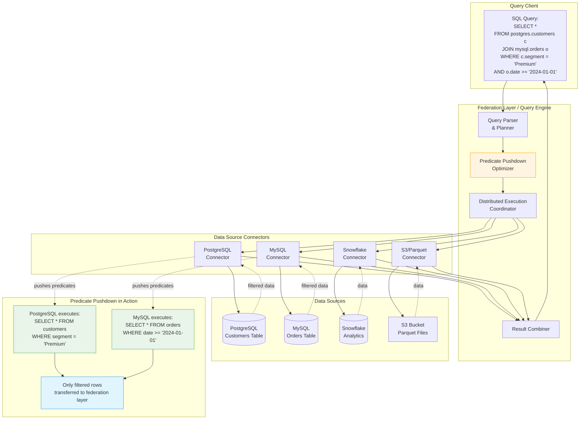

# Data Interoperability Architecture

<div class="difficulty-badge difficulty-advanced">Advanced</div>

## Quick Reference

```sql
-- Query Federation: Cross-database joins
-- PostgreSQL with foreign data wrappers (FDW)
CREATE SERVER mysql_server
FOREIGN DATA WRAPPER mysql_fdw
OPTIONS (host 'mysql-host', port '3306');

CREATE FOREIGN TABLE customers_mysql (
    customer_id INTEGER,
    customer_name VARCHAR(200),
    email VARCHAR(200),
    segment VARCHAR(50)
)
SERVER mysql_server
OPTIONS (dbname 'crm', table_name 'customers');

-- Join local PostgreSQL data with remote MySQL data
SELECT
    o.order_id,
    o.order_date,
    o.order_total,
    c.customer_name,
    c.email,
    c.segment
FROM orders o
JOIN customers_mysql c ON o.customer_id = c.customer_id
WHERE o.order_date >= CURRENT_DATE - INTERVAL '30 days'
  AND c.segment = 'Premium';
-- Predicate c.segment = 'Premium' pushed down to MySQL
-- Only matching rows transferred over network

-- Trino/Presto: Query federation across data sources
SELECT
    pg.customer_id,
    pg.customer_name,
    mysql.total_orders,
    sf.lifetime_revenue,
    mongo.recent_activity
FROM postgresql.crm.customers pg
JOIN mysql.ecommerce.order_summary mysql
    ON pg.customer_id = mysql.customer_id
JOIN snowflake.analytics.customer_metrics sf
    ON pg.customer_id = sf.customer_id
JOIN mongodb.events.customer_activity mongo
    ON pg.customer_id = mongo.customer_id
WHERE pg.created_date >= DATE '2024-01-01'
  AND sf.lifetime_revenue > 10000
  AND mongo.last_activity >= CURRENT_DATE - INTERVAL '7' DAY;
-- Predicates pushed down to each source system

-- DuckDB: Query federation with Parquet, CSV, and databases
SELECT
    db_customers.customer_id,
    db_customers.customer_name,
    parquet_orders.order_count,
    csv_demographics.age_group,
    csv_demographics.location
FROM postgres_scan('host=localhost dbname=crm', 'customers') db_customers
JOIN parquet_scan('s3://data-lake/orders/*.parquet') parquet_orders
    ON db_customers.customer_id = parquet_orders.customer_id
JOIN read_csv('s3://data-lake/demographics.csv') csv_demographics
    ON db_customers.customer_id = csv_demographics.customer_id
WHERE db_customers.segment = 'Enterprise'
  AND parquet_orders.order_date >= CURRENT_DATE - 90
  AND csv_demographics.age_group IN ('25-34', '35-44');

-- Predicate Pushdown: Explicit optimization
-- Without pushdown (inefficient)
SELECT *
FROM (
    SELECT * FROM remote_large_table  -- Fetches millions of rows
) t
WHERE t.date_col >= '2024-01-01'
  AND t.category = 'Electronics';
-- All data transferred, then filtered locally

-- With pushdown (efficient)
SELECT *
FROM remote_large_table
WHERE date_col >= '2024-01-01'
  AND category = 'Electronics';
-- Filter applied at source, only matching rows transferred

-- Snowflake: Cross-database and cross-cloud federation
-- Query data across databases and cloud providers
SELECT
    aws_db.sales.customer_id,
    aws_db.sales.total_amount,
    azure_db.crm.customer_name,
    gcp_db.analytics.customer_segment
FROM aws_database.sales_schema.sales aws_db
JOIN azure_database.crm_schema.customers azure_db
    ON aws_db.customer_id = azure_db.customer_id
JOIN gcp_database.analytics_schema.segments gcp_db
    ON aws_db.customer_id = gcp_db.customer_id
WHERE aws_db.sale_date >= DATEADD(month, -1, CURRENT_DATE)
  AND gcp_db.customer_segment = 'High Value';

-- Starburst/Trino: Advanced predicate pushdown with dynamic filtering
SELECT
    fact.order_id,
    fact.order_date,
    fact.order_amount,
    dim.customer_name,
    dim.customer_tier
FROM hive.warehouse.fact_orders fact
JOIN postgresql.crm.dim_customers dim
    ON fact.customer_id = dim.customer_id
WHERE dim.customer_tier IN ('Platinum', 'Gold')
  AND fact.order_date >= DATE '2024-01-01'
  AND fact.order_amount > 1000;
-- Dynamic filter on customer_id values pushed to fact table
-- Only relevant fact rows processed

-- PostgreSQL: Materialized views for federation caching
CREATE MATERIALIZED VIEW federated_customer_summary AS
SELECT
    c.customer_id,
    c.customer_name,
    c.email,
    o.total_orders,
    o.lifetime_value,
    p.payment_method
FROM customers c
JOIN orders_summary_mysql o ON c.customer_id = o.customer_id
JOIN payment_info_oracle p ON c.customer_id = p.customer_id;

-- Refresh materialized view periodically
REFRESH MATERIALIZED VIEW federated_customer_summary;

-- Query local materialized view (fast)
SELECT * FROM federated_customer_summary
WHERE lifetime_value > 50000;
```

## Overview

**Data Interoperability Architecture** enables seamless querying and integration across heterogeneous data sources - databases, data warehouses, data lakes, cloud storage, and APIs. This architecture provides a unified query interface while maintaining data in its native location, enabling organizations to query data "where it lives" without expensive ETL operations.

Modern data landscapes are inherently polyglot:
- **Operational databases** (PostgreSQL, MySQL, SQL Server) for transactional workloads
- **Cloud warehouses** (Snowflake, BigQuery, Redshift) for analytics
- **Data lakes** (S3, ADLS, GCS) for raw and semi-structured data
- **NoSQL stores** (MongoDB, Cassandra, DynamoDB) for specific use cases
- **Streaming platforms** (Kafka, Kinesis) for real-time data

Data interoperability eliminates data silos by enabling **query federation** and **data virtualization**, where:
- Queries span multiple data sources transparently
- Data remains in its optimal storage location
- Predicates and filters are **pushed down** to source systems
- Results are combined efficiently

### Core Concepts

**Query Federation**: Ability to execute a single query across multiple heterogeneous data sources, with the query engine coordinating execution, applying optimizations, and combining results.

**Predicate Pushdown**: Critical optimization that pushes WHERE clause filters, projections (SELECT columns), and aggregations down to source systems, minimizing data transfer and maximizing performance.

**Data Virtualization**: Abstraction layer that provides a unified view of disparate data sources without physical data movement, enabling real-time access to distributed data.



## Core Principles

### 1. Query Federation

Query federation enables executing queries across multiple data sources with a unified SQL interface.

**PostgreSQL Foreign Data Wrappers (FDW)**:

```sql
-- Install PostgreSQL FDW extensions
CREATE EXTENSION postgres_fdw;
CREATE EXTENSION mysql_fdw;
CREATE EXTENSION oracle_fdw;

-- Define foreign servers
CREATE SERVER postgres_remote
FOREIGN DATA WRAPPER postgres_fdw
OPTIONS (host 'remote-postgres.example.com', port '5432', dbname 'analytics');

CREATE SERVER mysql_crm
FOREIGN DATA WRAPPER mysql_fdw
OPTIONS (host 'mysql.example.com', port '3306');

CREATE SERVER oracle_erp
FOREIGN DATA WRAPPER oracle_fdw
OPTIONS (dbserver '//oracle.example.com:1521/PROD');

-- Create user mappings for authentication
CREATE USER MAPPING FOR current_user
SERVER postgres_remote
OPTIONS (user 'federated_user', password 'secret');

CREATE USER MAPPING FOR current_user
SERVER mysql_crm
OPTIONS (username 'app_user', password 'secret');

-- Define foreign tables (virtual tables referencing remote data)
CREATE FOREIGN TABLE remote_customers (
    customer_id INTEGER,
    customer_name VARCHAR(200),
    email VARCHAR(200),
    registration_date DATE,
    lifetime_value DECIMAL(12,2)
)
SERVER postgres_remote
OPTIONS (schema_name 'public', table_name 'customers');

CREATE FOREIGN TABLE mysql_orders (
    order_id INTEGER,
    customer_id INTEGER,
    order_date DATE,
    order_total DECIMAL(10,2),
    order_status VARCHAR(50)
)
SERVER mysql_crm
OPTIONS (dbname 'ecommerce', table_name 'orders');

CREATE FOREIGN TABLE oracle_products (
    product_id INTEGER,
    product_name VARCHAR(200),
    category VARCHAR(100),
    unit_price DECIMAL(10,2)
)
SERVER oracle_erp
OPTIONS (schema 'PRODUCTS', table 'PRODUCT_CATALOG');

-- Federated query across PostgreSQL, MySQL, and Oracle
SELECT
    c.customer_id,
    c.customer_name,
    c.email,
    COUNT(o.order_id) as total_orders,
    SUM(o.order_total) as total_spent,
    ARRAY_AGG(DISTINCT p.category) as purchased_categories
FROM remote_customers c
JOIN mysql_orders o ON c.customer_id = o.customer_id
JOIN oracle_products p ON o.product_id = p.product_id
WHERE c.registration_date >= '2023-01-01'
  AND o.order_status = 'completed'
  AND p.category IN ('Electronics', 'Computers')
GROUP BY c.customer_id, c.customer_name, c.email
HAVING SUM(o.order_total) > 10000
ORDER BY total_spent DESC;

-- Check query plan to verify predicate pushdown
EXPLAIN (VERBOSE, COSTS ON)
SELECT *
FROM mysql_orders
WHERE order_date >= '2024-01-01'
  AND order_status = 'completed';

-- Expected plan shows remote SQL with pushed predicates:
-- Foreign Scan on mysql_orders
--   Remote SQL: SELECT order_id, customer_id, order_date, order_total, order_status
--               FROM ecommerce.orders
--               WHERE order_date >= '2024-01-01' AND order_status = 'completed'
```

**Trino/Presto Federation**:

```sql
-- Trino: Query federation engine designed for heterogeneous sources
-- Configure catalogs in catalog/mysql.properties, catalog/postgresql.properties, etc.

-- Cross-catalog federated query
SELECT
    pg.customer_id,
    pg.customer_name,
    pg.segment,
    mysql.order_count,
    mysql.total_revenue,
    sf.predicted_churn_score,
    mongo.last_interaction_date
FROM postgresql.crm.customers pg
JOIN mysql.ecommerce.customer_order_summary mysql
    ON pg.customer_id = mysql.customer_id
JOIN snowflake.ml_models.churn_predictions sf
    ON pg.customer_id = sf.customer_id
JOIN mongodb.interactions.customer_events mongo
    ON CAST(pg.customer_id AS VARCHAR) = mongo.customer_id
WHERE pg.segment IN ('Premium', 'Enterprise')
  AND mysql.total_revenue > 50000
  AND sf.predicted_churn_score < 0.3
  AND mongo.last_interaction_date >= CURRENT_DATE - INTERVAL '30' DAY;

-- Trino EXPLAIN shows distributed execution plan
EXPLAIN
SELECT *
FROM postgresql.sales.orders
WHERE order_date >= DATE '2024-01-01';

-- Shows:
-- - Fragment 0 (coordinator): Aggregates results
-- - Fragment 1 (workers): Scans PostgreSQL with predicate pushdown
--   TableScan[postgresql.sales.orders, predicate=(order_date >= DATE '2024-01-01')]

-- Create materialized view for frequently accessed federated data
CREATE MATERIALIZED VIEW hive.analytics.customer_360 AS
SELECT
    pg.customer_id,
    pg.customer_name,
    pg.email,
    mysql.total_orders,
    sf.lifetime_value,
    mongo.recent_activities
FROM postgresql.crm.customers pg
LEFT JOIN mysql.ecommerce.order_summary mysql
    ON pg.customer_id = mysql.customer_id
LEFT JOIN snowflake.analytics.customer_metrics sf
    ON pg.customer_id = sf.customer_id
LEFT JOIN mongodb.events.customer_activity mongo
    ON CAST(pg.customer_id AS VARCHAR) = mongo.customer_id;

-- Query materialized view (much faster than live federation)
SELECT * FROM hive.analytics.customer_360
WHERE lifetime_value > 100000;
```

**DuckDB Federated Queries**:

```sql
-- DuckDB: In-process analytical engine with federation capabilities

-- Install and load extensions
INSTALL postgres;
INSTALL mysql;
INSTALL aws;
LOAD postgres;
LOAD mysql;
LOAD aws;

-- Query PostgreSQL database
SELECT *
FROM postgres_scan('host=localhost port=5432 dbname=analytics user=duck password=quack', 'public', 'customers')
WHERE segment = 'Premium';

-- Query MySQL database
SELECT *
FROM mysql_scan('host=mysql-server port=3306 database=ecommerce user=root password=secret', 'orders')
WHERE order_date >= '2024-01-01';

-- Federated query combining database and Parquet files
SELECT
    c.customer_id,
    c.customer_name,
    o.order_count,
    o.total_revenue,
    p.product_preferences
FROM postgres_scan('host=localhost dbname=crm', 'customers') c
JOIN read_parquet('s3://data-lake/orders/*.parquet') o
    ON c.customer_id = o.customer_id
JOIN read_csv('s3://data-lake/product_prefs.csv') p
    ON c.customer_id = p.customer_id
WHERE c.created_date >= '2023-01-01'
  AND o.total_revenue > 10000;

-- Query Iceberg tables with predicate pushdown
SELECT *
FROM iceberg_scan('s3://warehouse/customer_events', allow_moved_paths = true)
WHERE event_date >= '2024-01-01'
  AND event_type = 'purchase';

-- Attach databases for cleaner syntax
ATTACH 'host=localhost dbname=analytics' AS pg_analytics (TYPE postgres);
ATTACH 'host=mysql-server database=ecommerce' AS mysql_ecom (TYPE mysql);

-- Now query with simpler syntax
SELECT
    pg.customer_id,
    pg.customer_name,
    mysql.total_orders
FROM pg_analytics.customers pg
JOIN mysql_ecom.order_summary mysql ON pg.customer_id = mysql.customer_id
WHERE pg.segment = 'Enterprise';
```

### 2. Predicate Pushdown

Predicate pushdown is the most critical optimization in federated queries, pushing filters, projections, and aggregations to source systems to minimize data transfer.

**Understanding Predicate Pushdown**:

```sql
-- Scenario: Querying 100M row table with foreign data wrapper

-- WITHOUT predicate pushdown (DISASTER - transfers all 100M rows)
-- This happens when predicates cannot be pushed down
SELECT *
FROM (
    SELECT * FROM foreign_large_table  -- Fetches ALL 100M rows over network
) t
WHERE t.category = 'Electronics'
  AND t.sale_date >= '2024-01-01';
-- Result: 100M rows transferred, filtered locally to 100K rows
-- Network transfer: ~10GB
-- Query time: 5-10 minutes

-- WITH predicate pushdown (EFFICIENT - transfers only matching rows)
SELECT *
FROM foreign_large_table
WHERE category = 'Electronics'
  AND sale_date >= '2024-01-01';
-- Result: 100K rows transferred
-- Network transfer: ~10MB
-- Query time: 5-10 seconds
-- 100x faster!

-- Verify pushdown with EXPLAIN
EXPLAIN (VERBOSE)
SELECT *
FROM foreign_large_table
WHERE category = 'Electronics'
  AND sale_date >= '2024-01-01';

-- Good plan shows:
-- Foreign Scan on foreign_large_table
--   Remote SQL: SELECT * FROM large_table
--               WHERE category = 'Electronics'
--                 AND sale_date >= '2024-01-01'
```

**PostgreSQL FDW Predicate Pushdown**:

```sql
-- PostgreSQL FDW supports pushdown for:
-- - WHERE clauses (predicates)
-- - SELECT columns (projections)
-- - LIMIT clauses
-- - JOINs (in some cases)
-- - Aggregations (GROUP BY, COUNT, SUM, AVG, etc.)

-- Projection pushdown (only fetch needed columns)
EXPLAIN VERBOSE
SELECT customer_id, customer_name, email
FROM remote_customers
WHERE segment = 'Premium';

-- Shows pushed down SELECT with only requested columns:
-- Remote SQL: SELECT customer_id, customer_name, email
--             FROM customers
--             WHERE segment = 'Premium'

-- Aggregation pushdown
EXPLAIN VERBOSE
SELECT
    segment,
    COUNT(*) as customer_count,
    AVG(lifetime_value) as avg_ltv,
    SUM(lifetime_value) as total_ltv
FROM remote_customers
WHERE registration_date >= '2023-01-01'
GROUP BY segment;

-- Shows pushed down aggregation:
-- Remote SQL: SELECT segment, COUNT(*), AVG(lifetime_value), SUM(lifetime_value)
--             FROM customers
--             WHERE registration_date >= '2023-01-01'
--             GROUP BY segment

-- JOIN pushdown (when both tables are on same foreign server)
EXPLAIN VERBOSE
SELECT
    c.customer_id,
    c.customer_name,
    o.order_total
FROM remote_customers c
JOIN remote_orders o ON c.customer_id = o.customer_id
WHERE c.segment = 'Premium'
  AND o.order_date >= '2024-01-01';

-- If both tables on same server, entire join executes remotely:
-- Remote SQL: SELECT c.customer_id, c.customer_name, o.order_total
--             FROM customers c
--             JOIN orders o ON c.customer_id = o.customer_id
--             WHERE c.segment = 'Premium'
--               AND o.order_date >= '2024-01-01'

-- Control pushdown behavior with options
ALTER FOREIGN TABLE remote_customers
OPTIONS (ADD use_remote_estimate 'true');  -- Use remote table statistics

ALTER SERVER postgres_remote
OPTIONS (ADD fetch_size '10000');  -- Fetch rows in batches of 10K
```

**Trino/Starburst Dynamic Filtering**:

```sql
-- Trino's advanced predicate pushdown with dynamic filtering
-- Scenario: Join small dimension table (1K rows) with huge fact table (1B rows)

SELECT
    f.order_id,
    f.order_date,
    f.order_amount,
    d.customer_name,
    d.customer_tier
FROM hive.warehouse.fact_orders f
JOIN postgresql.crm.dim_customers d
    ON f.customer_id = d.customer_id
WHERE d.customer_tier = 'Platinum'
  AND d.country = 'USA';

-- Execution with dynamic filtering:
-- 1. Filter dim_customers: WHERE customer_tier = 'Platinum' AND country = 'USA'
--    Result: 500 customer_ids
--
-- 2. Create dynamic filter: customer_id IN (id1, id2, ..., id500)
--
-- 3. Push dynamic filter to fact_orders scan:
--    SELECT * FROM fact_orders
--    WHERE customer_id IN (id1, id2, ..., id500)
--      AND <other predicates>
--
-- Result: Only scan 50K relevant fact rows instead of 1B rows
-- 20,000x reduction in data scanned!

-- Configure dynamic filtering
SET SESSION enable_dynamic_filtering = true;
SET SESSION dynamic_filtering_max_per_driver_row_count = 1000;

-- View query execution details
EXPLAIN (TYPE DISTRIBUTED)
SELECT
    f.sale_id,
    d.product_name,
    d.category
FROM hive.sales.fact_sales f
JOIN postgresql.product.dim_products d ON f.product_id = d.product_id
WHERE d.category = 'Electronics';

-- Shows dynamic filter application:
-- - ScanProject[table = hive.sales.fact_sales,
--                dynamicFilters = {"product_id" = #df_123}]
```

**Snowflake Predicate Pushdown**:

```sql
-- Snowflake external tables with predicate pushdown

-- Create external table on S3 Parquet files
CREATE EXTERNAL TABLE ext_sales
(
    sale_id INTEGER AS (value:sale_id::INTEGER),
    sale_date DATE AS (value:sale_date::DATE),
    customer_id INTEGER AS (value:customer_id::INTEGER),
    amount DECIMAL(10,2) AS (value:amount::DECIMAL(10,2)),
    category VARCHAR AS (value:category::VARCHAR)
)
PARTITION BY (sale_date)
LOCATION = 's3://data-lake/sales/'
FILE_FORMAT = (TYPE = PARQUET);

-- Refresh external table metadata
ALTER EXTERNAL TABLE ext_sales REFRESH;

-- Query with predicate pushdown to Parquet files
SELECT
    sale_date,
    category,
    COUNT(*) as sale_count,
    SUM(amount) as total_amount
FROM ext_sales
WHERE sale_date >= '2024-01-01'
  AND category = 'Electronics'
GROUP BY sale_date, category;

-- Snowflake pushes predicates to Parquet file scans
-- Only reads matching partitions and row groups
-- Uses Parquet metadata (min/max stats) to skip files

-- Check query profile to verify pushdown
-- Shows: "Partitions scanned: 12 of 365" (partition pruning)
--        "Bytes scanned: 1.2GB of 500GB" (predicate pushdown)

-- Federated query with predicate pushdown across databases
SELECT
    s.customer_id,
    s.total_sales,
    c.customer_name,
    c.segment
FROM snowflake_db.analytics.sales_summary s
JOIN external_postgresql_db.crm.customers c
    ON s.customer_id = c.customer_id
WHERE s.sale_year = 2024
  AND s.total_sales > 50000
  AND c.segment = 'Enterprise';

-- Predicates pushed to both Snowflake and PostgreSQL
```

### 3. Data Virtualization Layers

Data virtualization provides a unified abstraction over heterogeneous sources.

```sql
-- Dremio: Data virtualization and acceleration

-- Define data sources
-- PostgreSQL source
CREATE SOURCE postgres_crm
TYPE 'POSTGRES'
CONFIG {
    'host' = 'postgres-host',
    'port' = '5432',
    'database' = 'crm',
    'username' = 'dremio',
    'password' = 'secret'
};

-- S3 data lake source
CREATE SOURCE s3_datalake
TYPE 'S3'
CONFIG {
    'aws_access_key' = 'ACCESS_KEY',
    'aws_secret_key' = 'SECRET_KEY',
    'region' = 'us-east-1'
};

-- Create virtual dataset combining sources
CREATE VDS analytics.customer_360 AS
SELECT
    c.customer_id,
    c.customer_name,
    c.email,
    c.segment,
    o.total_orders,
    o.lifetime_value,
    e.recent_events
FROM postgres_crm.public.customers c
LEFT JOIN s3_datalake.analytics.order_summary o
    ON c.customer_id = o.customer_id
LEFT JOIN s3_datalake.events.customer_events e
    ON c.customer_id = e.customer_id;

-- Create reflection (materialized acceleration)
CREATE REFLECTION customer_360_reflection
ON analytics.customer_360
DIMENSIONS (customer_id, segment)
MEASURES (total_orders, lifetime_value)
PARTITION BY (segment);

-- Queries automatically use reflection when beneficial
SELECT
    segment,
    AVG(lifetime_value) as avg_ltv,
    COUNT(*) as customer_count
FROM analytics.customer_360
WHERE segment = 'Premium'
GROUP BY segment;
-- Dremio query optimizer uses reflection for instant results

-- Denodo: Enterprise data virtualization
-- Define base views over sources
CREATE VIEW customer_base AS
SELECT *
FROM JDBC_DATASOURCE.crm.customers;

CREATE VIEW orders_base AS
SELECT *
FROM MYSQL_DATASOURCE.ecommerce.orders;

-- Create derived view with business logic
CREATE VIEW customer_summary AS
SELECT
    c.customer_id,
    c.customer_name,
    c.email,
    COUNT(o.order_id) as total_orders,
    SUM(o.order_total) as lifetime_value,
    MAX(o.order_date) as last_order_date
FROM customer_base c
LEFT JOIN orders_base o ON c.customer_id = o.customer_id
GROUP BY c.customer_id, c.customer_name, c.email;

-- Enable query optimization
ALTER VIEW customer_summary
SET QUERY_OPTIMIZATION = ON;

-- Configure cache for performance
CREATE CACHE FOR customer_summary
MODE = PARTIAL
TTL = 3600;  -- 1 hour TTL
```

## Federation Patterns

### Pattern 1: Hub-and-Spoke Federation

Central query engine federates to multiple sources.

```sql
-- Trino as central hub
-- Query plan spans multiple catalogs

-- Define catalogs in coordinator
-- catalog/postgres.properties
-- catalog/mysql.properties
-- catalog/snowflake.properties
-- catalog/mongodb.properties

-- Federated analytical query
SELECT
    d.date_key,
    d.fiscal_year,
    d.fiscal_quarter,
    fc.customer_segment,
    fp.product_category,
    SUM(f.sales_amount) as total_sales,
    COUNT(DISTINCT f.customer_id) as unique_customers,
    AVG(f.order_value) as avg_order_value
FROM hive.warehouse.fact_sales f
JOIN postgresql.dimensions.dim_date d
    ON f.date_id = d.date_id
JOIN mysql.dimensions.fact_customers fc
    ON f.customer_id = fc.customer_id
JOIN snowflake.product_catalog.dim_products fp
    ON f.product_id = fp.product_id
WHERE d.fiscal_year = 2024
  AND fc.customer_segment IN ('Premium', 'Enterprise')
  AND fp.product_category = 'Electronics'
GROUP BY
    d.date_key,
    d.fiscal_year,
    d.fiscal_quarter,
    fc.customer_segment,
    fp.product_category
HAVING SUM(f.sales_amount) > 100000
ORDER BY total_sales DESC;

-- Execution plan:
-- 1. Scan dim_date from PostgreSQL with predicate fiscal_year = 2024
-- 2. Scan fact_customers from MySQL with predicate customer_segment IN (...)
-- 3. Scan dim_products from Snowflake with predicate product_category = 'Electronics'
-- 4. Scan fact_sales from Hive with dynamic filters from dimension scans
-- 5. Distributed hash join across all tables
-- 6. Aggregation and final result
```

### Pattern 2: Peer-to-Peer Federation

Databases directly query each other.

```sql
-- PostgreSQL querying MySQL and Oracle directly

-- Setup foreign servers
CREATE SERVER mysql_peer
FOREIGN DATA WRAPPER mysql_fdw
OPTIONS (host 'mysql-server', port '3306');

CREATE SERVER oracle_peer
FOREIGN DATA WRAPPER oracle_fdw
OPTIONS (dbserver '//oracle-server:1521/PROD');

-- Foreign tables
CREATE FOREIGN TABLE mysql_inventory (
    product_id INTEGER,
    warehouse_id INTEGER,
    quantity_available INTEGER,
    last_updated TIMESTAMP
)
SERVER mysql_peer
OPTIONS (dbname 'inventory', table_name 'stock_levels');

CREATE FOREIGN TABLE oracle_shipments (
    shipment_id INTEGER,
    product_id INTEGER,
    quantity INTEGER,
    shipment_date DATE,
    destination_warehouse INTEGER
)
SERVER oracle_peer
OPTIONS (schema 'LOGISTICS', table 'SHIPMENTS');

-- Local PostgreSQL products table
CREATE TABLE products (
    product_id INTEGER PRIMARY KEY,
    product_name VARCHAR(200),
    category VARCHAR(100),
    unit_price DECIMAL(10,2)
);

-- Federated inventory query
SELECT
    p.product_id,
    p.product_name,
    p.category,
    i.warehouse_id,
    i.quantity_available,
    COALESCE(s.inbound_quantity, 0) as inbound_quantity,
    i.quantity_available + COALESCE(s.inbound_quantity, 0) as projected_quantity
FROM products p
JOIN mysql_inventory i ON p.product_id = i.product_id
LEFT JOIN (
    SELECT
        product_id,
        destination_warehouse,
        SUM(quantity) as inbound_quantity
    FROM oracle_shipments
    WHERE shipment_date >= CURRENT_DATE
      AND shipment_date <= CURRENT_DATE + 7
    GROUP BY product_id, destination_warehouse
) s ON p.product_id = s.product_id
   AND i.warehouse_id = s.destination_warehouse
WHERE p.category = 'Electronics'
  AND i.quantity_available < 100
ORDER BY projected_quantity ASC;
```

### Pattern 3: Layered Federation

Multiple federation layers for different use cases.

```sql
-- Layer 1: Source connectors (Trino)
-- Layer 2: Semantic layer (dbt metrics)
-- Layer 3: BI tools

-- Trino queries raw sources
CREATE VIEW raw_sales AS
SELECT
    order_id,
    customer_id,
    order_date,
    order_total
FROM mysql.ecommerce.orders
WHERE order_date >= DATE '2024-01-01';

CREATE VIEW raw_customers AS
SELECT
    customer_id,
    customer_name,
    segment
FROM postgresql.crm.customers;

-- dbt creates semantic models on top
-- models/customer_metrics.sql
{{ config(materialized='view') }}

SELECT
    c.customer_id,
    c.customer_name,
    c.segment,
    COUNT(s.order_id) as total_orders,
    SUM(s.order_total) as lifetime_value,
    AVG(s.order_total) as avg_order_value,
    MAX(s.order_date) as last_order_date,
    CURRENT_DATE - MAX(s.order_date) as days_since_last_order
FROM {{ ref('raw_customers') }} c
LEFT JOIN {{ ref('raw_sales') }} s
    ON c.customer_id = s.customer_id
GROUP BY c.customer_id, c.customer_name, c.segment;

-- BI tools query semantic layer
SELECT
    segment,
    COUNT(*) as customer_count,
    AVG(lifetime_value) as avg_ltv,
    SUM(lifetime_value) as total_revenue
FROM dbt.analytics.customer_metrics
WHERE days_since_last_order <= 90
GROUP BY segment;
```

## Performance Optimization

### Optimization 1: Partition Pruning

```sql
-- Partition-aware predicate pushdown

-- Hive partitioned table
CREATE TABLE sales_partitioned (
    sale_id BIGINT,
    customer_id BIGINT,
    amount DECIMAL(10,2)
)
PARTITIONED BY (year INT, month INT, day INT)
STORED AS PARQUET;

-- Query with partition predicates
SELECT
    SUM(amount) as total_sales,
    COUNT(DISTINCT customer_id) as unique_customers
FROM sales_partitioned
WHERE year = 2024
  AND month = 3
  AND day BETWEEN 1 AND 7;

-- Only scans partitions: year=2024/month=3/day=1 through day=7
-- Skips all other partitions (99.9% of data)

-- Verify partition pruning in Trino
EXPLAIN
SELECT * FROM hive.warehouse.sales_partitioned
WHERE year = 2024 AND month >= 3;

-- Shows: partitions=12 (only 2024's months), out of 1000 total
```

### Optimization 2: Column Pruning

```sql
-- Only fetch needed columns

-- Inefficient: Fetches all 50 columns
SELECT *
FROM wide_table_with_50_columns
WHERE date_col = '2024-01-01';

-- Efficient: Fetches only 3 columns
SELECT customer_id, order_total, order_date
FROM wide_table_with_50_columns
WHERE date_col = '2024-01-01';

-- Column pruning with Parquet (columnar format)
-- Reads only necessary column data from disk
-- 17x less data read (3 columns vs 50 columns)
```

### Optimization 3: Join Ordering

```sql
-- Small table first (dimension) to build hash table
-- Then scan large table (fact) with dynamic filter

-- Efficient join order
SELECT
    f.sale_id,
    f.amount,
    d.customer_name,
    d.segment
FROM small_dimension d  -- 10K rows, scan first
JOIN large_fact f ON d.customer_id = f.customer_id  -- 1B rows, scan second
WHERE d.segment = 'Premium';  -- Filters to 1K customers

-- Creates dynamic filter: customer_id IN (id1, id2, ..., id1000)
-- Pushed to fact table scan
-- Only scans ~100K fact rows instead of 1B

-- Inefficient join order (wrong order)
SELECT
    f.sale_id,
    f.amount,
    d.customer_name,
    d.segment
FROM large_fact f  -- Scans 1B rows first
JOIN small_dimension d ON f.customer_id = d.customer_id
WHERE d.segment = 'Premium';

-- No dynamic filter possible
-- Must scan all 1B fact rows
```

### Optimization 4: Caching and Materialization

```sql
-- PostgreSQL materialized view for expensive federated queries
CREATE MATERIALIZED VIEW mv_customer_summary AS
SELECT
    c.customer_id,
    c.customer_name,
    o.total_orders,
    o.lifetime_value
FROM customers c
JOIN foreign_orders o ON c.customer_id = o.customer_id;

-- Refresh periodically (e.g., hourly cron job)
REFRESH MATERIALIZED VIEW mv_customer_summary;

-- Query materialized view (local, fast)
SELECT * FROM mv_customer_summary
WHERE lifetime_value > 10000;

-- Trino connector caching
CREATE TABLE hive.cache.customer_orders
WITH (
    format = 'PARQUET',
    external_location = 's3://cache-bucket/customer_orders/'
) AS
SELECT
    c.customer_id,
    c.customer_name,
    o.order_id,
    o.order_date,
    o.order_total
FROM postgresql.crm.customers c
JOIN mysql.ecommerce.orders o ON c.customer_id = o.customer_id
WHERE o.order_date >= DATE '2024-01-01';

-- Future queries use cached Parquet files
SELECT * FROM hive.cache.customer_orders
WHERE customer_id = 12345;
```

## Benefits

### 1. Eliminate Data Silos

Access all data from one interface without moving it.

```sql
-- Single query across operational DB, data warehouse, and data lake
SELECT
    operational.customer_name,
    warehouse.customer_segment,
    datalake.recent_clickstream_events
FROM postgresql.production.customers operational
JOIN snowflake.analytics.customer_segments warehouse
    ON operational.customer_id = warehouse.customer_id
JOIN s3_parquet.events.clickstream datalake
    ON operational.customer_id = datalake.customer_id
WHERE operational.account_status = 'active';
```

### 2. Reduce ETL Complexity

Query data where it lives instead of copying.

```sql
-- Traditional: ETL all data to warehouse (slow, expensive)
-- Modern: Query federation (fast, cost-effective)

-- No ETL needed - query live operational data
SELECT
    COUNT(*) as active_orders,
    SUM(order_total) as total_value
FROM mysql.production.orders
WHERE order_status = 'processing'
  AND order_date = CURRENT_DATE;
```

### 3. Real-Time Data Access

No delays from batch ETL processes.

```sql
-- Query production database in real-time
SELECT
    product_id,
    SUM(quantity) as units_sold_today,
    SUM(order_total) as revenue_today
FROM operational_db.orders
WHERE order_date = CURRENT_DATE
  AND order_status = 'completed'
GROUP BY product_id
ORDER BY revenue_today DESC
LIMIT 10;
```

### 4. Cost Optimization

Avoid storing duplicate data.

```sql
-- Data stays in optimal storage tier
-- Hot data: PostgreSQL (expensive, fast)
-- Warm data: Snowflake (moderate cost)
-- Cold data: S3 Parquet (cheap, slower)

-- Query seamlessly across tiers
SELECT *
FROM hot_tier.recent_orders
UNION ALL
SELECT *
FROM warm_tier.last_year_orders
UNION ALL
SELECT *
FROM cold_tier.archived_orders;
```

## Challenges & Considerations

### 1. Network Latency

```sql
-- Challenge: Remote queries slower than local
-- Solution: Predicate pushdown, caching, materialization

-- Measure query performance
EXPLAIN ANALYZE
SELECT * FROM remote_table WHERE date_col >= '2024-01-01';

-- If slow, create materialized view
CREATE MATERIALIZED VIEW local_cache AS
SELECT * FROM remote_table
WHERE date_col >= '2024-01-01';
```

### 2. Limited Pushdown Support

```sql
-- Some predicates may not push down
-- Complex functions, custom types, etc.

-- Check what pushes down
EXPLAIN VERBOSE
SELECT *
FROM foreign_table
WHERE EXTRACT(YEAR FROM date_col) = 2024;  -- May not push down

-- Rewrite for better pushdown
SELECT *
FROM foreign_table
WHERE date_col >= '2024-01-01'
  AND date_col < '2025-01-01';  -- Pushes down
```

### 3. Consistency Challenges

```sql
-- Federated queries may see inconsistent snapshot
-- Source A at time T1, Source B at time T2

-- Solution: Materialized views for consistency
CREATE MATERIALIZED VIEW consistent_snapshot AS
SELECT
    a.id,
    a.value_from_source_a,
    b.value_from_source_b
FROM source_a a
JOIN source_b b ON a.id = b.id;
```

## Best Practices

### 1. Always Push Predicates Down

```sql
-- Good: Predicates in main query
SELECT * FROM foreign_table
WHERE date_col >= '2024-01-01';

-- Bad: Predicates in subquery (may not push down)
SELECT * FROM (SELECT * FROM foreign_table) t
WHERE t.date_col >= '2024-01-01';
```

### 2. Use EXPLAIN to Verify Pushdown

```sql
EXPLAIN VERBOSE
SELECT * FROM foreign_table
WHERE col = 'value';

-- Check Remote SQL shows pushed predicate
```

### 3. Materialize Frequently Accessed Federated Data

```sql
CREATE MATERIALIZED VIEW cached_federated_data AS
SELECT * FROM expensive_federated_query;

REFRESH MATERIALIZED VIEW cached_federated_data;
```

### 4. Monitor Query Performance

```sql
-- Track slow federated queries
CREATE TABLE query_performance_log (
    query_text TEXT,
    execution_time_ms INTEGER,
    data_transferred_bytes BIGINT,
    predicates_pushed_down BOOLEAN
);
```

## See Also

- [Lakehouse Architecture](/architectures/lakehouse/) - Unified data platform architecture
- [Data Mesh Architecture](/architectures/data-mesh/) - Decentralized domain-oriented data architecture
- [Data Vault Architecture](/architectures/data-vault/) - Enterprise data modeling approach
- [Medallion Architecture](/architectures/medallion/) - Bronze-Silver-Gold layering pattern
