# Data Mesh Architecture

<div class="difficulty-badge difficulty-advanced">Advanced</div>

## Quick Reference

```sql
-- Domain Data Product: Customer Domain
CREATE SCHEMA customer_domain;

-- Data Product: Customer Profile (Analytical Data Product)
CREATE TABLE customer_domain.customer_profile_v1 (
    customer_id VARCHAR(50) PRIMARY KEY,
    customer_name VARCHAR(200),
    email VARCHAR(200),
    segment VARCHAR(50),
    lifetime_value DECIMAL(12,2),

    -- Data product metadata
    data_product_version VARCHAR(20) DEFAULT 'v1.0',
    last_updated TIMESTAMP DEFAULT CURRENT_TIMESTAMP,
    quality_score DECIMAL(5,2),

    -- SLA guarantees
    freshness_timestamp TIMESTAMP,
    completeness_pct DECIMAL(5,2)
);

-- Data Product Contract (Schema + Semantics + SLAs)
CREATE TABLE customer_domain.data_product_contract (
    product_name VARCHAR(100) PRIMARY KEY,
    version VARCHAR(20),
    owner_team VARCHAR(100),
    description TEXT,

    -- SLA specifications
    freshness_sla_minutes INTEGER,
    availability_sla_pct DECIMAL(5,2),
    quality_sla_score DECIMAL(5,2),

    -- Schema definition
    schema_version VARCHAR(20),
    schema_registry_id VARCHAR(100),

    -- Access control
    access_policy TEXT,
    approved_consumers TEXT[],

    created_at TIMESTAMP DEFAULT CURRENT_TIMESTAMP,
    updated_at TIMESTAMP DEFAULT CURRENT_TIMESTAMP
);

-- Register data product
INSERT INTO customer_domain.data_product_contract VALUES (
    'customer_profile',
    'v1.0',
    'customer_experience_team',
    'Curated customer profiles with lifetime value and segmentation for analytics',
    30,  -- 30 minute freshness SLA
    99.9,  -- 99.9% availability
    95.0,  -- 95% quality score minimum
    'v1.0',
    'schema-registry://customer-profile-v1',
    'GRANT SELECT TO ROLE analytics_users',
    ARRAY['marketing_team', 'sales_analytics_team', 'finance_reporting'],
    CURRENT_TIMESTAMP,
    CURRENT_TIMESTAMP
);

-- Domain Data Product: Order Domain
CREATE SCHEMA order_domain;

CREATE TABLE order_domain.order_analytics_v1 (
    order_id VARCHAR(50) PRIMARY KEY,
    customer_id VARCHAR(50),
    order_date DATE,
    order_status VARCHAR(50),
    total_amount DECIMAL(12,2),
    items_count INTEGER,

    -- Inter-domain reference
    customer_segment VARCHAR(50),  -- Derived from customer_domain

    data_product_version VARCHAR(20) DEFAULT 'v1.0',
    last_updated TIMESTAMP DEFAULT CURRENT_TIMESTAMP
);

-- Cross-domain query using data products
SELECT
    c.customer_id,
    c.customer_name,
    c.segment,
    c.lifetime_value,
    COUNT(o.order_id) as total_orders,
    SUM(o.total_amount) as total_revenue,
    AVG(o.total_amount) as avg_order_value
FROM customer_domain.customer_profile_v1 c
JOIN order_domain.order_analytics_v1 o
    ON c.customer_id = o.customer_id
WHERE c.segment = 'Premium'
  AND o.order_date >= CURRENT_DATE - INTERVAL '365 days'
GROUP BY c.customer_id, c.customer_name, c.segment, c.lifetime_value;

-- Data Product Quality Monitoring
CREATE TABLE governance.data_quality_metrics (
    domain_name VARCHAR(100),
    product_name VARCHAR(100),
    metric_timestamp TIMESTAMP,

    -- Quality dimensions
    completeness_pct DECIMAL(5,2),
    accuracy_score DECIMAL(5,2),
    consistency_score DECIMAL(5,2),
    timeliness_minutes INTEGER,

    -- SLA compliance
    sla_met BOOLEAN,
    sla_violations INTEGER,

    PRIMARY KEY (domain_name, product_name, metric_timestamp)
);

-- Federated Governance: Global policies
CREATE TABLE governance.global_policies (
    policy_id VARCHAR(50) PRIMARY KEY,
    policy_name VARCHAR(200),
    policy_type VARCHAR(50),  -- 'data_classification', 'retention', 'access_control'
    policy_definition TEXT,
    applies_to_domains TEXT[],
    enforcement_level VARCHAR(20),  -- 'mandatory', 'recommended'
    created_by VARCHAR(100),
    effective_date DATE
);

-- Self-serve Data Infrastructure: Automated data product provisioning
CREATE OR REPLACE FUNCTION create_data_product(
    p_domain VARCHAR,
    p_product_name VARCHAR,
    p_owner_team VARCHAR
) RETURNS BOOLEAN AS $$
DECLARE
    v_schema_name VARCHAR;
BEGIN
    v_schema_name := p_domain || '_domain';

    -- Create domain schema if not exists
    EXECUTE format('CREATE SCHEMA IF NOT EXISTS %I', v_schema_name);

    -- Grant permissions
    EXECUTE format('GRANT USAGE ON SCHEMA %I TO ROLE %I',
                   v_schema_name, p_owner_team);

    -- Register in catalog
    INSERT INTO governance.data_product_catalog (
        domain, product_name, owner_team, status
    ) VALUES (
        p_domain, p_product_name, p_owner_team, 'active'
    );

    RETURN TRUE;
END;
$$ LANGUAGE plpgsql;
```

## Overview

**Data Mesh** is a paradigm shift in data architecture and organizational design, introduced by **Zhamak Dehghani** in 2019. Unlike centralized data platforms (data warehouses, data lakes), Data Mesh proposes a **decentralized, domain-oriented approach** where data is treated as a product, owned and served by domain teams who understand the data best.

Data Mesh addresses the scalability, ownership, and organizational challenges of centralized data architectures by applying **domain-driven design**, **product thinking**, and **platform thinking** to data infrastructure.

### The Problem with Centralized Data Architectures

Traditional centralized approaches face fundamental challenges:

- **Bottlenecks**: Central data teams become bottlenecks as data volume and complexity grow
- **Domain expertise gap**: Central teams lack deep domain knowledge to ensure data quality and relevance
- **Tight coupling**: Monolithic pipelines create dependencies that slow down changes
- **Ownership ambiguity**: Unclear responsibility for data quality and meaning
- **Scaling limitations**: Centralized teams cannot scale with organizational growth

### The Four Pillars of Data Mesh

1. **Domain-Oriented Decentralized Data Ownership**: Data ownership distributed to domain teams
2. **Data as a Product**: Treating datasets as products with clear ownership, SLAs, and user experience
3. **Self-Serve Data Infrastructure as a Platform**: Platform capabilities that enable domain autonomy
4. **Federated Computational Governance**: Automated, distributed governance with global standards

```mermaid
graph TB
    subgraph Domains["Domain-Oriented Decentralization"]
        subgraph CustomerDomain["Customer Domain (Owned by Customer Experience Team)"]
            CD1[Customer Profile<br/>Data Product]
            CD2[Customer Behavior<br/>Data Product]
            CD3[Customer Segmentation<br/>Data Product]
            CDO[Domain Owner:<br/>Customer Experience Team]
        end

        subgraph OrderDomain["Order Domain (Owned by Order Management Team)"]
            OD1[Order Analytics<br/>Data Product]
            OD2[Order Events<br/>Data Product]
            OD3[Order Fulfillment<br/>Data Product]
            ODO[Domain Owner:<br/>Order Management Team]
        end

        subgraph ProductDomain["Product Domain (Owned by Product Team)"]
            PD1[Product Catalog<br/>Data Product]
            PD2[Product Performance<br/>Data Product]
            PD3[Inventory Levels<br/>Data Product]
            PDO[Domain Owner:<br/>Product Team]
        end

        subgraph MarketingDomain["Marketing Domain (Owned by Marketing Team)"]
            MD1[Campaign Performance<br/>Data Product]
            MD2[Attribution Data<br/>Data Product]
            MD3[Customer Journey<br/>Data Product]
            MDO[Domain Owner:<br/>Marketing Team]
        end
    end

    subgraph Platform["Self-Serve Data Platform"]
        P1[Data Product SDK<br/>Templates & Tools]
        P2[Data Pipeline<br/>Orchestration]
        P3[Storage & Compute<br/>Infrastructure]
        P4[Observability<br/>& Monitoring]
        P5[Data Catalog<br/>& Discovery]
        P6[Access Control<br/>& Security]
    end

    subgraph Governance["Federated Computational Governance"]
        G1[Global Policies<br/>Data Classification, Privacy]
        G2[Data Contracts<br/>Schema Registry]
        G3[SLA Standards<br/>Quality, Freshness, Availability]
        G4[Compliance<br/>Automated Enforcement]
        G5[Interoperability<br/>Standards]
    end

    subgraph Consumers["Data Consumers"]
        C1[Analytics & BI<br/>Dashboards]
        C2[ML Models<br/>Training & Inference]
        C3[Operational Apps<br/>Real-time Serving]
        C4[Data Scientists<br/>Exploration]
    end

    CDO -.owns.-> CD1
    CDO -.owns.-> CD2
    CDO -.owns.-> CD3
    ODO -.owns.-> OD1
    ODO -.owns.-> OD2
    ODO -.owns.-> OD3
    PDO -.owns.-> PD1
    PDO -.owns.-> PD2
    PDO -.owns.-> PD3
    MDO -.owns.-> MD1
    MDO -.owns.-> MD2
    MDO -.owns.-> MD3

    CD1 --> P5
    CD2 --> P5
    CD3 --> P5
    OD1 --> P5
    OD2 --> P5
    OD3 --> P5
    PD1 --> P5
    PD2 --> P5
    PD3 --> P5
    MD1 --> P5
    MD2 --> P5
    MD3 --> P5

    P1 -.enables.-> CD1
    P1 -.enables.-> OD1
    P1 -.enables.-> PD1
    P1 -.enables.-> MD1

    P2 -.supports.-> CD1
    P2 -.supports.-> OD1
    P2 -.supports.-> PD1

    G1 -.governs.-> CD1
    G1 -.governs.-> OD1
    G1 -.governs.-> PD1
    G1 -.governs.-> MD1

    G2 -.enforces.-> CD1
    G2 -.enforces.-> OD1
    G2 -.enforces.-> PD1

    P5 --> C1
    P5 --> C2
    P5 --> C3
    P5 --> C4

    CD1 -.consumed by.-> C1
    OD1 -.consumed by.-> C1
    PD1 -.consumed by.-> C2
    MD1 -.consumed by.-> C1

    style CDO fill:#e1f5ff
    style ODO fill:#e1f5ff
    style PDO fill:#e1f5ff
    style MDO fill:#e1f5ff
    style CD1 fill:#fff4e1
    style CD2 fill:#fff4e1
    style CD3 fill:#fff4e1
    style OD1 fill:#fff4e1
    style OD2 fill:#fff4e1
    style OD3 fill:#fff4e1
    style PD1 fill:#fff4e1
    style PD2 fill:#fff4e1
    style PD3 fill:#fff4e1
    style MD1 fill:#fff4e1
    style MD2 fill:#fff4e1
    style MD3 fill:#fff4e1
    style P5 fill:#e8f5e8
    style G1 fill:#ffe8f5
    style G2 fill:#ffe8f5
    style G3 fill:#ffe8f5
```



## Core Principles

### 1. Domain-Oriented Decentralized Data Ownership

Data ownership is distributed to **domain teams** who have the most knowledge about the data. Each domain is responsible for providing high-quality, discoverable data products.

**Characteristics:**
- Domain boundaries align with business capabilities
- Domain teams own operational and analytical data
- Clear ownership and accountability
- Autonomous teams with end-to-end responsibility

```sql
-- Domain structure: Customer Domain
CREATE SCHEMA customer_domain AUTHORIZATION customer_experience_team;

-- Operational data product: Real-time customer data
CREATE TABLE customer_domain.customer_operational (
    customer_id VARCHAR(50) PRIMARY KEY,
    customer_name VARCHAR(200) NOT NULL,
    email VARCHAR(200) UNIQUE NOT NULL,
    phone VARCHAR(50),
    registration_date TIMESTAMP DEFAULT CURRENT_TIMESTAMP,

    -- Operational metadata
    last_login TIMESTAMP,
    account_status VARCHAR(20),

    -- Data product metadata
    _product_name VARCHAR(100) DEFAULT 'customer_operational',
    _product_version VARCHAR(20) DEFAULT 'v1.0',
    _last_updated TIMESTAMP DEFAULT CURRENT_TIMESTAMP,
    _source_system VARCHAR(100) DEFAULT 'customer_service_app'
);

-- Analytical data product: Customer 360 view
CREATE TABLE customer_domain.customer_analytics (
    customer_id VARCHAR(50) PRIMARY KEY,
    customer_name VARCHAR(200),
    email VARCHAR(200),
    segment VARCHAR(50),

    -- Enriched attributes
    lifetime_value DECIMAL(12,2),
    total_orders INTEGER,
    average_order_value DECIMAL(10,2),
    preferred_category VARCHAR(100),
    churn_risk_score DECIMAL(5,2),

    -- Customer lifetime metrics
    first_purchase_date DATE,
    last_purchase_date DATE,
    customer_tenure_days INTEGER,

    -- Data product quality
    _product_name VARCHAR(100) DEFAULT 'customer_analytics',
    _product_version VARCHAR(20) DEFAULT 'v2.0',
    _quality_score DECIMAL(5,2),
    _completeness_pct DECIMAL(5,2),
    _last_updated TIMESTAMP DEFAULT CURRENT_TIMESTAMP
);

-- Domain owner responsibilities
CREATE TABLE customer_domain.ownership_manifest (
    domain_name VARCHAR(100) DEFAULT 'customer',
    owner_team VARCHAR(100) DEFAULT 'customer_experience_team',
    owner_contact VARCHAR(200) DEFAULT 'customer-data@company.com',

    -- Domain responsibilities
    data_products TEXT[] DEFAULT ARRAY[
        'customer_operational',
        'customer_analytics',
        'customer_segmentation',
        'customer_behavior_events'
    ],

    -- SLA commitments
    support_hours VARCHAR(50) DEFAULT '24x7',
    response_time_sla_hours INTEGER DEFAULT 4,

    -- Documentation
    documentation_url TEXT DEFAULT 'https://docs.company.com/data/customer-domain',
    slack_channel VARCHAR(100) DEFAULT '#customer-data-products',

    last_updated TIMESTAMP DEFAULT CURRENT_TIMESTAMP
);

-- Domain Data Product: Order Domain (separate team ownership)
CREATE SCHEMA order_domain AUTHORIZATION order_management_team;

CREATE TABLE order_domain.order_events (
    event_id VARCHAR(50) PRIMARY KEY,
    order_id VARCHAR(50) NOT NULL,
    event_type VARCHAR(50) NOT NULL,
    event_timestamp TIMESTAMP NOT NULL,

    -- Order details
    customer_id VARCHAR(50),
    order_status VARCHAR(50),
    order_total DECIMAL(12,2),

    -- Event payload
    event_payload JSONB,

    -- Data product metadata
    _product_name VARCHAR(100) DEFAULT 'order_events',
    _product_version VARCHAR(20) DEFAULT 'v1.0',
    _last_updated TIMESTAMP DEFAULT CURRENT_TIMESTAMP
);
```

### 2. Data as a Product

Each domain exposes **data products** - datasets with clear ownership, SLAs, documentation, and designed for specific use cases. Data products are discoverable, addressable, trustworthy, and self-describing.

**Characteristics:**
- Treat data consumers as customers
- Clear product ownership and roadmap
- SLAs for quality, freshness, and availability
- Versioning and backward compatibility
- Self-serve access and documentation

```sql
-- Data Product specification table
CREATE TABLE governance.data_product_registry (
    product_id VARCHAR(50) PRIMARY KEY,
    domain VARCHAR(100) NOT NULL,
    product_name VARCHAR(200) NOT NULL,
    product_type VARCHAR(50),  -- 'operational', 'analytical', 'aggregated'

    -- Ownership
    owner_team VARCHAR(100) NOT NULL,
    product_manager VARCHAR(200),
    technical_contact VARCHAR(200),

    -- Product details
    description TEXT,
    use_cases TEXT[],
    update_frequency VARCHAR(50),

    -- Technical specifications
    schema_name VARCHAR(100),
    table_names TEXT[],
    api_endpoint TEXT,

    -- Version management
    current_version VARCHAR(20),
    supported_versions TEXT[],
    deprecated_versions TEXT[],

    -- SLAs
    freshness_sla_minutes INTEGER,
    availability_sla_pct DECIMAL(5,2),
    quality_sla_score DECIMAL(5,2),
    response_time_sla_ms INTEGER,

    -- Discoverability
    tags TEXT[],
    keywords TEXT[],
    documentation_url TEXT,
    sample_queries TEXT,

    -- Access control
    access_policy VARCHAR(50),  -- 'public', 'restricted', 'confidential'
    approved_consumers TEXT[],
    request_access_url TEXT,

    -- Metadata
    created_date TIMESTAMP DEFAULT CURRENT_TIMESTAMP,
    last_updated TIMESTAMP DEFAULT CURRENT_TIMESTAMP,
    status VARCHAR(20) DEFAULT 'active'  -- 'active', 'deprecated', 'sunset'
);

-- Register Customer Analytics data product
INSERT INTO governance.data_product_registry (
    product_id, domain, product_name, product_type,
    owner_team, product_manager, technical_contact,
    description, use_cases, update_frequency,
    schema_name, table_names, api_endpoint,
    current_version, supported_versions,
    freshness_sla_minutes, availability_sla_pct, quality_sla_score,
    tags, keywords, documentation_url,
    access_policy, approved_consumers
) VALUES (
    'customer-analytics-v2',
    'customer',
    'Customer 360 Analytics',
    'analytical',
    'customer_experience_team',
    'jane.doe@company.com',
    'data-eng-customer@company.com',
    'Comprehensive customer profiles with lifetime value, segmentation, and behavior metrics for analytical workloads',
    ARRAY['customer segmentation', 'lifetime value analysis', 'churn prediction', 'marketing campaigns'],
    'hourly',
    'customer_domain',
    ARRAY['customer_analytics', 'customer_segmentation'],
    'https://api.company.com/data-products/customer-analytics/v2',
    'v2.0',
    ARRAY['v2.0', 'v1.5'],
    60,  -- 1 hour freshness
    99.5,  -- 99.5% availability
    95.0,  -- 95% quality score
    ARRAY['customer', 'analytics', 'segmentation', '360-view'],
    ARRAY['customer', 'profile', 'lifetime value', 'segment', 'churn'],
    'https://docs.company.com/data-products/customer-analytics',
    'restricted',
    ARRAY['marketing_team', 'sales_analytics', 'finance_reporting', 'data_science_team']
);

-- Data Product Contract: Schema and SLAs
CREATE TABLE customer_domain.product_contract_v2 (
    contract_version VARCHAR(20) PRIMARY KEY DEFAULT 'v2.0',

    -- Schema contract
    required_fields TEXT[] DEFAULT ARRAY[
        'customer_id', 'customer_name', 'email', 'segment', 'lifetime_value'
    ],
    optional_fields TEXT[] DEFAULT ARRAY[
        'preferred_category', 'churn_risk_score', 'total_orders'
    ],
    field_types JSONB,

    -- SLA contract
    freshness_guarantee_minutes INTEGER DEFAULT 60,
    availability_guarantee_pct DECIMAL(5,2) DEFAULT 99.5,
    quality_guarantee_pct DECIMAL(5,2) DEFAULT 95.0,

    -- Backward compatibility promise
    breaking_change_notice_days INTEGER DEFAULT 90,
    deprecation_policy TEXT DEFAULT 'Support for 2 major versions',

    -- Support contract
    support_channel VARCHAR(200) DEFAULT '#customer-data-support',
    support_hours VARCHAR(50) DEFAULT 'Business hours + on-call',
    response_time_sla_hours INTEGER DEFAULT 4,

    -- Change log
    changelog TEXT,
    last_updated TIMESTAMP DEFAULT CURRENT_TIMESTAMP
);

-- Data Quality Guarantees (Observable)
CREATE TABLE customer_domain.quality_metrics (
    metric_timestamp TIMESTAMP PRIMARY KEY DEFAULT CURRENT_TIMESTAMP,

    -- Completeness
    total_records BIGINT,
    null_customer_id INTEGER,
    null_email INTEGER,
    completeness_score DECIMAL(5,2),

    -- Accuracy
    invalid_email_format INTEGER,
    negative_lifetime_value INTEGER,
    accuracy_score DECIMAL(5,2),

    -- Freshness
    last_update_timestamp TIMESTAMP,
    staleness_minutes INTEGER,
    freshness_sla_met BOOLEAN,

    -- Overall quality
    overall_quality_score DECIMAL(5,2),
    sla_met BOOLEAN,

    -- Alerts
    quality_alerts TEXT[]
);

-- Data Product versioning
CREATE TABLE customer_domain.customer_analytics_v3 (
    customer_id VARCHAR(50) PRIMARY KEY,

    -- All v2 fields maintained for backward compatibility
    customer_name VARCHAR(200),
    email VARCHAR(200),
    segment VARCHAR(50),
    lifetime_value DECIMAL(12,2),

    -- New fields in v3 (additive changes only)
    predicted_next_purchase_date DATE,
    customer_health_score DECIMAL(5,2),
    engagement_level VARCHAR(20),

    _product_version VARCHAR(20) DEFAULT 'v3.0',
    _last_updated TIMESTAMP DEFAULT CURRENT_TIMESTAMP
);
```

### 3. Self-Serve Data Infrastructure as a Platform

A platform that provides **self-serve capabilities** enabling domain teams to build, deploy, and operate data products autonomously without deep infrastructure expertise.

**Characteristics:**
- Domain-agnostic infrastructure
- Automated provisioning and deployment
- Built-in observability and monitoring
- Standardized tools and APIs
- Reduced cognitive load for domain teams

```sql
-- Platform capability: Data product template
CREATE OR REPLACE FUNCTION platform.create_data_product(
    p_domain VARCHAR,
    p_product_name VARCHAR,
    p_owner_team VARCHAR,
    p_product_type VARCHAR DEFAULT 'analytical'
) RETURNS TABLE (
    product_id VARCHAR,
    schema_name VARCHAR,
    status VARCHAR
) AS $$
DECLARE
    v_product_id VARCHAR;
    v_schema_name VARCHAR;
BEGIN
    -- Generate product ID
    v_product_id := p_domain || '-' || p_product_name || '-' ||
                    TO_CHAR(CURRENT_TIMESTAMP, 'YYYYMMDD');
    v_schema_name := p_domain || '_domain';

    -- Create domain schema if not exists
    EXECUTE format('CREATE SCHEMA IF NOT EXISTS %I AUTHORIZATION %I',
                   v_schema_name, p_owner_team);

    -- Grant standard permissions
    EXECUTE format('GRANT USAGE ON SCHEMA %I TO ROLE data_consumers',
                   v_schema_name);

    -- Register in data product registry
    INSERT INTO governance.data_product_registry (
        product_id, domain, product_name, product_type,
        owner_team, schema_name, status
    ) VALUES (
        v_product_id, p_domain, p_product_name, p_product_type,
        p_owner_team, v_schema_name, 'provisioning'
    );

    -- Create monitoring tables
    EXECUTE format(
        'CREATE TABLE IF NOT EXISTS %I.%I_quality_metrics (
            metric_timestamp TIMESTAMP PRIMARY KEY,
            completeness_score DECIMAL(5,2),
            accuracy_score DECIMAL(5,2),
            freshness_minutes INTEGER,
            overall_quality_score DECIMAL(5,2)
        )',
        v_schema_name,
        p_product_name
    );

    -- Set up automated quality checks
    INSERT INTO platform.quality_check_jobs (
        product_id, check_type, schedule_cron
    ) VALUES
        (v_product_id, 'completeness', '0 * * * *'),  -- Hourly
        (v_product_id, 'freshness', '*/15 * * * *'),  -- Every 15 min
        (v_product_id, 'schema_validation', '0 0 * * *');  -- Daily

    -- Create data lineage tracking
    INSERT INTO platform.data_lineage (
        product_id, lineage_type, created_at
    ) VALUES (
        v_product_id, 'data_product', CURRENT_TIMESTAMP
    );

    -- Update status
    UPDATE governance.data_product_registry
    SET status = 'active'
    WHERE product_id = v_product_id;

    RETURN QUERY
    SELECT v_product_id, v_schema_name, 'active'::VARCHAR;
END;
$$ LANGUAGE plpgsql;

-- Platform capability: Automated data pipeline template
CREATE TABLE platform.pipeline_templates (
    template_id VARCHAR(50) PRIMARY KEY,
    template_name VARCHAR(200),
    template_type VARCHAR(50),  -- 'batch', 'streaming', 'incremental'

    -- Template configuration
    source_type VARCHAR(50),
    transformation_type VARCHAR(50),
    destination_type VARCHAR(50),

    -- Default settings
    default_schedule VARCHAR(50),
    default_retry_policy JSONB,
    default_alerting JSONB,

    template_code TEXT,
    documentation_url TEXT
);

-- Example: Batch pipeline template
INSERT INTO platform.pipeline_templates VALUES (
    'batch-sql-transform',
    'Batch SQL Transformation Pipeline',
    'batch',
    'database',
    'sql',
    'data_product',
    '0 * * * *',  -- Hourly
    '{"max_retries": 3, "retry_delay_minutes": 5}',
    '{"slack_channel": "#data-alerts", "pagerduty_on_failure": true}',
    'SELECT * FROM source_table WHERE updated_at > :last_run_time',
    'https://platform-docs.company.com/pipeline-templates/batch-sql'
);

-- Platform capability: Data catalog integration
CREATE TABLE platform.data_catalog (
    catalog_entry_id VARCHAR(50) PRIMARY KEY,
    product_id VARCHAR(50) REFERENCES governance.data_product_registry(product_id),

    -- Metadata
    title VARCHAR(200),
    description TEXT,
    tags TEXT[],

    -- Schema information
    schema_definition JSONB,
    sample_data JSONB,
    data_dictionary JSONB,

    -- Lineage
    upstream_dependencies TEXT[],
    downstream_consumers TEXT[],

    -- Usage statistics
    query_count_7d INTEGER,
    unique_users_7d INTEGER,
    avg_query_time_ms INTEGER,

    -- Discoverability
    search_keywords TSVECTOR,
    popularity_score DECIMAL(5,2),

    indexed_at TIMESTAMP DEFAULT CURRENT_TIMESTAMP,
    last_accessed TIMESTAMP
);

-- Platform capability: Observability
CREATE TABLE platform.data_product_metrics (
    metric_id BIGSERIAL PRIMARY KEY,
    product_id VARCHAR(50),
    metric_timestamp TIMESTAMP DEFAULT CURRENT_TIMESTAMP,

    -- Usage metrics
    query_count INTEGER,
    unique_consumers INTEGER,
    data_volume_mb DECIMAL(12,2),

    -- Performance metrics
    avg_query_latency_ms INTEGER,
    p95_query_latency_ms INTEGER,
    p99_query_latency_ms INTEGER,

    -- Quality metrics
    quality_score DECIMAL(5,2),
    freshness_minutes INTEGER,
    completeness_pct DECIMAL(5,2),

    -- Availability
    uptime_pct DECIMAL(5,2),
    error_count INTEGER,

    -- SLA compliance
    sla_met BOOLEAN
);

-- Platform capability: Access management
CREATE TABLE platform.access_requests (
    request_id VARCHAR(50) PRIMARY KEY,
    product_id VARCHAR(50) REFERENCES governance.data_product_registry(product_id),
    requester_email VARCHAR(200),
    requester_team VARCHAR(100),

    -- Request details
    access_level VARCHAR(50),  -- 'read', 'write', 'admin'
    business_justification TEXT,
    intended_use_case TEXT,

    -- Approval workflow
    status VARCHAR(20) DEFAULT 'pending',  -- 'pending', 'approved', 'rejected'
    approved_by VARCHAR(200),
    approved_at TIMESTAMP,
    expiry_date DATE,

    requested_at TIMESTAMP DEFAULT CURRENT_TIMESTAMP
);
```

### 4. Federated Computational Governance

Governance is **distributed but standardized** - domain teams have autonomy within guardrails defined by global policies. Governance is automated and embedded in the platform.

**Characteristics:**
- Global standards, local implementation
- Automated policy enforcement
- Interoperability standards
- Computational governance (not manual)
- Balance between autonomy and compliance

```sql
-- Global governance policies
CREATE SCHEMA governance;

CREATE TABLE governance.global_policies (
    policy_id VARCHAR(50) PRIMARY KEY,
    policy_name VARCHAR(200),
    policy_type VARCHAR(50),  -- 'data_classification', 'retention', 'privacy', 'quality'
    policy_category VARCHAR(50),  -- 'mandatory', 'recommended'

    -- Policy definition
    policy_description TEXT,
    policy_rules JSONB,

    -- Applicability
    applies_to_domains TEXT[] DEFAULT ARRAY['*'],  -- '*' means all domains
    applies_to_product_types TEXT[],

    -- Enforcement
    enforcement_mode VARCHAR(20) DEFAULT 'automated',  -- 'automated', 'monitored', 'advisory'
    violation_action VARCHAR(50),  -- 'block', 'alert', 'log'

    -- Ownership
    policy_owner VARCHAR(100),
    created_by VARCHAR(100),
    approved_by TEXT[],

    effective_date DATE,
    last_updated TIMESTAMP DEFAULT CURRENT_TIMESTAMP
);

-- Example: PII data classification policy
INSERT INTO governance.global_policies VALUES (
    'pol-data-classification-pii',
    'PII Data Classification and Protection',
    'data_classification',
    'mandatory',
    'All data products containing personally identifiable information (PII) must be classified and protected according to data privacy regulations',
    '{
        "pii_fields": ["email", "phone", "ssn", "address", "date_of_birth"],
        "required_controls": ["encryption_at_rest", "encryption_in_transit", "access_logging"],
        "masking_required": true,
        "retention_days": 2555
    }',
    ARRAY['*'],
    ARRAY['operational', 'analytical'],
    'automated',
    'block',
    'data_governance_council',
    'governance-admin',
    ARRAY['chief_data_officer', 'chief_privacy_officer'],
    '2024-01-01',
    CURRENT_TIMESTAMP
);

-- Example: Data retention policy
INSERT INTO governance.global_policies VALUES (
    'pol-data-retention-7yr',
    '7-Year Data Retention Standard',
    'retention',
    'mandatory',
    'All transactional and customer data must be retained for 7 years for regulatory compliance',
    '{
        "retention_period_days": 2555,
        "archive_after_days": 365,
        "deletion_method": "secure_erasure",
        "exceptions": ["legal_hold", "active_investigation"]
    }',
    ARRAY['customer', 'order', 'payment'],
    ARRAY['operational', 'analytical'],
    'automated',
    'alert',
    'data_governance_council',
    'governance-admin',
    ARRAY['chief_data_officer', 'legal_counsel'],
    '2024-01-01',
    CURRENT_TIMESTAMP
);

-- Example: Data quality standards policy
INSERT INTO governance.global_policies VALUES (
    'pol-quality-standards',
    'Minimum Data Quality Standards',
    'quality',
    'mandatory',
    'All data products must meet minimum quality thresholds for completeness, accuracy, and freshness',
    '{
        "min_completeness_pct": 95.0,
        "min_accuracy_score": 90.0,
        "max_staleness_hours": 24,
        "required_quality_checks": ["null_check", "type_check", "range_check", "referential_integrity"]
    }',
    ARRAY['*'],
    ARRAY['analytical'],
    'monitored',
    'alert',
    'data_platform_team',
    'platform-admin',
    ARRAY['chief_data_officer'],
    '2024-01-01',
    CURRENT_TIMESTAMP
);

-- Interoperability standards
CREATE TABLE governance.interoperability_standards (
    standard_id VARCHAR(50) PRIMARY KEY,
    standard_name VARCHAR(200),
    standard_type VARCHAR(50),  -- 'schema', 'api', 'format', 'protocol'

    -- Standard specification
    specification TEXT,
    version VARCHAR(20),

    -- Compliance requirements
    mandatory BOOLEAN DEFAULT TRUE,
    applies_to_domains TEXT[] DEFAULT ARRAY['*'],

    -- Examples and templates
    example_implementation TEXT,
    validation_rules JSONB,

    created_by VARCHAR(100),
    effective_date DATE
);

-- Example: Common customer identifier standard
INSERT INTO governance.interoperability_standards VALUES (
    'std-customer-id-format',
    'Customer ID Format Standard',
    'schema',
    'All customer identifiers must follow the format: CUST-{UUID} or CUST-{8-digit-number}.
     This ensures consistent customer identification across all domains.',
    'v1.0',
    TRUE,
    ARRAY['*'],
    'CUST-12345678 or CUST-550e8400-e29b-41d4-a716-446655440000',
    '{
        "pattern": "^CUST-[0-9]{8}$|^CUST-[0-9a-f]{8}-[0-9a-f]{4}-[0-9a-f]{4}-[0-9a-f]{4}-[0-9a-f]{12}$",
        "type": "string",
        "required": true
    }',
    'data_architecture_guild',
    '2024-01-01'
);

-- Automated policy enforcement
CREATE OR REPLACE FUNCTION governance.enforce_policy_on_data_product(
    p_product_id VARCHAR,
    p_policy_id VARCHAR
) RETURNS TABLE (
    compliant BOOLEAN,
    violations TEXT[]
) AS $$
DECLARE
    v_policy RECORD;
    v_product RECORD;
    v_violations TEXT[] := ARRAY[]::TEXT[];
BEGIN
    -- Get policy details
    SELECT * INTO v_policy
    FROM governance.global_policies
    WHERE policy_id = p_policy_id;

    -- Get product details
    SELECT * INTO v_product
    FROM governance.data_product_registry
    WHERE product_id = p_product_id;

    -- Check if policy applies to this product
    IF v_product.domain = ANY(v_policy.applies_to_domains)
       OR '*' = ANY(v_policy.applies_to_domains) THEN

        -- Enforce based on policy type
        CASE v_policy.policy_type
            WHEN 'data_classification' THEN
                -- Check for PII fields and encryption
                IF EXISTS (
                    SELECT 1 FROM information_schema.columns
                    WHERE table_schema = v_product.schema_name
                      AND column_name = ANY(
                          (v_policy.policy_rules->>'pii_fields')::TEXT[]
                      )
                ) THEN
                    -- Verify encryption and access controls
                    v_violations := array_append(v_violations,
                        'PII fields detected but encryption not verified');
                END IF;

            WHEN 'quality' THEN
                -- Check quality metrics
                DECLARE
                    v_quality_score DECIMAL(5,2);
                BEGIN
                    SELECT overall_quality_score INTO v_quality_score
                    FROM platform.data_product_metrics
                    WHERE product_id = p_product_id
                    ORDER BY metric_timestamp DESC
                    LIMIT 1;

                    IF v_quality_score < (v_policy.policy_rules->>'min_quality_score')::DECIMAL THEN
                        v_violations := array_append(v_violations,
                            format('Quality score %s below minimum %s',
                                   v_quality_score,
                                   v_policy.policy_rules->>'min_quality_score'));
                    END IF;
                END;
        END CASE;
    END IF;

    -- Return compliance status
    RETURN QUERY
    SELECT
        CASE WHEN array_length(v_violations, 1) IS NULL THEN TRUE ELSE FALSE END,
        v_violations;
END;
$$ LANGUAGE plpgsql;

-- Policy compliance tracking
CREATE TABLE governance.policy_compliance (
    compliance_id BIGSERIAL PRIMARY KEY,
    product_id VARCHAR(50),
    policy_id VARCHAR(50),
    check_timestamp TIMESTAMP DEFAULT CURRENT_TIMESTAMP,

    compliant BOOLEAN,
    violations TEXT[],

    -- Remediation
    remediation_required BOOLEAN,
    remediation_deadline DATE,
    remediation_status VARCHAR(20),  -- 'pending', 'in_progress', 'completed'

    checked_by VARCHAR(100) DEFAULT 'automated_governance_system'
);

-- Federated governance council
CREATE TABLE governance.governance_council (
    member_id VARCHAR(50) PRIMARY KEY,
    member_name VARCHAR(200),
    member_email VARCHAR(200),
    member_role VARCHAR(100),  -- 'domain_representative', 'platform_lead', 'data_steward'

    -- Representing
    represents_domain VARCHAR(100),
    represents_function VARCHAR(100),

    -- Responsibilities
    responsibilities TEXT[],
    decision_authority TEXT[],

    active BOOLEAN DEFAULT TRUE,
    joined_date DATE,
    term_end_date DATE
);
```

## Data Product Lifecycle

```mermaid
graph LR
    subgraph Discovery["1. Discovery & Planning"]
        D1[Identify Consumer Needs]
        D2[Define Product Vision]
        D3[Design Data Contract]
    end

    subgraph Build["2. Build & Test"]
        B1[Develop Data Pipeline]
        B2[Implement Quality Checks]
        B3[Create Documentation]
        B4[Test SLAs]
    end

    subgraph Deploy["3. Deploy & Publish"]
        DP1[Deploy to Platform]
        DP2[Register in Catalog]
        DP3[Enable Access Controls]
        DP4[Publish Documentation]
    end

    subgraph Operate["4. Operate & Monitor"]
        O1[Monitor SLAs]
        O2[Track Usage Analytics]
        O3[Respond to Issues]
        O4[Collect Feedback]
    end

    subgraph Evolve["5. Evolve & Improve"]
        E1[Analyze Usage Patterns]
        E2[Plan Enhancements]
        E3[Version Management]
        E4[Deprecation Strategy]
    end

    D1 --> D2 --> D3
    D3 --> B1
    B1 --> B2 --> B3 --> B4
    B4 --> DP1
    DP1 --> DP2 --> DP3 --> DP4
    DP4 --> O1
    O1 --> O2 --> O3 --> O4
    O4 --> E1
    E1 --> E2 --> E3 --> E4
    E4 -.feedback loop.-> D1

    style D1 fill:#e1f5ff
    style B1 fill:#fff4e1
    style DP1 fill:#e8f5e8
    style O1 fill:#ffe8f5
    style E1 fill:#f5e8ff
```



```sql
-- Data product lifecycle management
CREATE TABLE governance.product_lifecycle (
    product_id VARCHAR(50) PRIMARY KEY,
    lifecycle_stage VARCHAR(50),  -- 'planning', 'development', 'active', 'deprecated', 'sunset'

    -- Stage timestamps
    planning_started DATE,
    development_started DATE,
    production_launched DATE,
    deprecated_date DATE,
    sunset_date DATE,

    -- Lifecycle policies
    deprecation_notice_days INTEGER DEFAULT 90,
    sunset_notice_days INTEGER DEFAULT 180,

    -- Version history
    version_history JSONB,

    last_updated TIMESTAMP DEFAULT CURRENT_TIMESTAMP
);

-- Product evolution: Version management
CREATE TABLE customer_domain.version_registry (
    product_name VARCHAR(100),
    version VARCHAR(20),
    release_date DATE,

    -- Change information
    change_type VARCHAR(50),  -- 'major', 'minor', 'patch'
    breaking_changes BOOLEAN,
    changelog TEXT,
    migration_guide_url TEXT,

    -- Support status
    support_status VARCHAR(20),  -- 'active', 'maintenance', 'deprecated', 'unsupported'
    end_of_support_date DATE,

    PRIMARY KEY (product_name, version)
);
```

## Domain Design Patterns

### Bounded Contexts and Domain Boundaries

```sql
-- Domain: Customer (owned by Customer Experience Team)
CREATE SCHEMA customer_domain;

-- Core entity
CREATE TABLE customer_domain.customer (
    customer_id VARCHAR(50) PRIMARY KEY,
    customer_name VARCHAR(200),
    email VARCHAR(200),
    registration_date DATE
);

-- Domain aggregate: Customer with orders
CREATE VIEW customer_domain.customer_with_orders AS
SELECT
    c.customer_id,
    c.customer_name,
    c.email,
    COUNT(o.order_id) as total_orders,
    SUM(o.order_total) as total_spent
FROM customer_domain.customer c
LEFT JOIN order_domain.order_summary o ON c.customer_id = o.customer_id
GROUP BY c.customer_id, c.customer_name, c.email;

-- Domain: Order (owned by Order Management Team)
CREATE SCHEMA order_domain;

CREATE TABLE order_domain.order_header (
    order_id VARCHAR(50) PRIMARY KEY,
    customer_id VARCHAR(50),  -- Reference to customer domain
    order_date DATE,
    order_status VARCHAR(50),
    order_total DECIMAL(12,2)
);

-- Anti-corruption layer: Order domain's view of customer
CREATE VIEW order_domain.customer_reference AS
SELECT
    customer_id,
    customer_name,
    email,
    'customer_domain' as source_domain
FROM customer_domain.customer;

-- Domain: Product (owned by Product Team)
CREATE SCHEMA product_domain;

CREATE TABLE product_domain.product_catalog (
    product_id VARCHAR(50) PRIMARY KEY,
    product_name VARCHAR(200),
    category VARCHAR(100),
    unit_price DECIMAL(10,2),
    inventory_level INTEGER
);

-- Aggregate data product: Product performance
CREATE VIEW product_domain.product_performance AS
SELECT
    p.product_id,
    p.product_name,
    p.category,
    COUNT(oi.order_id) as times_ordered,
    SUM(oi.quantity) as total_units_sold,
    SUM(oi.line_total) as total_revenue
FROM product_domain.product_catalog p
LEFT JOIN order_domain.order_items oi ON p.product_id = oi.product_id
GROUP BY p.product_id, p.product_name, p.category;
```

### Source-Aligned, Aggregate, and Consumer-Aligned Data Products

```sql
-- Source-aligned data product: Raw operational data from source system
CREATE TABLE customer_domain.customer_source_aligned (
    customer_id VARCHAR(50) PRIMARY KEY,

    -- Direct mapping from source system
    source_customer_id VARCHAR(50),
    source_system VARCHAR(100) DEFAULT 'CRM_SALESFORCE',

    -- Raw attributes (minimal transformation)
    raw_customer_data JSONB,

    -- Source metadata
    extracted_at TIMESTAMP,
    source_version VARCHAR(20),

    _product_type VARCHAR(50) DEFAULT 'source_aligned'
);

-- Aggregate data product: Combined view across multiple sources
CREATE TABLE customer_domain.customer_aggregate (
    customer_id VARCHAR(50) PRIMARY KEY,

    -- Unified customer view
    customer_name VARCHAR(200),
    primary_email VARCHAR(200),

    -- Aggregated from multiple domains
    total_orders INTEGER,  -- From order domain
    total_spent DECIMAL(12,2),  -- From order domain
    preferred_products TEXT[],  -- From product domain
    lifetime_value DECIMAL(12,2),  -- Calculated

    -- Quality metadata
    data_sources TEXT[] DEFAULT ARRAY['customer_domain', 'order_domain', 'product_domain'],
    last_aggregated TIMESTAMP DEFAULT CURRENT_TIMESTAMP,

    _product_type VARCHAR(50) DEFAULT 'aggregate'
);

-- Consumer-aligned data product: Optimized for specific use case (Marketing)
CREATE TABLE customer_domain.customer_marketing_segments (
    customer_id VARCHAR(50) PRIMARY KEY,

    -- Tailored for marketing use case
    customer_name VARCHAR(200),
    email VARCHAR(200),
    segment VARCHAR(50),  -- 'high_value', 'at_risk', 'new', 'loyal'

    -- Marketing-specific metrics
    email_engagement_score DECIMAL(5,2),
    campaign_responsiveness DECIMAL(5,2),
    predicted_ltv DECIMAL(12,2),
    recommended_campaigns TEXT[],

    -- Last interaction
    last_purchase_date DATE,
    days_since_purchase INTEGER,

    -- Optimized for marketing queries
    marketing_consent BOOLEAN,
    preferred_channel VARCHAR(50),

    _product_type VARCHAR(50) DEFAULT 'consumer_aligned',
    _optimized_for VARCHAR(100) DEFAULT 'marketing_campaigns'
);
```

## Cross-Domain Collaboration

```sql
-- Data contract between domains
CREATE TABLE governance.inter_domain_contracts (
    contract_id VARCHAR(50) PRIMARY KEY,
    provider_domain VARCHAR(100),
    consumer_domain VARCHAR(100),

    -- Contract details
    data_product_name VARCHAR(200),
    contract_version VARCHAR(20),

    -- SLA agreement
    freshness_sla_minutes INTEGER,
    availability_sla_pct DECIMAL(5,2),
    response_time_sla_ms INTEGER,

    -- Schema contract
    schema_version VARCHAR(20),
    schema_definition JSONB,

    -- Breaking change policy
    breaking_change_notice_days INTEGER DEFAULT 90,

    -- Support agreement
    support_channel VARCHAR(200),
    escalation_contact VARCHAR(200),

    -- Contract lifecycle
    effective_date DATE,
    review_date DATE,
    expiry_date DATE,

    signed_by_provider VARCHAR(200),
    signed_by_consumer VARCHAR(200),
    created_at TIMESTAMP DEFAULT CURRENT_TIMESTAMP
);

-- Example: Order domain consumes Customer domain data product
INSERT INTO governance.inter_domain_contracts VALUES (
    'contract-customer-to-order-001',
    'customer',
    'order',
    'customer_profile_v2',
    'v2.0',
    60,  -- 60 min freshness
    99.5,  -- 99.5% availability
    100,  -- 100ms response time
    'v2.0',
    '{
        "customer_id": "string",
        "customer_name": "string",
        "segment": "string",
        "lifetime_value": "decimal"
    }',
    90,  -- 90 days notice for breaking changes
    '#customer-data-support',
    'customer-data-lead@company.com',
    '2024-01-01',
    '2024-07-01',
    '2025-01-01',
    'customer-domain-owner@company.com',
    'order-domain-owner@company.com',
    CURRENT_TIMESTAMP
);

-- Cross-domain query using data products
CREATE VIEW analytics.customer_order_analysis AS
SELECT
    c.customer_id,
    c.customer_name,
    c.segment,
    c.lifetime_value,
    COUNT(o.order_id) as order_count,
    SUM(o.order_total) as total_revenue,
    AVG(o.order_total) as avg_order_value,
    MAX(o.order_date) as last_order_date
FROM customer_domain.customer_analytics c
JOIN order_domain.order_analytics_v1 o ON c.customer_id = o.customer_id
GROUP BY c.customer_id, c.customer_name, c.segment, c.lifetime_value;
```

## Benefits

### 1. Organizational Scalability

Data Mesh scales with organizational growth without central bottlenecks.

```sql
-- Each domain operates independently
-- Customer domain team owns and operates their data products
-- No dependency on central data team for every change

-- Customer domain can evolve independently
ALTER TABLE customer_domain.customer_analytics
ADD COLUMN customer_health_score DECIMAL(5,2);

-- Order domain continues operating without disruption
-- No coordination needed for non-breaking changes
SELECT * FROM order_domain.order_analytics_v1;
```

### 2. Domain Expertise and Data Quality

Domain teams understand their data best, leading to higher quality.

```sql
-- Domain team can apply business logic correctly
CREATE VIEW customer_domain.high_value_customers AS
SELECT
    customer_id,
    customer_name,
    lifetime_value,
    CASE
        WHEN lifetime_value > 50000 THEN 'Platinum'
        WHEN lifetime_value > 10000 THEN 'Gold'
        WHEN lifetime_value > 1000 THEN 'Silver'
        ELSE 'Bronze'
    END as value_tier
FROM customer_domain.customer_analytics
WHERE segment = 'Premium'
  AND lifetime_value > 1000;

-- Domain-specific quality checks
CREATE OR REPLACE FUNCTION customer_domain.validate_customer_data()
RETURNS BOOLEAN AS $$
DECLARE
    v_invalid_count INTEGER;
BEGIN
    -- Domain experts define relevant quality rules
    SELECT COUNT(*) INTO v_invalid_count
    FROM customer_domain.customer_analytics
    WHERE lifetime_value < 0  -- Should never be negative
       OR (total_orders > 0 AND lifetime_value = 0);  -- Inconsistent

    RETURN v_invalid_count = 0;
END;
$$ LANGUAGE plpgsql;
```

### 3. Reduced Time to Market

Teams can iterate quickly without coordination overhead.

```sql
-- Domain team launches new data product without central approval
SELECT platform.create_data_product(
    'customer',
    'customer_churn_prediction',
    'customer_experience_team',
    'analytical'
);

-- Deploy new version independently
CREATE TABLE customer_domain.customer_churn_prediction_v1 (
    customer_id VARCHAR(50) PRIMARY KEY,
    churn_probability DECIMAL(5,2),
    risk_factors TEXT[],
    recommended_interventions TEXT[],
    prediction_date DATE DEFAULT CURRENT_DATE
);

-- Register and make available
INSERT INTO governance.data_product_registry (...) VALUES (...);
```

### 4. Innovation and Experimentation

Domains can experiment without affecting others.

```sql
-- Experiment with new data product version
CREATE TABLE customer_domain.customer_analytics_v3_beta (
    -- New experimental fields
    customer_id VARCHAR(50) PRIMARY KEY,
    ai_generated_insights TEXT,
    next_best_action VARCHAR(200),

    -- Existing fields preserved
    customer_name VARCHAR(200),
    lifetime_value DECIMAL(12,2)
);

-- Expose to select consumers for feedback
GRANT SELECT ON customer_domain.customer_analytics_v3_beta
TO ROLE data_science_team;

-- v2 continues serving production traffic
-- No risk to existing consumers
```

### 5. Clear Ownership and Accountability

Every data product has a clear owner.

```sql
-- Clear ownership tracking
SELECT
    product_name,
    owner_team,
    technical_contact,
    documentation_url,
    slack_channel
FROM governance.data_product_registry
WHERE domain = 'customer';

-- Accountability through SLA tracking
SELECT
    product_id,
    freshness_sla_minutes,
    availability_sla_pct,
    CASE
        WHEN freshness_minutes <= freshness_sla_minutes
         AND uptime_pct >= availability_sla_pct
        THEN 'MET'
        ELSE 'VIOLATED'
    END as sla_status
FROM platform.data_product_metrics
WHERE metric_timestamp >= CURRENT_DATE - 7;
```

## Challenges & Considerations

### 1. Organizational Change Management

Data Mesh requires significant cultural and organizational transformation.

```sql
-- Challenge: Requires new roles and responsibilities
-- Domain data product owners
-- Data platform engineers
-- Federated governance council

-- Solution: Phased adoption with clear communication
CREATE TABLE governance.adoption_roadmap (
    phase VARCHAR(50),
    milestone VARCHAR(200),
    target_date DATE,
    status VARCHAR(20),
    responsible_team VARCHAR(100)
);

INSERT INTO governance.adoption_roadmap VALUES
('Phase 1', 'Identify pilot domains', '2024-03-01', 'completed', 'data_architecture'),
('Phase 1', 'Build platform MVP', '2024-05-01', 'in_progress', 'platform_team'),
('Phase 2', 'Launch first 3 domains', '2024-07-01', 'planned', 'pilot_domains'),
('Phase 3', 'Scale to all domains', '2024-12-01', 'planned', 'all_teams');
```

### 2. Platform Complexity

Building and maintaining a self-serve platform requires significant investment.

```sql
-- Challenge: Platform must provide comprehensive capabilities
-- Data pipeline orchestration
-- Quality monitoring
-- Access management
-- Data catalog
-- Observability

-- Solution: Incremental platform development
CREATE TABLE platform.capability_roadmap (
    capability_name VARCHAR(200),
    priority VARCHAR(20),  -- 'must_have', 'should_have', 'nice_to_have'
    complexity VARCHAR(20),  -- 'low', 'medium', 'high'
    status VARCHAR(20),
    release_version VARCHAR(20)
);

INSERT INTO platform.capability_roadmap VALUES
('Automated pipeline deployment', 'must_have', 'high', 'completed', 'v1.0'),
('Data quality monitoring', 'must_have', 'medium', 'in_progress', 'v1.1'),
('Data catalog with search', 'must_have', 'medium', 'planned', 'v1.2'),
('Automated access provisioning', 'should_have', 'medium', 'planned', 'v1.3');
```

### 3. Data Duplication and Storage Costs

Multiple domains may create overlapping data products.

```sql
-- Challenge: Customer data might be duplicated across domains
-- Customer domain: customer_analytics
-- Marketing domain: customer_marketing_view
-- Sales domain: customer_sales_view

-- Solution: Establish golden source and derived products
CREATE TABLE governance.data_lineage_map (
    product_id VARCHAR(50) PRIMARY KEY,
    product_type VARCHAR(50),  -- 'golden_source', 'derived', 'aggregate'
    source_products TEXT[],

    -- Cost tracking
    storage_gb DECIMAL(10,2),
    monthly_cost_usd DECIMAL(10,2)
);

-- Monitor and optimize duplication
SELECT
    domain,
    SUM(storage_gb) as total_storage_gb,
    SUM(monthly_cost_usd) as total_monthly_cost
FROM governance.data_lineage_map dlm
JOIN governance.data_product_registry dpr ON dlm.product_id = dpr.product_id
GROUP BY domain
ORDER BY total_monthly_cost DESC;
```

### 4. Maintaining Consistency Across Domains

Different domains may define concepts differently.

```sql
-- Challenge: "Customer" might be defined differently
-- Customer domain: Registered users
-- Order domain: Anyone who placed an order
-- Marketing domain: Anyone who engaged with campaigns

-- Solution: Establish interoperability standards
CREATE TABLE governance.canonical_models (
    entity_name VARCHAR(100) PRIMARY KEY,
    canonical_definition TEXT,

    -- Standard attributes
    required_attributes TEXT[],
    optional_attributes TEXT[],
    data_types JSONB,

    -- Identifier standards
    identifier_format VARCHAR(200),
    identifier_example VARCHAR(200),

    -- Ownership
    stewarded_by VARCHAR(100),
    last_reviewed DATE
);

INSERT INTO governance.canonical_models VALUES (
    'Customer',
    'An individual or organization that has registered an account or placed an order',
    ARRAY['customer_id', 'customer_name', 'email'],
    ARRAY['phone', 'address', 'registration_date'],
    '{
        "customer_id": "string",
        "customer_name": "string",
        "email": "string"
    }',
    'CUST-{8-digit-number}',
    'CUST-12345678',
    'customer_data_guild',
    '2024-01-01'
);
```

### 5. Discovery and Documentation Overhead

Finding and understanding data products across many domains is challenging.

```sql
-- Challenge: Hundreds of data products across dozens of domains
-- Hard to discover what exists
-- Hard to understand if product meets needs

-- Solution: Comprehensive data catalog with rich metadata
CREATE TABLE platform.enhanced_catalog (
    product_id VARCHAR(50) PRIMARY KEY,

    -- Rich descriptions
    title VARCHAR(200),
    description TEXT,
    use_case_examples TEXT[],

    -- Sample queries
    common_queries TEXT[],
    sample_results JSONB,

    -- Relationships
    related_products TEXT[],
    similar_products TEXT[],
    upstream_products TEXT[],

    -- Usage analytics
    popularity_score DECIMAL(5,2),
    avg_queries_per_day INTEGER,
    unique_users_30d INTEGER,
    user_satisfaction_score DECIMAL(5,2),

    -- Search optimization
    search_keywords TSVECTOR,
    tags TEXT[]
);

-- Full-text search capability
CREATE INDEX idx_catalog_search
ON platform.enhanced_catalog
USING GIN(search_keywords);
```

### 6. Governance at Scale

Ensuring compliance across autonomous domains is complex.

```sql
-- Challenge: Each domain has autonomy
-- Need to ensure global standards are met
-- Manual audits don't scale

-- Solution: Automated governance checks
CREATE OR REPLACE FUNCTION governance.run_compliance_audit()
RETURNS TABLE (
    domain VARCHAR,
    product_id VARCHAR,
    policy_violations TEXT[]
) AS $$
BEGIN
    RETURN QUERY
    SELECT
        dpr.domain,
        dpr.product_id,
        ARRAY_AGG(gp.policy_name) as violations
    FROM governance.data_product_registry dpr
    CROSS JOIN governance.global_policies gp
    LEFT JOIN governance.policy_compliance pc
        ON dpr.product_id = pc.product_id
        AND gp.policy_id = pc.policy_id
        AND pc.check_timestamp >= CURRENT_DATE - 7
    WHERE pc.compliant = FALSE
       OR pc.compliance_id IS NULL
    GROUP BY dpr.domain, dpr.product_id;
END;
$$ LANGUAGE plpgsql;

-- Scheduled automated compliance checks
CREATE TABLE platform.governance_audit_log (
    audit_id BIGSERIAL PRIMARY KEY,
    audit_timestamp TIMESTAMP DEFAULT CURRENT_TIMESTAMP,
    total_products INTEGER,
    compliant_products INTEGER,
    non_compliant_products INTEGER,
    critical_violations INTEGER
);
```

## Best Practices

### 1. Start with Pilot Domains

```sql
-- Begin with 2-3 pilot domains
-- Choose domains with:
-- - Clear boundaries
-- - Motivated teams
-- - Manageable complexity

-- Example pilot selection
CREATE TABLE governance.pilot_domains (
    domain_name VARCHAR(100) PRIMARY KEY,
    selection_reason TEXT,
    team_readiness_score DECIMAL(5,2),
    data_maturity_score DECIMAL(5,2),
    expected_value VARCHAR(200),
    pilot_start_date DATE,
    pilot_end_date DATE
);

INSERT INTO governance.pilot_domains VALUES
('customer', 'Well-defined boundary, engaged team, high business value', 8.5, 7.0, 'Improve customer analytics speed by 50%', '2024-01-01', '2024-06-30'),
('order', 'Critical for business, clear ownership, existing data product mindset', 8.0, 7.5, 'Reduce order analytics latency from days to hours', '2024-01-01', '2024-06-30');
```

### 2. Invest in Platform Capabilities

```sql
-- Build platform capabilities before scaling
-- Priority order:
-- 1. Pipeline deployment automation
-- 2. Monitoring and observability
-- 3. Data catalog
-- 4. Access management
-- 5. Quality frameworks

-- Track platform maturity
CREATE TABLE platform.capability_maturity (
    capability_name VARCHAR(200) PRIMARY KEY,
    maturity_level VARCHAR(20),  -- 'initial', 'developing', 'defined', 'managed', 'optimized'
    key_features_available TEXT[],
    adoption_pct DECIMAL(5,2),
    target_maturity_level VARCHAR(20),
    target_date DATE
);
```

### 3. Establish Clear Data Contracts

```sql
-- Always define explicit contracts between producer and consumer
CREATE OR REPLACE FUNCTION create_data_contract(
    p_product_id VARCHAR,
    p_schema_version VARCHAR,
    p_sla_specs JSONB
) RETURNS VARCHAR AS $$
DECLARE
    v_contract_id VARCHAR;
BEGIN
    v_contract_id := p_product_id || '-contract-' || p_schema_version;

    INSERT INTO governance.data_contracts (
        contract_id,
        product_id,
        schema_version,
        sla_specifications,
        status
    ) VALUES (
        v_contract_id,
        p_product_id,
        p_schema_version,
        p_sla_specs,
        'active'
    );

    RETURN v_contract_id;
END;
$$ LANGUAGE plpgsql;
```

### 4. Implement Automated Quality Checks

```sql
-- Build quality checks into every data product
CREATE OR REPLACE FUNCTION customer_domain.automated_quality_checks()
RETURNS TABLE (
    check_name VARCHAR,
    passed BOOLEAN,
    details TEXT
) AS $$
BEGIN
    -- Completeness check
    RETURN QUERY
    SELECT
        'completeness_customer_id'::VARCHAR,
        COUNT(CASE WHEN customer_id IS NULL THEN 1 END) = 0,
        format('%s null customer_ids found',
               COUNT(CASE WHEN customer_id IS NULL THEN 1 END))::TEXT
    FROM customer_domain.customer_analytics;

    -- Accuracy check
    RETURN QUERY
    SELECT
        'accuracy_lifetime_value'::VARCHAR,
        COUNT(CASE WHEN lifetime_value < 0 THEN 1 END) = 0,
        format('%s records with negative lifetime value',
               COUNT(CASE WHEN lifetime_value < 0 THEN 1 END))::TEXT
    FROM customer_domain.customer_analytics;

    -- Freshness check
    RETURN QUERY
    SELECT
        'freshness_last_updated'::VARCHAR,
        MAX(_last_updated) >= CURRENT_TIMESTAMP - INTERVAL '1 hour',
        format('Last updated: %s', MAX(_last_updated))::TEXT
    FROM customer_domain.customer_analytics;
END;
$$ LANGUAGE plpgsql;
```

### 5. Foster a Product Mindset

```sql
-- Track product metrics like a real product
CREATE TABLE customer_domain.product_metrics (
    metric_date DATE,

    -- Adoption metrics
    active_consumers INTEGER,
    new_consumers_30d INTEGER,
    churn_consumers_30d INTEGER,

    -- Usage metrics
    daily_queries INTEGER,
    unique_users INTEGER,
    data_volume_accessed_gb DECIMAL(10,2),

    -- Satisfaction metrics
    nps_score DECIMAL(5,2),
    support_tickets INTEGER,
    avg_resolution_time_hours DECIMAL(6,2),

    -- Quality metrics
    sla_compliance_pct DECIMAL(5,2),
    availability_pct DECIMAL(5,2),

    PRIMARY KEY (metric_date)
);

-- Regular product reviews
CREATE TABLE customer_domain.product_review_log (
    review_date DATE,
    attendees TEXT[],

    -- Review topics
    adoption_trend VARCHAR(20),  -- 'growing', 'stable', 'declining'
    quality_trend VARCHAR(20),
    consumer_feedback TEXT,

    -- Action items
    action_items TEXT[],
    next_review_date DATE,

    PRIMARY KEY (review_date)
);
```

### 6. Document Everything

```sql
-- Comprehensive documentation
CREATE TABLE customer_domain.product_documentation (
    doc_section VARCHAR(100) PRIMARY KEY,
    doc_content TEXT,
    last_updated TIMESTAMP DEFAULT CURRENT_TIMESTAMP,
    updated_by VARCHAR(100)
);

INSERT INTO customer_domain.product_documentation VALUES
('overview', 'Customer analytics data product provides enriched customer profiles...', CURRENT_TIMESTAMP, 'product-owner'),
('schema', 'Table: customer_analytics\nColumns: customer_id (PK), customer_name, email...', CURRENT_TIMESTAMP, 'data-engineer'),
('sla', 'Freshness: 60 minutes\nAvailability: 99.5%\nQuality: 95%', CURRENT_TIMESTAMP, 'product-owner'),
('sample_queries', 'SELECT * FROM customer_domain.customer_analytics WHERE segment = ''Premium''', CURRENT_TIMESTAMP, 'data-engineer'),
('faq', 'Q: How is lifetime_value calculated? A: Sum of all orders * 1.2 multiplier', CURRENT_TIMESTAMP, 'product-owner');
```

## Data Mesh vs. Other Architectures

| Aspect | Data Mesh | Data Warehouse (Kimball/Inmon) | Data Lake | Data Fabric |
|--------|-----------|--------------------------------|-----------|-------------|
| **Ownership** | Decentralized (domain teams) | Centralized (data team) | Centralized (data team) | Centralized with automation |
| **Architecture** | Distributed, domain-oriented | Monolithic, centralized | Centralized storage | Unified virtual layer |
| **Data Model** | Domain-specific products | Dimensional or normalized | Schema-on-read | Virtualized |
| **Governance** | Federated computational | Centralized manual | Limited | Automated metadata-driven |
| **Scalability** | Organizational + technical | Technical limitations | Technical scalability | Technical scalability |
| **Time to Market** | Fast (domain autonomy) | Slow (central bottleneck) | Slow (data lake preparation) | Medium (depends on integration) |
| **Data Quality** | High (domain expertise) | High (central control) | Variable | Depends on sources |
| **Infrastructure** | Self-serve platform | Proprietary/custom | Flexible storage | Intelligent fabric layer |
| **Best For** | Large organizations, complex domains | Traditional BI, reporting | Data science, exploration | Real-time integration needs |
| **Complexity** | Organizational + technical | Technical | Technical | High technical complexity |

## See Also

- [Medallion Architecture](/architectures/medallion/) - Bronze-Silver-Gold layering pattern
- [Data Vault Architecture](/architectures/data-vault/) - Hub-Link-Satellite enterprise modeling
- [Lakehouse Architecture](/architectures/lakehouse/) - Unified data platform combining lake and warehouse
- [Kimball Data Warehouse Architecture](/architectures/kimball/) - Dimensional modeling approach
- [Domain-Driven Design](/concepts/domain-driven-design/) - Strategic design principles
- [Data Governance Patterns](/patterns/data-governance/) - Governance best practices
