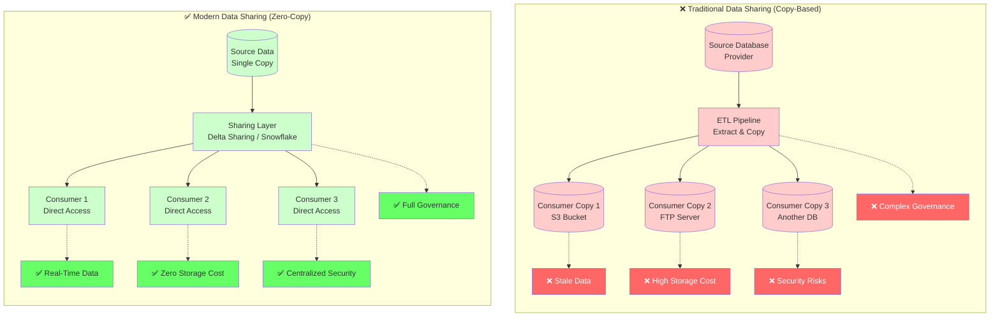
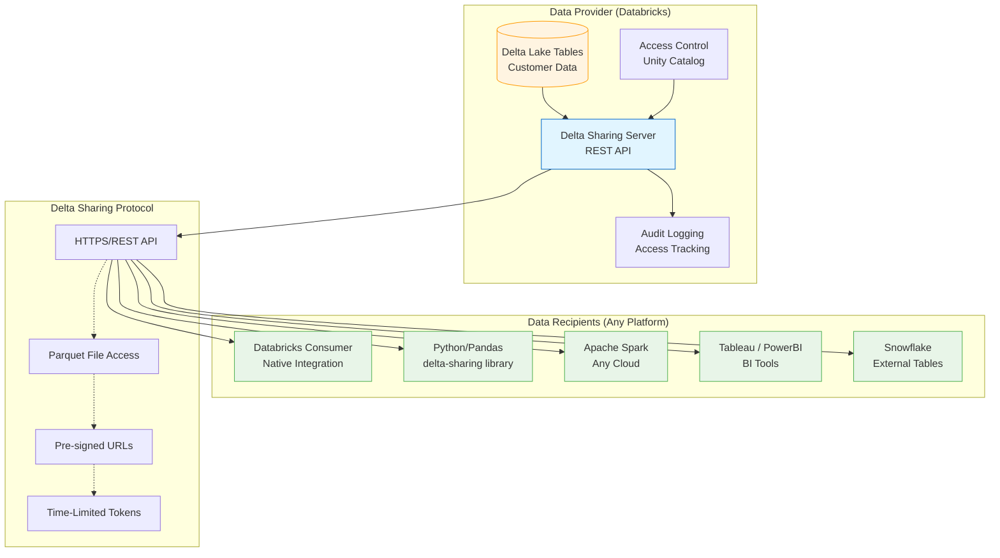
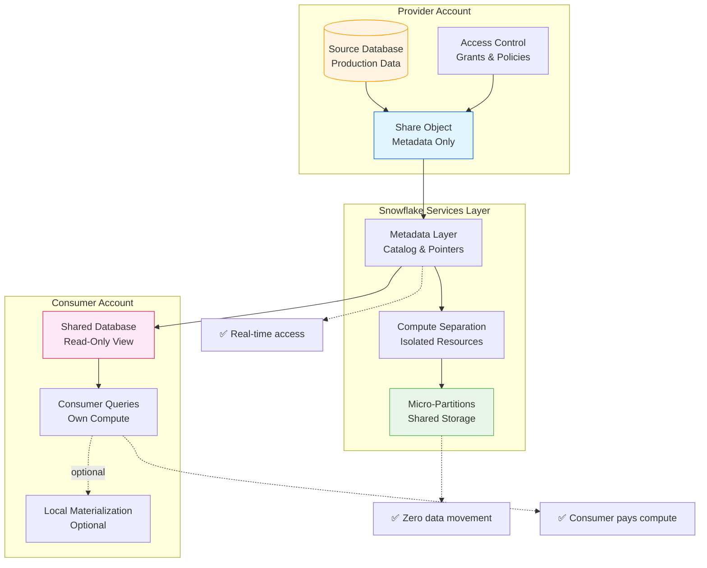
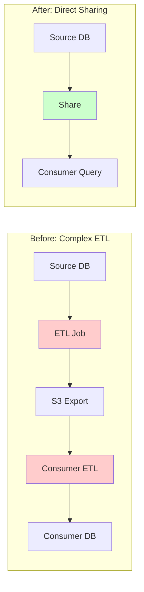

# Data Sharing Architectures

<div class="difficulty-badge difficulty-advanced">Advanced</div>

## Quick Reference

```sql
-- Delta Sharing: Share data across organizations
-- Create a share in Databricks
CREATE SHARE sales_share;

-- Add table to share
ALTER SHARE sales_share
ADD TABLE sales.customer_orders;

-- Grant access to recipient
GRANT SELECT ON SHARE sales_share TO RECIPIENT 'partner_company';

-- Recipient queries shared data (no data copy!)
SELECT
    order_date,
    product_category,
    SUM(order_amount) as total_sales
FROM delta_sharing_recipient.sales_share.customer_orders
WHERE order_date >= CURRENT_DATE - INTERVAL 30 DAYS
GROUP BY order_date, product_category;

-- Snowflake: Zero Copy Cloning
-- Create instant clone (no storage used initially)
CREATE DATABASE prod_clone
CLONE production;

-- Query clone immediately
SELECT COUNT(*) FROM prod_clone.sales.orders;

-- Snowflake: Secure Data Sharing
-- Create share as provider
CREATE SHARE customer_analytics_share;

-- Add objects to share
GRANT USAGE ON DATABASE analytics TO SHARE customer_analytics_share;
GRANT USAGE ON SCHEMA analytics.sales TO SHARE customer_analytics_share;
GRANT SELECT ON TABLE analytics.sales.orders TO SHARE customer_analytics_share;

-- Add consumer account
ALTER SHARE customer_analytics_share
ADD ACCOUNTS = xy12345;

-- Consumer creates database from share (read-only, zero copy)
CREATE DATABASE shared_analytics
FROM SHARE provider_account.customer_analytics_share;

-- Query shared data instantly
SELECT
    region,
    COUNT(DISTINCT customer_id) as customers,
    SUM(order_total) as total_revenue
FROM shared_analytics.sales.orders
GROUP BY region;

-- BigQuery: Analytics Hub Data Sharing
-- Publish dataset to Analytics Hub
CALL `bigquery.analytics_hub.create_listing`(
    'projects/my-project/locations/us/dataExchanges/my-exchange/listings/sales-data',
    'Sales Analytics Dataset',
    'Comprehensive sales data for analytics'
);

-- Subscribe to shared data
CREATE OR REPLACE VIEW my_project.shared_views.partner_sales AS
SELECT * FROM `partner-project.sales_data.orders`;

-- Cross-cloud sharing with Delta Sharing
-- Share from Databricks to any platform
CREATE SHARE cross_cloud_share;
ALTER SHARE cross_cloud_share ADD TABLE analytics.customer_metrics;

-- Access from Python (any cloud, any platform)
-- import delta_sharing
-- profile = delta_sharing.load_profile("config.share")
-- df = delta_sharing.load_as_pandas("profile#share_name.schema.table")
```

## Overview

**Data Sharing Architectures** enable secure, efficient data collaboration between organizations, teams, and platforms without physically copying or moving data. Modern data sharing eliminates traditional ETL pipelines, reduces storage costs, ensures real-time data access, and maintains strong governance controls.

### The Evolution of Data Sharing

Traditional data sharing faced fundamental challenges:

- **Data Duplication**: Copy data to external storage (S3, FTP) for each consumer
- **Staleness**: Batch exports create delays; consumers work with outdated data
- **Security Risks**: Uncontrolled copies increase attack surface
- **Cost**: Storage multiplies with each copy; network egress fees add up
- **Governance**: Tracking data lineage and usage across copies is nearly impossible
- **Complexity**: Maintain ETL pipelines, credentials, and integrations for each consumer

Modern data sharing architectures solve these problems through:



### Core Data Sharing Technologies

Modern data sharing is powered by several key technologies:

1. **Delta Sharing** (Databricks): Open-source protocol for secure data sharing
2. **Snowflake Secure Data Sharing**: Zero-copy sharing within Snowflake ecosystem
3. **Zero Copy Cloning**: Instant database/table copies using copy-on-write
4. **BigQuery Analytics Hub**: Google Cloud's data exchange platform
5. **Data Clean Rooms**: Privacy-preserving collaborative analytics
6. **Federated Queries**: Cross-platform query federation

## Core Principles

### 1. Delta Sharing: Open Protocol for Universal Data Sharing

**Delta Sharing** is an open-source protocol for secure data sharing, introduced by Databricks. It enables sharing data stored in Delta Lake format with any computing platform (Databricks, Snowflake, Python, R, Spark) without vendor lock-in.

#### Architecture



#### Creating and Managing Delta Shares

```sql
-- Provider: Create share in Databricks
CREATE SHARE IF NOT EXISTS customer_analytics_share
COMMENT 'Share customer analytics data with partners';

-- Add table to share
ALTER SHARE customer_analytics_share
ADD TABLE sales.customer_orders
COMMENT 'Monthly customer orders aggregated';

-- Add multiple tables
ALTER SHARE customer_analytics_share
ADD TABLE sales.customer_profiles,
ADD TABLE sales.product_catalog;

-- Create share with row-level filtering
CREATE SHARE regional_sales_share;

-- Add table with partition filtering (only share recent data)
ALTER SHARE regional_sales_share
ADD TABLE sales.transactions
PARTITION (date >= '2024-01-01');

-- Create recipient
CREATE RECIPIENT partner_company
COMMENT 'Partner Company Data Access';

-- Grant recipient access to share
GRANT SELECT ON SHARE customer_analytics_share
TO RECIPIENT partner_company;

-- View shares
SHOW SHARES;

-- View share details
DESCRIBE SHARE customer_analytics_share;

-- View recipients
SHOW RECIPIENTS;

-- Revoke access
REVOKE SELECT ON SHARE customer_analytics_share
FROM RECIPIENT partner_company;

-- Audit share access
SELECT
    user_name,
    event_time,
    request_params,
    response.status_code
FROM system.access.audit
WHERE action_name = 'deltaSharingRead'
  AND request_params.share_name = 'customer_analytics_share'
ORDER BY event_time DESC
LIMIT 100;
```

#### Delta Sharing: Databricks-to-Databricks (D2D)

Native sharing between Databricks workspaces offers the richest integration:

```sql
-- Provider Databricks Workspace
-- Create share
CREATE SHARE d2d_analytics_share;

-- Add Unity Catalog tables
ALTER SHARE d2d_analytics_share
ADD TABLE main.sales.orders,
ADD TABLE main.sales.customers,
ADD TABLE main.analytics.revenue_metrics;

-- Create recipient for another Databricks workspace
CREATE RECIPIENT partner_workspace
USING ID 'cloud-and-region-identifier';

-- Grant permissions
GRANT SELECT ON SHARE d2d_analytics_share
TO RECIPIENT partner_workspace;

-- Enable change data feed for incremental updates
ALTER TABLE main.sales.orders
SET TBLPROPERTIES (delta.enableChangeDataFeed = true);

-- Consumer Databricks Workspace
-- Create catalog from share (automatically syncs)
CREATE CATALOG IF NOT EXISTS shared_analytics
USING SHARE provider_workspace.d2d_analytics_share;

-- Query shared tables directly (no data copy!)
SELECT
    o.order_id,
    c.customer_name,
    o.order_total,
    r.revenue_category
FROM shared_analytics.sales.orders o
JOIN shared_analytics.sales.customers c
    ON o.customer_id = c.customer_id
JOIN shared_analytics.analytics.revenue_metrics r
    ON o.order_id = r.order_id
WHERE o.order_date >= CURRENT_DATE - INTERVAL 30 DAYS;

-- Create local materialized view for performance
CREATE MATERIALIZED VIEW local_shared_summary AS
SELECT
    DATE_TRUNC('day', order_date) as day,
    product_category,
    COUNT(*) as order_count,
    SUM(order_total) as daily_revenue
FROM shared_analytics.sales.orders
GROUP BY DATE_TRUNC('day', order_date), product_category;

-- Refresh periodically
REFRESH MATERIALIZED VIEW local_shared_summary;

-- Check share metadata
DESCRIBE SHARE shared_analytics;

-- View table schemas
DESCRIBE TABLE shared_analytics.sales.orders;
```

#### Delta Sharing: Databricks-to-Open (D2O)

Share to any platform using open-source delta-sharing connectors:

```sql
-- Provider: Create share and get credential file
CREATE SHARE open_share_public_data;

ALTER SHARE open_share_public_data
ADD TABLE analytics.public_metrics;

-- Create recipient (generates activation link and profile file)
CREATE RECIPIENT external_consumer;

GRANT SELECT ON SHARE open_share_public_data
TO RECIPIENT external_consumer;

-- Generate activation URL (sent to recipient)
-- Recipient downloads profile.share JSON file
```

**Python Consumer (Any Platform):**

```python
# Install delta-sharing
# pip install delta-sharing

import delta_sharing

# Load share profile (received from provider)
profile_file = "/path/to/config.share"

# Create client
client = delta_sharing.SharingClient(profile_file)

# List available shares
shares = client.list_shares()
print(shares)

# List tables in share
tables = client.list_all_tables()
for table in tables:
    print(f"{table.share}.{table.schema}.{table.name}")

# Load data as Pandas DataFrame
table_url = f"{profile_file}#share_name.schema.table_name"
df = delta_sharing.load_as_pandas(table_url)

# Load with filtering (predicate pushdown)
df_filtered = delta_sharing.load_as_pandas(
    table_url,
    predicates=["order_date >= '2024-01-01'", "region = 'US'"]
)

# Load as Spark DataFrame
spark_df = delta_sharing.load_as_spark(table_url)

# Incremental processing using version
df_v10 = delta_sharing.load_as_pandas(table_url, version=10)
```

**Apache Spark Consumer:**

```scala
// Scala/Spark
import io.delta.sharing.spark._

// Read shared table
val df = spark.read
  .format("deltaSharing")
  .option("profile", "/path/to/config.share")
  .table("share_name.schema.table_name")

// Filter and aggregate
val summary = df
  .filter($"order_date" >= "2024-01-01")
  .groupBy("product_category")
  .agg(
    sum("order_total").as("total_revenue"),
    count("order_id").as("order_count")
  )

summary.show()
```

#### Delta Sharing Features

```sql
-- Time Travel on shared data
-- Consumer can query historical versions (if provider allows)
SELECT * FROM shared_analytics.sales.orders
VERSION AS OF 10;

SELECT * FROM shared_analytics.sales.orders
TIMESTAMP AS OF '2024-01-01 00:00:00';

-- Provider: Control time travel retention
ALTER SHARE customer_analytics_share
SET MINREADERVERSION = 2;  -- Enable time travel

-- Row-level security with dynamic views
CREATE VIEW secure_orders_view AS
SELECT
    order_id,
    customer_id,
    order_date,
    order_total,
    region
FROM sales.orders
WHERE region = current_user_region();  -- Dynamic filtering

-- Share view instead of table
ALTER SHARE regional_share
ADD VIEW sales.secure_orders_view;

-- Column-level security
CREATE VIEW masked_customers AS
SELECT
    customer_id,
    CASE
        WHEN is_recipient_privileged() THEN customer_name
        ELSE 'REDACTED'
    END as customer_name,
    CASE
        WHEN is_recipient_privileged() THEN email
        ELSE SHA2(email, 256)
    END as email,
    city,
    state,
    country
FROM sales.customers;

ALTER SHARE privacy_compliant_share
ADD VIEW sales.masked_customers;

-- Audit trail
CREATE TABLE share_audit_log (
    event_time TIMESTAMP,
    share_name STRING,
    recipient_name STRING,
    table_name STRING,
    action STRING,
    row_count BIGINT,
    bytes_transferred BIGINT
);

-- Log share access
INSERT INTO share_audit_log
SELECT
    event_time,
    request_params.share_name,
    request_params.recipient_name,
    request_params.table_name,
    action_name,
    response.num_rows,
    response.bytes_sent
FROM system.access.audit
WHERE action_name LIKE 'deltaSharing%'
  AND event_date = CURRENT_DATE;

-- Monitor usage
SELECT
    share_name,
    recipient_name,
    COUNT(*) as access_count,
    SUM(response.bytes_sent) / 1024 / 1024 / 1024 as gb_transferred,
    MAX(event_time) as last_access
FROM system.access.audit
WHERE action_name = 'deltaSharingRead'
  AND event_date >= CURRENT_DATE - INTERVAL 30 DAYS
GROUP BY share_name, recipient_name
ORDER BY gb_transferred DESC;
```

### 2. Snowflake Secure Data Sharing

**Snowflake Secure Data Sharing** enables instant, secure sharing of live data between Snowflake accounts without copying or transferring data. All sharing happens through Snowflake's metadata layer.

#### Architecture



#### Creating Secure Data Shares

```sql
-- Provider Account
-- Create share
CREATE SHARE customer_analytics_share
COMMENT = 'Customer analytics data for partner organizations';

-- Grant database access
GRANT USAGE ON DATABASE analytics TO SHARE customer_analytics_share;

-- Grant schema access
GRANT USAGE ON SCHEMA analytics.sales TO SHARE customer_analytics_share;

-- Grant table access
GRANT SELECT ON TABLE analytics.sales.orders TO SHARE customer_analytics_share;
GRANT SELECT ON TABLE analytics.sales.customers TO SHARE customer_analytics_share;

-- Grant view access (with transformations/filters)
GRANT SELECT ON VIEW analytics.sales.aggregated_metrics
TO SHARE customer_analytics_share;

-- Add consumer accounts (must be in same region/cloud)
ALTER SHARE customer_analytics_share
ADD ACCOUNTS = xy12345, ab67890;

-- View share details
SHOW SHARES;
DESC SHARE customer_analytics_share;

-- Consumer Account
-- Create database from share (instant, zero copy)
CREATE DATABASE shared_analytics
FROM SHARE provider_account.customer_analytics_share;

-- Query shared data immediately
SELECT
    DATE_TRUNC('month', order_date) as month,
    product_category,
    COUNT(DISTINCT customer_id) as unique_customers,
    SUM(order_total) as total_revenue,
    AVG(order_total) as avg_order_value
FROM shared_analytics.sales.orders
WHERE order_date >= DATEADD(month, -12, CURRENT_DATE)
GROUP BY 1, 2
ORDER BY month DESC, total_revenue DESC;

-- Consumer uses own compute warehouse
USE WAREHOUSE consumer_wh;

-- Create local materialized table for performance
CREATE TABLE local_analytics.orders_snapshot AS
SELECT * FROM shared_analytics.sales.orders;

-- Refresh periodically
CREATE OR REPLACE TASK refresh_shared_snapshot
WAREHOUSE = consumer_wh
SCHEDULE = 'USING CRON 0 2 * * * UTC'
AS
INSERT OVERWRITE INTO local_analytics.orders_snapshot
SELECT * FROM shared_analytics.sales.orders;

ALTER TASK refresh_shared_snapshot RESUME;
```

#### Secure Views for Row/Column-Level Security

```sql
-- Provider: Create secure view with row-level security
CREATE SECURE VIEW analytics.sales.regional_orders AS
SELECT
    order_id,
    customer_id,
    order_date,
    order_total,
    product_category,
    region
FROM analytics.sales.orders
WHERE region = CURRENT_ROLE();  -- Each consumer sees only their region

-- Share secure view
GRANT SELECT ON VIEW analytics.sales.regional_orders
TO SHARE customer_analytics_share;

-- Column masking for PII
CREATE SECURE VIEW analytics.sales.masked_customers AS
SELECT
    customer_id,
    customer_name,
    -- Mask email for non-privileged consumers
    CASE
        WHEN CURRENT_ROLE() IN ('PROVIDER_ADMIN', 'FULL_ACCESS')
        THEN email
        ELSE SHA2(email)
    END as email,
    -- Show only partial phone
    CONCAT('XXX-XXX-', RIGHT(phone, 4)) as phone,
    city,
    state,
    postal_code
FROM analytics.sales.customers;

GRANT SELECT ON VIEW analytics.sales.masked_customers
TO SHARE customer_analytics_share;

-- Dynamic data masking with masking policies
CREATE OR REPLACE MASKING POLICY email_mask AS (val STRING)
RETURNS STRING ->
    CASE
        WHEN CURRENT_ROLE() IN ('PROVIDER_ADMIN', 'PREMIUM_CONSUMER')
        THEN val
        ELSE REGEXP_REPLACE(val, '(.*)@(.*)', '****@\\2')
    END;

-- Apply masking policy
ALTER TABLE analytics.sales.customers
MODIFY COLUMN email
SET MASKING POLICY email_mask;

-- Row access policy
CREATE OR REPLACE ROW ACCESS POLICY orders_region_filter
AS (region STRING) RETURNS BOOLEAN ->
    CURRENT_ROLE() = 'GLOBAL_ADMIN'
    OR region = CURRENT_USER_REGION();

-- Apply row access policy
ALTER TABLE analytics.sales.orders
ADD ROW ACCESS POLICY orders_region_filter ON (region);
```

#### Sharing Across Regions and Clouds

```sql
-- Provider: Enable cross-region sharing (replication required)
-- Create database replica in target region
CREATE DATABASE analytics_replica
AS REPLICA OF analytics
REFRESH_INTERVAL = 600;  -- 10 minutes

-- Create share from replica
CREATE SHARE cross_region_share;

GRANT USAGE ON DATABASE analytics_replica TO SHARE cross_region_share;
GRANT USAGE ON SCHEMA analytics_replica.sales TO SHARE cross_region_share;
GRANT SELECT ON ALL TABLES IN SCHEMA analytics_replica.sales
TO SHARE cross_region_share;

-- Add accounts in target region
ALTER SHARE cross_region_share
ADD ACCOUNTS = eu12345;  -- EU account

-- Cross-cloud sharing (AWS ↔ Azure ↔ GCP)
-- Requires business critical edition
CREATE SHARE cross_cloud_share
COMMENT = 'Share data across cloud providers';

-- Add accounts from different clouds
ALTER SHARE cross_cloud_share
ADD ACCOUNTS = azure_account_123, gcp_account_456;

-- Monitor replication
SELECT
    database_name,
    target_region,
    replication_lag_seconds,
    last_refreshed
FROM information_schema.database_replicas
WHERE database_name = 'analytics_replica';
```

### 3. Zero Copy Cloning

**Zero Copy Cloning** creates instant, writable copies of databases, schemas, or tables using copy-on-write technology. Clones initially share the same underlying storage and only diverge when modifications are made.

#### Snowflake Zero Copy Cloning

```sql
-- Clone entire database (instant, zero storage cost initially)
CREATE DATABASE dev_environment
CLONE production;

-- Clone at specific timestamp (time travel)
CREATE DATABASE production_snapshot
CLONE production
AT (TIMESTAMP => '2024-01-01 00:00:00'::TIMESTAMP);

-- Clone before statement (undo mistakes)
CREATE TABLE orders_backup
CLONE orders
BEFORE (STATEMENT => '01a00b2c-0000-1234-5678-9abcdef01234');

-- Clone schema
CREATE SCHEMA analytics_dev
CLONE analytics_prod;

-- Clone single table
CREATE TABLE customers_test
CLONE customers;

-- Clone with time travel
CREATE TABLE customers_yesterday
CLONE customers
AT (OFFSET => -86400);  -- 24 hours ago

-- Check clone lineage
SELECT
    table_name,
    clone_source_name,
    clone_timestamp,
    bytes,
    rows
FROM information_schema.tables
WHERE is_clone = 'YES'
  AND table_schema = 'PUBLIC';

-- Storage usage (clones share storage initially)
SELECT
    database_name,
    active_bytes / 1024 / 1024 / 1024 as active_gb,
    time_travel_bytes / 1024 / 1024 / 1024 as time_travel_gb,
    failsafe_bytes / 1024 / 1024 / 1024 as failsafe_gb,
    clone_bytes / 1024 / 1024 / 1024 as clone_gb
FROM snowflake.account_usage.database_storage_usage_history
WHERE usage_date = CURRENT_DATE
ORDER BY active_gb DESC;

-- Use case: Instant dev/test environments
CREATE DATABASE dev_team_1 CLONE production;
CREATE DATABASE dev_team_2 CLONE production;
CREATE DATABASE qa_environment CLONE production;

GRANT ALL ON DATABASE dev_team_1 TO ROLE dev_role_1;
GRANT ALL ON DATABASE dev_team_2 TO ROLE dev_role_2;
GRANT ALL ON DATABASE qa_environment TO ROLE qa_role;

-- Developers work independently without affecting production
USE DATABASE dev_team_1;

-- Make changes freely
UPDATE customers SET email = 'test@example.com' WHERE customer_id = 123;
DELETE FROM orders WHERE order_date < '2023-01-01';

-- Production remains untouched
-- Storage cost only for modified data (copy-on-write)
```

#### Delta Lake Zero Copy Cloning

```sql
-- Shallow clone (metadata only, shares data files)
CREATE TABLE customers_dev
SHALLOW CLONE customers;

-- Query cloned table immediately
SELECT COUNT(*) FROM customers_dev;

-- Modifications create new data files (copy-on-write)
INSERT INTO customers_dev
VALUES (1001, 'Test Customer', 'test@example.com');

-- Original table unchanged
SELECT COUNT(*) FROM customers;  -- Original count

-- Deep clone (full copy of data)
CREATE TABLE customers_archive
DEEP CLONE customers;

-- Clone with time travel
CREATE TABLE customers_snapshot
SHALLOW CLONE customers
VERSION AS OF 10;

-- Clone to different location
CREATE TABLE customers_backup
DEEP CLONE customers
LOCATION 's3://backup-bucket/customers';

-- Replace table with clone (atomic swap)
CREATE OR REPLACE TABLE customers_new
SHALLOW CLONE customers_staging;

-- Use case: Blue-green deployments
-- Prepare new version
CREATE TABLE orders_v2
SHALLOW CLONE orders;

-- Test new version
-- ... run tests ...

-- Atomic cutover (instant)
ALTER TABLE orders RENAME TO orders_old;
ALTER TABLE orders_v2 RENAME TO orders;

-- Rollback if needed
ALTER TABLE orders RENAME TO orders_v2;
ALTER TABLE orders_old RENAME TO orders;

-- Check clone storage
SELECT
    table_name,
    total_size_bytes / 1024 / 1024 / 1024 as size_gb,
    num_files,
    cloned_from
FROM table_storage_info('customers_dev');
```

### 4. Data Clean Rooms

**Data Clean Rooms** enable privacy-preserving collaboration where multiple parties can analyze combined datasets without exposing raw data to each other.

```sql
-- Snowflake Data Clean Room
-- Provider 1: Advertiser with campaign data
CREATE DATABASE advertiser_clean_room;

CREATE TABLE advertiser_clean_room.campaigns (
    campaign_id STRING,
    campaign_name STRING,
    user_id_hash STRING,  -- Hashed user identifier
    impression_date DATE,
    clicks INTEGER,
    spend DECIMAL(12,2)
);

-- Provider 2: Publisher with conversion data
CREATE DATABASE publisher_clean_room;

CREATE TABLE publisher_clean_room.conversions (
    user_id_hash STRING,  -- Same hashing algorithm
    conversion_date DATE,
    conversion_value DECIMAL(12,2),
    product_category STRING
);

-- Clean Room: Secure join without exposing PII
CREATE SECURE VIEW clean_room.campaign_attribution AS
WITH joined_data AS (
    SELECT
        c.campaign_id,
        c.campaign_name,
        c.impression_date,
        c.clicks,
        c.spend,
        conv.conversion_date,
        conv.conversion_value,
        conv.product_category,
        DATEDIFF(day, c.impression_date, conv.conversion_date) as days_to_conversion
    FROM advertiser_clean_room.campaigns c
    JOIN publisher_clean_room.conversions conv
        ON c.user_id_hash = conv.user_id_hash
    WHERE conv.conversion_date BETWEEN c.impression_date
      AND c.impression_date + INTERVAL '30 days'
)
SELECT
    campaign_id,
    campaign_name,
    product_category,
    COUNT(*) as conversions,
    SUM(conversion_value) as total_conversion_value,
    SUM(spend) as total_spend,
    SUM(conversion_value) / SUM(spend) as roas,
    AVG(days_to_conversion) as avg_days_to_conversion
FROM joined_data
GROUP BY campaign_id, campaign_name, product_category;

-- Neither party can see individual records or raw PII
-- Only aggregated insights are accessible
GRANT SELECT ON VIEW clean_room.campaign_attribution
TO ROLE advertiser_analyst, TO ROLE publisher_analyst;

-- Query clean room (both parties see same aggregated view)
SELECT
    campaign_name,
    product_category,
    conversions,
    total_conversion_value,
    roas
FROM clean_room.campaign_attribution
WHERE conversions >= 100  -- Minimum threshold for privacy
ORDER BY roas DESC;

-- Differential privacy with noise injection
CREATE SECURE VIEW clean_room.private_campaign_metrics AS
SELECT
    campaign_id,
    campaign_name,
    COUNT(*) + FLOOR(RANDOM() * 10) as conversions_with_noise,  -- Add noise
    SUM(conversion_value) * (1 + (RANDOM() - 0.5) * 0.05) as value_with_noise  -- ±5% noise
FROM clean_room.campaign_attribution
GROUP BY campaign_id, campaign_name
HAVING COUNT(*) >= 50;  -- K-anonymity threshold
```

### 5. Cross-Platform Data Sharing

#### BigQuery Analytics Hub

```sql
-- Publisher: Create listing in Analytics Hub
-- Create authorized dataset
CREATE SCHEMA IF NOT EXISTS analytics_hub.public_data;

CREATE TABLE analytics_hub.public_data.sales_metrics (
    metric_date DATE,
    region STRING,
    product_category STRING,
    total_sales NUMERIC,
    transaction_count INT64
);

-- Publish to Analytics Hub (via console or API)
-- Subscribers discover and subscribe through Analytics Hub UI

-- Subscriber: Access shared data
CREATE OR REPLACE VIEW my_project.shared_data.partner_sales AS
SELECT
    metric_date,
    region,
    product_category,
    total_sales,
    transaction_count
FROM `partner-project.analytics_hub_public.sales_metrics`;

-- Query shared data
SELECT
    region,
    SUM(total_sales) as total_revenue,
    SUM(transaction_count) as total_transactions
FROM my_project.shared_data.partner_sales
WHERE metric_date >= DATE_SUB(CURRENT_DATE(), INTERVAL 90 DAY)
GROUP BY region
ORDER BY total_revenue DESC;

-- Create local materialized view for performance
CREATE MATERIALIZED VIEW my_project.analytics.cached_partner_sales AS
SELECT
    DATE_TRUNC(metric_date, MONTH) as month,
    region,
    product_category,
    SUM(total_sales) as monthly_sales,
    SUM(transaction_count) as monthly_transactions
FROM my_project.shared_data.partner_sales
GROUP BY 1, 2, 3;

-- Auto-refresh
-- BigQuery automatically refreshes materialized views
```

#### Federated Queries Across Platforms

```sql
-- Snowflake: Query external data sources
-- Create external table pointing to S3 (Parquet)
CREATE OR REPLACE EXTERNAL TABLE ext_s3_sales
WITH LOCATION = @s3_stage/sales/
FILE_FORMAT = (TYPE = PARQUET)
PATTERN = '.*\.parquet';

-- Query external data
SELECT
    product_category,
    SUM(sales_amount) as total_sales
FROM ext_s3_sales
WHERE sale_date >= '2024-01-01'
GROUP BY product_category;

-- BigQuery: Query external data sources
-- Federated query to Cloud SQL (PostgreSQL)
SELECT
    bq.product_id,
    bq.product_name,
    pg.inventory_level,
    pg.warehouse_location
FROM `project.dataset.products` bq
JOIN EXTERNAL_QUERY(
    'projects/my-project/locations/us-central1/connections/pg-connection',
    '''SELECT product_id, inventory_level, warehouse_location
       FROM inventory.current_stock'''
) pg
ON bq.product_id = pg.product_id;

-- DuckDB: Query multiple formats
SELECT
    s3.*,
    local.customer_segment
FROM read_parquet('s3://shared-bucket/sales/**/*.parquet') s3
JOIN local_db.customers local
    ON s3.customer_id = local.customer_id
WHERE s3.sale_date >= CURRENT_DATE - INTERVAL 30 DAYS;
```

## Data Sharing Patterns

### Pattern 1: Managed Data Marketplace

```sql
-- Provider: Create multiple shares for different products
CREATE SHARE financial_data_basic;
CREATE SHARE financial_data_premium;
CREATE SHARE financial_data_enterprise;

-- Basic tier: Aggregated data only
ALTER SHARE financial_data_basic
ADD VIEW analytics.public.monthly_aggregates;

-- Premium tier: Daily data with limited history
CREATE VIEW analytics.premium.daily_metrics AS
SELECT * FROM analytics.internal.detailed_metrics
WHERE metric_date >= CURRENT_DATE - INTERVAL 90 DAYS;

ALTER SHARE financial_data_premium
ADD VIEW analytics.premium.daily_metrics;

-- Enterprise tier: Full historical data + real-time
ALTER SHARE financial_data_enterprise
ADD TABLE analytics.internal.detailed_metrics;

-- Pricing metadata table
CREATE TABLE marketplace.subscription_tiers (
    tier_name STRING,
    share_name STRING,
    monthly_price DECIMAL(10,2),
    data_latency STRING,
    historical_depth STRING,
    update_frequency STRING
);

INSERT INTO marketplace.subscription_tiers VALUES
('Basic', 'financial_data_basic', 99.00, '1 month', '1 year', 'Monthly'),
('Premium', 'financial_data_premium', 499.00, '1 day', '2 years', 'Daily'),
('Enterprise', 'financial_data_enterprise', 2999.00, 'Real-time', 'Unlimited', 'Real-time');

-- Audit and billing
CREATE TABLE marketplace.usage_log (
    consumer_account STRING,
    share_name STRING,
    access_timestamp TIMESTAMP,
    query_count INTEGER,
    bytes_scanned BIGINT
);

-- Track usage for billing
INSERT INTO marketplace.usage_log
SELECT
    user_name,
    request_params.share_name,
    event_time,
    1,
    response.bytes_scanned
FROM system.access.audit
WHERE action_name = 'deltaSharingRead'
  AND event_date = CURRENT_DATE;

-- Monthly billing summary
SELECT
    consumer_account,
    share_name,
    DATE_TRUNC('month', access_timestamp) as billing_month,
    SUM(query_count) as total_queries,
    SUM(bytes_scanned) / 1024 / 1024 / 1024 as total_gb_scanned,
    COUNT(DISTINCT DATE(access_timestamp)) as active_days
FROM marketplace.usage_log
WHERE access_timestamp >= DATE_TRUNC('month', CURRENT_DATE)
GROUP BY consumer_account, share_name, DATE_TRUNC('month', access_timestamp);
```

### Pattern 2: Multi-Tenant Data Sharing

```sql
-- Provider: Share same table with row-level isolation per tenant
CREATE TABLE saas.customer_data (
    tenant_id STRING,
    customer_id STRING,
    customer_name STRING,
    email STRING,
    subscription_tier STRING,
    mrr DECIMAL(10,2)
);

-- Create separate share for each tenant
CREATE SHARE tenant_a_share;
CREATE SHARE tenant_b_share;

-- Tenant-specific secure views
CREATE SECURE VIEW saas.tenant_a_data AS
SELECT
    customer_id,
    customer_name,
    email,
    subscription_tier,
    mrr
FROM saas.customer_data
WHERE tenant_id = 'tenant_a';

CREATE SECURE VIEW saas.tenant_b_data AS
SELECT
    customer_id,
    customer_name,
    email,
    subscription_tier,
    mrr
FROM saas.customer_data
WHERE tenant_id = 'tenant_b';

-- Add views to respective shares
ALTER SHARE tenant_a_share ADD VIEW saas.tenant_a_data;
ALTER SHARE tenant_b_share ADD VIEW saas.tenant_b_data;

-- Grant access to tenant accounts
GRANT SELECT ON SHARE tenant_a_share TO RECIPIENT tenant_a_account;
GRANT SELECT ON SHARE tenant_b_share TO RECIPIENT tenant_b_account;

-- Each tenant only sees their own data
-- Consumer (Tenant A)
SELECT
    subscription_tier,
    COUNT(*) as customer_count,
    SUM(mrr) as total_mrr
FROM shared_data.tenant_a_data
GROUP BY subscription_tier;

-- Cannot access other tenants' data
```

### Pattern 3: Change Data Capture (CDC) Sharing

```sql
-- Provider: Share incremental changes for efficient sync
-- Enable change data feed
ALTER TABLE sales.orders
SET TBLPROPERTIES (delta.enableChangeDataFeed = true);

-- Create view of changes only
CREATE VIEW sales.orders_changes AS
SELECT
    _change_type,
    _commit_version,
    _commit_timestamp,
    order_id,
    customer_id,
    order_date,
    order_total,
    order_status
FROM table_changes('sales.orders', 0);

-- Share changes view
ALTER SHARE incremental_orders_share
ADD VIEW sales.orders_changes;

-- Consumer: Process only changes
-- Track last processed version
CREATE TABLE sync_state (
    source_table STRING,
    last_version BIGINT,
    last_sync_timestamp TIMESTAMP
);

-- Incremental sync query
MERGE INTO local_orders target
USING (
    SELECT *
    FROM shared_data.orders_changes
    WHERE _commit_version > (
        SELECT last_version FROM sync_state
        WHERE source_table = 'orders'
    )
    AND _change_type IN ('insert', 'update_postimage')
) source
ON target.order_id = source.order_id
WHEN MATCHED THEN UPDATE SET *
WHEN NOT MATCHED THEN INSERT *;

-- Update sync state
UPDATE sync_state
SET last_version = (SELECT MAX(_commit_version) FROM shared_data.orders_changes),
    last_sync_timestamp = CURRENT_TIMESTAMP
WHERE source_table = 'orders';
```

## Benefits

### 1. Zero Data Movement, Real-Time Access

```sql
-- Traditional: Daily export and import
-- Provider exports to S3 → Consumer downloads → Consumer loads → 24+ hour delay

-- Modern: Query shared data directly
SELECT * FROM shared_data.orders
WHERE order_date = CURRENT_DATE;
-- ✅ Real-time, no delay
-- ✅ No export job
-- ✅ No import process
-- ✅ Always up-to-date
```

### 2. Massive Cost Savings

```sql
-- Traditional costs:
-- - Storage: 100TB × $23/TB/month × 5 consumers = $11,500/month
-- - Egress: 100TB × $90/TB transfer × 12 exports/year = $108,000/year
-- - ETL compute: $5,000/month
-- Total: $176,000/year

-- Data sharing costs:
-- - Storage: 100TB × $23/TB/month = $2,300/month (single copy)
-- - Egress: $0 (no data movement)
-- - Compute: Consumer pays for queries
-- Total: $27,600/year
-- Savings: $148,400/year (84% reduction)

-- Monitor savings
SELECT
    share_name,
    recipient_name,
    SUM(estimated_transfer_gb) as gb_saved,
    SUM(estimated_transfer_gb) * 0.09 as usd_saved  -- $0.09/GB egress
FROM sharing_metrics
WHERE metric_month >= DATE_TRUNC('year', CURRENT_DATE)
GROUP BY share_name, recipient_name;
```

### 3. Enhanced Security and Compliance

```sql
-- Centralized access control
CREATE SHARE compliant_share;

-- All data stays under provider control
-- Revoke access instantly
REVOKE SELECT ON SHARE compliant_share FROM RECIPIENT partner_x;

-- Audit all access
SELECT
    event_time,
    user_name,
    recipient_name,
    table_name,
    query_text,
    rows_returned
FROM system.access.audit
WHERE action_name = 'deltaSharingRead'
  AND event_date >= CURRENT_DATE - INTERVAL 7 DAYS;

-- GDPR: Right to deletion (single delete affects all consumers)
DELETE FROM customers WHERE customer_id = '123';
-- All shares updated immediately

-- Row-level security enforced at source
CREATE VIEW gdpr_compliant_view AS
SELECT
    customer_id,
    CASE
        WHEN consent_granted = TRUE THEN customer_name
        ELSE 'REDACTED'
    END as customer_name,
    anonymized_email
FROM customers;

ALTER SHARE compliant_share ADD VIEW gdpr_compliant_view;
```

### 4. Simplified Data Architecture



## Challenges & Considerations

### 1. Cross-Cloud and Cross-Region Limitations

```sql
-- Problem: Cannot directly share between clouds (AWS ↔ Azure ↔ GCP)

-- Solution 1: Database replication
CREATE DATABASE azure_replica AS REPLICA OF aws_production
REFRESH_INTERVAL = 600;  -- 10 min

CREATE SHARE cross_cloud_share;
GRANT USAGE ON DATABASE azure_replica TO SHARE cross_cloud_share;

-- Solution 2: Delta Sharing (cloud-agnostic)
CREATE SHARE delta_cross_cloud;
ALTER SHARE delta_cross_cloud ADD TABLE analytics.metrics;
-- Works across any cloud using REST API

-- Monitor replication lag
SELECT
    database_name,
    source_region,
    target_region,
    replication_lag_seconds,
    last_refresh_time
FROM replication_status
WHERE replication_lag_seconds > 600;  -- Alert if > 10 min lag
```

### 2. Performance vs. Local Data

```sql
-- Challenge: Shared data access slower than local queries

-- Solution: Materialized views / caching
CREATE MATERIALIZED VIEW local_cache.shared_orders AS
SELECT * FROM shared_data.orders
WHERE order_date >= CURRENT_DATE - INTERVAL 90 DAYS;

-- Incremental refresh
REFRESH MATERIALIZED VIEW local_cache.shared_orders;

-- Hot data locally, historical data shared
SELECT * FROM local_cache.shared_orders  -- Fast
WHERE order_date >= CURRENT_DATE - INTERVAL 30 DAYS
UNION ALL
SELECT * FROM shared_data.orders  -- Slower but complete
WHERE order_date < CURRENT_DATE - INTERVAL 30 DAYS;

-- Query optimization
-- ✅ Good: Predicate pushdown
SELECT * FROM shared_data.orders
WHERE order_date = '2024-01-01'  -- Partition pruning
  AND region = 'US';  -- Filter pushdown

-- ❌ Bad: Full table scan
SELECT * FROM shared_data.orders;
```

### 3. Governance and Access Management

```sql
-- Challenge: Managing access across many consumers

-- Solution: Role-based access hierarchy
CREATE ROLE data_provider_admin;
CREATE ROLE data_consumer_tier1;
CREATE ROLE data_consumer_tier2;

-- Tiered shares
CREATE SHARE tier1_limited;
CREATE SHARE tier2_full;

-- Automated provisioning
CREATE PROCEDURE provision_consumer(
    consumer_name STRING,
    tier STRING
)
AS
BEGIN
    IF tier = 'tier1' THEN
        GRANT SELECT ON SHARE tier1_limited TO RECIPIENT consumer_name;
    ELSEIF tier = 'tier2' THEN
        GRANT SELECT ON SHARE tier2_full TO RECIPIENT consumer_name;
    END IF;

    INSERT INTO access_log VALUES (consumer_name, tier, CURRENT_TIMESTAMP);
END;

-- Compliance check
CREATE VIEW access_review AS
SELECT
    recipient_name,
    share_name,
    granted_date,
    last_access_date,
    DATEDIFF(day, last_access_date, CURRENT_DATE) as days_since_access
FROM share_access_metadata
WHERE days_since_access > 90;  -- Flag inactive access
```

### 4. Cost Attribution

```sql
-- Challenge: Consumer compute costs can be unpredictable

-- Snowflake: Consumer pays for their compute
-- Monitor consumer usage
SELECT
    consumer_account,
    share_name,
    SUM(credits_used) as total_credits,
    SUM(credits_used) * 3.00 as estimated_cost_usd  -- $3 per credit
FROM consumer_usage_history
WHERE usage_date >= DATE_TRUNC('month', CURRENT_DATE)
GROUP BY consumer_account, share_name
ORDER BY total_credits DESC;

-- Set resource monitors for cost control
CREATE RESOURCE MONITOR consumer_limit
WITH CREDIT_QUOTA = 1000
TRIGGERS
    ON 80 PERCENT DO NOTIFY
    ON 100 PERCENT DO SUSPEND;

ALTER WAREHOUSE consumer_wh
SET RESOURCE_MONITOR = consumer_limit;
```

## Best Practices

### 1. Design for Performance

```sql
-- Partition shared tables appropriately
CREATE TABLE optimized_shares.events (
    event_id STRING,
    event_date DATE,
    event_type STRING,
    user_id STRING,
    event_data STRING
)
PARTITIONED BY (event_date);

-- Create covering views for common queries
CREATE VIEW optimized_shares.recent_events AS
SELECT * FROM optimized_shares.events
WHERE event_date >= CURRENT_DATE - INTERVAL 30 DAYS;

-- Share the optimized view
ALTER SHARE performance_share ADD VIEW optimized_shares.recent_events;

-- Z-ordering for multi-dimensional queries (Databricks)
OPTIMIZE optimized_shares.events
ZORDER BY (user_id, event_type);
```

### 2. Implement Strong Governance

```sql
-- Catalog all shares
CREATE TABLE governance.share_registry (
    share_name STRING,
    share_type STRING,  -- 'internal', 'external', 'marketplace'
    data_classification STRING,  -- 'public', 'confidential', 'restricted'
    business_owner STRING,
    technical_owner STRING,
    creation_date DATE,
    review_date DATE,
    compliance_requirements ARRAY<STRING>
);

-- Automated compliance checks
CREATE PROCEDURE check_share_compliance()
AS
BEGIN
    -- Check for PII in shared tables
    INSERT INTO compliance_violations
    SELECT
        share_name,
        'PII_DETECTED',
        CURRENT_TIMESTAMP
    FROM shared_tables st
    JOIN information_schema.columns c
        ON st.table_name = c.table_name
    WHERE c.column_name IN ('email', 'ssn', 'phone', 'credit_card')
      AND st.has_pii_masking = FALSE;

    -- Check for expired shares
    INSERT INTO compliance_violations
    SELECT
        share_name,
        'REVIEW_OVERDUE',
        CURRENT_TIMESTAMP
    FROM governance.share_registry
    WHERE review_date < CURRENT_DATE;
END;

-- Schedule regular reviews
CREATE TASK compliance_check
WAREHOUSE = governance_wh
SCHEDULE = 'USING CRON 0 0 * * *'  -- Daily
AS CALL check_share_compliance();
```

### 3. Monitor and Optimize

```sql
-- Comprehensive monitoring view
CREATE VIEW monitoring.share_health AS
SELECT
    s.share_name,
    s.recipient_name,
    COUNT(DISTINCT a.table_name) as tables_shared,
    COUNT(a.event_id) as query_count_7d,
    SUM(a.bytes_scanned) / 1024 / 1024 / 1024 as gb_scanned_7d,
    AVG(a.query_duration_ms) as avg_query_ms,
    MAX(a.event_time) as last_access,
    DATEDIFF(day, MAX(a.event_time), CURRENT_DATE) as days_since_access
FROM shares s
LEFT JOIN system.access.audit a
    ON s.share_name = a.share_name
    AND a.event_date >= CURRENT_DATE - INTERVAL 7 DAYS
GROUP BY s.share_name, s.recipient_name;

-- Optimization recommendations
SELECT
    share_name,
    'Add materialized view' as recommendation,
    'High query count with poor performance' as reason
FROM monitoring.share_health
WHERE query_count_7d > 1000
  AND avg_query_ms > 5000;

SELECT
    share_name,
    'Consider deprecation' as recommendation,
    'No access in 90 days' as reason
FROM monitoring.share_health
WHERE days_since_access > 90;
```

### 4. Document and Communicate

```sql
-- Data product catalog for consumers
CREATE TABLE catalog.data_products (
    product_id STRING,
    product_name STRING,
    description TEXT,
    share_name STRING,
    schema_name STRING,
    update_frequency STRING,
    data_retention STRING,
    sample_query TEXT,
    documentation_url STRING,
    support_contact STRING,
    sla_availability DECIMAL(5,2),
    sla_freshness_minutes INTEGER
);

INSERT INTO catalog.data_products VALUES (
    'prod-001',
    'Customer Orders Analytics',
    'Comprehensive order data with customer demographics and product details',
    'customer_analytics_share',
    'sales.orders',
    'Real-time',
    '7 years',
    'SELECT * FROM shared_data.orders WHERE order_date >= CURRENT_DATE - 30',
    'https://docs.company.com/data-products/orders',
    'data-support@company.com',
    99.9,
    5
);

-- Consumer-facing data dictionary
CREATE VIEW catalog.data_dictionary AS
SELECT
    dp.product_name,
    dp.share_name,
    c.table_schema,
    c.table_name,
    c.column_name,
    c.data_type,
    c.comment as column_description
FROM catalog.data_products dp
JOIN information_schema.columns c
    ON dp.schema_name = c.table_schema;
```

## See Also

- [Lakehouse Architecture](/architectures/lakehouse/) - Modern unified data platform
- [Data Mesh Architecture](/architectures/data-mesh/) - Domain-oriented decentralized data ownership
- [Data Security Patterns](/concepts/security/) - Securing sensitive data
- [Zero ETL Patterns](/patterns/zero-etl/) - Eliminating data movement
