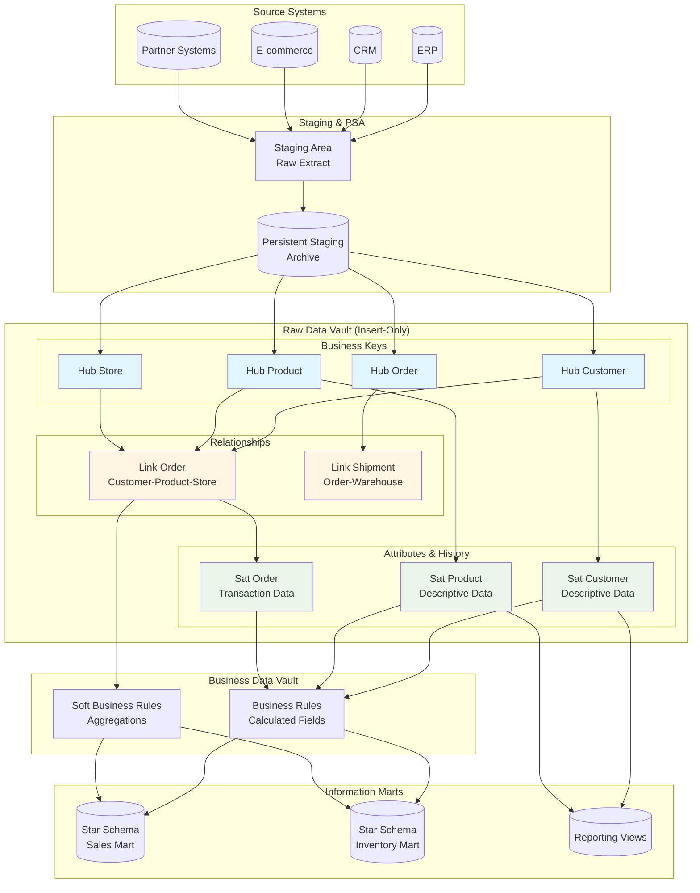

# Data Vault Architecture

<div class="difficulty-badge difficulty-advanced">Advanced</div>

## Quick Reference

```sql
-- Hub: Business keys and metadata
CREATE TABLE hub_customer (
    hub_customer_key BIGSERIAL PRIMARY KEY,
    customer_id VARCHAR(50) UNIQUE NOT NULL,  -- Business key
    load_date TIMESTAMP NOT NULL,
    record_source VARCHAR(50) NOT NULL
);

-- Link: Relationships between hubs
CREATE TABLE link_order (
    link_order_key BIGSERIAL PRIMARY KEY,
    hub_customer_key BIGINT NOT NULL REFERENCES hub_customer(hub_customer_key),
    hub_product_key BIGINT NOT NULL REFERENCES hub_product(hub_product_key),
    hub_store_key BIGINT NOT NULL REFERENCES hub_store(hub_store_key),
    order_id VARCHAR(50) NOT NULL,  -- Business key of the relationship
    load_date TIMESTAMP NOT NULL,
    record_source VARCHAR(50) NOT NULL,
    UNIQUE (hub_customer_key, hub_product_key, hub_store_key, order_id)
);

-- Satellite: Descriptive attributes (historized)
CREATE TABLE sat_customer (
    hub_customer_key BIGINT NOT NULL REFERENCES hub_customer(hub_customer_key),
    load_date TIMESTAMP NOT NULL,
    load_end_date TIMESTAMP,
    record_source VARCHAR(50) NOT NULL,
    hash_diff VARCHAR(64) NOT NULL,  -- Hash of all attributes
    customer_name VARCHAR(200),
    email VARCHAR(200),
    phone VARCHAR(50),
    address VARCHAR(200),
    city VARCHAR(100),
    state VARCHAR(50),
    postal_code VARCHAR(20),
    PRIMARY KEY (hub_customer_key, load_date)
);

-- Link Satellite: Attributes of relationships
CREATE TABLE sat_order (
    link_order_key BIGINT NOT NULL REFERENCES link_order(link_order_key),
    load_date TIMESTAMP NOT NULL,
    load_end_date TIMESTAMP,
    record_source VARCHAR(50) NOT NULL,
    hash_diff VARCHAR(64) NOT NULL,
    order_date DATE,
    ship_date DATE,
    delivery_date DATE,
    quantity INTEGER,
    unit_price DECIMAL(10,2),
    discount_amount DECIMAL(10,2),
    tax_amount DECIMAL(10,2),
    total_amount DECIMAL(12,2),
    order_status VARCHAR(50),
    PRIMARY KEY (link_order_key, load_date)
);

-- Querying Data Vault: Point-in-time construct
SELECT
    h.customer_id,
    s.customer_name,
    s.email,
    s.city,
    s.state
FROM hub_customer h
JOIN sat_customer s ON h.hub_customer_key = s.hub_customer_key
WHERE s.load_date <= CURRENT_TIMESTAMP
  AND (s.load_end_date IS NULL OR s.load_end_date > CURRENT_TIMESTAMP);
```

## Overview

Data Vault is a data modeling methodology created by **Dan Linstedt** in the 1990s and formalized in Data Vault 2.0, designed specifically for **enterprise data warehousing** with emphasis on agility, scalability, and auditability. Unlike traditional approaches (Inmon's normalized EDW or Kimball's dimensional modeling), Data Vault provides a hybrid methodology that captures raw business concepts in a highly normalized, insert-only structure optimized for parallel loading and historical tracking.

The Data Vault model consists of three core entity types:
- **Hubs**: Store unique business keys and metadata
- **Links**: Store relationships between business keys
- **Satellites**: Store descriptive attributes with full history

This architecture excels in environments with:
- **High data velocity** (frequent changes from multiple sources)
- **Complex source system integration** (many disparate systems)
- **Regulatory compliance** requirements (full audit trail)
- **Evolving business requirements** (frequent schema changes)
- **Parallel processing** needs (high-performance loading)



## Core Principles

### 1. Hubs - Business Keys

Hubs represent **core business concepts** and store only the unique business key, load metadata, and no descriptive attributes. Each hub represents a distinct business entity.

**Characteristics:**
- Contains only business keys (natural keys from source systems)
- No descriptive attributes
- Insert-only (no updates or deletes)
- Tracks when the business key first appeared
- May have multiple source systems providing the same business key

```sql
-- Hub for Customer
CREATE TABLE hub_customer (
    hub_customer_key BIGSERIAL PRIMARY KEY,
    customer_id VARCHAR(50) UNIQUE NOT NULL,  -- Business key
    load_date TIMESTAMP NOT NULL DEFAULT CURRENT_TIMESTAMP,
    record_source VARCHAR(50) NOT NULL
);

-- Hub for Product
CREATE TABLE hub_product (
    hub_product_key BIGSERIAL PRIMARY KEY,
    product_sku VARCHAR(50) UNIQUE NOT NULL,  -- Business key
    load_date TIMESTAMP NOT NULL DEFAULT CURRENT_TIMESTAMP,
    record_source VARCHAR(50) NOT NULL
);

-- Hub for Order
CREATE TABLE hub_order (
    hub_order_key BIGSERIAL PRIMARY KEY,
    order_number VARCHAR(50) UNIQUE NOT NULL,  -- Business key
    load_date TIMESTAMP NOT NULL DEFAULT CURRENT_TIMESTAMP,
    record_source VARCHAR(50) NOT NULL
);

-- Hub for Store/Location
CREATE TABLE hub_store (
    hub_store_key BIGSERIAL PRIMARY KEY,
    store_code VARCHAR(50) UNIQUE NOT NULL,  -- Business key
    load_date TIMESTAMP NOT NULL DEFAULT CURRENT_TIMESTAMP,
    record_source VARCHAR(50) NOT NULL
);

-- Hub for Employee
CREATE TABLE hub_employee (
    hub_employee_key BIGSERIAL PRIMARY KEY,
    employee_id VARCHAR(50) UNIQUE NOT NULL,  -- Business key
    load_date TIMESTAMP NOT NULL DEFAULT CURRENT_TIMESTAMP,
    record_source VARCHAR(50) NOT NULL
);

-- Loading a Hub (insert-only, duplicates ignored)
INSERT INTO hub_customer (customer_id, load_date, record_source)
SELECT DISTINCT
    customer_id,
    CURRENT_TIMESTAMP,
    'CRM_SYSTEM'
FROM staging.stg_customers
WHERE customer_id NOT IN (SELECT customer_id FROM hub_customer)
  AND customer_id IS NOT NULL;

-- Alternative using ON CONFLICT (PostgreSQL)
INSERT INTO hub_customer (customer_id, load_date, record_source)
SELECT DISTINCT
    customer_id,
    CURRENT_TIMESTAMP,
    'E_COMMERCE'
FROM staging.stg_web_customers
WHERE customer_id IS NOT NULL
ON CONFLICT (customer_id) DO NOTHING;
```

### 2. Links - Relationships Between Business Keys

Links represent **associations, transactions, or relationships** between two or more hubs. Links are also insert-only and maintain the history of relationships.

**Characteristics:**
- Contains foreign keys to hubs (and optionally other links)
- May contain a business key representing the relationship itself
- No descriptive attributes (those go in link satellites)
- Insert-only structure
- Supports many-to-many relationships naturally

```sql
-- Link: Customer purchases Product at Store (Order relationship)
CREATE TABLE link_order (
    link_order_key BIGSERIAL PRIMARY KEY,
    hub_customer_key BIGINT NOT NULL REFERENCES hub_customer(hub_customer_key),
    hub_product_key BIGINT NOT NULL REFERENCES hub_product(hub_product_key),
    hub_store_key BIGINT NOT NULL REFERENCES hub_store(hub_store_key),
    order_number VARCHAR(50) NOT NULL,  -- Business key of relationship
    load_date TIMESTAMP NOT NULL DEFAULT CURRENT_TIMESTAMP,
    record_source VARCHAR(50) NOT NULL,
    UNIQUE (hub_customer_key, hub_product_key, hub_store_key, order_number)
);

-- Link: Employee works at Store
CREATE TABLE link_employee_store (
    link_employee_store_key BIGSERIAL PRIMARY KEY,
    hub_employee_key BIGINT NOT NULL REFERENCES hub_employee(hub_employee_key),
    hub_store_key BIGINT NOT NULL REFERENCES hub_store(hub_store_key),
    load_date TIMESTAMP NOT NULL DEFAULT CURRENT_TIMESTAMP,
    record_source VARCHAR(50) NOT NULL,
    UNIQUE (hub_employee_key, hub_store_key, load_date)
);

-- Link: Order shipped from Warehouse (Link to Link example)
CREATE TABLE link_shipment (
    link_shipment_key BIGSERIAL PRIMARY KEY,
    link_order_key BIGINT NOT NULL REFERENCES link_order(link_order_key),
    hub_warehouse_key BIGINT NOT NULL REFERENCES hub_warehouse(hub_warehouse_key),
    shipment_id VARCHAR(50) NOT NULL,
    load_date TIMESTAMP NOT NULL DEFAULT CURRENT_TIMESTAMP,
    record_source VARCHAR(50) NOT NULL,
    UNIQUE (link_order_key, hub_warehouse_key, shipment_id)
);

-- Hierarchical Link: Product belongs to Category
CREATE TABLE link_product_category (
    link_product_category_key BIGSERIAL PRIMARY KEY,
    hub_product_key BIGINT NOT NULL REFERENCES hub_product(hub_product_key),
    hub_category_key BIGINT NOT NULL REFERENCES hub_category(hub_category_key),
    load_date TIMESTAMP NOT NULL DEFAULT CURRENT_TIMESTAMP,
    record_source VARCHAR(50) NOT NULL,
    UNIQUE (hub_product_key, hub_category_key, load_date)
);

-- Loading a Link
INSERT INTO link_order (
    hub_customer_key,
    hub_product_key,
    hub_store_key,
    order_number,
    load_date,
    record_source
)
SELECT
    hc.hub_customer_key,
    hp.hub_product_key,
    hs.hub_store_key,
    s.order_number,
    CURRENT_TIMESTAMP,
    'ORDER_SYSTEM'
FROM staging.stg_orders s
JOIN hub_customer hc ON s.customer_id = hc.customer_id
JOIN hub_product hp ON s.product_sku = hp.product_sku
JOIN hub_store hs ON s.store_code = hs.store_code
WHERE NOT EXISTS (
    SELECT 1 FROM link_order l
    WHERE l.hub_customer_key = hc.hub_customer_key
      AND l.hub_product_key = hp.hub_product_key
      AND l.hub_store_key = hs.hub_store_key
      AND l.order_number = s.order_number
);
```

### 3. Satellites - Descriptive Attributes with History

Satellites store all **descriptive attributes** (context) for hubs or links. They are historized, tracking all changes over time, and use hash diffs for efficient change detection.

**Characteristics:**
- Contains descriptive/context attributes
- Fully historized (temporal tracking)
- Insert-only with load_date and load_end_date
- Uses hash_diff for change detection
- Multiple satellites can attach to same hub/link (multi-source, multi-rate)

```sql
-- Satellite for Customer descriptive data
CREATE TABLE sat_customer (
    hub_customer_key BIGINT NOT NULL REFERENCES hub_customer(hub_customer_key),
    load_date TIMESTAMP NOT NULL DEFAULT CURRENT_TIMESTAMP,
    load_end_date TIMESTAMP,
    record_source VARCHAR(50) NOT NULL,
    hash_diff VARCHAR(64) NOT NULL,  -- MD5/SHA hash of all attributes

    -- Descriptive attributes
    first_name VARCHAR(100),
    last_name VARCHAR(100),
    email VARCHAR(200),
    phone VARCHAR(50),
    date_of_birth DATE,

    PRIMARY KEY (hub_customer_key, load_date),
    CHECK (load_end_date IS NULL OR load_end_date > load_date)
);

-- Satellite for Customer address (separate rate of change)
CREATE TABLE sat_customer_address (
    hub_customer_key BIGINT NOT NULL REFERENCES hub_customer(hub_customer_key),
    load_date TIMESTAMP NOT NULL DEFAULT CURRENT_TIMESTAMP,
    load_end_date TIMESTAMP,
    record_source VARCHAR(50) NOT NULL,
    hash_diff VARCHAR(64) NOT NULL,

    -- Address attributes
    street_address VARCHAR(200),
    city VARCHAR(100),
    state VARCHAR(50),
    postal_code VARCHAR(20),
    country VARCHAR(50),

    PRIMARY KEY (hub_customer_key, load_date)
);

-- Satellite for Product descriptive data
CREATE TABLE sat_product (
    hub_product_key BIGINT NOT NULL REFERENCES hub_product(hub_product_key),
    load_date TIMESTAMP NOT NULL DEFAULT CURRENT_TIMESTAMP,
    load_end_date TIMESTAMP,
    record_source VARCHAR(50) NOT NULL,
    hash_diff VARCHAR(64) NOT NULL,

    product_name VARCHAR(200),
    product_description TEXT,
    brand VARCHAR(100),
    category VARCHAR(100),
    subcategory VARCHAR(100),
    unit_price DECIMAL(10,2),
    weight DECIMAL(10,3),
    dimensions VARCHAR(50),

    PRIMARY KEY (hub_product_key, load_date)
);

-- Link Satellite for Order transaction details
CREATE TABLE sat_order (
    link_order_key BIGINT NOT NULL REFERENCES link_order(link_order_key),
    load_date TIMESTAMP NOT NULL DEFAULT CURRENT_TIMESTAMP,
    load_end_date TIMESTAMP,
    record_source VARCHAR(50) NOT NULL,
    hash_diff VARCHAR(64) NOT NULL,

    -- Transaction attributes
    order_date DATE,
    ship_date DATE,
    delivery_date DATE,
    quantity INTEGER,
    unit_price DECIMAL(10,2),
    discount_amount DECIMAL(10,2),
    tax_amount DECIMAL(10,2),
    total_amount DECIMAL(12,2),
    order_status VARCHAR(50),
    payment_method VARCHAR(50),

    PRIMARY KEY (link_order_key, load_date)
);

-- Function to compute hash diff
CREATE OR REPLACE FUNCTION compute_hash_diff(
    p_first_name VARCHAR,
    p_last_name VARCHAR,
    p_email VARCHAR,
    p_phone VARCHAR,
    p_dob DATE
)
RETURNS VARCHAR AS $$
BEGIN
    RETURN MD5(
        COALESCE(p_first_name, '') || '|' ||
        COALESCE(p_last_name, '') || '|' ||
        COALESCE(p_email, '') || '|' ||
        COALESCE(p_phone, '') || '|' ||
        COALESCE(p_dob::TEXT, '')
    );
END;
$$ LANGUAGE plpgsql IMMUTABLE;

-- Loading Satellite with change detection
-- Step 1: Close out existing records that have changed
UPDATE sat_customer sc
SET load_end_date = CURRENT_TIMESTAMP
FROM staging.stg_customers s
JOIN hub_customer h ON s.customer_id = h.customer_id
WHERE sc.hub_customer_key = h.hub_customer_key
  AND sc.load_end_date IS NULL
  AND sc.hash_diff != compute_hash_diff(
      s.first_name, s.last_name, s.email, s.phone, s.date_of_birth
  );

-- Step 2: Insert new records (new customers or changed attributes)
INSERT INTO sat_customer (
    hub_customer_key,
    load_date,
    record_source,
    hash_diff,
    first_name,
    last_name,
    email,
    phone,
    date_of_birth
)
SELECT
    h.hub_customer_key,
    CURRENT_TIMESTAMP,
    'CRM_SYSTEM',
    compute_hash_diff(s.first_name, s.last_name, s.email, s.phone, s.date_of_birth),
    s.first_name,
    s.last_name,
    s.email,
    s.phone,
    s.date_of_birth
FROM staging.stg_customers s
JOIN hub_customer h ON s.customer_id = h.customer_id
WHERE NOT EXISTS (
    SELECT 1 FROM sat_customer sc
    WHERE sc.hub_customer_key = h.hub_customer_key
      AND sc.load_end_date IS NULL
      AND sc.hash_diff = compute_hash_diff(
          s.first_name, s.last_name, s.email, s.phone, s.date_of_birth
      )
);
```

## Advanced Data Vault Constructs

### 4. Point-in-Time (PIT) Tables

PIT tables are **performance optimization structures** that snapshot the state of satellites at specific time intervals, eliminating the need for complex temporal joins in queries.

```sql
-- PIT table for Customer (daily snapshots)
CREATE TABLE pit_customer_daily (
    hub_customer_key BIGINT NOT NULL REFERENCES hub_customer(hub_customer_key),
    snapshot_date DATE NOT NULL,

    -- Pointers to current satellite records as of snapshot_date
    sat_customer_load_date TIMESTAMP,
    sat_customer_address_load_date TIMESTAMP,
    sat_customer_preferences_load_date TIMESTAMP,

    PRIMARY KEY (hub_customer_key, snapshot_date)
);

-- Populate PIT table
INSERT INTO pit_customer_daily (
    hub_customer_key,
    snapshot_date,
    sat_customer_load_date,
    sat_customer_address_load_date
)
SELECT
    h.hub_customer_key,
    d.snapshot_date,
    (SELECT MAX(sc.load_date)
     FROM sat_customer sc
     WHERE sc.hub_customer_key = h.hub_customer_key
       AND sc.load_date <= d.snapshot_date
       AND (sc.load_end_date IS NULL OR sc.load_end_date > d.snapshot_date)
    ) as sat_customer_load_date,
    (SELECT MAX(sa.load_date)
     FROM sat_customer_address sa
     WHERE sa.hub_customer_key = h.hub_customer_key
       AND sa.load_date <= d.snapshot_date
       AND (sa.load_end_date IS NULL OR sa.load_end_date > d.snapshot_date)
    ) as sat_customer_address_load_date
FROM hub_customer h
CROSS JOIN (SELECT CURRENT_DATE as snapshot_date) d;

-- Query using PIT (much faster than multiple temporal joins)
SELECT
    h.customer_id,
    sc.first_name,
    sc.last_name,
    sa.city,
    sa.state
FROM pit_customer_daily pit
JOIN hub_customer h ON pit.hub_customer_key = h.hub_customer_key
JOIN sat_customer sc ON pit.hub_customer_key = sc.hub_customer_key
    AND pit.sat_customer_load_date = sc.load_date
JOIN sat_customer_address sa ON pit.hub_customer_key = sa.hub_customer_key
    AND pit.sat_customer_address_load_date = sa.load_date
WHERE pit.snapshot_date = CURRENT_DATE;
```

### 5. Bridge Tables

Bridge tables are **query assistance structures** that simplify many-to-many relationships and hierarchies for reporting.

```sql
-- Bridge table for Product hierarchy
CREATE TABLE bridge_product_category (
    hub_product_key BIGINT NOT NULL REFERENCES hub_product(hub_product_key),
    hub_category_key BIGINT NOT NULL REFERENCES hub_category(hub_category_key),
    hub_subcategory_key BIGINT REFERENCES hub_subcategory(hub_subcategory_key),
    hub_department_key BIGINT REFERENCES hub_department(hub_department_key),

    -- Hierarchy level
    hierarchy_level INTEGER,

    -- Time range for which this relationship is valid
    effective_date DATE NOT NULL,
    expiration_date DATE,

    PRIMARY KEY (hub_product_key, hub_category_key, effective_date)
);

-- Populate bridge from links and satellites
INSERT INTO bridge_product_category (
    hub_product_key,
    hub_category_key,
    hub_subcategory_key,
    hub_department_key,
    hierarchy_level,
    effective_date,
    expiration_date
)
SELECT
    lpc.hub_product_key,
    lpc.hub_category_key,
    lsc.hub_subcategory_key,
    lcd.hub_department_key,
    1 as hierarchy_level,
    GREATEST(
        COALESCE(spc.load_date, '1900-01-01'),
        COALESCE(ssc.load_date, '1900-01-01')
    ) as effective_date,
    LEAST(
        COALESCE(spc.load_end_date, '9999-12-31'),
        COALESCE(ssc.load_end_date, '9999-12-31')
    ) as expiration_date
FROM link_product_category lpc
LEFT JOIN link_subcategory_category lsc ON lpc.hub_category_key = lsc.hub_category_key
LEFT JOIN link_category_department lcd ON lsc.hub_category_key = lcd.hub_category_key
LEFT JOIN sat_product_category spc ON lpc.link_product_category_key = spc.link_product_category_key
LEFT JOIN sat_subcategory_category ssc ON lsc.link_subcategory_category_key = ssc.link_subcategory_category_key;
```

### 6. Reference Tables

Reference tables store **code values, lookup data, and reference data** that rarely change.

```sql
-- Reference table for Country codes
CREATE TABLE ref_country (
    country_code CHAR(3) PRIMARY KEY,  -- ISO 3166-1 alpha-3
    country_name VARCHAR(100) NOT NULL,
    region VARCHAR(50),
    sub_region VARCHAR(50),
    load_date TIMESTAMP NOT NULL DEFAULT CURRENT_TIMESTAMP,
    record_source VARCHAR(50) NOT NULL
);

-- Reference table for Order Status
CREATE TABLE ref_order_status (
    status_code VARCHAR(20) PRIMARY KEY,
    status_name VARCHAR(100) NOT NULL,
    status_description TEXT,
    is_terminal BOOLEAN DEFAULT FALSE,
    load_date TIMESTAMP NOT NULL DEFAULT CURRENT_TIMESTAMP,
    record_source VARCHAR(50) NOT NULL
);

-- Usage in satellite
ALTER TABLE sat_customer_address
ADD COLUMN country_code CHAR(3) REFERENCES ref_country(country_code);

ALTER TABLE sat_order
ADD COLUMN status_code VARCHAR(20) REFERENCES ref_order_status(status_code);
```

### 7. Multi-Active Satellites

Multi-active satellites handle **multi-valued attributes** (arrays/lists) that belong to a single parent entity.

```sql
-- Multi-active satellite for Customer phone numbers
CREATE TABLE sat_customer_phone (
    hub_customer_key BIGINT NOT NULL REFERENCES hub_customer(hub_customer_key),
    phone_number VARCHAR(50) NOT NULL,  -- Part of compound key
    load_date TIMESTAMP NOT NULL DEFAULT CURRENT_TIMESTAMP,
    load_end_date TIMESTAMP,
    record_source VARCHAR(50) NOT NULL,
    hash_diff VARCHAR(64) NOT NULL,

    phone_type VARCHAR(20),  -- 'mobile', 'home', 'work'
    is_primary BOOLEAN,
    country_code VARCHAR(5),
    extension VARCHAR(10),

    PRIMARY KEY (hub_customer_key, phone_number, load_date)
);

-- Multi-active satellite for Product tags
CREATE TABLE sat_product_tags (
    hub_product_key BIGINT NOT NULL REFERENCES hub_product(hub_product_key),
    tag VARCHAR(50) NOT NULL,  -- Part of compound key
    load_date TIMESTAMP NOT NULL DEFAULT CURRENT_TIMESTAMP,
    load_end_date TIMESTAMP,
    record_source VARCHAR(50) NOT NULL,

    tag_category VARCHAR(50),
    tag_weight DECIMAL(5,2),

    PRIMARY KEY (hub_product_key, tag, load_date)
);

-- Query current phone numbers for a customer
SELECT
    h.customer_id,
    sp.phone_number,
    sp.phone_type,
    sp.is_primary
FROM hub_customer h
JOIN sat_customer_phone sp ON h.hub_customer_key = sp.hub_customer_key
WHERE h.customer_id = 'CUST-12345'
  AND sp.load_end_date IS NULL
ORDER BY sp.is_primary DESC, sp.phone_type;
```

## ETL Patterns and Loading Strategies

### Initial Load Pattern

```sql
-- Step 1: Load Hubs (in parallel)
BEGIN;

-- Load Customer Hub
INSERT INTO hub_customer (customer_id, load_date, record_source)
SELECT DISTINCT customer_id, CURRENT_TIMESTAMP, 'INITIAL_LOAD'
FROM staging.stg_customers
WHERE customer_id IS NOT NULL
ON CONFLICT (customer_id) DO NOTHING;

-- Load Product Hub
INSERT INTO hub_product (product_sku, load_date, record_source)
SELECT DISTINCT product_sku, CURRENT_TIMESTAMP, 'INITIAL_LOAD'
FROM staging.stg_products
WHERE product_sku IS NOT NULL
ON CONFLICT (product_sku) DO NOTHING;

-- Load Store Hub
INSERT INTO hub_store (store_code, load_date, record_source)
SELECT DISTINCT store_code, CURRENT_TIMESTAMP, 'INITIAL_LOAD'
FROM staging.stg_stores
WHERE store_code IS NOT NULL
ON CONFLICT (store_code) DO NOTHING;

COMMIT;

-- Step 2: Load Links (after hubs are loaded)
BEGIN;

INSERT INTO link_order (
    hub_customer_key, hub_product_key, hub_store_key,
    order_number, load_date, record_source
)
SELECT
    hc.hub_customer_key,
    hp.hub_product_key,
    hs.hub_store_key,
    s.order_number,
    CURRENT_TIMESTAMP,
    'INITIAL_LOAD'
FROM staging.stg_orders s
JOIN hub_customer hc ON s.customer_id = hc.customer_id
JOIN hub_product hp ON s.product_sku = hp.product_sku
JOIN hub_store hs ON s.store_code = hs.store_code
ON CONFLICT DO NOTHING;

COMMIT;

-- Step 3: Load Satellites (after hubs/links are loaded)
BEGIN;

-- Load Customer Satellite
INSERT INTO sat_customer (
    hub_customer_key, load_date, record_source, hash_diff,
    first_name, last_name, email, phone, date_of_birth
)
SELECT
    h.hub_customer_key,
    CURRENT_TIMESTAMP,
    'INITIAL_LOAD',
    compute_hash_diff(s.first_name, s.last_name, s.email, s.phone, s.date_of_birth),
    s.first_name,
    s.last_name,
    s.email,
    s.phone,
    s.date_of_birth
FROM staging.stg_customers s
JOIN hub_customer h ON s.customer_id = h.customer_id;

-- Load Order Satellite
INSERT INTO sat_order (
    link_order_key, load_date, record_source, hash_diff,
    order_date, ship_date, quantity, unit_price, total_amount, order_status
)
SELECT
    l.link_order_key,
    CURRENT_TIMESTAMP,
    'INITIAL_LOAD',
    MD5(CONCAT_WS('|',
        s.order_date, s.ship_date, s.quantity::TEXT,
        s.unit_price::TEXT, s.total_amount::TEXT, s.order_status
    )),
    s.order_date,
    s.ship_date,
    s.quantity,
    s.unit_price,
    s.total_amount,
    s.order_status
FROM staging.stg_orders s
JOIN hub_customer hc ON s.customer_id = hc.customer_id
JOIN hub_product hp ON s.product_sku = hp.product_sku
JOIN hub_store hs ON s.store_code = hs.store_code
JOIN link_order l ON l.hub_customer_key = hc.hub_customer_key
    AND l.hub_product_key = hp.hub_product_key
    AND l.hub_store_key = hs.hub_store_key
    AND l.order_number = s.order_number;

COMMIT;
```

### Incremental Delta Load Pattern

```sql
-- Incremental load procedure
CREATE OR REPLACE PROCEDURE load_customer_incremental()
LANGUAGE plpgsql
AS $$
DECLARE
    v_load_timestamp TIMESTAMP;
BEGIN
    v_load_timestamp := CURRENT_TIMESTAMP;

    -- 1. Load new Hubs
    INSERT INTO hub_customer (customer_id, load_date, record_source)
    SELECT DISTINCT customer_id, v_load_timestamp, record_source
    FROM staging.stg_customers_delta
    WHERE customer_id IS NOT NULL
    ON CONFLICT (customer_id) DO NOTHING;

    -- 2. Detect and load satellite changes
    -- Close out changed records
    UPDATE sat_customer sc
    SET load_end_date = v_load_timestamp
    FROM staging.stg_customers_delta s
    JOIN hub_customer h ON s.customer_id = h.customer_id
    WHERE sc.hub_customer_key = h.hub_customer_key
      AND sc.load_end_date IS NULL
      AND sc.hash_diff != compute_hash_diff(
          s.first_name, s.last_name, s.email, s.phone, s.date_of_birth
      );

    -- Insert new/changed records
    INSERT INTO sat_customer (
        hub_customer_key, load_date, record_source, hash_diff,
        first_name, last_name, email, phone, date_of_birth
    )
    SELECT
        h.hub_customer_key,
        v_load_timestamp,
        s.record_source,
        compute_hash_diff(s.first_name, s.last_name, s.email, s.phone, s.date_of_birth),
        s.first_name,
        s.last_name,
        s.email,
        s.phone,
        s.date_of_birth
    FROM staging.stg_customers_delta s
    JOIN hub_customer h ON s.customer_id = h.customer_id
    WHERE NOT EXISTS (
        SELECT 1 FROM sat_customer sc
        WHERE sc.hub_customer_key = h.hub_customer_key
          AND sc.load_end_date IS NULL
          AND sc.hash_diff = compute_hash_diff(
              s.first_name, s.last_name, s.email, s.phone, s.date_of_birth
          )
    );

    RAISE NOTICE 'Customer incremental load completed at %', v_load_timestamp;
END;
$$;
```

### Handling Deletes (Soft Delete Pattern)

```sql
-- Create deletion satellite to track logical deletes
CREATE TABLE sat_customer_deleted (
    hub_customer_key BIGINT NOT NULL REFERENCES hub_customer(hub_customer_key),
    load_date TIMESTAMP NOT NULL DEFAULT CURRENT_TIMESTAMP,
    load_end_date TIMESTAMP,
    record_source VARCHAR(50) NOT NULL,
    deleted_flag BOOLEAN NOT NULL DEFAULT TRUE,
    deletion_reason VARCHAR(200),
    PRIMARY KEY (hub_customer_key, load_date)
);

-- Mark customer as deleted
INSERT INTO sat_customer_deleted (
    hub_customer_key, load_date, record_source, deleted_flag, deletion_reason
)
SELECT
    h.hub_customer_key,
    CURRENT_TIMESTAMP,
    'CRM_SYSTEM',
    TRUE,
    'Customer account closed'
FROM hub_customer h
WHERE h.customer_id = 'CUST-12345';

-- Query active customers (excluding deleted)
SELECT
    h.customer_id,
    sc.first_name,
    sc.last_name
FROM hub_customer h
JOIN sat_customer sc ON h.hub_customer_key = sc.hub_customer_key
    AND sc.load_end_date IS NULL
WHERE NOT EXISTS (
    SELECT 1 FROM sat_customer_deleted sd
    WHERE sd.hub_customer_key = h.hub_customer_key
      AND sd.load_end_date IS NULL
      AND sd.deleted_flag = TRUE
);
```

## Query Patterns

### Current State Query (Point-in-Time = NOW)

```sql
-- Get current customer information
SELECT
    h.customer_id,
    sc.first_name,
    sc.last_name,
    sc.email,
    sa.city,
    sa.state,
    sa.postal_code
FROM hub_customer h
JOIN sat_customer sc ON h.hub_customer_key = sc.hub_customer_key
JOIN sat_customer_address sa ON h.hub_customer_key = sa.hub_customer_key
WHERE sc.load_end_date IS NULL
  AND sa.load_end_date IS NULL;

-- Get current orders with customer and product details
SELECT
    l.order_number,
    hc.customer_id,
    sc.first_name || ' ' || sc.last_name as customer_name,
    hp.product_sku,
    sp.product_name,
    so.order_date,
    so.quantity,
    so.total_amount,
    so.order_status
FROM link_order l
JOIN hub_customer hc ON l.hub_customer_key = hc.hub_customer_key
JOIN hub_product hp ON l.hub_product_key = hp.hub_product_key
JOIN sat_customer sc ON hc.hub_customer_key = sc.hub_customer_key
    AND sc.load_end_date IS NULL
JOIN sat_product sp ON hp.hub_product_key = sp.hub_product_key
    AND sp.load_end_date IS NULL
JOIN sat_order so ON l.link_order_key = so.link_order_key
    AND so.load_end_date IS NULL
WHERE so.order_status = 'Shipped';
```

### Historical Query (Point-in-Time = Specific Date)

```sql
-- Get customer state as of January 1, 2024
SELECT
    h.customer_id,
    sc.first_name,
    sc.last_name,
    sc.email,
    sa.city,
    sa.state
FROM hub_customer h
JOIN sat_customer sc ON h.hub_customer_key = sc.hub_customer_key
JOIN sat_customer_address sa ON h.hub_customer_key = sa.hub_customer_key
WHERE sc.load_date <= '2024-01-01'
  AND (sc.load_end_date IS NULL OR sc.load_end_date > '2024-01-01')
  AND sa.load_date <= '2024-01-01'
  AND (sa.load_end_date IS NULL OR sa.load_end_date > '2024-01-01');

-- Track price changes for a product over time
SELECT
    h.product_sku,
    sp.product_name,
    sp.unit_price,
    sp.load_date as price_effective_date,
    sp.load_end_date as price_expiration_date
FROM hub_product h
JOIN sat_product sp ON h.hub_product_key = sp.hub_product_key
WHERE h.product_sku = 'SKU-12345'
ORDER BY sp.load_date;
```

### Timeline/Audit Query

```sql
-- Complete audit trail for a customer
SELECT
    h.customer_id,
    sc.load_date as change_date,
    sc.load_end_date,
    sc.record_source,
    sc.first_name,
    sc.last_name,
    sc.email,
    sc.phone,
    CASE
        WHEN sc.load_end_date IS NULL THEN 'CURRENT'
        ELSE 'HISTORICAL'
    END as record_status
FROM hub_customer h
JOIN sat_customer sc ON h.hub_customer_key = sc.hub_customer_key
WHERE h.customer_id = 'CUST-12345'
ORDER BY sc.load_date DESC;

-- Track all changes to order status
SELECT
    l.order_number,
    so.order_status,
    so.load_date as status_change_date,
    so.record_source,
    DATEDIFF(
        day,
        so.load_date,
        COALESCE(so.load_end_date, CURRENT_TIMESTAMP)
    ) as days_in_status
FROM link_order l
JOIN sat_order so ON l.link_order_key = so.link_order_key
WHERE l.order_number = 'ORD-98765'
ORDER BY so.load_date;
```

### Relationship Analysis

```sql
-- Find all products purchased by a customer
SELECT DISTINCT
    hc.customer_id,
    sc.first_name || ' ' || sc.last_name as customer_name,
    hp.product_sku,
    sp.product_name,
    sp.category,
    COUNT(l.link_order_key) as purchase_count,
    SUM(so.quantity) as total_quantity,
    SUM(so.total_amount) as total_spent
FROM hub_customer hc
JOIN link_order l ON hc.hub_customer_key = l.hub_customer_key
JOIN hub_product hp ON l.hub_product_key = hp.hub_product_key
JOIN sat_customer sc ON hc.hub_customer_key = sc.hub_customer_key
    AND sc.load_end_date IS NULL
JOIN sat_product sp ON hp.hub_product_key = sp.hub_product_key
    AND sp.load_end_date IS NULL
JOIN sat_order so ON l.link_order_key = so.link_order_key
    AND so.load_end_date IS NULL
WHERE hc.customer_id = 'CUST-12345'
GROUP BY hc.customer_id, sc.first_name, sc.last_name,
         hp.product_sku, sp.product_name, sp.category;

-- Find customers who purchased specific product combinations
SELECT
    hc.customer_id,
    sc.first_name || ' ' || sc.last_name as customer_name,
    STRING_AGG(DISTINCT hp.product_sku, ', ') as products_purchased
FROM hub_customer hc
JOIN link_order l ON hc.hub_customer_key = l.hub_customer_key
JOIN hub_product hp ON l.hub_product_key = hp.hub_product_key
JOIN sat_customer sc ON hc.hub_customer_key = sc.hub_customer_key
    AND sc.load_end_date IS NULL
WHERE hp.product_sku IN ('SKU-111', 'SKU-222', 'SKU-333')
GROUP BY hc.customer_id, sc.first_name, sc.last_name
HAVING COUNT(DISTINCT hp.product_sku) = 3;  -- Purchased all three
```

### Using PIT Tables for Performance

```sql
-- Fast current-state query using PIT table
SELECT
    h.customer_id,
    sc.first_name,
    sc.last_name,
    sa.city,
    sa.state
FROM pit_customer_daily pit
JOIN hub_customer h ON pit.hub_customer_key = h.hub_customer_key
JOIN sat_customer sc ON pit.hub_customer_key = sc.hub_customer_key
    AND pit.sat_customer_load_date = sc.load_date
JOIN sat_customer_address sa ON pit.hub_customer_key = sa.hub_customer_key
    AND pit.sat_customer_address_load_date = sa.load_date
WHERE pit.snapshot_date = CURRENT_DATE;

-- Historical query using PIT table
SELECT
    h.customer_id,
    sc.first_name,
    sc.last_name,
    sa.city,
    sa.state
FROM pit_customer_daily pit
JOIN hub_customer h ON pit.hub_customer_key = h.hub_customer_key
JOIN sat_customer sc ON pit.hub_customer_key = sc.hub_customer_key
    AND pit.sat_customer_load_date = sc.load_date
JOIN sat_customer_address sa ON pit.hub_customer_key = sa.hub_customer_key
    AND pit.sat_customer_address_load_date = sa.load_date
WHERE pit.snapshot_date = '2024-01-01';
```

## Business Data Vault

The Business Data Vault layer contains **calculated fields, business rules, and aggregations** derived from Raw Data Vault.

```sql
-- Business rule: Customer lifetime value (calculated satellite)
CREATE TABLE sat_customer_metrics (
    hub_customer_key BIGINT NOT NULL REFERENCES hub_customer(hub_customer_key),
    load_date TIMESTAMP NOT NULL DEFAULT CURRENT_TIMESTAMP,
    load_end_date TIMESTAMP,
    record_source VARCHAR(50) NOT NULL DEFAULT 'BUSINESS_VAULT',

    total_orders INTEGER,
    total_spent DECIMAL(15,2),
    average_order_value DECIMAL(12,2),
    lifetime_value DECIMAL(15,2),
    customer_segment VARCHAR(50),
    last_purchase_date DATE,
    days_since_last_purchase INTEGER,

    PRIMARY KEY (hub_customer_key, load_date)
);

-- Populate business satellite with calculated metrics
INSERT INTO sat_customer_metrics (
    hub_customer_key,
    load_date,
    total_orders,
    total_spent,
    average_order_value,
    lifetime_value,
    customer_segment,
    last_purchase_date,
    days_since_last_purchase
)
SELECT
    hc.hub_customer_key,
    CURRENT_TIMESTAMP,
    COUNT(DISTINCT l.link_order_key) as total_orders,
    SUM(so.total_amount) as total_spent,
    AVG(so.total_amount) as average_order_value,
    SUM(so.total_amount) * 1.2 as lifetime_value,  -- Business rule: LTV = total * 1.2
    CASE
        WHEN SUM(so.total_amount) > 10000 THEN 'Premium'
        WHEN SUM(so.total_amount) > 1000 THEN 'Standard'
        ELSE 'Basic'
    END as customer_segment,
    MAX(so.order_date) as last_purchase_date,
    CURRENT_DATE - MAX(so.order_date) as days_since_last_purchase
FROM hub_customer hc
JOIN link_order l ON hc.hub_customer_key = l.hub_customer_key
JOIN sat_order so ON l.link_order_key = so.link_order_key
    AND so.load_end_date IS NULL
GROUP BY hc.hub_customer_key;

-- Aggregated link for performance
CREATE TABLE agg_link_daily_sales (
    hub_store_key BIGINT NOT NULL REFERENCES hub_store(hub_store_key),
    hub_product_key BIGINT NOT NULL REFERENCES hub_product(hub_product_key),
    sale_date DATE NOT NULL,

    order_count INTEGER,
    total_quantity INTEGER,
    total_revenue DECIMAL(15,2),
    unique_customers INTEGER,

    load_date TIMESTAMP NOT NULL DEFAULT CURRENT_TIMESTAMP,
    record_source VARCHAR(50) NOT NULL DEFAULT 'BUSINESS_VAULT',

    PRIMARY KEY (hub_store_key, hub_product_key, sale_date)
);
```

## Information Marts (Dimensional Models)

Information Marts are **dimensional star schemas** built from the Data Vault for reporting and BI tools.

```sql
-- Dimension table from Data Vault
CREATE VIEW dim_customer AS
SELECT
    h.hub_customer_key as customer_key,
    h.customer_id,
    sc.first_name,
    sc.last_name,
    sc.first_name || ' ' || sc.last_name as customer_name,
    sc.email,
    sc.phone,
    sa.street_address,
    sa.city,
    sa.state,
    sa.postal_code,
    sa.country,
    sm.customer_segment,
    sm.lifetime_value
FROM hub_customer h
JOIN sat_customer sc ON h.hub_customer_key = sc.hub_customer_key
    AND sc.load_end_date IS NULL
JOIN sat_customer_address sa ON h.hub_customer_key = sa.hub_customer_key
    AND sa.load_end_date IS NULL
LEFT JOIN sat_customer_metrics sm ON h.hub_customer_key = sm.hub_customer_key
    AND sm.load_end_date IS NULL;

-- Dimension table for Product
CREATE VIEW dim_product AS
SELECT
    h.hub_product_key as product_key,
    h.product_sku,
    sp.product_name,
    sp.product_description,
    sp.brand,
    sp.category,
    sp.subcategory,
    sp.unit_price,
    sp.weight
FROM hub_product h
JOIN sat_product sp ON h.hub_product_key = sp.hub_product_key
    AND sp.load_end_date IS NULL;

-- Fact table from Data Vault
CREATE VIEW fact_sales AS
SELECT
    l.link_order_key as order_key,
    l.hub_customer_key as customer_key,
    l.hub_product_key as product_key,
    l.hub_store_key as store_key,
    TO_CHAR(so.order_date, 'YYYYMMDD')::INTEGER as order_date_key,
    so.quantity,
    so.unit_price,
    so.discount_amount,
    so.tax_amount,
    so.total_amount,
    so.order_status
FROM link_order l
JOIN sat_order so ON l.link_order_key = so.link_order_key
    AND so.load_end_date IS NULL;

-- Materialized view for better performance
CREATE MATERIALIZED VIEW mv_fact_sales AS
SELECT * FROM fact_sales;

CREATE INDEX idx_mv_fact_sales_customer ON mv_fact_sales(customer_key);
CREATE INDEX idx_mv_fact_sales_product ON mv_fact_sales(product_key);
CREATE INDEX idx_mv_fact_sales_date ON mv_fact_sales(order_date_key);
```

## Benefits

### 1. Extreme Auditability

Every change is tracked with full lineage and timestamps.

```sql
-- Complete audit trail
SELECT
    'CUSTOMER' as entity_type,
    h.customer_id as business_key,
    sc.load_date as change_timestamp,
    sc.record_source,
    'UPDATE' as change_type,
    JSON_BUILD_OBJECT(
        'first_name', sc.first_name,
        'last_name', sc.last_name,
        'email', sc.email
    ) as attribute_values
FROM hub_customer h
JOIN sat_customer sc ON h.hub_customer_key = sc.hub_customer_key
WHERE h.customer_id = 'CUST-12345'
ORDER BY sc.load_date DESC;
```

### 2. Extreme Flexibility

Schema changes are non-destructive additions.

```sql
-- Add new attribute: Just add new satellite
CREATE TABLE sat_customer_preferences (
    hub_customer_key BIGINT NOT NULL REFERENCES hub_customer(hub_customer_key),
    load_date TIMESTAMP NOT NULL DEFAULT CURRENT_TIMESTAMP,
    load_end_date TIMESTAMP,
    record_source VARCHAR(50) NOT NULL,
    hash_diff VARCHAR(64) NOT NULL,

    -- New attributes
    preferred_language VARCHAR(10),
    preferred_currency VARCHAR(3),
    marketing_opt_in BOOLEAN,

    PRIMARY KEY (hub_customer_key, load_date)
);

-- Existing queries unaffected
-- New queries can join to new satellite
```

### 3. Parallel Loading

Hubs, Links, and Satellites can be loaded independently in parallel.

```sql
-- All hubs can load in parallel (no dependencies)
-- Session 1:
INSERT INTO hub_customer ...;

-- Session 2 (simultaneously):
INSERT INTO hub_product ...;

-- Session 3 (simultaneously):
INSERT INTO hub_store ...;

-- All satellites for same hub can load in parallel
-- Session 4:
INSERT INTO sat_customer ...;

-- Session 5 (simultaneously):
INSERT INTO sat_customer_address ...;

-- Session 6 (simultaneously):
INSERT INTO sat_customer_preferences ...;
```

### 4. Multi-Source Integration

Same business entity from different sources naturally handled.

```sql
-- Customer from CRM system
INSERT INTO hub_customer (customer_id, load_date, record_source)
VALUES ('CUST-001', CURRENT_TIMESTAMP, 'CRM_SYSTEM');

INSERT INTO sat_customer (hub_customer_key, load_date, record_source, ...)
SELECT hub_customer_key, CURRENT_TIMESTAMP, 'CRM_SYSTEM', ...
FROM hub_customer WHERE customer_id = 'CUST-001';

-- Same customer from E-commerce system (different attributes)
INSERT INTO sat_customer_web (hub_customer_key, load_date, record_source, ...)
SELECT hub_customer_key, CURRENT_TIMESTAMP, 'ECOMMERCE', ...
FROM hub_customer WHERE customer_id = 'CUST-001';

-- Query integrates both sources
SELECT
    h.customer_id,
    sc.first_name,
    sc.last_name,
    scw.username,
    scw.last_login_date
FROM hub_customer h
JOIN sat_customer sc ON h.hub_customer_key = sc.hub_customer_key
    AND sc.load_end_date IS NULL
LEFT JOIN sat_customer_web scw ON h.hub_customer_key = scw.hub_customer_key
    AND scw.load_end_date IS NULL;
```

### 5. Built-in Data Lineage

Every record tracks its source and load timestamp.

```sql
-- Track where data originated
SELECT
    h.customer_id,
    h.record_source as hub_source,
    h.load_date as first_seen,
    sc.record_source as attribute_source,
    sc.load_date as attribute_loaded
FROM hub_customer h
JOIN sat_customer sc ON h.hub_customer_key = sc.hub_customer_key
    AND sc.load_end_date IS NULL
WHERE h.customer_id = 'CUST-12345';
```

## Challenges & Considerations

### 1. Query Complexity

Querying Data Vault requires multiple joins and temporal logic.

```sql
-- ❌ Complex query without PIT table
SELECT
    h.customer_id,
    sc.first_name,
    sa.city,
    sp.product_name,
    so.total_amount
FROM hub_customer h
JOIN sat_customer sc ON h.hub_customer_key = sc.hub_customer_key
    AND sc.load_date <= '2024-01-01'
    AND (sc.load_end_date IS NULL OR sc.load_end_date > '2024-01-01')
JOIN sat_customer_address sa ON h.hub_customer_key = sa.hub_customer_key
    AND sa.load_date <= '2024-01-01'
    AND (sa.load_end_date IS NULL OR sa.load_end_date > '2024-01-01')
JOIN link_order l ON h.hub_customer_key = l.hub_customer_key
JOIN sat_order so ON l.link_order_key = so.link_order_key
    AND so.load_end_date IS NULL
JOIN hub_product hp ON l.hub_product_key = hp.hub_product_key
JOIN sat_product sp ON hp.hub_product_key = sp.hub_product_key
    AND sp.load_end_date IS NULL;

-- ✅ Solution: Use PIT tables and Information Marts
SELECT
    c.customer_id,
    c.first_name,
    c.city,
    p.product_name,
    f.total_amount
FROM dim_customer c
JOIN fact_sales f ON c.customer_key = f.customer_key
JOIN dim_product p ON f.product_key = p.product_key;
```

### 2. Storage Overhead

Insert-only pattern and full historization increase storage requirements.

```sql
-- Every change creates new row
-- Customer changes address 10 times = 10 satellite records
SELECT
    COUNT(*) as total_records,
    COUNT(CASE WHEN load_end_date IS NULL THEN 1 END) as current_records,
    COUNT(CASE WHEN load_end_date IS NOT NULL THEN 1 END) as historical_records
FROM sat_customer;

-- Solution: Implement retention policies for old historical data
DELETE FROM sat_customer
WHERE load_end_date < CURRENT_DATE - INTERVAL '7 years'
  AND record_source = 'LEGACY_SYSTEM';
```

### 3. Learning Curve

Data Vault concepts differ significantly from traditional modeling.

```sql
-- Traditional normalized: Single customer table
-- Data Vault: hub_customer + sat_customer + sat_customer_address + ...

-- Solution: Provide views that abstract complexity for end users
CREATE VIEW v_customer_simple AS
SELECT
    h.customer_id,
    sc.first_name || ' ' || sc.last_name as name,
    sc.email,
    sa.city,
    sa.state
FROM hub_customer h
JOIN sat_customer sc ON h.hub_customer_key = sc.hub_customer_key
    AND sc.load_end_date IS NULL
JOIN sat_customer_address sa ON h.hub_customer_key = sa.hub_customer_key
    AND sa.load_end_date IS NULL;
```

### 4. Hash Computation Overhead

Computing hash diffs for every load adds processing time.

```sql
-- Hash computation for every row
SELECT
    customer_id,
    MD5(CONCAT_WS('|',
        COALESCE(first_name, ''),
        COALESCE(last_name, ''),
        COALESCE(email, ''),
        COALESCE(phone, ''),
        COALESCE(address, '')
    )) as hash_diff
FROM staging.stg_customers;

-- Solution: Pre-compute hashes in staging or use database features
-- PostgreSQL example with generated column
ALTER TABLE staging.stg_customers
ADD COLUMN hash_diff VARCHAR(64) GENERATED ALWAYS AS (
    MD5(CONCAT_WS('|',
        COALESCE(first_name, ''),
        COALESCE(last_name, ''),
        COALESCE(email, '')
    ))
) STORED;
```

### 5. BI Tool Compatibility

Most BI tools expect dimensional models, not Data Vault structure.

```sql
-- Solution: Create Information Marts (dimensional views/tables)
-- BI tools connect to Information Mart layer, not Raw Data Vault

CREATE SCHEMA information_mart;

-- Star schema for BI tools
CREATE TABLE information_mart.dim_customer AS
SELECT * FROM dim_customer;

CREATE TABLE information_mart.dim_product AS
SELECT * FROM dim_product;

CREATE MATERIALIZED VIEW information_mart.fact_sales AS
SELECT * FROM fact_sales;

-- BI tools query information_mart schema
```

## Best Practices

### 1. Use Consistent Naming Conventions

```sql
-- ✅ Good: Clear, consistent naming
hub_customer          -- Hub for customer
link_order            -- Link for order relationship
sat_customer          -- Satellite for customer attributes
sat_customer_address  -- Satellite for customer address (separate rate of change)
pit_customer_daily    -- PIT table for customer
ref_country           -- Reference table for countries

-- ❌ Bad: Inconsistent naming
customer_h
order_lnk
cust_sat
customer_address_satellite
```

### 2. Always Use Hash Diffs

```sql
-- ✅ Good: Hash diff for efficient change detection
CREATE TABLE sat_customer (
    hub_customer_key BIGINT NOT NULL,
    load_date TIMESTAMP NOT NULL,
    hash_diff VARCHAR(64) NOT NULL,  -- Include this!
    first_name VARCHAR(100),
    last_name VARCHAR(100),
    email VARCHAR(200)
);

-- Change detection becomes simple comparison
WHERE new_hash_diff != current_hash_diff

-- ❌ Bad: Column-by-column comparison
WHERE new_first_name != current_first_name
   OR new_last_name != current_last_name
   OR new_email != current_email
   OR ...
```

### 3. Implement PIT Tables for Performance

```sql
-- ✅ Good: Create PIT tables for frequently queried entities
CREATE TABLE pit_customer_daily (
    hub_customer_key BIGINT NOT NULL,
    snapshot_date DATE NOT NULL,
    sat_customer_load_date TIMESTAMP,
    sat_customer_address_load_date TIMESTAMP,
    sat_customer_preferences_load_date TIMESTAMP,
    PRIMARY KEY (hub_customer_key, snapshot_date)
);

-- Refresh nightly
INSERT INTO pit_customer_daily ...;
```

### 4. Separate Satellites by Rate of Change

```sql
-- ✅ Good: Separate satellites for different change frequencies
-- Changes frequently (daily)
CREATE TABLE sat_customer_preferences (
    hub_customer_key BIGINT NOT NULL,
    load_date TIMESTAMP NOT NULL,
    marketing_opt_in BOOLEAN,
    newsletter_subscription BOOLEAN,
    PRIMARY KEY (hub_customer_key, load_date)
);

-- Changes rarely (monthly/yearly)
CREATE TABLE sat_customer_demographics (
    hub_customer_key BIGINT NOT NULL,
    load_date TIMESTAMP NOT NULL,
    date_of_birth DATE,
    gender VARCHAR(20),
    PRIMARY KEY (hub_customer_key, load_date)
);

-- ❌ Bad: Single satellite with mixed rates of change
CREATE TABLE sat_customer_all (
    hub_customer_key BIGINT NOT NULL,
    load_date TIMESTAMP NOT NULL,
    -- Frequent changes
    marketing_opt_in BOOLEAN,
    newsletter_subscription BOOLEAN,
    -- Rare changes
    date_of_birth DATE,
    gender VARCHAR(20)
    -- Every preference toggle creates new row with duplicate demographics!
);
```

### 5. Use Business Vault for Calculations

```sql
-- ✅ Good: Calculate metrics in Business Vault layer
CREATE TABLE sat_customer_metrics (
    hub_customer_key BIGINT NOT NULL,
    load_date TIMESTAMP NOT NULL,
    total_lifetime_value DECIMAL(15,2),  -- Calculated
    customer_tier VARCHAR(20),            -- Calculated
    PRIMARY KEY (hub_customer_key, load_date)
);

-- ❌ Bad: Calculate in Information Mart every time
CREATE VIEW dim_customer_bad AS
SELECT
    h.customer_id,
    -- Complex calculation in view (slow)
    (SELECT SUM(total_amount) FROM link_order l
     JOIN sat_order so ON l.link_order_key = so.link_order_key
     WHERE l.hub_customer_key = h.hub_customer_key) as lifetime_value
FROM hub_customer h;
```

### 6. Implement Proper Indexing

```sql
-- Create indexes on foreign keys
CREATE INDEX idx_sat_customer_hub ON sat_customer(hub_customer_key);
CREATE INDEX idx_link_order_customer ON link_order(hub_customer_key);
CREATE INDEX idx_link_order_product ON link_order(hub_product_key);

-- Create indexes on temporal columns
CREATE INDEX idx_sat_customer_dates ON sat_customer(load_date, load_end_date);

-- Create composite indexes for common queries
CREATE INDEX idx_sat_customer_current
ON sat_customer(hub_customer_key, load_date)
WHERE load_end_date IS NULL;
```

### 7. Maintain Metadata

```sql
-- Create metadata tables to document the vault
CREATE TABLE dv_metadata_hub (
    hub_name VARCHAR(100) PRIMARY KEY,
    business_key VARCHAR(200),
    description TEXT,
    source_systems VARCHAR(500),
    owner VARCHAR(100),
    created_date TIMESTAMP
);

CREATE TABLE dv_metadata_link (
    link_name VARCHAR(100) PRIMARY KEY,
    description TEXT,
    participating_hubs VARCHAR(500),
    relationship_type VARCHAR(50),
    created_date TIMESTAMP
);

CREATE TABLE dv_metadata_satellite (
    satellite_name VARCHAR(100) PRIMARY KEY,
    parent_entity VARCHAR(100),
    description TEXT,
    rate_of_change VARCHAR(50),
    created_date TIMESTAMP
);
```

## Data Vault vs. Other Architectures

| Aspect | Data Vault | Kimball | Inmon |
|--------|------------|---------|-------|
| **Data Model** | Hubs, Links, Satellites | Star Schema (Denormalized) | 3NF (Normalized) |
| **Structure** | Highly normalized, insert-only | Dimensional (Facts + Dimensions) | Relational (ER Model) |
| **Approach** | Hybrid bottom-up/top-down | Bottom-up (data marts first) | Top-down (EDW first) |
| **Historical Tracking** | Full history (all satellites) | SCD Types in dimensions | Temporal tables |
| **Loading Pattern** | Parallel, insert-only | Sequential ETL | Sequential ETL |
| **Query Performance** | Slower (requires marts) | Fast (denormalized) | Slower (requires views) |
| **Schema Changes** | Non-destructive additions | Moderate impact | High impact |
| **Auditability** | Extreme (every change tracked) | Good (SCD dependent) | Good (temporal tables) |
| **Storage Requirements** | Highest | Moderate-High | Moderate |
| **Complexity** | High (learning curve) | Moderate | Moderate-High |
| **Best For** | Agile, multi-source, compliance | BI/Analytics, rapid delivery | Enterprise integration |
| **BI Tool Compatibility** | Requires mart layer | Native | Requires mart/view layer |

## See Also

- [Kimball Data Warehouse Architecture](/architectures/kimball/) - Dimensional modeling approach
- [Inmon Data Warehouse Architecture](/architectures/inmon/) - Normalized enterprise approach
- [Slowly Changing Dimensions](/concepts/scd/) - Historical tracking patterns
- [ETL Patterns](/patterns/etl/) - Extract, Transform, Load best practices
- [Temporal Tables](/concepts/temporal-tables/) - Time-based data tracking
