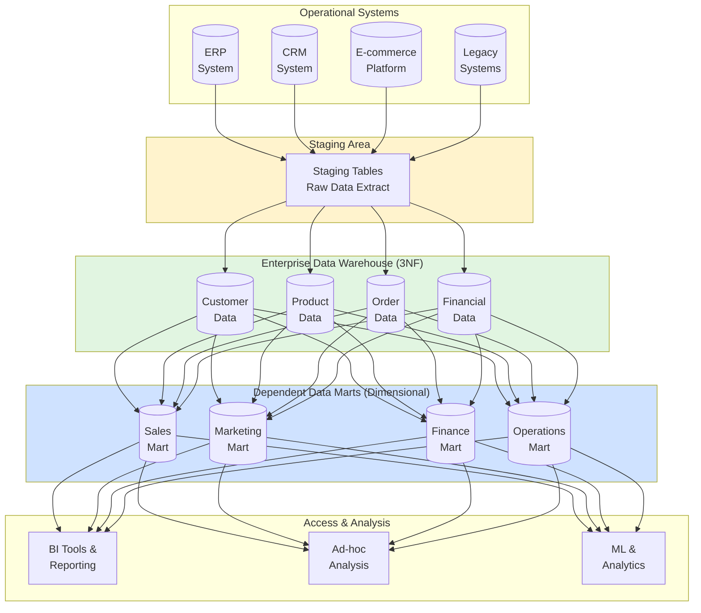
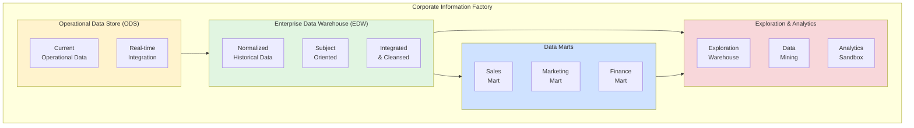

# Inmon Data Warehouse Architecture

<div class="difficulty-badge difficulty-advanced">Advanced</div>

## Quick Reference

```sql
-- Normalized Enterprise Data Warehouse - Third Normal Form (3NF)
-- Customer dimension in normalized form
CREATE TABLE dw_customer (
  customer_key BIGSERIAL PRIMARY KEY,
  customer_id VARCHAR(50) UNIQUE NOT NULL,
  customer_type_key INTEGER REFERENCES dw_customer_type(customer_type_key),
  segment_key INTEGER REFERENCES dw_customer_segment(segment_key),
  first_name VARCHAR(100),
  last_name VARCHAR(100),
  email VARCHAR(255),
  phone VARCHAR(50),
  effective_date TIMESTAMP NOT NULL,
  expiration_date TIMESTAMP,
  current_flag BOOLEAN DEFAULT TRUE,
  record_created_date TIMESTAMP DEFAULT CURRENT_TIMESTAMP,
  record_updated_date TIMESTAMP DEFAULT CURRENT_TIMESTAMP
);

-- Dependent Data Mart - Denormalized for reporting
CREATE TABLE dm_sales_customer_summary (
  customer_key BIGINT,
  customer_id VARCHAR(50),
  customer_name VARCHAR(255),
  customer_type VARCHAR(50),
  customer_segment VARCHAR(50),
  total_orders INTEGER,
  total_revenue DECIMAL(15, 2),
  lifetime_value DECIMAL(15, 2),
  first_order_date DATE,
  last_order_date DATE,
  snapshot_date DATE NOT NULL,
  PRIMARY KEY (customer_key, snapshot_date)
);

-- Atomic fact table in EDW
CREATE TABLE fact_order (
  order_key BIGSERIAL PRIMARY KEY,
  order_id VARCHAR(50) UNIQUE NOT NULL,
  customer_key BIGINT REFERENCES dw_customer(customer_key),
  product_key BIGINT REFERENCES dw_product(product_key),
  order_date_key INTEGER REFERENCES dw_date(date_key),
  ship_date_key INTEGER REFERENCES dw_date(date_key),
  order_status_key INTEGER REFERENCES dw_order_status(order_status_key),
  quantity INTEGER,
  unit_price DECIMAL(10, 2),
  discount_amount DECIMAL(10, 2),
  tax_amount DECIMAL(10, 2),
  total_amount DECIMAL(12, 2),
  record_created_date TIMESTAMP DEFAULT CURRENT_TIMESTAMP
);
```

## Overview

The Inmon architecture, developed by Bill Inmon (the "Father of Data Warehousing"), represents an enterprise-wide, top-down approach to data warehousing. At its core is the **Corporate Information Factory (CIF)**, which emphasizes building a centralized, normalized Enterprise Data Warehouse (EDW) as the single source of truth, from which dependent data marts are derived for specific business needs.

This architectural approach prioritizes data integrity, consistency, and long-term maintainability over query performance, making it ideal for large enterprises requiring a single, integrated view of their data across the organization.



## Core Principles

### 1. Subject-Oriented

Data is organized around major subjects (customers, products, sales) rather than applications.

```sql
-- Subject: Customer - All customer-related entities
CREATE TABLE dw_customer (
  customer_key BIGSERIAL PRIMARY KEY,
  customer_id VARCHAR(50) UNIQUE NOT NULL,
  customer_type_key INTEGER,
  first_name VARCHAR(100),
  last_name VARCHAR(100),
  birth_date DATE,
  effective_date TIMESTAMP NOT NULL,
  expiration_date TIMESTAMP,
  current_flag BOOLEAN DEFAULT TRUE
);

CREATE TABLE dw_customer_address (
  address_key BIGSERIAL PRIMARY KEY,
  customer_key BIGINT REFERENCES dw_customer(customer_key),
  address_type_key INTEGER,
  street_address VARCHAR(255),
  city VARCHAR(100),
  state VARCHAR(50),
  postal_code VARCHAR(20),
  country VARCHAR(100),
  effective_date TIMESTAMP NOT NULL,
  expiration_date TIMESTAMP,
  current_flag BOOLEAN DEFAULT TRUE
);

CREATE TABLE dw_customer_contact (
  contact_key BIGSERIAL PRIMARY KEY,
  customer_key BIGINT REFERENCES dw_customer(customer_key),
  contact_type_key INTEGER,
  contact_value VARCHAR(255),
  is_primary BOOLEAN DEFAULT FALSE,
  effective_date TIMESTAMP NOT NULL,
  expiration_date TIMESTAMP,
  current_flag BOOLEAN DEFAULT TRUE
);
```

### 2. Integrated

Data from multiple sources is integrated and standardized.

```sql
-- Integration: Standardizing customer data from multiple sources
CREATE TABLE stg_customer_erp (
  source_system VARCHAR(50) DEFAULT 'ERP',
  customer_code VARCHAR(50),
  cust_name VARCHAR(255),
  cust_email VARCHAR(255),
  load_timestamp TIMESTAMP DEFAULT CURRENT_TIMESTAMP
);

CREATE TABLE stg_customer_crm (
  source_system VARCHAR(50) DEFAULT 'CRM',
  customer_id VARCHAR(50),
  full_name VARCHAR(255),
  email_address VARCHAR(255),
  load_timestamp TIMESTAMP DEFAULT CURRENT_TIMESTAMP
);

-- Integration transformation
INSERT INTO dw_customer (
  customer_id,
  customer_type_key,
  first_name,
  last_name,
  email,
  effective_date,
  current_flag
)
SELECT DISTINCT
  COALESCE(erp.customer_code, crm.customer_id) as customer_id,
  1 as customer_type_key, -- Default type
  SPLIT_PART(COALESCE(erp.cust_name, crm.full_name), ' ', 1) as first_name,
  SPLIT_PART(COALESCE(erp.cust_name, crm.full_name), ' ', 2) as last_name,
  LOWER(COALESCE(erp.cust_email, crm.email_address)) as email, -- Standardize
  CURRENT_TIMESTAMP as effective_date,
  TRUE as current_flag
FROM stg_customer_erp erp
FULL OUTER JOIN stg_customer_crm crm
  ON LOWER(erp.cust_email) = LOWER(crm.email_address)
WHERE NOT EXISTS (
  SELECT 1 FROM dw_customer dc
  WHERE dc.customer_id = COALESCE(erp.customer_code, crm.customer_id)
    AND dc.current_flag = TRUE
);
```

### 3. Non-Volatile

Data, once entered, should not change. Historical accuracy is maintained through versioning.

```sql
-- Type 2 Slowly Changing Dimension - Preserving history
CREATE OR REPLACE FUNCTION update_customer_email(
  p_customer_id VARCHAR,
  p_new_email VARCHAR
)
RETURNS VOID AS $$
DECLARE
  v_customer_key BIGINT;
BEGIN
  -- Expire the current record
  UPDATE dw_customer
  SET expiration_date = CURRENT_TIMESTAMP,
      current_flag = FALSE,
      record_updated_date = CURRENT_TIMESTAMP
  WHERE customer_id = p_customer_id
    AND current_flag = TRUE
  RETURNING customer_key INTO v_customer_key;

  -- Insert new record with updated information
  INSERT INTO dw_customer (
    customer_id,
    customer_type_key,
    first_name,
    last_name,
    email,
    effective_date,
    current_flag
  )
  SELECT
    customer_id,
    customer_type_key,
    first_name,
    last_name,
    p_new_email,
    CURRENT_TIMESTAMP,
    TRUE
  FROM dw_customer
  WHERE customer_key = v_customer_key;
END;
$$ LANGUAGE plpgsql;
```

### 4. Time-Variant

All data includes a time dimension for historical analysis.

```sql
-- Date dimension for time-variant analysis
CREATE TABLE dw_date (
  date_key INTEGER PRIMARY KEY,
  full_date DATE NOT NULL UNIQUE,
  day_of_week INTEGER,
  day_name VARCHAR(10),
  day_of_month INTEGER,
  day_of_year INTEGER,
  week_of_year INTEGER,
  month_number INTEGER,
  month_name VARCHAR(10),
  quarter_number INTEGER,
  quarter_name VARCHAR(10),
  year_number INTEGER,
  is_weekend BOOLEAN,
  is_holiday BOOLEAN,
  fiscal_year INTEGER,
  fiscal_quarter INTEGER,
  fiscal_month INTEGER
);

-- Time-variant fact with multiple date references
CREATE TABLE fact_order (
  order_key BIGSERIAL PRIMARY KEY,
  order_id VARCHAR(50) NOT NULL,
  customer_key BIGINT,
  product_key BIGINT,
  order_date_key INTEGER REFERENCES dw_date(date_key),
  ship_date_key INTEGER REFERENCES dw_date(date_key),
  delivery_date_key INTEGER REFERENCES dw_date(date_key),
  return_date_key INTEGER REFERENCES dw_date(date_key),
  quantity INTEGER,
  amount DECIMAL(12, 2),
  record_created_date TIMESTAMP DEFAULT CURRENT_TIMESTAMP
);

-- Historical analysis using time dimensions
SELECT
  d.year_number,
  d.quarter_name,
  COUNT(DISTINCT f.customer_key) as customers,
  COUNT(*) as orders,
  SUM(f.amount) as revenue
FROM fact_order f
JOIN dw_date d ON f.order_date_key = d.date_key
WHERE d.year_number BETWEEN 2022 AND 2024
GROUP BY d.year_number, d.quarter_number, d.quarter_name
ORDER BY d.year_number, d.quarter_number;
```

## Corporate Information Factory (CIF)

The CIF is Inmon's comprehensive framework that extends beyond just the data warehouse.



### Operational Data Store (ODS)

The ODS provides current, integrated operational data for immediate operational reporting.

```sql
-- ODS structure - current snapshot, volatile
CREATE TABLE ods_customer_current (
  customer_id VARCHAR(50) PRIMARY KEY,
  first_name VARCHAR(100),
  last_name VARCHAR(100),
  email VARCHAR(255),
  phone VARCHAR(50),
  status VARCHAR(20),
  last_updated TIMESTAMP DEFAULT CURRENT_TIMESTAMP
);

CREATE TABLE ods_order_current (
  order_id VARCHAR(50) PRIMARY KEY,
  customer_id VARCHAR(50),
  order_date TIMESTAMP,
  order_status VARCHAR(50),
  total_amount DECIMAL(12, 2),
  last_updated TIMESTAMP DEFAULT CURRENT_TIMESTAMP
);

-- Real-time operational query
SELECT
  c.customer_id,
  c.first_name,
  c.last_name,
  COUNT(o.order_id) as active_orders,
  SUM(o.total_amount) as total_pending
FROM ods_customer_current c
JOIN ods_order_current o ON c.customer_id = o.customer_id
WHERE o.order_status IN ('pending', 'processing')
GROUP BY c.customer_id, c.first_name, c.last_name
HAVING COUNT(o.order_id) > 0;
```

### Enterprise Data Warehouse (EDW)

The EDW is the heart of the CIF - normalized, historical, and integrated.

```sql
-- EDW Customer subject area - normalized 3NF structure
CREATE TABLE dw_customer (
  customer_key BIGSERIAL PRIMARY KEY,
  customer_id VARCHAR(50) NOT NULL,
  customer_type_key INTEGER REFERENCES dw_customer_type(customer_type_key),
  segment_key INTEGER REFERENCES dw_customer_segment(segment_key),
  first_name VARCHAR(100),
  last_name VARCHAR(100),
  birth_date DATE,
  effective_date TIMESTAMP NOT NULL,
  expiration_date TIMESTAMP,
  current_flag BOOLEAN DEFAULT TRUE,
  source_system VARCHAR(50),
  record_created_date TIMESTAMP DEFAULT CURRENT_TIMESTAMP,
  record_updated_date TIMESTAMP
);

CREATE TABLE dw_customer_type (
  customer_type_key SERIAL PRIMARY KEY,
  customer_type_code VARCHAR(20) UNIQUE NOT NULL,
  customer_type_name VARCHAR(100),
  customer_type_description TEXT
);

CREATE TABLE dw_customer_segment (
  segment_key SERIAL PRIMARY KEY,
  segment_code VARCHAR(20) UNIQUE NOT NULL,
  segment_name VARCHAR(100),
  segment_description TEXT,
  min_lifetime_value DECIMAL(12, 2),
  max_lifetime_value DECIMAL(12, 2)
);

-- Normalized product structure
CREATE TABLE dw_product (
  product_key BIGSERIAL PRIMARY KEY,
  product_id VARCHAR(50) NOT NULL,
  product_name VARCHAR(255),
  product_category_key INTEGER REFERENCES dw_product_category(category_key),
  product_brand_key INTEGER REFERENCES dw_product_brand(brand_key),
  unit_cost DECIMAL(10, 2),
  unit_price DECIMAL(10, 2),
  effective_date TIMESTAMP NOT NULL,
  expiration_date TIMESTAMP,
  current_flag BOOLEAN DEFAULT TRUE
);

CREATE TABLE dw_product_category (
  category_key SERIAL PRIMARY KEY,
  category_code VARCHAR(20) UNIQUE NOT NULL,
  category_name VARCHAR(100),
  parent_category_key INTEGER REFERENCES dw_product_category(category_key),
  category_level INTEGER
);

CREATE TABLE dw_product_brand (
  brand_key SERIAL PRIMARY KEY,
  brand_code VARCHAR(20) UNIQUE NOT NULL,
  brand_name VARCHAR(100),
  manufacturer VARCHAR(255)
);

-- Atomic fact table - most granular level
CREATE TABLE fact_order_line (
  order_line_key BIGSERIAL PRIMARY KEY,
  order_key BIGINT REFERENCES fact_order_header(order_key),
  line_number INTEGER,
  customer_key BIGINT REFERENCES dw_customer(customer_key),
  product_key BIGINT REFERENCES dw_product(product_key),
  order_date_key INTEGER REFERENCES dw_date(date_key),
  quantity INTEGER,
  unit_price DECIMAL(10, 2),
  discount_percent DECIMAL(5, 2),
  discount_amount DECIMAL(10, 2),
  tax_amount DECIMAL(10, 2),
  line_total DECIMAL(12, 2),
  cost_amount DECIMAL(10, 2),
  record_source VARCHAR(50),
  record_created_date TIMESTAMP DEFAULT CURRENT_TIMESTAMP
);
```

### Dependent Data Marts

Data marts are sourced exclusively from the EDW, ensuring consistency.

```sql
-- Data mart creation from EDW (Sales Mart example)
-- Dimensional model derived from normalized EDW

-- Dimension: Customer (denormalized from EDW)
CREATE TABLE dm_sales_dim_customer AS
SELECT
  c.customer_key,
  c.customer_id,
  c.first_name || ' ' || c.last_name as customer_name,
  ct.customer_type_name,
  cs.segment_name as customer_segment,
  EXTRACT(YEAR FROM AGE(CURRENT_DATE, c.birth_date)) as customer_age,
  CASE
    WHEN EXTRACT(YEAR FROM AGE(CURRENT_DATE, c.birth_date)) < 25 THEN '18-24'
    WHEN EXTRACT(YEAR FROM AGE(CURRENT_DATE, c.birth_date)) < 35 THEN '25-34'
    WHEN EXTRACT(YEAR FROM AGE(CURRENT_DATE, c.birth_date)) < 45 THEN '35-44'
    WHEN EXTRACT(YEAR FROM AGE(CURRENT_DATE, c.birth_date)) < 55 THEN '45-54'
    WHEN EXTRACT(YEAR FROM AGE(CURRENT_DATE, c.birth_date)) < 65 THEN '55-64'
    ELSE '65+'
  END as age_group
FROM dw_customer c
JOIN dw_customer_type ct ON c.customer_type_key = ct.customer_type_key
JOIN dw_customer_segment cs ON c.segment_key = cs.segment_key
WHERE c.current_flag = TRUE;

-- Dimension: Product (denormalized from EDW)
CREATE TABLE dm_sales_dim_product AS
SELECT
  p.product_key,
  p.product_id,
  p.product_name,
  pc.category_name as product_category,
  pb.brand_name as product_brand,
  pb.manufacturer,
  p.unit_price,
  p.unit_cost,
  p.unit_price - p.unit_cost as unit_margin
FROM dw_product p
JOIN dw_product_category pc ON p.product_category_key = pc.category_key
JOIN dw_product_brand pb ON p.product_brand_key = pb.brand_key
WHERE p.current_flag = TRUE;

-- Fact: Sales (aggregated from EDW atomic facts)
CREATE TABLE dm_sales_fact_daily AS
SELECT
  fol.customer_key,
  fol.product_key,
  fol.order_date_key,
  COUNT(DISTINCT fol.order_key) as order_count,
  COUNT(*) as line_count,
  SUM(fol.quantity) as total_quantity,
  SUM(fol.line_total) as total_sales,
  SUM(fol.cost_amount) as total_cost,
  SUM(fol.line_total - fol.cost_amount) as total_margin,
  SUM(fol.discount_amount) as total_discounts
FROM fact_order_line fol
GROUP BY
  fol.customer_key,
  fol.product_key,
  fol.order_date_key;

-- Add indexes for performance
CREATE INDEX idx_dm_sales_fact_customer ON dm_sales_fact_daily(customer_key);
CREATE INDEX idx_dm_sales_fact_product ON dm_sales_fact_daily(product_key);
CREATE INDEX idx_dm_sales_fact_date ON dm_sales_fact_daily(order_date_key);
```

## ETL Process for Inmon Architecture

The ETL process follows a specific flow: Source → Staging → EDW → Data Marts.

### Stage 1: Extract to Staging

```sql
-- Staging area - raw extracted data
CREATE TABLE stg_orders (
  order_id VARCHAR(50),
  customer_id VARCHAR(50),
  order_date TIMESTAMP,
  order_status VARCHAR(50),
  total_amount DECIMAL(12, 2),
  source_system VARCHAR(50),
  extract_timestamp TIMESTAMP DEFAULT CURRENT_TIMESTAMP
);

CREATE TABLE stg_order_lines (
  order_id VARCHAR(50),
  line_number INTEGER,
  product_id VARCHAR(50),
  quantity INTEGER,
  unit_price DECIMAL(10, 2),
  discount DECIMAL(5, 2),
  source_system VARCHAR(50),
  extract_timestamp TIMESTAMP DEFAULT CURRENT_TIMESTAMP
);

-- Extract process
INSERT INTO stg_orders
SELECT
  order_id,
  customer_id,
  order_date,
  order_status,
  total_amount,
  'ERP' as source_system,
  CURRENT_TIMESTAMP
FROM external_erp_orders
WHERE order_date >= CURRENT_DATE - INTERVAL '1 day';
```

### Stage 2: Load to EDW (Transform & Integrate)

```sql
-- Transform and load into normalized EDW
-- Step 1: Load dimension data (customer)
INSERT INTO dw_customer (
  customer_id,
  customer_type_key,
  first_name,
  last_name,
  effective_date,
  current_flag,
  source_system
)
SELECT DISTINCT
  sc.customer_id,
  COALESCE(ct.customer_type_key, 1) as customer_type_key,
  sc.first_name,
  sc.last_name,
  CURRENT_TIMESTAMP as effective_date,
  TRUE as current_flag,
  sc.source_system
FROM stg_customers sc
LEFT JOIN dw_customer_type ct ON sc.customer_type = ct.customer_type_code
WHERE NOT EXISTS (
  SELECT 1 FROM dw_customer dc
  WHERE dc.customer_id = sc.customer_id
    AND dc.current_flag = TRUE
);

-- Step 2: Load fact data (atomic level)
INSERT INTO fact_order_line (
  order_key,
  line_number,
  customer_key,
  product_key,
  order_date_key,
  quantity,
  unit_price,
  discount_amount,
  line_total,
  record_source
)
SELECT
  oh.order_key,
  sol.line_number,
  c.customer_key,
  p.product_key,
  d.date_key,
  sol.quantity,
  sol.unit_price,
  sol.unit_price * sol.quantity * sol.discount / 100 as discount_amount,
  sol.unit_price * sol.quantity * (1 - sol.discount / 100) as line_total,
  sol.source_system
FROM stg_order_lines sol
JOIN fact_order_header oh ON sol.order_id = oh.order_id
JOIN dw_customer c ON sol.customer_id = c.customer_id AND c.current_flag = TRUE
JOIN dw_product p ON sol.product_id = p.product_id AND p.current_flag = TRUE
JOIN dw_date d ON DATE(sol.order_date) = d.full_date
WHERE NOT EXISTS (
  SELECT 1 FROM fact_order_line fol
  WHERE fol.order_key = oh.order_key
    AND fol.line_number = sol.line_number
);
```

### Stage 3: Populate Data Marts from EDW

```sql
-- Refresh data mart from EDW (incremental)
-- Delete and reload changed data
DELETE FROM dm_sales_fact_daily
WHERE order_date_key IN (
  SELECT DISTINCT order_date_key
  FROM fact_order_line
  WHERE record_created_date >= CURRENT_DATE - INTERVAL '1 day'
);

-- Reload with fresh data from EDW
INSERT INTO dm_sales_fact_daily
SELECT
  fol.customer_key,
  fol.product_key,
  fol.order_date_key,
  COUNT(DISTINCT fol.order_key) as order_count,
  COUNT(*) as line_count,
  SUM(fol.quantity) as total_quantity,
  SUM(fol.line_total) as total_sales,
  SUM(fol.cost_amount) as total_cost,
  SUM(fol.line_total - fol.cost_amount) as total_margin,
  SUM(fol.discount_amount) as total_discounts
FROM fact_order_line fol
WHERE fol.order_date_key IN (
  SELECT DISTINCT order_date_key
  FROM fact_order_line
  WHERE record_created_date >= CURRENT_DATE - INTERVAL '1 day'
)
GROUP BY
  fol.customer_key,
  fol.product_key,
  fol.order_date_key;
```

## Historical Tracking (SCD Implementation)

Inmon emphasizes maintaining complete history. Slowly Changing Dimensions (SCD) are critical.

### Type 1: Overwrite

```sql
-- Type 1 SCD: Simple overwrite (no history)
UPDATE dw_customer
SET
  phone = '555-0123',
  record_updated_date = CURRENT_TIMESTAMP
WHERE customer_id = 'CUST001'
  AND current_flag = TRUE;
```

### Type 2: Add New Row (Most Common in Inmon)

```sql
-- Type 2 SCD: Preserve full history
CREATE OR REPLACE FUNCTION scd_type2_customer(
  p_customer_id VARCHAR,
  p_first_name VARCHAR,
  p_last_name VARCHAR,
  p_email VARCHAR,
  p_phone VARCHAR
)
RETURNS VOID AS $$
DECLARE
  v_changed BOOLEAN := FALSE;
  v_old_record RECORD;
BEGIN
  -- Check if there are any changes
  SELECT * INTO v_old_record
  FROM dw_customer
  WHERE customer_id = p_customer_id
    AND current_flag = TRUE;

  -- Determine if update is needed
  IF v_old_record IS NOT NULL THEN
    IF v_old_record.first_name <> p_first_name OR
       v_old_record.last_name <> p_last_name OR
       v_old_record.email <> p_email OR
       v_old_record.phone <> p_phone THEN
      v_changed := TRUE;
    END IF;
  END IF;

  -- If changed, create new version
  IF v_changed THEN
    -- Expire current record
    UPDATE dw_customer
    SET
      expiration_date = CURRENT_TIMESTAMP,
      current_flag = FALSE,
      record_updated_date = CURRENT_TIMESTAMP
    WHERE customer_id = p_customer_id
      AND current_flag = TRUE;

    -- Insert new version
    INSERT INTO dw_customer (
      customer_id,
      customer_type_key,
      segment_key,
      first_name,
      last_name,
      email,
      phone,
      birth_date,
      effective_date,
      current_flag
    )
    SELECT
      customer_id,
      customer_type_key,
      segment_key,
      p_first_name,
      p_last_name,
      p_email,
      p_phone,
      birth_date,
      CURRENT_TIMESTAMP,
      TRUE
    FROM dw_customer
    WHERE customer_key = v_old_record.customer_key;
  END IF;
END;
$$ LANGUAGE plpgsql;

-- Usage
SELECT scd_type2_customer(
  'CUST001',
  'John',
  'Smith',
  'john.smith@newdomain.com',
  '555-0199'
);
```

### Type 3: Add New Column

```sql
-- Type 3 SCD: Keep current and previous value
ALTER TABLE dw_customer
ADD COLUMN previous_email VARCHAR(255),
ADD COLUMN email_changed_date TIMESTAMP;

UPDATE dw_customer
SET
  previous_email = email,
  email = 'new.email@domain.com',
  email_changed_date = CURRENT_TIMESTAMP
WHERE customer_id = 'CUST001'
  AND current_flag = TRUE;
```

## Query Patterns in Inmon Architecture

### Joining Normalized EDW Tables

```sql
-- Complex query across normalized EDW
-- Find customer lifetime value with detailed breakdown
WITH customer_orders AS (
  SELECT
    c.customer_key,
    c.customer_id,
    c.first_name || ' ' || c.last_name as customer_name,
    ct.customer_type_name,
    cs.segment_name,
    COUNT(DISTINCT fol.order_key) as total_orders,
    SUM(fol.line_total) as total_spent,
    MIN(d.full_date) as first_order_date,
    MAX(d.full_date) as last_order_date
  FROM dw_customer c
  JOIN dw_customer_type ct ON c.customer_type_key = ct.customer_type_key
  JOIN dw_customer_segment cs ON c.segment_key = cs.segment_key
  LEFT JOIN fact_order_line fol ON c.customer_key = fol.customer_key
  LEFT JOIN dw_date d ON fol.order_date_key = d.date_key
  WHERE c.current_flag = TRUE
  GROUP BY
    c.customer_key,
    c.customer_id,
    c.first_name,
    c.last_name,
    ct.customer_type_name,
    cs.segment_name
)
SELECT
  customer_id,
  customer_name,
  customer_type_name,
  segment_name,
  total_orders,
  ROUND(total_spent, 2) as total_spent,
  ROUND(total_spent / NULLIF(total_orders, 0), 2) as avg_order_value,
  first_order_date,
  last_order_date,
  EXTRACT(DAYS FROM (last_order_date - first_order_date)) as customer_lifespan_days,
  ROUND(
    total_spent / NULLIF(EXTRACT(DAYS FROM (last_order_date - first_order_date)), 0),
    2
  ) as revenue_per_day
FROM customer_orders
WHERE total_orders > 0
ORDER BY total_spent DESC
LIMIT 100;
```

### Historical Point-in-Time Analysis

```sql
-- Point-in-time customer analysis
-- What did the customer record look like on a specific date?
SELECT
  c.customer_id,
  c.first_name,
  c.last_name,
  c.email,
  ca.street_address,
  ca.city,
  ca.state,
  ct.customer_type_name,
  cs.segment_name
FROM dw_customer c
JOIN dw_customer_address ca ON c.customer_key = ca.customer_key
JOIN dw_customer_type ct ON c.customer_type_key = ct.customer_type_key
JOIN dw_customer_segment cs ON c.segment_key = cs.segment_key
WHERE c.customer_id = 'CUST001'
  AND c.effective_date <= '2023-06-15'
  AND (c.expiration_date IS NULL OR c.expiration_date > '2023-06-15')
  AND ca.effective_date <= '2023-06-15'
  AND (ca.expiration_date IS NULL OR ca.expiration_date > '2023-06-15');
```

### Audit Trail Query

```sql
-- Track all changes to a customer over time
SELECT
  customer_key,
  customer_id,
  first_name,
  last_name,
  email,
  phone,
  effective_date as change_date,
  expiration_date as valid_until,
  CASE
    WHEN current_flag = TRUE THEN 'CURRENT'
    ELSE 'HISTORICAL'
  END as record_status,
  record_created_date,
  record_updated_date
FROM dw_customer
WHERE customer_id = 'CUST001'
ORDER BY effective_date DESC;
```

## Benefits of Inmon Architecture

### 1. Single Source of Truth

```sql
-- Consistent data across all marts sourced from EDW
-- Query 1: Sales Mart
SELECT SUM(total_sales) as total_revenue
FROM dm_sales_fact_daily
WHERE order_date_key BETWEEN 20240101 AND 20241231;

-- Query 2: Finance Mart (sourced from same EDW)
SELECT SUM(total_sales) as total_revenue
FROM dm_finance_fact_daily
WHERE order_date_key BETWEEN 20240101 AND 20241231;

-- Both queries return identical results because both marts
-- are sourced from the same atomic facts in the EDW
```

### 2. Data Quality and Consistency

```sql
-- Referential integrity enforced in EDW
ALTER TABLE fact_order_line
ADD CONSTRAINT fk_customer
  FOREIGN KEY (customer_key)
  REFERENCES dw_customer(customer_key);

ALTER TABLE fact_order_line
ADD CONSTRAINT fk_product
  FOREIGN KEY (product_key)
  REFERENCES dw_product(product_key);

-- Data validation rules
ALTER TABLE dw_customer
ADD CONSTRAINT chk_email_format
  CHECK (email ~ '^[A-Za-z0-9._%+-]+@[A-Za-z0-9.-]+\.[A-Za-z]{2,}$');

ALTER TABLE fact_order_line
ADD CONSTRAINT chk_positive_quantity
  CHECK (quantity > 0);

ALTER TABLE fact_order_line
ADD CONSTRAINT chk_positive_amount
  CHECK (line_total >= 0);
```

### 3. Flexibility and Adaptability

```sql
-- New data mart can be easily created from existing EDW
-- Marketing Mart - without impacting existing marts
CREATE TABLE dm_marketing_fact_campaign AS
SELECT
  fol.customer_key,
  fol.product_key,
  fol.order_date_key,
  c.campaign_key,
  COUNT(DISTINCT fol.order_key) as orders_attributed,
  SUM(fol.line_total) as revenue_attributed,
  SUM(fol.line_total - fol.cost_amount) as margin_attributed
FROM fact_order_line fol
JOIN fact_order_header oh ON fol.order_key = oh.order_key
LEFT JOIN dw_campaign_attribution ca ON oh.order_key = ca.order_key
LEFT JOIN dw_campaign c ON ca.campaign_id = c.campaign_id
GROUP BY
  fol.customer_key,
  fol.product_key,
  fol.order_date_key,
  c.campaign_key;
```

### 4. Complete Historical View

```sql
-- Analyze customer behavior across their entire history
WITH customer_history AS (
  SELECT
    c.customer_id,
    c.customer_key,
    c.email,
    c.effective_date,
    c.expiration_date,
    c.current_flag,
    -- Calculate tenure in each status
    COALESCE(
      c.expiration_date,
      CURRENT_TIMESTAMP
    ) - c.effective_date as status_duration
  FROM dw_customer c
  WHERE c.customer_id = 'CUST001'
)
SELECT
  customer_id,
  email,
  effective_date as status_start,
  expiration_date as status_end,
  EXTRACT(DAYS FROM status_duration) as days_active,
  current_flag
FROM customer_history
ORDER BY effective_date;
```

## Challenges and Considerations

### 1. Query Complexity

```sql
-- ❌ Complex multi-table joins required for simple queries
SELECT
  c.customer_id,
  c.first_name || ' ' || c.last_name as name,
  ct.customer_type_name,
  cs.segment_name,
  ca.city,
  ca.state,
  COUNT(fol.order_key) as orders,
  SUM(fol.line_total) as revenue
FROM dw_customer c
JOIN dw_customer_type ct ON c.customer_type_key = ct.customer_type_key
JOIN dw_customer_segment cs ON c.segment_key = cs.segment_key
JOIN dw_customer_address ca ON c.customer_key = ca.customer_key
  AND ca.current_flag = TRUE
  AND ca.address_type_key = 1 -- Primary address
LEFT JOIN fact_order_line fol ON c.customer_key = fol.customer_key
WHERE c.current_flag = TRUE
GROUP BY
  c.customer_id,
  c.first_name,
  c.last_name,
  ct.customer_type_name,
  cs.segment_name,
  ca.city,
  ca.state;

-- ✅ Solution: Use data marts for reporting
SELECT
  customer_id,
  customer_name,
  customer_type,
  customer_segment,
  city,
  state,
  total_orders,
  total_revenue
FROM dm_sales_customer_summary
WHERE snapshot_date = CURRENT_DATE;
```

### 2. Initial Development Time

```sql
-- Comprehensive EDW setup requires significant upfront effort
-- Example: Full customer subject area

-- 1. Customer base table
CREATE TABLE dw_customer (...);

-- 2. Customer reference tables
CREATE TABLE dw_customer_type (...);
CREATE TABLE dw_customer_segment (...);
CREATE TABLE dw_customer_status (...);

-- 3. Customer related entities
CREATE TABLE dw_customer_address (...);
CREATE TABLE dw_customer_contact (...);
CREATE TABLE dw_customer_preference (...);

-- 4. Customer relationships
CREATE TABLE dw_customer_relationship (...);

-- 5. All required indexes, constraints, and ETL procedures
-- This is just ONE subject area of potentially dozens
```

### 3. Data Redundancy

```sql
-- Data exists in both EDW and data marts
-- EDW (normalized)
SELECT COUNT(*) FROM fact_order_line;  -- 10 million rows

-- Sales Mart (denormalized)
SELECT COUNT(*) FROM dm_sales_fact_daily;  -- 5 million rows

-- Marketing Mart (denormalized)
SELECT COUNT(*) FROM dm_marketing_fact_daily;  -- 5 million rows

-- Finance Mart (denormalized)
SELECT COUNT(*) FROM dm_finance_fact_daily;  -- 5 million rows

-- Total storage needed > original EDW due to redundancy
```

### 4. ETL Complexity

```sql
-- Multi-stage ETL process
-- Stage 1: Source → Staging (simple extract)
-- Stage 2: Staging → EDW (complex transformation, integration, validation)
-- Stage 3: EDW → Data Marts (denormalization, aggregation)

-- Each stage requires error handling, logging, and monitoring
CREATE TABLE etl_job_log (
  job_id SERIAL PRIMARY KEY,
  job_name VARCHAR(255),
  job_stage VARCHAR(50), -- EXTRACT, TRANSFORM, LOAD
  target_table VARCHAR(255),
  start_time TIMESTAMP,
  end_time TIMESTAMP,
  rows_processed INTEGER,
  rows_inserted INTEGER,
  rows_updated INTEGER,
  rows_rejected INTEGER,
  status VARCHAR(20), -- SUCCESS, FAILURE, PARTIAL
  error_message TEXT
);
```

## Inmon vs. Kimball Comparison

```sql
-- Inmon Approach (Normalized EDW)
-- Customer dimension in EDW
CREATE TABLE dw_customer (
  customer_key BIGSERIAL PRIMARY KEY,
  customer_id VARCHAR(50),
  customer_type_key INTEGER REFERENCES dw_customer_type(customer_type_key),
  first_name VARCHAR(100),
  last_name VARCHAR(100),
  effective_date TIMESTAMP,
  current_flag BOOLEAN
);

CREATE TABLE dw_customer_type (
  customer_type_key SERIAL PRIMARY KEY,
  customer_type_name VARCHAR(100)
);

-- Query requires join
SELECT c.customer_id, ct.customer_type_name
FROM dw_customer c
JOIN dw_customer_type ct ON c.customer_type_key = ct.customer_type_key;

-- Kimball Approach (Denormalized Dimensions)
-- Customer dimension is denormalized
CREATE TABLE dim_customer (
  customer_key BIGSERIAL PRIMARY KEY,
  customer_id VARCHAR(50),
  customer_type_name VARCHAR(100), -- Denormalized
  first_name VARCHAR(100),
  last_name VARCHAR(100),
  effective_date TIMESTAMP,
  current_flag BOOLEAN
);

-- Query is simpler, no join needed
SELECT customer_id, customer_type_name
FROM dim_customer;
```

| Aspect | Inmon | Kimball |
|--------|-------|---------|
| Data Model | Normalized (3NF) in EDW | Denormalized (Star/Snowflake) |
| Approach | Top-down (enterprise-wide) | Bottom-up (departmental) |
| Initial Effort | High | Lower |
| Query Performance | Slower (requires joins) | Faster (pre-joined) |
| Storage | Less redundancy | More redundancy |
| Flexibility | High (easy to create new marts) | Moderate |
| Data Consistency | Enforced at EDW level | Managed at dimensional level |
| Best For | Large enterprises, long-term | Departmental needs, quick wins |

## Best Practices

### 1. Implement Proper SCD Handling

```sql
-- ✅ Always use Type 2 for important historical attributes
CREATE TABLE dw_product (
  product_key BIGSERIAL PRIMARY KEY,
  product_id VARCHAR(50) NOT NULL,
  product_name VARCHAR(255),
  unit_price DECIMAL(10, 2),
  effective_date TIMESTAMP NOT NULL,
  expiration_date TIMESTAMP,
  current_flag BOOLEAN DEFAULT TRUE,
  CONSTRAINT uq_product_current UNIQUE (product_id, current_flag)
    WHERE (current_flag = TRUE)
);
```

### 2. Use Surrogate Keys

```sql
-- ✅ Use surrogate keys for all dimension tables
CREATE TABLE dw_customer (
  customer_key BIGSERIAL PRIMARY KEY,  -- Surrogate key
  customer_id VARCHAR(50) NOT NULL,    -- Natural key
  -- ... other attributes
);

-- ❌ Don't use natural keys as primary keys
CREATE TABLE dw_customer_bad (
  customer_id VARCHAR(50) PRIMARY KEY,  -- Natural key as PK (bad practice)
  -- ... other attributes
);
```

### 3. Maintain Audit Columns

```sql
-- ✅ Include comprehensive audit trail
CREATE TABLE dw_customer (
  customer_key BIGSERIAL PRIMARY KEY,
  customer_id VARCHAR(50) NOT NULL,
  -- Business attributes
  first_name VARCHAR(100),
  last_name VARCHAR(100),
  -- SCD Type 2 columns
  effective_date TIMESTAMP NOT NULL,
  expiration_date TIMESTAMP,
  current_flag BOOLEAN DEFAULT TRUE,
  -- Audit columns
  record_source VARCHAR(50),
  record_created_date TIMESTAMP DEFAULT CURRENT_TIMESTAMP,
  record_created_by VARCHAR(100) DEFAULT CURRENT_USER,
  record_updated_date TIMESTAMP,
  record_updated_by VARCHAR(100),
  -- Lineage
  source_system_id INTEGER,
  batch_id BIGINT
);
```

### 4. Document Data Lineage

```sql
-- Create metadata tables for lineage tracking
CREATE TABLE meta_data_lineage (
  lineage_id SERIAL PRIMARY KEY,
  source_system VARCHAR(100),
  source_table VARCHAR(255),
  source_column VARCHAR(255),
  target_table VARCHAR(255),
  target_column VARCHAR(255),
  transformation_logic TEXT,
  created_date TIMESTAMP DEFAULT CURRENT_TIMESTAMP,
  created_by VARCHAR(100)
);

-- Document lineage
INSERT INTO meta_data_lineage VALUES
(1, 'ERP', 'customers', 'customer_code', 'dw_customer', 'customer_id', 'Direct mapping', CURRENT_TIMESTAMP, 'ETL_ADMIN'),
(2, 'CRM', 'contacts', 'contact_id', 'dw_customer', 'customer_id', 'Merged with ERP customer_code', CURRENT_TIMESTAMP, 'ETL_ADMIN');
```

### 5. Implement Data Quality Checks

```sql
-- Data quality validation before loading to EDW
CREATE TABLE dq_validation_rules (
  rule_id SERIAL PRIMARY KEY,
  rule_name VARCHAR(255),
  target_table VARCHAR(255),
  validation_sql TEXT,
  severity VARCHAR(20), -- ERROR, WARNING
  active BOOLEAN DEFAULT TRUE
);

-- Example validation rules
INSERT INTO dq_validation_rules (rule_name, target_table, validation_sql, severity) VALUES
('Email format', 'dw_customer', 'SELECT COUNT(*) FROM dw_customer WHERE email NOT LIKE ''%@%.%''', 'ERROR'),
('Future dates', 'fact_order_line', 'SELECT COUNT(*) FROM fact_order_line f JOIN dw_date d ON f.order_date_key = d.date_key WHERE d.full_date > CURRENT_DATE', 'ERROR'),
('Negative quantities', 'fact_order_line', 'SELECT COUNT(*) FROM fact_order_line WHERE quantity <= 0', 'ERROR');

-- Run validation
CREATE OR REPLACE FUNCTION run_data_quality_checks()
RETURNS TABLE (
  rule_name VARCHAR,
  target_table VARCHAR,
  violation_count BIGINT,
  severity VARCHAR,
  check_timestamp TIMESTAMP
) AS $$
DECLARE
  v_rule RECORD;
  v_count BIGINT;
BEGIN
  FOR v_rule IN
    SELECT * FROM dq_validation_rules WHERE active = TRUE
  LOOP
    EXECUTE v_rule.validation_sql INTO v_count;

    RETURN QUERY SELECT
      v_rule.rule_name,
      v_rule.target_table,
      v_count,
      v_rule.severity,
      CURRENT_TIMESTAMP;
  END LOOP;
END;
$$ LANGUAGE plpgsql;

-- Execute checks
SELECT * FROM run_data_quality_checks();
```

## Common Pitfalls

### 1. Over-Normalization

```sql
-- ❌ Too many levels of normalization
CREATE TABLE dw_customer (
  customer_key BIGSERIAL PRIMARY KEY,
  first_name_key INTEGER REFERENCES dw_first_names(name_key),
  last_name_key INTEGER REFERENCES dw_last_names(name_key),
  -- This is excessive!
);

-- ✅ Normalize to reasonable level (3NF)
CREATE TABLE dw_customer (
  customer_key BIGSERIAL PRIMARY KEY,
  first_name VARCHAR(100),
  last_name VARCHAR(100),
  customer_type_key INTEGER REFERENCES dw_customer_type(customer_type_key)
);
```

### 2. Not Using Data Marts

```sql
-- ❌ Querying EDW directly for reporting (slow)
SELECT
  c.customer_id,
  p.product_name,
  SUM(fol.line_total) as revenue
FROM fact_order_line fol
JOIN dw_customer c ON fol.customer_key = c.customer_key
JOIN dw_product p ON fol.product_key = p.product_key
JOIN dw_date d ON fol.order_date_key = d.date_key
WHERE c.current_flag = TRUE
  AND p.current_flag = TRUE
  AND d.year_number = 2024
GROUP BY c.customer_id, p.product_name;

-- ✅ Use data marts for reporting (fast)
SELECT
  customer_id,
  product_name,
  SUM(total_sales) as revenue
FROM dm_sales_fact_daily f
JOIN dm_sales_dim_customer c ON f.customer_key = c.customer_key
JOIN dm_sales_dim_product p ON f.product_key = p.product_key
WHERE order_date_key BETWEEN 20240101 AND 20241231
GROUP BY customer_id, product_name;
```

### 3. Inconsistent SCD Implementation

```sql
-- ❌ Mixing SCD types inconsistently
CREATE TABLE dw_customer (
  customer_key BIGSERIAL PRIMARY KEY,
  customer_id VARCHAR(50),
  first_name VARCHAR(100),        -- Type 2
  email VARCHAR(255),             -- Type 2
  previous_email VARCHAR(255),    -- Type 3 (inconsistent!)
  phone VARCHAR(50),              -- Type 1 (inconsistent!)
  effective_date TIMESTAMP,
  current_flag BOOLEAN
);

-- ✅ Consistent SCD strategy
CREATE TABLE dw_customer (
  customer_key BIGSERIAL PRIMARY KEY,
  customer_id VARCHAR(50),
  first_name VARCHAR(100),
  email VARCHAR(255),
  phone VARCHAR(50),
  effective_date TIMESTAMP,
  expiration_date TIMESTAMP,
  current_flag BOOLEAN
  -- All attributes use Type 2 consistently
);
```

## See Also

- [Kimball Architecture](/architectures/kimball/) - Dimensional modeling approach
- [Data Vault Architecture](/architectures/data-vault/) - Hybrid approach
- [ETL Patterns](/patterns/etl/) - Extract, transform, and load processes
- [Analytics Patterns](/patterns/analytics/) - Advanced analytics techniques
- [Performance](/concepts/performance/) - Query optimization strategies
- [Slowly Changing Dimensions](/concepts/scd/) - Historical data tracking
