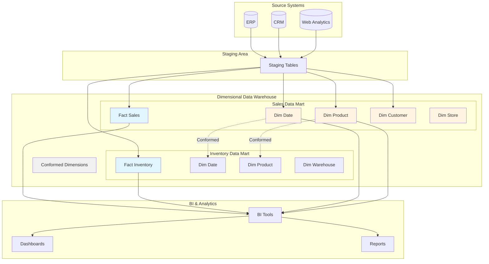

# Kimball Data Warehouse Architecture

<div class="difficulty-badge difficulty-advanced">Advanced</div>

## Quick Reference

```sql
-- Create a typical star schema fact table
CREATE TABLE fact_sales (
    date_key INTEGER REFERENCES dim_date(date_key),
    product_key INTEGER REFERENCES dim_product(product_key),
    store_key INTEGER REFERENCES dim_store(store_key),
    customer_key INTEGER REFERENCES dim_customer(customer_key),
    quantity INTEGER,
    amount DECIMAL(10,2),
    discount DECIMAL(10,2),
    PRIMARY KEY (date_key, product_key, store_key, customer_key)
);

-- Create a dimension table with slowly changing dimension (Type 2)
CREATE TABLE dim_product (
    product_key INTEGER PRIMARY KEY,
    product_id VARCHAR(50),
    product_name VARCHAR(200),
    category VARCHAR(100),
    subcategory VARCHAR(100),
    brand VARCHAR(100),
    price DECIMAL(10,2),
    effective_date DATE,
    expiration_date DATE,
    is_current BOOLEAN,
    version INTEGER
);

-- Create a conformed dimension (shared across fact tables)
CREATE TABLE dim_date (
    date_key INTEGER PRIMARY KEY,
    full_date DATE,
    day_of_week VARCHAR(10),
    day_of_month INTEGER,
    month INTEGER,
    month_name VARCHAR(10),
    quarter INTEGER,
    year INTEGER,
    is_weekend BOOLEAN,
    is_holiday BOOLEAN,
    fiscal_period VARCHAR(20)
);

-- Query pattern: dimensional drill-down
SELECT
    d.year,
    d.quarter,
    p.category,
    SUM(f.amount) as total_sales,
    SUM(f.quantity) as total_quantity,
    COUNT(DISTINCT f.customer_key) as unique_customers
FROM fact_sales f
JOIN dim_date d ON f.date_key = d.date_key
JOIN dim_product p ON f.product_key = p.product_key
WHERE d.year = 2024
  AND p.category = 'Electronics'
GROUP BY d.year, d.quarter, p.category
ORDER BY d.quarter;

-- Slowly changing dimension Type 2 lookup
SELECT
    product_key,
    product_name,
    price,
    effective_date,
    expiration_date
FROM dim_product
WHERE product_id = 'PROD-123'
  AND is_current = true;
```

## Overview

The Kimball approach to data warehousing, pioneered by Ralph Kimball in the 1990s, focuses on **dimensional modeling** and a **bottom-up, business process-centric** methodology. Unlike the Inmon approach which emphasizes normalized enterprise data warehouses, Kimball advocates for building **denormalized dimensional models** (star schemas) that are optimized for query performance and business user comprehension.

The core philosophy is to deliver business value quickly by implementing dimensional data marts one business process at a time, using **conformed dimensions** to ensure enterprise-wide consistency. This approach prioritizes ease of use, query performance, and rapid development cycles.

The Kimball architecture organizes data into **fact tables** (containing measurable business events) surrounded by **dimension tables** (containing descriptive context), creating intuitive star-shaped schemas that business users can easily understand and query.



## Core Principles

### 1. Dimensional Modeling (Star Schema)

The foundation of Kimball architecture is the **star schema**: a fact table at the center surrounded by dimension tables. This denormalized structure optimizes query performance and business comprehension.

**Fact Table**: Contains numeric measurements (facts) about business events
**Dimension Tables**: Contain descriptive attributes providing context to facts

```sql
-- Fact table: Contains measurements of business events
CREATE TABLE fact_orders (
    -- Foreign keys to dimensions
    order_date_key INTEGER REFERENCES dim_date(date_key),
    customer_key INTEGER REFERENCES dim_customer(customer_key),
    product_key INTEGER REFERENCES dim_product(product_key),
    shipper_key INTEGER REFERENCES dim_shipper(shipper_key),

    -- Degenerate dimension (stored in fact table)
    order_number VARCHAR(50),

    -- Measurements (facts)
    quantity INTEGER,
    unit_price DECIMAL(10,2),
    discount_amount DECIMAL(10,2),
    tax_amount DECIMAL(10,2),
    total_amount DECIMAL(10,2),
    cost_amount DECIMAL(10,2),
    profit_amount DECIMAL(10,2),

    -- Audit columns
    load_date TIMESTAMP DEFAULT CURRENT_TIMESTAMP,

    PRIMARY KEY (order_date_key, customer_key, product_key, order_number)
);

-- Dimension table: Customer context
CREATE TABLE dim_customer (
    customer_key INTEGER PRIMARY KEY,
    customer_id VARCHAR(50),
    customer_name VARCHAR(200),
    customer_type VARCHAR(50),
    segment VARCHAR(50),

    -- Address attributes
    street_address VARCHAR(200),
    city VARCHAR(100),
    state VARCHAR(50),
    postal_code VARCHAR(20),
    country VARCHAR(50),

    -- SCD Type 2 columns
    effective_date DATE,
    expiration_date DATE,
    is_current BOOLEAN,
    version INTEGER
);

-- Dimension table: Product context
CREATE TABLE dim_product (
    product_key INTEGER PRIMARY KEY,
    product_id VARCHAR(50),
    product_name VARCHAR(200),
    product_description TEXT,

    -- Hierarchy attributes
    brand VARCHAR(100),
    subcategory VARCHAR(100),
    category VARCHAR(100),
    department VARCHAR(100),

    -- Product attributes
    color VARCHAR(50),
    size VARCHAR(50),
    weight DECIMAL(10,2),
    unit_of_measure VARCHAR(20),

    -- SCD Type 2 columns
    effective_date DATE,
    expiration_date DATE,
    is_current BOOLEAN
);
```

### 2. Conformed Dimensions

Conformed dimensions are dimensions that are shared across multiple fact tables and data marts, ensuring **consistent** reporting across the enterprise. They are the "glue" that integrates separate data marts into a cohesive data warehouse.

```sql
-- Conformed dimension: Date (shared across all fact tables)
CREATE TABLE dim_date (
    date_key INTEGER PRIMARY KEY,
    full_date DATE UNIQUE NOT NULL,

    -- Date components
    day_of_week INTEGER,
    day_of_week_name VARCHAR(10),
    day_of_month INTEGER,
    day_of_year INTEGER,

    -- Week information
    week_of_year INTEGER,
    iso_week INTEGER,

    -- Month information
    month INTEGER,
    month_name VARCHAR(10),
    month_abbr VARCHAR(3),

    -- Quarter information
    quarter INTEGER,
    quarter_name VARCHAR(10),

    -- Year information
    year INTEGER,

    -- Fiscal period (company-specific)
    fiscal_month INTEGER,
    fiscal_quarter INTEGER,
    fiscal_year INTEGER,
    fiscal_period VARCHAR(20),

    -- Business day indicators
    is_weekend BOOLEAN,
    is_holiday BOOLEAN,
    is_business_day BOOLEAN,
    holiday_name VARCHAR(100)
);

-- Populate date dimension for 10 years
INSERT INTO dim_date (date_key, full_date, day_of_week, day_of_week_name,
                      day_of_month, month, month_name, quarter, year,
                      is_weekend, is_business_day)
SELECT
    TO_CHAR(d, 'YYYYMMDD')::INTEGER as date_key,
    d as full_date,
    EXTRACT(DOW FROM d) as day_of_week,
    TO_CHAR(d, 'Day') as day_of_week_name,
    EXTRACT(DAY FROM d) as day_of_month,
    EXTRACT(MONTH FROM d) as month,
    TO_CHAR(d, 'Month') as month_name,
    EXTRACT(QUARTER FROM d) as quarter,
    EXTRACT(YEAR FROM d) as year,
    EXTRACT(DOW FROM d) IN (0, 6) as is_weekend,
    EXTRACT(DOW FROM d) NOT IN (0, 6) as is_business_day
FROM generate_series(
    '2020-01-01'::DATE,
    '2029-12-31'::DATE,
    '1 day'::INTERVAL
) as d;

-- Conformed dimension: Geography (shared across customer and store)
CREATE TABLE dim_geography (
    geography_key INTEGER PRIMARY KEY,
    postal_code VARCHAR(20),
    city VARCHAR(100),
    state VARCHAR(50),
    state_abbr VARCHAR(5),
    country VARCHAR(50),
    country_code VARCHAR(3),
    region VARCHAR(50),
    timezone VARCHAR(50),
    latitude DECIMAL(10,6),
    longitude DECIMAL(10,6)
);

-- Customer dimension references conformed geography
ALTER TABLE dim_customer
ADD COLUMN geography_key INTEGER REFERENCES dim_geography(geography_key);

-- Store dimension also references same conformed geography
CREATE TABLE dim_store (
    store_key INTEGER PRIMARY KEY,
    store_id VARCHAR(50),
    store_name VARCHAR(200),
    geography_key INTEGER REFERENCES dim_geography(geography_key),
    store_type VARCHAR(50),
    square_footage INTEGER,
    opening_date DATE
);
```

### 3. Grain Declaration

The **grain** is the most fundamental decision in dimensional modeling - it defines what a single row in the fact table represents. All facts and dimensions must be consistent with the declared grain.

```sql
-- Transaction-grain fact table (finest grain)
-- Grain: One row per product per transaction
CREATE TABLE fact_sales_transaction (
    transaction_key BIGSERIAL PRIMARY KEY,
    date_key INTEGER REFERENCES dim_date(date_key),
    time_key INTEGER REFERENCES dim_time(time_key),
    customer_key INTEGER REFERENCES dim_customer(customer_key),
    product_key INTEGER REFERENCES dim_product(product_key),
    store_key INTEGER REFERENCES dim_store(store_key),

    transaction_number VARCHAR(50),
    line_number INTEGER,

    quantity INTEGER,
    unit_price DECIMAL(10,2),
    extended_price DECIMAL(10,2),
    discount_amount DECIMAL(10,2),
    net_amount DECIMAL(10,2)
);

-- Daily snapshot-grain fact table (aggregated grain)
-- Grain: One row per product per store per day
CREATE TABLE fact_inventory_daily (
    date_key INTEGER REFERENCES dim_date(date_key),
    product_key INTEGER REFERENCES dim_product(product_key),
    warehouse_key INTEGER REFERENCES dim_warehouse(warehouse_key),

    quantity_on_hand INTEGER,
    quantity_available INTEGER,
    quantity_reserved INTEGER,
    quantity_backorder INTEGER,

    units_received_today INTEGER,
    units_shipped_today INTEGER,

    PRIMARY KEY (date_key, product_key, warehouse_key)
);

-- Accumulating snapshot-grain fact table (lifecycle grain)
-- Grain: One row per order, updated as order progresses
CREATE TABLE fact_order_fulfillment (
    order_key INTEGER PRIMARY KEY,
    order_number VARCHAR(50) UNIQUE,

    -- Multiple date foreign keys tracking order lifecycle
    order_date_key INTEGER REFERENCES dim_date(date_key),
    payment_date_key INTEGER REFERENCES dim_date(date_key),
    ship_date_key INTEGER REFERENCES dim_date(date_key),
    delivery_date_key INTEGER REFERENCES dim_date(date_key),

    customer_key INTEGER REFERENCES dim_customer(customer_key),

    -- Days between milestones (calculated facts)
    days_to_payment INTEGER,
    days_to_ship INTEGER,
    days_to_delivery INTEGER,

    -- Measurements
    order_amount DECIMAL(10,2),
    shipping_cost DECIMAL(10,2),

    -- Status tracking
    current_status VARCHAR(50),
    last_updated TIMESTAMP
);
```

### 4. Slowly Changing Dimensions (SCD)

Dimensions change over time, and the Kimball methodology provides specific techniques for tracking these changes while maintaining historical accuracy.

```sql
-- Type 1 SCD: Overwrite (no history)
-- Used when historical values don't matter
UPDATE dim_product
SET price = 29.99,
    last_updated = CURRENT_TIMESTAMP
WHERE product_id = 'PROD-123'
  AND is_current = true;

-- Type 2 SCD: Add new row (full history)
-- Used when tracking history is critical
CREATE TABLE dim_customer_scd2 (
    customer_key SERIAL PRIMARY KEY,
    customer_id VARCHAR(50),
    customer_name VARCHAR(200),

    -- Address attributes that change
    street_address VARCHAR(200),
    city VARCHAR(100),
    state VARCHAR(50),
    postal_code VARCHAR(20),

    -- Customer segment that changes
    segment VARCHAR(50),

    -- SCD Type 2 tracking columns
    effective_date DATE NOT NULL,
    expiration_date DATE,
    is_current BOOLEAN NOT NULL DEFAULT true,
    version INTEGER NOT NULL DEFAULT 1
);

-- Insert new customer (first version)
INSERT INTO dim_customer_scd2
    (customer_id, customer_name, street_address, city, state,
     segment, effective_date, is_current, version)
VALUES
    ('CUST-001', 'John Doe', '123 Main St', 'Boston', 'MA',
     'Gold', '2024-01-01', true, 1);

-- Customer moves: create new version, expire old version
BEGIN;

-- Expire current record
UPDATE dim_customer_scd2
SET expiration_date = CURRENT_DATE - 1,
    is_current = false
WHERE customer_id = 'CUST-001'
  AND is_current = true;

-- Insert new record with updated address
INSERT INTO dim_customer_scd2
    (customer_id, customer_name, street_address, city, state,
     segment, effective_date, is_current, version)
SELECT
    customer_id,
    customer_name,
    '456 Oak Ave' as street_address,
    'Seattle' as city,
    'WA' as state,
    segment,
    CURRENT_DATE as effective_date,
    true as is_current,
    version + 1 as version
FROM dim_customer_scd2
WHERE customer_id = 'CUST-001'
  AND is_current = false
  AND version = (SELECT MAX(version) FROM dim_customer_scd2 WHERE customer_id = 'CUST-001');

COMMIT;

-- Query current state
SELECT * FROM dim_customer_scd2
WHERE customer_id = 'CUST-001'
  AND is_current = true;

-- Query historical state
SELECT * FROM dim_customer_scd2
WHERE customer_id = 'CUST-001'
  AND '2024-06-15' BETWEEN effective_date AND COALESCE(expiration_date, '9999-12-31');

-- Type 3 SCD: Add column (limited history)
-- Used when you only need to track one prior value
ALTER TABLE dim_product
ADD COLUMN previous_price DECIMAL(10,2),
ADD COLUMN price_change_date DATE;

UPDATE dim_product
SET previous_price = price,
    price = 34.99,
    price_change_date = CURRENT_DATE
WHERE product_id = 'PROD-456';
```

## Implementation Architecture

### Data Mart Structure

In the Kimball approach, data marts are organized around **business processes** rather than departments. Each data mart is built as a dimensional model with one or more fact tables and their associated dimensions.

```sql
-- Sales Data Mart
-- Business Process: Customer purchases products at stores

-- Fact table: Sales transactions
CREATE TABLE sales_mart.fact_sales (
    -- Dimension foreign keys
    sale_date_key INTEGER REFERENCES dim_date(date_key),
    sale_time_key INTEGER REFERENCES dim_time(time_key),
    customer_key INTEGER REFERENCES dim_customer(customer_key),
    product_key INTEGER REFERENCES dim_product(product_key),
    store_key INTEGER REFERENCES dim_store(store_key),
    promotion_key INTEGER REFERENCES dim_promotion(promotion_key),
    payment_method_key INTEGER REFERENCES dim_payment_method(payment_method_key),

    -- Degenerate dimensions
    transaction_number VARCHAR(50),
    receipt_number VARCHAR(50),

    -- Facts (measurements)
    quantity_sold INTEGER,
    unit_retail_price DECIMAL(10,2),
    unit_cost DECIMAL(10,2),
    discount_amount DECIMAL(10,2),
    net_sale_amount DECIMAL(10,2),
    tax_amount DECIMAL(10,2),
    total_amount DECIMAL(10,2),
    profit_amount DECIMAL(10,2),

    PRIMARY KEY (sale_date_key, transaction_number, product_key)
);

-- Inventory Data Mart
-- Business Process: Product inventory levels tracked daily

CREATE TABLE inventory_mart.fact_inventory_snapshot (
    snapshot_date_key INTEGER REFERENCES dim_date(date_key),
    product_key INTEGER REFERENCES dim_product(product_key),
    warehouse_key INTEGER REFERENCES dim_warehouse(warehouse_key),

    -- Inventory levels (semi-additive facts)
    quantity_on_hand INTEGER,
    quantity_available INTEGER,
    quantity_reserved INTEGER,
    quantity_in_transit INTEGER,

    -- Movements (fully additive facts)
    quantity_received INTEGER,
    quantity_shipped INTEGER,
    quantity_adjusted INTEGER,

    -- Values
    unit_cost DECIMAL(10,2),
    inventory_value DECIMAL(12,2),

    PRIMARY KEY (snapshot_date_key, product_key, warehouse_key)
);

-- Marketing Data Mart
-- Business Process: Customers respond to marketing campaigns

CREATE TABLE marketing_mart.fact_campaign_response (
    response_date_key INTEGER REFERENCES dim_date(date_key),
    customer_key INTEGER REFERENCES dim_customer(customer_key),
    campaign_key INTEGER REFERENCES dim_campaign(campaign_key),
    channel_key INTEGER REFERENCES dim_channel(channel_key),

    -- Response facts
    was_contacted BOOLEAN,
    was_delivered BOOLEAN,
    was_opened BOOLEAN,
    was_clicked BOOLEAN,
    resulted_in_purchase BOOLEAN,

    -- Measurements
    contact_cost DECIMAL(10,2),
    response_count INTEGER DEFAULT 1,
    conversion_amount DECIMAL(10,2),

    PRIMARY KEY (response_date_key, customer_key, campaign_key)
);
```

### Staging Area

The staging area is a temporary workspace for extracting and transforming source data before loading into dimensional models.

```sql
-- Create staging schema
CREATE SCHEMA IF NOT EXISTS staging;

-- Staging table for customer source data
CREATE TABLE staging.stg_customers (
    customer_id VARCHAR(50),
    first_name VARCHAR(100),
    last_name VARCHAR(100),
    email VARCHAR(200),
    phone VARCHAR(50),
    address VARCHAR(200),
    city VARCHAR(100),
    state VARCHAR(50),
    postal_code VARCHAR(20),
    country VARCHAR(50),
    customer_since DATE,
    segment VARCHAR(50),

    -- Audit columns
    source_system VARCHAR(50),
    extract_timestamp TIMESTAMP,
    record_hash VARCHAR(64)
);

-- Staging table for sales transactions
CREATE TABLE staging.stg_sales_transactions (
    transaction_id VARCHAR(50),
    transaction_date DATE,
    transaction_time TIME,
    customer_id VARCHAR(50),
    product_id VARCHAR(50),
    store_id VARCHAR(50),
    quantity INTEGER,
    unit_price DECIMAL(10,2),
    discount_amount DECIMAL(10,2),
    tax_amount DECIMAL(10,2),
    total_amount DECIMAL(10,2),

    -- Audit
    source_system VARCHAR(50),
    extract_timestamp TIMESTAMP,
    record_hash VARCHAR(64)
);

-- Function to compute record hash for change detection
CREATE OR REPLACE FUNCTION staging.compute_record_hash(
    p_customer_id VARCHAR,
    p_first_name VARCHAR,
    p_last_name VARCHAR,
    p_email VARCHAR,
    p_address VARCHAR,
    p_city VARCHAR,
    p_state VARCHAR,
    p_segment VARCHAR
)
RETURNS VARCHAR AS $$
BEGIN
    RETURN MD5(
        COALESCE(p_customer_id, '') || '|' ||
        COALESCE(p_first_name, '') || '|' ||
        COALESCE(p_last_name, '') || '|' ||
        COALESCE(p_email, '') || '|' ||
        COALESCE(p_address, '') || '|' ||
        COALESCE(p_city, '') || '|' ||
        COALESCE(p_state, '') || '|' ||
        COALESCE(p_segment, '')
    );
END;
$$ LANGUAGE plpgsql;
```

## ETL Process (Extract, Transform, Load)

### Dimension Loading

```sql
-- Load Type 2 SCD dimension from staging
CREATE OR REPLACE PROCEDURE load_dim_customer()
LANGUAGE plpgsql
AS $$
BEGIN
    -- Handle new customers (inserts)
    INSERT INTO dim_customer (
        customer_id, customer_name, email, phone,
        street_address, city, state, postal_code, country,
        segment, effective_date, expiration_date, is_current, version
    )
    SELECT
        s.customer_id,
        s.first_name || ' ' || s.last_name as customer_name,
        s.email,
        s.phone,
        s.address,
        s.city,
        s.state,
        s.postal_code,
        s.country,
        s.segment,
        CURRENT_DATE as effective_date,
        '9999-12-31'::DATE as expiration_date,
        true as is_current,
        1 as version
    FROM staging.stg_customers s
    WHERE NOT EXISTS (
        SELECT 1 FROM dim_customer d
        WHERE d.customer_id = s.customer_id
    );

    -- Handle changed customers (Type 2 SCD updates)
    -- Step 1: Expire current records that have changed
    UPDATE dim_customer d
    SET expiration_date = CURRENT_DATE - 1,
        is_current = false
    FROM staging.stg_customers s
    WHERE d.customer_id = s.customer_id
      AND d.is_current = true
      AND (
          d.street_address != s.address
          OR d.city != s.city
          OR d.state != s.state
          OR d.postal_code != s.postal_code
          OR d.segment != s.segment
      );

    -- Step 2: Insert new current records for changed customers
    INSERT INTO dim_customer (
        customer_id, customer_name, email, phone,
        street_address, city, state, postal_code, country,
        segment, effective_date, expiration_date, is_current, version
    )
    SELECT
        s.customer_id,
        s.first_name || ' ' || s.last_name,
        s.email,
        s.phone,
        s.address,
        s.city,
        s.state,
        s.postal_code,
        s.country,
        s.segment,
        CURRENT_DATE as effective_date,
        '9999-12-31'::DATE as expiration_date,
        true as is_current,
        d.version + 1 as version
    FROM staging.stg_customers s
    JOIN dim_customer d ON s.customer_id = d.customer_id
    WHERE d.is_current = false
      AND d.expiration_date = CURRENT_DATE - 1;

    RAISE NOTICE 'Dimension load completed';
END;
$$;

-- Load dimension with lookup table for surrogate key assignment
CREATE OR REPLACE PROCEDURE load_dim_product()
LANGUAGE plpgsql
AS $$
BEGIN
    -- Insert new products
    INSERT INTO dim_product (
        product_id, product_name, product_description,
        brand, subcategory, category, department,
        color, size, price,
        effective_date, expiration_date, is_current
    )
    SELECT
        s.product_id,
        s.product_name,
        s.product_description,
        s.brand,
        s.subcategory,
        s.category,
        s.department,
        s.color,
        s.size,
        s.price,
        CURRENT_DATE,
        '9999-12-31'::DATE,
        true
    FROM staging.stg_products s
    WHERE NOT EXISTS (
        SELECT 1 FROM dim_product d
        WHERE d.product_id = s.product_id
          AND d.is_current = true
    );
END;
$$;
```

### Fact Table Loading

```sql
-- Load fact table with dimension key lookups
CREATE OR REPLACE PROCEDURE load_fact_sales()
LANGUAGE plpgsql
AS $$
DECLARE
    v_rows_inserted INTEGER;
BEGIN
    -- Load sales facts with dimension key lookups
    INSERT INTO fact_sales (
        sale_date_key,
        customer_key,
        product_key,
        store_key,
        transaction_number,
        quantity_sold,
        unit_retail_price,
        discount_amount,
        net_sale_amount,
        tax_amount,
        total_amount
    )
    SELECT
        dd.date_key,
        dc.customer_key,
        dp.product_key,
        ds.store_key,
        s.transaction_id,
        s.quantity,
        s.unit_price,
        s.discount_amount,
        (s.quantity * s.unit_price) - s.discount_amount,
        s.tax_amount,
        s.total_amount
    FROM staging.stg_sales_transactions s
    JOIN dim_date dd ON s.transaction_date = dd.full_date
    JOIN dim_customer dc ON s.customer_id = dc.customer_id
        AND dc.is_current = true
    JOIN dim_product dp ON s.product_id = dp.product_id
        AND dp.is_current = true
    JOIN dim_store ds ON s.store_id = ds.store_id
    WHERE NOT EXISTS (
        SELECT 1 FROM fact_sales f
        WHERE f.transaction_number = s.transaction_id
          AND f.product_key = dp.product_key
    );

    GET DIAGNOSTICS v_rows_inserted = ROW_COUNT;
    RAISE NOTICE 'Inserted % rows into fact_sales', v_rows_inserted;
END;
$$;

-- Handle late-arriving dimensions (dimension arrives after fact)
CREATE OR REPLACE PROCEDURE handle_late_arriving_dimension()
LANGUAGE plpgsql
AS $$
BEGIN
    -- Create placeholder dimension record for unknown customers
    INSERT INTO dim_customer (
        customer_key, customer_id, customer_name,
        street_address, city, state, segment,
        effective_date, expiration_date, is_current, version
    )
    VALUES (
        -1, 'UNKNOWN', 'Unknown Customer',
        'Unknown', 'Unknown', 'Unknown', 'Unknown',
        '1900-01-01', '9999-12-31', true, 1
    )
    ON CONFLICT (customer_key) DO NOTHING;

    -- Load facts with unknown customer key
    INSERT INTO fact_sales (
        sale_date_key, customer_key, product_key, store_key,
        transaction_number, quantity_sold, net_sale_amount
    )
    SELECT
        dd.date_key,
        -1 as customer_key,  -- Unknown customer placeholder
        dp.product_key,
        ds.store_key,
        s.transaction_id,
        s.quantity,
        s.total_amount
    FROM staging.stg_sales_transactions s
    JOIN dim_date dd ON s.transaction_date = dd.full_date
    JOIN dim_product dp ON s.product_id = dp.product_id AND dp.is_current = true
    JOIN dim_store ds ON s.store_id = ds.store_id
    LEFT JOIN dim_customer dc ON s.customer_id = dc.customer_id AND dc.is_current = true
    WHERE dc.customer_key IS NULL;

    -- Later, when dimension arrives, update fact records
    UPDATE fact_sales f
    SET customer_key = dc.customer_key
    FROM dim_customer dc
    WHERE f.customer_key = -1
      AND EXISTS (
          SELECT 1 FROM staging.stg_sales_transactions s
          WHERE s.transaction_id = f.transaction_number
            AND s.customer_id = dc.customer_id
            AND dc.is_current = true
      );
END;
$$;
```

### Complete ETL Orchestration

```sql
-- Master ETL procedure
CREATE OR REPLACE PROCEDURE run_daily_etl()
LANGUAGE plpgsql
AS $$
DECLARE
    v_start_time TIMESTAMP;
    v_end_time TIMESTAMP;
BEGIN
    v_start_time := CURRENT_TIMESTAMP;

    RAISE NOTICE 'Starting ETL process at %', v_start_time;

    -- Step 1: Extract data into staging
    RAISE NOTICE 'Step 1: Extracting data to staging...';
    -- (In real implementation, this would call extraction procedures)

    -- Step 2: Load dimensions (order matters for dependencies)
    RAISE NOTICE 'Step 2: Loading dimensions...';
    CALL load_dim_product();
    CALL load_dim_customer();
    -- Other dimensions...

    -- Step 3: Load facts
    RAISE NOTICE 'Step 3: Loading facts...';
    CALL load_fact_sales();
    CALL load_fact_inventory_snapshot();

    -- Step 4: Handle late-arriving data
    RAISE NOTICE 'Step 4: Handling late-arriving dimensions...';
    CALL handle_late_arriving_dimension();

    -- Step 5: Update aggregates
    RAISE NOTICE 'Step 5: Refreshing aggregate tables...';
    REFRESH MATERIALIZED VIEW CONCURRENTLY mv_sales_summary;

    -- Step 6: Cleanup staging
    RAISE NOTICE 'Step 6: Cleaning up staging area...';
    TRUNCATE staging.stg_customers;
    TRUNCATE staging.stg_sales_transactions;

    v_end_time := CURRENT_TIMESTAMP;
    RAISE NOTICE 'ETL completed at %. Duration: %',
                 v_end_time,
                 v_end_time - v_start_time;
END;
$$;
```

## Query Patterns

### Dimensional Drill-Down

```sql
-- Drill down from year to quarter to month to day
SELECT
    d.year,
    d.quarter,
    d.month_name,
    p.department,
    p.category,
    p.subcategory,
    COUNT(DISTINCT f.transaction_number) as transaction_count,
    SUM(f.quantity_sold) as total_quantity,
    SUM(f.net_sale_amount) as total_sales,
    SUM(f.profit_amount) as total_profit,
    SUM(f.profit_amount) / NULLIF(SUM(f.net_sale_amount), 0) * 100 as profit_margin_pct
FROM fact_sales f
JOIN dim_date d ON f.sale_date_key = d.date_key
JOIN dim_product p ON f.product_key = p.product_key
WHERE d.year = 2024
  AND d.quarter = 2
GROUP BY d.year, d.quarter, d.month_name,
         p.department, p.category, p.subcategory
ORDER BY d.year, d.quarter, total_sales DESC;
```

### Slice and Dice

```sql
-- Slice: Filter on specific dimension values
SELECT
    d.month_name,
    p.brand,
    SUM(f.net_sale_amount) as sales,
    SUM(f.quantity_sold) as units
FROM fact_sales f
JOIN dim_date d ON f.sale_date_key = d.date_key
JOIN dim_product p ON f.product_key = p.product_key
JOIN dim_customer c ON f.customer_key = c.customer_key
WHERE c.segment = 'Premium'  -- Slice on customer segment
  AND d.year = 2024
GROUP BY d.month_name, p.brand;

-- Dice: Multiple dimension filters create a subcube
SELECT
    d.quarter,
    s.state,
    p.category,
    SUM(f.net_sale_amount) as sales
FROM fact_sales f
JOIN dim_date d ON f.sale_date_key = d.date_key
JOIN dim_store s ON f.store_key = s.store_key
JOIN dim_product p ON f.product_key = p.product_key
WHERE d.year = 2024
  AND s.state IN ('CA', 'NY', 'TX')  -- Dice on geography
  AND p.department = 'Electronics'    -- Dice on product
GROUP BY d.quarter, s.state, p.category;
```

### Time Period Comparisons

```sql
-- Year-over-year comparison
SELECT
    d.month_name,
    p.category,
    SUM(CASE WHEN d.year = 2024 THEN f.net_sale_amount ELSE 0 END) as sales_2024,
    SUM(CASE WHEN d.year = 2023 THEN f.net_sale_amount ELSE 0 END) as sales_2023,
    SUM(CASE WHEN d.year = 2024 THEN f.net_sale_amount ELSE 0 END) -
    SUM(CASE WHEN d.year = 2023 THEN f.net_sale_amount ELSE 0 END) as absolute_change,
    ROUND(
        (SUM(CASE WHEN d.year = 2024 THEN f.net_sale_amount ELSE 0 END) -
         SUM(CASE WHEN d.year = 2023 THEN f.net_sale_amount ELSE 0 END)) /
        NULLIF(SUM(CASE WHEN d.year = 2023 THEN f.net_sale_amount ELSE 0 END), 0) * 100,
        2
    ) as pct_change
FROM fact_sales f
JOIN dim_date d ON f.sale_date_key = d.date_key
JOIN dim_product p ON f.product_key = p.product_key
WHERE d.year IN (2023, 2024)
GROUP BY d.month_name, p.category
ORDER BY d.month_name, p.category;

-- Moving average
SELECT
    d.full_date,
    p.product_name,
    f.quantity_sold,
    AVG(f.quantity_sold) OVER (
        PARTITION BY p.product_key
        ORDER BY d.date_key
        ROWS BETWEEN 6 PRECEDING AND CURRENT ROW
    ) as moving_avg_7_days
FROM fact_sales f
JOIN dim_date d ON f.sale_date_key = d.date_key
JOIN dim_product p ON f.product_key = p.product_key
WHERE p.product_id = 'PROD-123'
ORDER BY d.full_date;
```

### Customer Analytics

```sql
-- Customer segmentation by purchase behavior
SELECT
    c.segment,
    COUNT(DISTINCT c.customer_key) as customer_count,
    COUNT(DISTINCT f.transaction_number) as transaction_count,
    SUM(f.net_sale_amount) as total_sales,
    SUM(f.net_sale_amount) / COUNT(DISTINCT c.customer_key) as avg_sales_per_customer,
    COUNT(DISTINCT f.transaction_number) / COUNT(DISTINCT c.customer_key) as avg_transactions_per_customer
FROM fact_sales f
JOIN dim_customer c ON f.customer_key = c.customer_key
JOIN dim_date d ON f.sale_date_key = d.date_key
WHERE d.year = 2024
GROUP BY c.segment
ORDER BY total_sales DESC;

-- Customer lifetime value with historical tracking
SELECT
    c.customer_id,
    c.customer_name,
    MIN(d.full_date) as first_purchase_date,
    MAX(d.full_date) as last_purchase_date,
    COUNT(DISTINCT f.transaction_number) as lifetime_transactions,
    SUM(f.net_sale_amount) as lifetime_value,
    SUM(f.profit_amount) as lifetime_profit
FROM fact_sales f
JOIN dim_customer c ON f.customer_key = c.customer_key
JOIN dim_date d ON f.sale_date_key = d.date_key
GROUP BY c.customer_id, c.customer_name
HAVING COUNT(DISTINCT f.transaction_number) > 10
ORDER BY lifetime_value DESC
LIMIT 100;
```

### Aggregate Fact Tables

```sql
-- Create aggregate fact table for better performance
CREATE TABLE fact_sales_monthly_summary AS
SELECT
    d.year,
    d.month,
    p.product_key,
    s.store_key,
    COUNT(DISTINCT f.transaction_number) as transaction_count,
    COUNT(DISTINCT f.customer_key) as unique_customers,
    SUM(f.quantity_sold) as total_quantity,
    SUM(f.net_sale_amount) as total_sales,
    SUM(f.profit_amount) as total_profit,
    AVG(f.net_sale_amount) as avg_transaction_amount
FROM fact_sales f
JOIN dim_date d ON f.sale_date_key = d.date_key
JOIN dim_product p ON f.product_key = p.product_key
JOIN dim_store s ON f.store_key = s.store_key
GROUP BY d.year, d.month, p.product_key, s.store_key;

-- Create index for fast lookup
CREATE INDEX idx_sales_monthly_date
ON fact_sales_monthly_summary(year, month);

-- Query using aggregate (much faster for monthly analysis)
SELECT
    year,
    month,
    SUM(total_sales) as sales,
    SUM(total_profit) as profit
FROM fact_sales_monthly_summary
WHERE year = 2024
GROUP BY year, month
ORDER BY year, month;
```

## Benefits

### 1. Query Performance

The denormalized star schema structure provides excellent query performance compared to normalized models.

```sql
-- Star schema query (simple, fast)
SELECT
    d.year,
    d.quarter,
    p.category,
    c.segment,
    SUM(f.net_sale_amount) as sales
FROM fact_sales f
JOIN dim_date d ON f.sale_date_key = d.date_key
JOIN dim_product p ON f.product_key = p.product_key
JOIN dim_customer c ON f.customer_key = c.customer_key
WHERE d.year = 2024
GROUP BY d.year, d.quarter, p.category, c.segment;

-- Equivalent normalized query (complex, slower)
-- Requires many joins through normalized tables
SELECT
    o.order_year,
    o.order_quarter,
    pc.category_name,
    cs.segment_name,
    SUM(oi.line_amount) as sales
FROM order_items oi
JOIN orders o ON oi.order_id = o.order_id
JOIN products p ON oi.product_id = p.product_id
JOIN product_subcategories psc ON p.subcategory_id = psc.subcategory_id
JOIN product_categories pc ON psc.category_id = pc.category_id
JOIN customers c ON o.customer_id = c.customer_id
JOIN customer_segments cs ON c.segment_id = cs.segment_id
WHERE o.order_year = 2024
GROUP BY o.order_year, o.order_quarter, pc.category_name, cs.segment_name;
```

### 2. Business User Accessibility

The intuitive structure of star schemas makes it easy for business users to understand and query the data.

```sql
-- Self-explanatory query structure
SELECT
    -- Date attributes are obvious
    dim_date.year,
    dim_date.month_name,

    -- Product hierarchy is clear
    dim_product.department,
    dim_product.category,
    dim_product.brand,

    -- Customer attributes are accessible
    dim_customer.segment,
    dim_customer.city,
    dim_customer.state,

    -- Metrics are clearly named
    SUM(fact_sales.net_sale_amount) as total_sales,
    SUM(fact_sales.quantity_sold) as units_sold,
    SUM(fact_sales.profit_amount) as total_profit
FROM fact_sales
JOIN dim_date ON fact_sales.sale_date_key = dim_date.date_key
JOIN dim_product ON fact_sales.product_key = dim_product.product_key
JOIN dim_customer ON fact_sales.customer_key = dim_customer.customer_key
GROUP BY
    dim_date.year,
    dim_date.month_name,
    dim_product.department,
    dim_product.category,
    dim_product.brand,
    dim_customer.segment,
    dim_customer.city,
    dim_customer.state;
```

### 3. Rapid Development

Building data marts one business process at a time delivers value quickly.

```sql
-- Iteration 1: Basic sales mart (week 1-2)
CREATE TABLE fact_sales_v1 (
    date_key INTEGER,
    product_key INTEGER,
    store_key INTEGER,
    quantity INTEGER,
    amount DECIMAL(10,2)
);

-- Iteration 2: Add customer dimension (week 3)
ALTER TABLE fact_sales_v1 ADD COLUMN customer_key INTEGER;

-- Iteration 3: Add promotion tracking (week 4)
ALTER TABLE fact_sales_v1 ADD COLUMN promotion_key INTEGER;

-- Iteration 4: Add detailed metrics (week 5)
ALTER TABLE fact_sales_v1
ADD COLUMN discount_amount DECIMAL(10,2),
ADD COLUMN tax_amount DECIMAL(10,2),
ADD COLUMN profit_amount DECIMAL(10,2);
```

### 4. Flexibility and Extensibility

New dimensions and facts can be added without disrupting existing queries.

```sql
-- Add new dimension without affecting existing queries
CREATE TABLE dim_payment_method (
    payment_method_key SERIAL PRIMARY KEY,
    payment_method_type VARCHAR(50),
    card_type VARCHAR(50),
    is_online BOOLEAN
);

-- Add foreign key to fact table
ALTER TABLE fact_sales
ADD COLUMN payment_method_key INTEGER REFERENCES dim_payment_method(payment_method_key);

-- Existing queries continue to work without modification
-- New queries can leverage the additional dimension
SELECT
    pm.payment_method_type,
    SUM(f.net_sale_amount) as sales
FROM fact_sales f
JOIN dim_payment_method pm ON f.payment_method_key = pm.payment_method_key
GROUP BY pm.payment_method_type;
```

## Challenges & Considerations

### 1. Data Redundancy

The denormalized structure leads to more storage usage compared to normalized models.

```sql
-- Dimension table with redundant hierarchy
CREATE TABLE dim_product (
    product_key INTEGER PRIMARY KEY,
    product_id VARCHAR(50),
    product_name VARCHAR(200),

    -- Redundant hierarchy (repeated for every product)
    subcategory VARCHAR(100),
    category VARCHAR(100),
    department VARCHAR(100),
    division VARCHAR(100),

    brand VARCHAR(100),
    price DECIMAL(10,2)
);

-- Example: 10,000 products in "Electronics" department
-- The word "Electronics" is stored 10,000 times

-- Solution: This is an acceptable trade-off for query performance
-- Storage is cheap; query performance is valuable
-- If storage is truly a concern, consider snowflaking critical hierarchies

-- Partial snowflake for deep hierarchies
CREATE TABLE dim_product_hierarchy (
    hierarchy_key SERIAL PRIMARY KEY,
    department VARCHAR(100),
    category VARCHAR(100),
    subcategory VARCHAR(100)
);

ALTER TABLE dim_product
ADD COLUMN hierarchy_key INTEGER REFERENCES dim_product_hierarchy(hierarchy_key);
```

### 2. Complex ETL for SCD Type 2

Managing slowly changing dimensions with full history requires careful ETL logic.

```sql
-- Challenge: Detecting changes and creating new versions
CREATE OR REPLACE PROCEDURE complex_scd_type2_update()
LANGUAGE plpgsql
AS $$
BEGIN
    -- This requires careful transaction management
    -- Must avoid race conditions with concurrent loads

    -- Lock table to prevent concurrent modifications
    LOCK TABLE dim_customer IN EXCLUSIVE MODE;

    -- Identify changed records
    WITH changes AS (
        SELECT
            s.customer_id,
            s.address,
            s.city,
            s.state,
            s.segment,
            d.customer_key,
            d.version
        FROM staging.stg_customers s
        JOIN dim_customer d ON s.customer_id = d.customer_id
        WHERE d.is_current = true
          AND (
              d.street_address != s.address
              OR d.city != s.city
              OR d.state != s.state
              OR d.segment != s.segment
          )
    )
    -- Expire old versions
    UPDATE dim_customer d
    SET expiration_date = CURRENT_DATE - 1,
        is_current = false
    FROM changes c
    WHERE d.customer_key = c.customer_key;

    -- Insert new versions
    -- (Additional logic here)

    COMMIT;
END;
$$;

-- Solution: Use robust ETL frameworks and thorough testing
-- Consider using CDC (Change Data Capture) for efficiency
```

### 3. Dimension Conformance Management

Ensuring dimensions remain conformed across data marts requires governance.

```sql
-- Challenge: Multiple teams may create conflicting versions
-- Team A creates their own customer dimension
CREATE TABLE sales_mart.dim_customer_sales (
    customer_key INTEGER PRIMARY KEY,
    customer_id VARCHAR(50),
    customer_name VARCHAR(200),
    segment VARCHAR(50)  -- Uses: "High Value", "Medium Value", "Low Value"
);

-- Team B creates their own customer dimension
CREATE TABLE marketing_mart.dim_customer_marketing (
    customer_key INTEGER PRIMARY KEY,
    customer_id VARCHAR(50),
    customer_name VARCHAR(200),
    segment VARCHAR(50)  -- Uses: "Premium", "Standard", "Basic"
);

-- Problem: Can't join facts across data marts consistently!

-- Solution: Establish enterprise-wide conformed dimensions
CREATE TABLE enterprise.dim_customer_conformed (
    customer_key INTEGER PRIMARY KEY,
    customer_id VARCHAR(50),
    customer_name VARCHAR(200),
    segment VARCHAR(50),  -- Standardized values enforced
    CONSTRAINT chk_segment CHECK (segment IN ('Premium', 'Standard', 'Basic'))
);

-- All data marts reference the conformed dimension
CREATE TABLE sales_mart.fact_sales (
    customer_key INTEGER REFERENCES enterprise.dim_customer_conformed(customer_key),
    -- other columns
);

CREATE TABLE marketing_mart.fact_campaigns (
    customer_key INTEGER REFERENCES enterprise.dim_customer_conformed(customer_key),
    -- other columns
);
```

### 4. Handling Real-Time Requirements

Traditional batch ETL processes may not meet real-time reporting needs.

```sql
-- Traditional batch: Load once per day
-- Challenge: Data is stale for 24 hours

-- Solution 1: Micro-batch processing (load every 15 minutes)
-- Solution 2: Streaming ETL with Kafka/CDC
-- Solution 3: Hybrid approach with operational reporting

-- Create near-real-time view combining DW and operational data
CREATE VIEW v_sales_current_day AS
-- Historical data from data warehouse
SELECT
    d.full_date,
    p.product_name,
    SUM(f.net_sale_amount) as sales
FROM fact_sales f
JOIN dim_date d ON f.sale_date_key = d.date_key
JOIN dim_product p ON f.product_key = p.product_key
WHERE d.full_date < CURRENT_DATE
GROUP BY d.full_date, p.product_name

UNION ALL

-- Today's data from operational system (real-time)
SELECT
    o.order_date as full_date,
    p.product_name,
    SUM(oi.line_amount) as sales
FROM orders o
JOIN order_items oi ON o.order_id = oi.order_id
JOIN products p ON oi.product_id = p.product_id
WHERE o.order_date = CURRENT_DATE
GROUP BY o.order_date, p.product_name;
```

### 5. Late-Arriving Facts and Dimensions

Handling data that arrives out of sequence requires special logic.

```sql
-- Challenge: Fact arrives before its dimension
-- Example: Sale recorded for new customer before customer data arrives

-- Solution: Use placeholder/unknown dimension members
INSERT INTO dim_customer (customer_key, customer_id, customer_name)
VALUES (-1, 'UNKNOWN', 'Unknown Customer - Pending Load');

-- Load fact with placeholder
INSERT INTO fact_sales (customer_key, product_key, net_sale_amount)
VALUES (-1, 123, 599.99);

-- Later, when customer dimension arrives, update fact
UPDATE fact_sales
SET customer_key = (
    SELECT customer_key FROM dim_customer
    WHERE customer_id = 'CUST-123' AND is_current = true
)
WHERE customer_key = -1
  AND transaction_number = 'TXN-456';

-- For Type 2 SCD: Must find the dimension version valid at fact time
UPDATE fact_sales f
SET customer_key = (
    SELECT customer_key
    FROM dim_customer d
    WHERE d.customer_id = 'CUST-123'
      AND f.sale_date BETWEEN d.effective_date AND d.expiration_date
)
WHERE f.customer_key = -1;
```

## Best Practices

### 1. Design to the Grain

Always declare the grain explicitly and ensure all facts and dimensions align.

```sql
-- ✅ Good: Clear grain declaration
-- Grain: One row per product per transaction
CREATE TABLE fact_sales_transaction (
    transaction_number VARCHAR(50),
    line_number INTEGER,
    date_key INTEGER,
    product_key INTEGER,
    quantity INTEGER,
    amount DECIMAL(10,2),
    PRIMARY KEY (transaction_number, line_number)
);

-- ❌ Bad: Mixed grain (violates atomic grain principle)
CREATE TABLE fact_sales_mixed (
    transaction_number VARCHAR(50),
    -- Transaction-level fact
    total_transaction_amount DECIMAL(10,2),
    -- Line-level fact (different grain!)
    line_product_id VARCHAR(50),
    line_quantity INTEGER
    -- This creates confusion and incorrect aggregations
);
```

### 2. Use Surrogate Keys

Always use surrogate keys for dimension tables, never natural keys.

```sql
-- ✅ Good: Surrogate key
CREATE TABLE dim_customer (
    customer_key SERIAL PRIMARY KEY,  -- Surrogate key
    customer_id VARCHAR(50),           -- Natural key
    customer_name VARCHAR(200),
    effective_date DATE,
    is_current BOOLEAN
);

-- Allows multiple versions for same customer
INSERT INTO dim_customer VALUES
(1, 'CUST-001', 'John Doe', '2023-01-01', false),
(2, 'CUST-001', 'John Doe', '2024-01-01', true);

-- ❌ Bad: Natural key as primary key
CREATE TABLE dim_customer_bad (
    customer_id VARCHAR(50) PRIMARY KEY,  -- Natural key
    customer_name VARCHAR(200)
    -- Cannot track history! Can't have multiple versions.
);
```

### 3. Build Conformed Dimensions First

Establish enterprise conformed dimensions before building individual data marts.

```sql
-- Step 1: Build conformed dimensions (shared across marts)
CREATE SCHEMA conformed;

CREATE TABLE conformed.dim_date (
    date_key INTEGER PRIMARY KEY,
    full_date DATE,
    -- full dimension attributes
);

CREATE TABLE conformed.dim_product (
    product_key INTEGER PRIMARY KEY,
    product_id VARCHAR(50),
    -- full dimension attributes
);

-- Step 2: Build data marts referencing conformed dimensions
CREATE TABLE sales_mart.fact_sales (
    date_key INTEGER REFERENCES conformed.dim_date(date_key),
    product_key INTEGER REFERENCES conformed.dim_product(product_key),
    -- sale facts
);

CREATE TABLE inventory_mart.fact_inventory (
    date_key INTEGER REFERENCES conformed.dim_date(date_key),
    product_key INTEGER REFERENCES conformed.dim_product(product_key),
    -- inventory facts
);

-- Now both marts can be joined consistently
SELECT
    s.date_key,
    s.product_key,
    SUM(s.sale_amount) as sales,
    AVG(i.quantity_on_hand) as avg_inventory
FROM sales_mart.fact_sales s
JOIN inventory_mart.fact_inventory i
    ON s.date_key = i.date_key
    AND s.product_key = i.product_key
GROUP BY s.date_key, s.product_key;
```

### 4. Implement Comprehensive Date Dimension

Build a rich date dimension with all relevant attributes.

```sql
-- ✅ Good: Comprehensive date dimension
CREATE TABLE dim_date (
    date_key INTEGER PRIMARY KEY,
    full_date DATE UNIQUE NOT NULL,

    -- Granular components
    day_of_week INTEGER,
    day_of_month INTEGER,
    day_of_year INTEGER,
    day_name VARCHAR(10),

    -- Week
    week_of_year INTEGER,
    iso_week INTEGER,
    week_start_date DATE,
    week_end_date DATE,

    -- Month
    month INTEGER,
    month_name VARCHAR(10),
    month_abbr VARCHAR(3),
    month_start_date DATE,
    month_end_date DATE,

    -- Quarter
    quarter INTEGER,
    quarter_name VARCHAR(10),
    quarter_start_date DATE,
    quarter_end_date DATE,

    -- Year
    year INTEGER,

    -- Fiscal periods
    fiscal_month INTEGER,
    fiscal_quarter INTEGER,
    fiscal_year INTEGER,

    -- Business indicators
    is_weekend BOOLEAN,
    is_holiday BOOLEAN,
    is_business_day BOOLEAN,
    holiday_name VARCHAR(100),

    -- Relative periods
    days_ago INTEGER,
    weeks_ago INTEGER,
    months_ago INTEGER,
    years_ago INTEGER
);

-- ❌ Bad: Minimal date dimension
CREATE TABLE dim_date_bad (
    date_key INTEGER PRIMARY KEY,
    full_date DATE
    -- Missing crucial attributes for analysis
);
```

### 5. Handle Unknown Dimension Members

Always provide special dimension members for missing/unknown/not applicable cases.

```sql
-- Create special dimension members
INSERT INTO dim_customer (customer_key, customer_id, customer_name, segment)
VALUES
    (-1, 'UNKNOWN', 'Unknown Customer', 'Unknown'),
    (-2, 'N/A', 'Not Applicable', 'N/A'),
    (-3, 'TBD', 'To Be Determined', 'TBD');

INSERT INTO dim_product (product_key, product_id, product_name, category)
VALUES
    (-1, 'UNKNOWN', 'Unknown Product', 'Unknown'),
    (-2, 'N/A', 'Not Applicable', 'N/A');

-- Use in fact table when dimension is missing
INSERT INTO fact_sales (date_key, customer_key, product_key, amount)
SELECT
    dd.date_key,
    COALESCE(dc.customer_key, -1) as customer_key,  -- Use -1 if customer not found
    COALESCE(dp.product_key, -1) as product_key,
    s.amount
FROM staging.stg_sales s
JOIN dim_date dd ON s.sale_date = dd.full_date
LEFT JOIN dim_customer dc ON s.customer_id = dc.customer_id AND dc.is_current = true
LEFT JOIN dim_product dp ON s.product_id = dp.product_id AND dp.is_current = true;
```

### 6. Optimize for Query Performance

Design indexes and aggregates based on query patterns.

```sql
-- Create indexes on foreign keys
CREATE INDEX idx_fact_sales_date ON fact_sales(date_key);
CREATE INDEX idx_fact_sales_customer ON fact_sales(customer_key);
CREATE INDEX idx_fact_sales_product ON fact_sales(product_key);

-- Create composite indexes for common query patterns
CREATE INDEX idx_fact_sales_date_product
ON fact_sales(date_key, product_key);

-- Create aggregate tables for common reports
CREATE MATERIALIZED VIEW mv_sales_monthly AS
SELECT
    d.year,
    d.month,
    p.category,
    c.segment,
    SUM(f.net_sale_amount) as total_sales,
    SUM(f.quantity_sold) as total_quantity,
    COUNT(DISTINCT f.transaction_number) as transaction_count
FROM fact_sales f
JOIN dim_date d ON f.date_key = d.date_key
JOIN dim_product p ON f.product_key = p.product_key
JOIN dim_customer c ON f.customer_key = c.customer_key
GROUP BY d.year, d.month, p.category, c.segment;

-- Create index on materialized view
CREATE INDEX idx_mv_sales_monthly_date
ON mv_sales_monthly(year, month);

-- Refresh periodically
REFRESH MATERIALIZED VIEW CONCURRENTLY mv_sales_monthly;
```

## Common Pitfalls

### 1. ❌ Using Natural Keys in Fact Tables

```sql
-- ❌ Bad: Natural keys in fact table
CREATE TABLE fact_sales_bad (
    transaction_date DATE,
    customer_id VARCHAR(50),  -- Natural key
    product_id VARCHAR(50),   -- Natural key
    amount DECIMAL(10,2)
);

-- Problems:
-- 1. Cannot track dimension history
-- 2. Joins are slower (string comparison)
-- 3. Cannot handle late-arriving dimensions

-- ✅ Good: Surrogate keys in fact table
CREATE TABLE fact_sales (
    date_key INTEGER REFERENCES dim_date(date_key),
    customer_key INTEGER REFERENCES dim_customer(customer_key),
    product_key INTEGER REFERENCES dim_product(product_key),
    amount DECIMAL(10,2)
);

-- Benefits:
-- 1. Fast integer joins
-- 2. Supports dimension versioning
-- 3. Smaller fact table storage
```

### 2. ❌ Creating One Massive Fact Table

```sql
-- ❌ Bad: One giant fact table for everything
CREATE TABLE fact_everything (
    date_key INTEGER,
    -- Sales facts
    sale_amount DECIMAL(10,2),
    sale_quantity INTEGER,
    -- Inventory facts (different grain!)
    quantity_on_hand INTEGER,
    -- Customer service facts (different grain!)
    support_ticket_count INTEGER,
    -- Performance facts (different grain!)
    page_load_time DECIMAL(10,4)
    -- This violates the grain principle
);

-- ✅ Good: Separate fact tables for each business process
CREATE TABLE fact_sales (
    date_key INTEGER,
    customer_key INTEGER,
    product_key INTEGER,
    sale_amount DECIMAL(10,2),
    quantity INTEGER
);

CREATE TABLE fact_inventory_snapshot (
    date_key INTEGER,
    product_key INTEGER,
    warehouse_key INTEGER,
    quantity_on_hand INTEGER
);

CREATE TABLE fact_customer_support (
    date_key INTEGER,
    customer_key INTEGER,
    ticket_key INTEGER,
    resolution_time_minutes INTEGER
);
```

### 3. ❌ Over-Normalizing Dimensions (Snowflaking Excessively)

```sql
-- ❌ Bad: Excessive snowflaking
CREATE TABLE dim_product (
    product_key INTEGER PRIMARY KEY,
    product_id VARCHAR(50),
    product_name VARCHAR(200),
    subcategory_key INTEGER REFERENCES dim_subcategory(subcategory_key)
);

CREATE TABLE dim_subcategory (
    subcategory_key INTEGER PRIMARY KEY,
    subcategory_name VARCHAR(100),
    category_key INTEGER REFERENCES dim_category(category_key)
);

CREATE TABLE dim_category (
    category_key INTEGER PRIMARY KEY,
    category_name VARCHAR(100),
    department_key INTEGER REFERENCES dim_department(department_key)
);

CREATE TABLE dim_department (
    department_key INTEGER PRIMARY KEY,
    department_name VARCHAR(100)
);

-- Query requires many joins (slow and complex)
SELECT
    dept.department_name,
    SUM(f.amount) as sales
FROM fact_sales f
JOIN dim_product p ON f.product_key = p.product_key
JOIN dim_subcategory sc ON p.subcategory_key = sc.subcategory_key
JOIN dim_category cat ON sc.category_key = cat.category_key
JOIN dim_department dept ON cat.department_key = dept.department_key
GROUP BY dept.department_name;

-- ✅ Good: Denormalized dimension (star schema)
CREATE TABLE dim_product (
    product_key INTEGER PRIMARY KEY,
    product_id VARCHAR(50),
    product_name VARCHAR(200),
    subcategory VARCHAR(100),
    category VARCHAR(100),
    department VARCHAR(100)
);

-- Query is simple and fast
SELECT
    p.department,
    SUM(f.amount) as sales
FROM fact_sales f
JOIN dim_product p ON f.product_key = p.product_key
GROUP BY p.department;
```

### 4. ❌ Storing Calculated Facts in Source Systems

```sql
-- ❌ Bad: Relying on source system calculations
CREATE TABLE staging.stg_orders (
    order_id VARCHAR(50),
    order_date DATE,
    subtotal DECIMAL(10,2),
    discount DECIMAL(10,2),
    tax DECIMAL(10,2),
    total DECIMAL(10,2)  -- Calculated in source
);

-- Problem: Source calculations may be wrong or inconsistent

-- ✅ Good: Calculate facts in ETL process
CREATE TABLE fact_orders (
    date_key INTEGER,
    order_number VARCHAR(50),
    gross_amount DECIMAL(10,2),      -- Base facts
    discount_amount DECIMAL(10,2),   -- Base facts
    tax_amount DECIMAL(10,2),        -- Base facts
    net_amount DECIMAL(10,2)         -- Calculated: gross - discount + tax
);

-- Calculate during load
INSERT INTO fact_orders (
    date_key, order_number,
    gross_amount, discount_amount, tax_amount, net_amount
)
SELECT
    dd.date_key,
    s.order_id,
    s.subtotal,
    s.discount,
    s.tax,
    s.subtotal - s.discount + s.tax as net_amount  -- Calculate here
FROM staging.stg_orders s
JOIN dim_date dd ON s.order_date = dd.full_date;
```

### 5. ❌ Ignoring Data Quality in ETL

```sql
-- ❌ Bad: Loading data without validation
INSERT INTO fact_sales
SELECT * FROM staging.stg_sales;

-- ✅ Good: Validate and handle data quality issues
INSERT INTO fact_sales (
    date_key, customer_key, product_key, quantity, amount
)
SELECT
    dd.date_key,
    COALESCE(dc.customer_key, -1) as customer_key,  -- Handle missing
    dp.product_key,
    s.quantity,
    s.amount
FROM staging.stg_sales s
JOIN dim_date dd ON s.sale_date = dd.full_date
LEFT JOIN dim_customer dc ON s.customer_id = dc.customer_id AND dc.is_current = true
JOIN dim_product dp ON s.product_id = dp.product_id AND dp.is_current = true
WHERE s.quantity > 0                    -- Validate quantity
  AND s.amount > 0                      -- Validate amount
  AND s.sale_date >= '2020-01-01'       -- Validate date range
  AND dp.product_key IS NOT NULL;       -- Product must exist

-- Log rejected records
INSERT INTO staging.rejected_records (source_table, rejection_reason, record_data)
SELECT
    'stg_sales',
    CASE
        WHEN s.quantity <= 0 THEN 'Invalid quantity'
        WHEN s.amount <= 0 THEN 'Invalid amount'
        WHEN s.sale_date < '2020-01-01' THEN 'Date out of range'
        ELSE 'Product not found'
    END,
    ROW_TO_JSON(s)
FROM staging.stg_sales s
LEFT JOIN dim_product dp ON s.product_id = dp.product_id AND dp.is_current = true
WHERE s.quantity <= 0
   OR s.amount <= 0
   OR s.sale_date < '2020-01-01'
   OR dp.product_key IS NULL;
```

## Kimball vs. Inmon Comparison

| Aspect | Kimball | Inmon |
|--------|---------|-------|
| **Data Model** | Denormalized (star schema) | Normalized (3NF) |
| **Structure** | Dimensional (fact + dimension tables) | Relational (ER model) |
| **Approach** | Bottom-up (data marts first) | Top-down (EDW first) |
| **Focus** | Business process-centric | Subject-area-centric |
| **Integration** | Conformed dimensions | Centralized EDW |
| **Query Performance** | Optimized for BI queries | Requires views/aggregates |
| **Development** | Iterative, rapid | Comprehensive, slower |
| **Business Value** | Quick wins, incremental | Long-term, holistic |
| **Complexity** | Simpler for end users | Complex for end users |
| **Storage** | Higher redundancy | Lower redundancy |
| **ETL Complexity** | Moderate | High |
| **Historical Tracking** | SCD types in dimensions | Temporal tables in EDW |
| **Best For** | Departmental BI, analytics | Enterprise integration |

```sql
-- Kimball: Star schema (denormalized)
SELECT
    d.year,
    p.category,
    c.segment,
    SUM(f.amount) as sales
FROM fact_sales f
JOIN dim_date d ON f.date_key = d.date_key
JOIN dim_product p ON f.product_key = p.product_key
JOIN dim_customer c ON f.customer_key = c.customer_key
GROUP BY d.year, p.category, c.segment;

-- Inmon: Normalized EDW requires more joins
SELECT
    d.calendar_year,
    pc.category_name,
    cs.segment_name,
    SUM(f.sale_amount) as sales
FROM fact_sales f
JOIN dim_date d ON f.date_id = d.date_id
JOIN dim_product p ON f.product_id = p.product_id
JOIN product_category pc ON p.category_id = pc.category_id
JOIN dim_customer c ON f.customer_id = c.customer_id
JOIN customer_segment cs ON c.segment_id = cs.segment_id
GROUP BY d.calendar_year, pc.category_name, cs.segment_name;
```

## See Also

- [Inmon Data Warehouse Architecture](/architectures/inmon/) - Normalized enterprise approach
- [Slowly Changing Dimensions](/concepts/scd/) - Tracking dimensional changes
- [ETL Patterns](/patterns/etl/) - Extract, Transform, Load best practices
- [Star Schema Design](/patterns/star-schema/) - Dimensional modeling patterns
- [Data Mart Design](/patterns/data-mart/) - Building business process data marts
