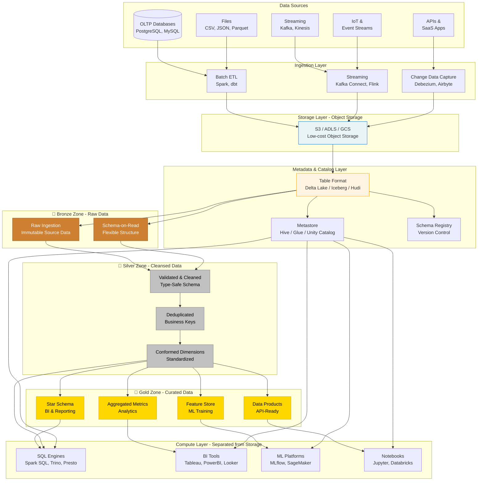

# Lakehouse Architecture

<div class="difficulty-badge difficulty-advanced">Advanced</div>

## Quick Reference

```sql
-- Delta Lake: Create table with ACID transactions
CREATE TABLE delta_customers (
    customer_id STRING,
    customer_name STRING,
    email STRING,
    segment STRING,
    total_lifetime_value DECIMAL(15,2),
    created_at TIMESTAMP,
    updated_at TIMESTAMP
)
USING DELTA
PARTITIONED BY (segment)
LOCATION 's3://lakehouse/customers';

-- Time travel: Query historical data
SELECT * FROM delta_customers
VERSION AS OF 10;  -- Version-based

SELECT * FROM delta_customers
TIMESTAMP AS OF '2024-01-01 00:00:00';  -- Timestamp-based

-- ACID updates and deletes on data lake
UPDATE delta_customers
SET segment = 'Premium'
WHERE total_lifetime_value > 100000;

DELETE FROM delta_customers
WHERE updated_at < CURRENT_DATE - INTERVAL 2 YEARS;

-- MERGE for upserts (SCD Type 1)
MERGE INTO delta_customers AS target
USING staging_customers AS source
ON target.customer_id = source.customer_id
WHEN MATCHED THEN
    UPDATE SET
        customer_name = source.customer_name,
        email = source.email,
        segment = source.segment,
        total_lifetime_value = source.total_lifetime_value,
        updated_at = CURRENT_TIMESTAMP
WHEN NOT MATCHED THEN
    INSERT (customer_id, customer_name, email, segment,
            total_lifetime_value, created_at, updated_at)
    VALUES (source.customer_id, source.customer_name, source.email,
            source.segment, source.total_lifetime_value,
            CURRENT_TIMESTAMP, CURRENT_TIMESTAMP);

-- Apache Iceberg: Create partitioned table
CREATE TABLE iceberg_orders (
    order_id BIGINT,
    customer_id STRING,
    order_date DATE,
    order_total DECIMAL(12,2),
    order_status STRING,
    items ARRAY<STRUCT<product_id: STRING, quantity: INT, price: DECIMAL(10,2)>>
)
USING iceberg
PARTITIONED BY (days(order_date))
LOCATION 's3://lakehouse/orders'
TBLPROPERTIES (
    'write.format.default' = 'parquet',
    'write.parquet.compression-codec' = 'snappy'
);

-- Schema evolution: Add column without rewriting data
ALTER TABLE delta_customers
ADD COLUMN loyalty_tier STRING AFTER segment;

-- Vacuum: Clean up old data files
VACUUM delta_customers RETAIN 168 HOURS;  -- Keep 7 days of history

-- Optimize: Compact small files
OPTIMIZE delta_customers
ZORDER BY (customer_id, created_at);

-- Unified batch and streaming
CREATE TABLE streaming_events (
    event_id STRING,
    event_type STRING,
    event_timestamp TIMESTAMP,
    user_id STRING,
    event_data MAP<STRING, STRING>
)
USING DELTA
LOCATION 's3://lakehouse/events';

-- Streaming write
INSERT INTO streaming_events
SELECT * FROM read_stream('kafka')
WHERE event_timestamp > current_timestamp() - INTERVAL 5 MINUTES;

-- Query with DuckDB (lakehouse interoperability)
SELECT
    segment,
    COUNT(*) as customer_count,
    AVG(total_lifetime_value) as avg_ltv,
    SUM(total_lifetime_value) as total_revenue
FROM delta_scan('s3://lakehouse/customers')
WHERE updated_at >= CURRENT_DATE - INTERVAL 30 DAYS
GROUP BY segment
ORDER BY total_revenue DESC;
```

## Overview

The **Lakehouse Architecture** is a modern data platform design that combines the **flexibility and low-cost storage of data lakes** with the **performance and ACID guarantees of data warehouses**. Pioneered by Databricks and now adopted industry-wide, the lakehouse eliminates the need for separate data lake and warehouse systems by implementing database-like capabilities directly on top of low-cost cloud object storage.

The lakehouse addresses fundamental limitations of traditional two-tier architectures (data lake + data warehouse):

- **Data Duplication**: No need to ETL data from lake to warehouse
- **Data Freshness**: Real-time analytics without batch delays
- **Complexity**: Single platform for all analytics workloads
- **Cost**: Eliminate expensive proprietary warehouse storage
- **Flexibility**: Support for structured, semi-structured, and unstructured data

### Core Technologies

The lakehouse is built on three foundational open-source table formats:

- **Delta Lake** (Databricks): ACID transactions, time travel, schema enforcement
- **Apache Iceberg** (Netflix): Hidden partitioning, schema evolution, snapshot isolation
- **Apache Hudi** (Uber): Incremental processing, record-level updates, streaming ingestion

All three provide:
- **ACID transactions** on object storage (S3, ADLS, GCS)
- **Time travel** and versioning
- **Schema evolution** without downtime
- **Unified batch and streaming**
- **Open file formats** (Parquet, ORC, Avro)



## Core Principles

### 1. ACID Transactions on Object Storage

Unlike traditional data lakes that only support append-only operations, lakehouses provide full ACID (Atomicity, Consistency, Isolation, Durability) guarantees on cloud object storage.

**Delta Lake Transaction Example:**

```sql
-- Delta Lake uses transaction log for ACID guarantees
-- All operations are atomic and isolated

-- Start transaction (implicit)
BEGIN;

-- Multiple operations in single transaction
DELETE FROM orders WHERE order_status = 'CANCELLED';

UPDATE orders
SET order_status = 'SHIPPED',
    shipped_date = CURRENT_DATE
WHERE order_status = 'PROCESSING'
  AND warehouse_id = 'WH-001';

INSERT INTO orders
SELECT * FROM staging_orders
WHERE order_date = CURRENT_DATE;

-- Commit transaction (implicit)
COMMIT;

-- Transaction log structure
-- _delta_log/
--   00000000000000000000.json  -- Initial version
--   00000000000000000001.json  -- Transaction 1
--   00000000000000000002.json  -- Transaction 2
--   00000000000000000010.checkpoint.parquet  -- Checkpoint

-- Examine transaction log
DESCRIBE HISTORY orders;
-- Returns: version, timestamp, operation, operationParameters, etc.
```

**Optimistic Concurrency Control:**

```sql
-- Delta Lake handles concurrent writes using optimistic concurrency

-- Session 1: Update customer segment
UPDATE delta_customers
SET segment = 'Premium'
WHERE total_lifetime_value > 50000;

-- Session 2: Update customer email (concurrent)
UPDATE delta_customers
SET email = LOWER(email)
WHERE customer_id = 'CUST-12345';

-- Delta Lake detects conflicts and retries if needed
-- Uses transaction log to ensure serializability

-- Check for active operations
SHOW LOCKS delta_customers;
```

### 2. Schema Evolution and Enforcement

Lakehouses support both **schema-on-write** (enforcement) and **schema-on-read** (flexibility), with powerful schema evolution capabilities.

**Delta Lake Schema Evolution:**

```sql
-- Create table with initial schema
CREATE TABLE products (
    product_id STRING,
    product_name STRING,
    category STRING,
    price DECIMAL(10,2),
    created_at TIMESTAMP
)
USING DELTA
LOCATION 's3://lakehouse/products';

-- Add column (non-breaking change)
ALTER TABLE products
ADD COLUMN (
    brand STRING,
    weight_kg DECIMAL(8,3),
    dimensions STRING
);

-- Schema evolution during merge
SET spark.databricks.delta.schema.autoMerge.enabled = true;

MERGE INTO products AS target
USING new_products AS source
ON target.product_id = source.product_id
WHEN MATCHED THEN UPDATE SET *
WHEN NOT MATCHED THEN INSERT *;
-- Automatically adds new columns from source

-- Rename column (metadata-only operation)
ALTER TABLE products
RENAME COLUMN weight_kg TO weight_kilograms;

-- Change column comment
ALTER TABLE products
ALTER COLUMN price COMMENT 'Product price in USD';

-- View schema history
DESCRIBE HISTORY products;

-- Enforce schema on write
SET spark.databricks.delta.schema.autoMerge.enabled = false;

-- This will fail if schema doesn't match
INSERT INTO products
SELECT * FROM new_products_with_extra_columns;
-- Error: Schema mismatch
```

**Apache Iceberg Schema Evolution:**

```sql
-- Iceberg supports advanced schema evolution
CREATE TABLE iceberg_events (
    event_id BIGINT,
    event_type STRING,
    event_timestamp TIMESTAMP,
    user_id STRING,
    properties MAP<STRING, STRING>
)
USING iceberg;

-- Add nested column
ALTER TABLE iceberg_events
ADD COLUMN event_metadata STRUCT<
    ip_address: STRING,
    user_agent: STRING,
    session_id: STRING
>;

-- Evolve partition spec (no data rewrite!)
ALTER TABLE iceberg_events
ADD PARTITION FIELD days(event_timestamp);

-- Drop partition field (deprecated old partitioning)
ALTER TABLE iceberg_events
DROP PARTITION FIELD event_type;

-- Column reordering (metadata-only)
ALTER TABLE iceberg_events
ALTER COLUMN user_id AFTER event_type;

-- Type promotion
ALTER TABLE iceberg_events
ALTER COLUMN event_id TYPE BIGINT;  -- INT -> BIGINT (safe)
```

### 3. Time Travel and Versioning

Time travel enables querying historical snapshots of data, essential for debugging, auditing, and compliance.

**Delta Lake Time Travel:**

```sql
-- Query by version number
SELECT * FROM customers
VERSION AS OF 5;

-- Query by timestamp
SELECT * FROM customers
TIMESTAMP AS OF '2024-01-01 00:00:00';

-- Compare current vs. historical
SELECT
    current.customer_id,
    current.segment as current_segment,
    historical.segment as segment_30_days_ago
FROM customers AS current
JOIN (
    SELECT * FROM customers
    TIMESTAMP AS OF current_timestamp() - INTERVAL 30 DAYS
) AS historical
ON current.customer_id = historical.customer_id
WHERE current.segment != historical.segment;

-- View version history
DESCRIBE HISTORY customers;

-- Restore to previous version (rollback)
RESTORE TABLE customers TO VERSION AS OF 10;

-- Restore to timestamp
RESTORE TABLE customers TO TIMESTAMP AS OF '2024-01-01';

-- Clone table at specific version
CREATE TABLE customers_backup
SHALLOW CLONE customers
VERSION AS OF 5;

-- Deep clone (copies data)
CREATE TABLE customers_archive
DEEP CLONE customers
TIMESTAMP AS OF '2023-12-31';
```

**Apache Iceberg Snapshots:**

```sql
-- Iceberg maintains snapshot lineage
-- Query snapshot metadata
SELECT * FROM iceberg_orders.snapshots;

-- Query specific snapshot
SELECT * FROM iceberg_orders
FOR SYSTEM_VERSION AS OF 8234719823947129834;

-- Query as of timestamp
SELECT * FROM iceberg_orders
FOR SYSTEM_TIME AS OF '2024-01-15 10:00:00';

-- Rollback to snapshot
CALL system.rollback_to_snapshot('default.iceberg_orders', 8234719823947129834);

-- Create branch for experimentation
ALTER TABLE iceberg_orders
CREATE BRANCH test_branch;

-- Query branch
SELECT * FROM iceberg_orders.branch_test_branch;

-- Merge branch back
ALTER TABLE iceberg_orders
MERGE BRANCH test_branch;
```

### 4. Partition Evolution and Hidden Partitioning

Traditional partitioning requires users to filter on partition columns. Lakehouse formats enable **hidden partitioning** where the system automatically optimizes queries.

**Delta Lake Z-Ordering:**

```sql
-- Traditional partitioning (explicit)
CREATE TABLE orders_partitioned (
    order_id STRING,
    customer_id STRING,
    order_date DATE,
    order_total DECIMAL(12,2)
)
USING DELTA
PARTITIONED BY (order_date)
LOCATION 's3://lakehouse/orders';

-- Z-Ordering for multi-dimensional clustering
OPTIMIZE orders_partitioned
ZORDER BY (customer_id, order_date);

-- Data skipping with statistics
-- Delta Lake automatically collects min/max stats on all columns
-- Queries skip files based on statistics

SELECT * FROM orders_partitioned
WHERE customer_id = 'CUST-12345'
  AND order_date BETWEEN '2024-01-01' AND '2024-01-31';
-- Skips files that don't contain this customer or date range
```

**Apache Iceberg Hidden Partitioning:**

```sql
-- Iceberg hides partitioning from users
CREATE TABLE iceberg_clicks (
    click_id BIGINT,
    user_id STRING,
    click_timestamp TIMESTAMP,
    url STRING,
    session_id STRING
)
USING iceberg
PARTITIONED BY (hours(click_timestamp))  -- Partition by hour
LOCATION 's3://lakehouse/clicks';

-- Users query without knowing partition structure
SELECT * FROM iceberg_clicks
WHERE click_timestamp >= '2024-01-01 00:00:00'
  AND click_timestamp < '2024-01-02 00:00:00';
-- Automatically uses hourly partitions

-- Evolve partitioning without rewriting data
ALTER TABLE iceberg_clicks
ADD PARTITION FIELD days(click_timestamp);

-- Now partitioned by both hours AND days (for different query patterns)
-- Old data remains in hourly partitions
-- New data uses daily partitions

-- Transform-based partitioning
CREATE TABLE iceberg_users (
    user_id STRING,
    email STRING,
    country STRING,
    registration_date DATE
)
USING iceberg
PARTITIONED BY (
    bucket(16, user_id),     -- Hash partitioning
    truncate(2, country),     -- First 2 chars of country
    years(registration_date)  -- Year partitioning
);
```

### 5. Unified Batch and Streaming

Lakehouses enable the same table to be written to and read from in both batch and streaming modes, eliminating the lambda architecture complexity.

**Delta Lake Streaming:**

```sql
-- Streaming write (continuous ingestion)
CREATE OR REPLACE TEMPORARY VIEW kafka_stream AS
SELECT
    CAST(key AS STRING) as event_id,
    CAST(value AS STRING) as event_data,
    timestamp
FROM read_kafka(
    'kafka.bootstrap.servers' = 'kafka-broker:9092',
    'subscribe' = 'events-topic'
);

-- Write stream to Delta table
INSERT INTO delta_events
SELECT
    event_id,
    get_json_object(event_data, '$.type') as event_type,
    get_json_object(event_data, '$.user_id') as user_id,
    timestamp as event_timestamp
FROM stream(kafka_stream);

-- Batch read (for analytics)
SELECT
    event_type,
    COUNT(*) as event_count,
    COUNT(DISTINCT user_id) as unique_users
FROM delta_events
WHERE event_timestamp >= CURRENT_DATE
GROUP BY event_type;

-- Streaming read (for real-time dashboards)
SELECT * FROM stream(delta_events)
WHERE event_type = 'purchase';

-- Change Data Feed (track changes)
ALTER TABLE delta_customers
SET TBLPROPERTIES (delta.enableChangeDataFeed = true);

-- Read changes as stream
SELECT * FROM table_changes('delta_customers', 0)
WHERE _change_type IN ('update_postimage', 'insert');
```

**Apache Hudi Incremental Processing:**

```sql
-- Hudi optimized for incremental processing
CREATE TABLE hudi_transactions (
    transaction_id STRING,
    customer_id STRING,
    transaction_date TIMESTAMP,
    amount DECIMAL(12,2),
    status STRING
)
USING hudi
TBLPROPERTIES (
    type = 'cow',  -- Copy-on-Write
    primaryKey = 'transaction_id',
    preCombineField = 'transaction_date'
)
PARTITIONED BY (transaction_date)
LOCATION 's3://lakehouse/transactions';

-- Incremental query (only new data since last checkpoint)
SELECT * FROM hudi_transactions
WHERE _hoodie_commit_time > '20240101120000';

-- Merge-on-Read (MOR) for faster writes
CREATE TABLE hudi_events_mor (
    event_id STRING,
    event_type STRING,
    event_timestamp TIMESTAMP,
    event_data STRING
)
USING hudi
TBLPROPERTIES (
    type = 'mor',  -- Merge-on-Read
    primaryKey = 'event_id'
);

-- Compaction for MOR tables
CALL run_compaction(
    table => 'hudi_events_mor',
    compaction_instant_time => '20240101120000'
);
```

## Data Organization Patterns

### Medallion Architecture on Lakehouse

The lakehouse naturally implements the medallion (bronze-silver-gold) pattern with ACID guarantees at each layer.

```sql
-- Bronze Layer: Raw ingestion with schema enforcement
CREATE TABLE bronze_sales_raw (
    raw_id STRING,
    source_system STRING,
    ingestion_timestamp TIMESTAMP,
    raw_data STRING,
    _partition_date DATE
)
USING DELTA
PARTITIONED BY (_partition_date)
LOCATION 's3://lakehouse/bronze/sales';

-- Streaming ingestion to Bronze
COPY INTO bronze_sales_raw
FROM 's3://source-data/sales/'
FILEFORMAT = JSON
PATTERN = '*.json'
FORMAT_OPTIONS ('inferSchema' = 'true');

-- Silver Layer: Cleaned and validated
CREATE TABLE silver_sales (
    sale_id STRING,
    customer_id STRING,
    product_id STRING,
    sale_date DATE,
    quantity INT,
    unit_price DECIMAL(10,2),
    total_amount DECIMAL(12,2),
    sale_status STRING,

    -- Audit columns
    source_system STRING,
    ingestion_timestamp TIMESTAMP,
    processing_timestamp TIMESTAMP,
    data_quality_score DECIMAL(5,2)
)
USING DELTA
PARTITIONED BY (sale_date)
LOCATION 's3://lakehouse/silver/sales';

-- Bronze to Silver transformation with MERGE
MERGE INTO silver_sales AS target
USING (
    SELECT
        get_json_object(raw_data, '$.sale_id') as sale_id,
        get_json_object(raw_data, '$.customer_id') as customer_id,
        get_json_object(raw_data, '$.product_id') as product_id,
        CAST(get_json_object(raw_data, '$.sale_date') AS DATE) as sale_date,
        CAST(get_json_object(raw_data, '$.quantity') AS INT) as quantity,
        CAST(get_json_object(raw_data, '$.unit_price') AS DECIMAL(10,2)) as unit_price,
        CAST(get_json_object(raw_data, '$.total_amount') AS DECIMAL(12,2)) as total_amount,
        get_json_object(raw_data, '$.status') as sale_status,
        source_system,
        ingestion_timestamp,
        CURRENT_TIMESTAMP as processing_timestamp,
        CASE
            WHEN get_json_object(raw_data, '$.sale_id') IS NOT NULL
             AND get_json_object(raw_data, '$.customer_id') IS NOT NULL
             AND CAST(get_json_object(raw_data, '$.total_amount') AS DECIMAL(12,2)) > 0
            THEN 100.0
            ELSE 50.0
        END as data_quality_score
    FROM bronze_sales_raw
    WHERE _partition_date = CURRENT_DATE
) AS source
ON target.sale_id = source.sale_id
WHEN MATCHED AND source.processing_timestamp > target.processing_timestamp THEN
    UPDATE SET *
WHEN NOT MATCHED THEN
    INSERT *;

-- Gold Layer: Business aggregates
CREATE TABLE gold_sales_summary (
    summary_date DATE,
    product_id STRING,
    customer_segment STRING,
    region STRING,

    total_sales_amount DECIMAL(15,2),
    total_quantity INT,
    unique_customers INT,
    average_order_value DECIMAL(12,2),

    calculated_at TIMESTAMP
)
USING DELTA
PARTITIONED BY (summary_date)
LOCATION 's3://lakehouse/gold/sales_summary';

-- Incremental aggregation to Gold
INSERT OVERWRITE gold_sales_summary
SELECT
    s.sale_date as summary_date,
    s.product_id,
    c.segment as customer_segment,
    c.region,

    SUM(s.total_amount) as total_sales_amount,
    SUM(s.quantity) as total_quantity,
    COUNT(DISTINCT s.customer_id) as unique_customers,
    AVG(s.total_amount) as average_order_value,

    CURRENT_TIMESTAMP as calculated_at
FROM silver_sales s
JOIN silver_customers c ON s.customer_id = c.customer_id
WHERE s.sale_date = CURRENT_DATE
GROUP BY s.sale_date, s.product_id, c.segment, c.region;
```

### Data Quality and Constraints

```sql
-- Delta Lake: Constraints and checks
CREATE TABLE constrained_customers (
    customer_id STRING,
    email STRING,
    age INT,
    registration_date DATE,
    status STRING
)
USING DELTA;

-- Add CHECK constraints
ALTER TABLE constrained_customers
ADD CONSTRAINT valid_email CHECK (email LIKE '%@%.%');

ALTER TABLE constrained_customers
ADD CONSTRAINT valid_age CHECK (age >= 18 AND age <= 120);

ALTER TABLE constrained_customers
ADD CONSTRAINT valid_status CHECK (status IN ('active', 'inactive', 'suspended'));

-- NOT NULL constraints
ALTER TABLE constrained_customers
ALTER COLUMN customer_id SET NOT NULL;

-- Expectations (Great Expectations integration)
CREATE TABLE customers_with_expectations (
    customer_id STRING,
    email STRING,
    created_at TIMESTAMP
)
USING DELTA
TBLPROPERTIES (
    'delta.constraints.validEmail' = 'email IS NOT NULL AND email RLIKE "^[a-zA-Z0-9._%+-]+@[a-zA-Z0-9.-]+\\.[a-zA-Z]{2,}$"',
    'delta.constraints.recentCreation' = 'created_at >= "2020-01-01"'
);

-- Data quality monitoring
CREATE TABLE data_quality_metrics (
    table_name STRING,
    check_date DATE,
    metric_name STRING,
    metric_value DECIMAL(10,2),
    threshold DECIMAL(10,2),
    passed BOOLEAN
)
USING DELTA;

INSERT INTO data_quality_metrics
SELECT
    'silver_sales' as table_name,
    CURRENT_DATE as check_date,
    'completeness_customer_id' as metric_name,
    COUNT(CASE WHEN customer_id IS NOT NULL THEN 1 END) * 100.0 / COUNT(*) as metric_value,
    99.0 as threshold,
    COUNT(CASE WHEN customer_id IS NOT NULL THEN 1 END) * 100.0 / COUNT(*) >= 99.0 as passed
FROM silver_sales
WHERE sale_date = CURRENT_DATE;
```

## Performance Optimization

### File Compaction and Optimization

```sql
-- Small file problem: Many small files hurt performance
-- Before optimization
SELECT COUNT(*) FROM describe_detail('delta_events');
-- Result: 10,000 files, average size 100KB

-- OPTIMIZE: Compact small files into larger ones
OPTIMIZE delta_events;

-- After optimization
SELECT COUNT(*) FROM describe_detail('delta_events');
-- Result: 100 files, average size 10MB

-- Z-Ordering for multi-dimensional clustering
OPTIMIZE delta_events
ZORDER BY (user_id, event_date);

-- Bin-packing optimization (target file size)
OPTIMIZE delta_events
WHERE event_date >= '2024-01-01'
TBLPROPERTIES ('delta.targetFileSize' = '134217728');  -- 128MB

-- Auto-optimize (automatically compact on write)
ALTER TABLE delta_events
SET TBLPROPERTIES (
    'delta.autoOptimize.optimizeWrite' = 'true',
    'delta.autoOptimize.autoCompact' = 'true'
);

-- Vacuum: Remove old data files (for time travel)
-- Default retention: 7 days
VACUUM delta_events;

-- Custom retention
VACUUM delta_events RETAIN 168 HOURS;  -- 7 days

-- Dry run to see what would be deleted
VACUUM delta_events DRY RUN;
```

### Caching and Materialized Views

```sql
-- Delta Lake caching
CACHE SELECT * FROM delta_customers
WHERE segment = 'Premium';

-- Materialized views (pre-aggregated)
CREATE MATERIALIZED VIEW mv_daily_revenue
AS
SELECT
    sale_date,
    product_category,
    SUM(total_amount) as total_revenue,
    COUNT(DISTINCT customer_id) as unique_customers
FROM silver_sales
GROUP BY sale_date, product_category;

-- Refresh materialized view
REFRESH MATERIALIZED VIEW mv_daily_revenue;

-- Incremental refresh
REFRESH MATERIALIZED VIEW mv_daily_revenue
WHERE sale_date >= CURRENT_DATE - INTERVAL 7 DAYS;

-- DuckDB: Query parquet files directly with caching
SELECT
    product_category,
    SUM(total_amount) as revenue
FROM parquet_scan('s3://lakehouse/silver/sales/**/*.parquet')
WHERE sale_date >= CURRENT_DATE - INTERVAL 30 DAYS
GROUP BY product_category;
```

### Partition Pruning and Data Skipping

```sql
-- Iceberg: Partition pruning statistics
SELECT * FROM iceberg_events.partitions;

-- Shows partition-level statistics
-- partition_value, record_count, file_count,
-- total_data_file_size_in_bytes, position_delete_record_count

-- Query with partition pruning
SELECT *
FROM iceberg_events
WHERE event_date = '2024-01-01'  -- Scans only 1 partition
  AND event_type = 'click';      -- Uses column statistics

-- Delta Lake: Data skipping with column statistics
-- Automatically collects min/max for first 32 columns
SET spark.databricks.delta.properties.defaults.dataSkippingNumIndexedCols = 50;

-- Force statistics collection
ANALYZE TABLE delta_customers
COMPUTE STATISTICS FOR ALL COLUMNS;

-- Query uses statistics to skip files
SELECT * FROM delta_customers
WHERE created_at BETWEEN '2024-01-01' AND '2024-01-31'
  AND total_lifetime_value > 10000;
-- Skips files where max(created_at) < '2024-01-01'
-- or min(total_lifetime_value) > 10000
```

## Advanced Patterns

### Slowly Changing Dimensions (SCD Type 2)

```sql
-- SCD Type 2 with Delta Lake MERGE
CREATE TABLE dim_product_scd (
    product_key BIGINT GENERATED ALWAYS AS IDENTITY,
    product_id STRING,
    product_name STRING,
    category STRING,
    price DECIMAL(10,2),

    -- SCD Type 2 columns
    effective_date DATE,
    end_date DATE,
    is_current BOOLEAN,

    -- Audit
    updated_at TIMESTAMP
)
USING DELTA;

-- SCD Type 2 merge logic
MERGE INTO dim_product_scd AS target
USING (
    SELECT
        product_id,
        product_name,
        category,
        price,
        CURRENT_DATE as effective_date,
        NULL as end_date,
        true as is_current,
        CURRENT_TIMESTAMP as updated_at
    FROM staging_products
) AS source
ON target.product_id = source.product_id
   AND target.is_current = true
-- When product attributes changed
WHEN MATCHED AND (
    target.product_name != source.product_name OR
    target.category != source.category OR
    target.price != source.price
) THEN UPDATE SET
    is_current = false,
    end_date = CURRENT_DATE - INTERVAL 1 DAY,
    updated_at = CURRENT_TIMESTAMP
-- Insert new version
WHEN NOT MATCHED BY SOURCE AND target.is_current = true THEN
    INSERT (product_id, product_name, category, price,
            effective_date, end_date, is_current, updated_at)
    VALUES (target.product_id, source.product_name, source.category, source.price,
            CURRENT_DATE, NULL, true, CURRENT_TIMESTAMP);

-- Also insert unchanged products
INSERT INTO dim_product_scd
SELECT
    NULL as product_key,
    product_id,
    product_name,
    category,
    price,
    CURRENT_DATE as effective_date,
    NULL as end_date,
    true as is_current,
    CURRENT_TIMESTAMP as updated_at
FROM staging_products s
WHERE NOT EXISTS (
    SELECT 1 FROM dim_product_scd d
    WHERE d.product_id = s.product_id
);
```

### Change Data Capture (CDC)

```sql
-- Enable Change Data Feed in Delta Lake
ALTER TABLE silver_customers
SET TBLPROPERTIES (delta.enableChangeDataFeed = true);

-- Read changes between versions
SELECT *
FROM table_changes('silver_customers', 0, 10)
ORDER BY _commit_version;

-- Returns: _change_type, _commit_version, _commit_timestamp, + all columns
-- _change_type: insert, update_preimage, update_postimage, delete

-- Stream changes to downstream
CREATE OR REPLACE TEMPORARY VIEW customer_changes AS
SELECT
    customer_id,
    customer_name,
    email,
    _change_type,
    _commit_timestamp
FROM table_changes('silver_customers', 0);

-- Process only inserts and updates
SELECT *
FROM customer_changes
WHERE _change_type IN ('insert', 'update_postimage');

-- CDC with Apache Hudi
CREATE TABLE hudi_cdc_customers (
    customer_id STRING,
    customer_name STRING,
    email STRING,
    updated_at TIMESTAMP
)
USING hudi
TBLPROPERTIES (
    hoodie.table.type = 'MERGE_ON_READ',
    hoodie.datasource.write.recordkey.field = 'customer_id',
    hoodie.datasource.write.precombine.field = 'updated_at',
    hoodie.datasource.write.operation = 'upsert'
);

-- Incremental query
SELECT *
FROM hudi_cdc_customers
WHERE _hoodie_commit_time > '20240101000000';
```

### Data Versioning and Branching

```sql
-- Iceberg: Create development branch
ALTER TABLE iceberg_products
CREATE BRANCH dev_branch
AS OF VERSION 5
RETAIN 7 DAYS;

-- Work on branch (isolated from main)
INSERT INTO iceberg_products.branch_dev_branch
VALUES (1001, 'New Product', 'Electronics', 299.99);

-- Query branch
SELECT * FROM iceberg_products.branch_dev_branch;

-- Compare branches
SELECT
    main.*,
    dev.product_name as dev_product_name,
    dev.price as dev_price
FROM iceberg_products AS main
FULL OUTER JOIN iceberg_products.branch_dev_branch AS dev
    ON main.product_id = dev.product_id
WHERE main.product_id != dev.product_id
   OR main.price != dev.price;

-- Merge branch to main
ALTER TABLE iceberg_products
MERGE BRANCH dev_branch INTO main;

-- Create tags for releases
ALTER TABLE iceberg_products
CREATE TAG v1_0_release
AS OF VERSION 10
RETAIN 365 DAYS;

-- Query tagged version
SELECT * FROM iceberg_products.tag_v1_0_release;
```

## Query Federation and Interoperability

### Cross-Engine Compatibility

```sql
-- DuckDB: Query Delta Lake tables
INSTALL delta;
LOAD delta;

SELECT
    customer_segment,
    COUNT(*) as customer_count,
    AVG(lifetime_value) as avg_ltv
FROM delta_scan('s3://lakehouse/customers/_delta_log')
GROUP BY customer_segment;

-- Trino/Presto: Query Iceberg tables
SELECT
    order_date,
    COUNT(*) as order_count,
    SUM(order_total) as total_revenue
FROM iceberg.lakehouse.orders
WHERE order_date >= DATE '2024-01-01'
GROUP BY order_date
ORDER BY order_date;

-- Spark: Query mixed formats
SELECT
    d.customer_id,
    d.customer_name,
    i.order_count,
    h.last_transaction_date
FROM delta.`s3://lakehouse/customers` d
JOIN iceberg.lakehouse.orders_summary i
    ON d.customer_id = i.customer_id
JOIN hudi.lakehouse.transactions h
    ON d.customer_id = h.customer_id;

-- Apache Arrow Flight SQL: Fast columnar transfer
-- Query lakehouse with Arrow-native performance
SELECT * FROM arrow_scan('s3://lakehouse/parquet/sales/*.parquet')
WHERE sale_date >= CURRENT_DATE - INTERVAL 7 DAYS;
```

## Benefits

### 1. Reduced Data Duplication and Cost

Eliminate separate data lake and warehouse infrastructure.

```sql
-- Traditional: Data duplicated across lake and warehouse
-- Data Lake (S3): 100TB @ $0.023/GB = $2,300/month
-- Data Warehouse (Snowflake): 100TB @ $40/TB = $4,000/month
-- Total: $6,300/month

-- Lakehouse: Single copy on object storage
-- Object Storage (S3): 100TB @ $0.023/GB = $2,300/month
-- Compute (on-demand): Pay only when running queries
-- Total: $2,300/month + compute costs
-- Savings: ~65% reduction

-- Query cost comparison
-- Warehouse: Fixed compute costs
-- Lakehouse: Compute autoscaling
SELECT
    product_category,
    SUM(sales_amount) as total_sales
FROM delta_sales
WHERE sale_date >= CURRENT_DATE - INTERVAL 30 DAYS
GROUP BY product_category;
-- Compute spins up, runs query, shuts down
```

### 2. Real-Time Analytics Without Lambda Architecture

Single platform for batch and streaming eliminates dual-pipeline complexity.

```sql
-- Streaming write
CREATE STREAMING LIVE TABLE streaming_analytics AS
SELECT
    window(event_timestamp, '5 minutes') as time_window,
    event_type,
    COUNT(*) as event_count,
    COUNT(DISTINCT user_id) as unique_users
FROM stream(delta_events)
GROUP BY window(event_timestamp, '5 minutes'), event_type;

-- Batch read (same table)
SELECT
    DATE(event_timestamp) as event_date,
    event_type,
    COUNT(*) as daily_count
FROM delta_events
WHERE event_timestamp >= CURRENT_DATE - INTERVAL 7 DAYS
GROUP BY DATE(event_timestamp), event_type;

-- No separate streaming pipeline needed!
```

### 3. Schema Flexibility with Governance

Support schema evolution while maintaining data quality.

```sql
-- Add new columns without downtime
ALTER TABLE products
ADD COLUMN sustainability_rating STRING;

-- Existing queries continue to work
SELECT product_id, product_name, price
FROM products;

-- New queries use new column
SELECT product_id, sustainability_rating
FROM products
WHERE sustainability_rating = 'A+';

-- Schema enforcement prevents bad data
ALTER TABLE products
ADD CONSTRAINT valid_rating
CHECK (sustainability_rating IN ('A+', 'A', 'B', 'C', 'D', NULL));
```

### 4. Simplified Architecture and Operations

```sql
-- Traditional: Separate ETL pipelines
-- Lake ingestion -> Lake storage -> ETL to warehouse -> Warehouse queries

-- Lakehouse: Direct ingestion and querying
-- Ingestion -> Delta/Iceberg table -> Direct queries

-- Monitoring single platform
DESCRIBE HISTORY delta_customers;

-- Data quality in one place
SELECT
    table_name,
    COUNT(*) as total_records,
    SUM(CASE WHEN data_quality_score >= 90 THEN 1 ELSE 0 END) as high_quality_records
FROM (
    SELECT 'customers' as table_name, data_quality_score FROM delta_customers
    UNION ALL
    SELECT 'orders' as table_name, data_quality_score FROM delta_orders
    UNION ALL
    SELECT 'products' as table_name, data_quality_score FROM delta_products
)
GROUP BY table_name;
```

### 5. Open Standards and No Vendor Lock-in

```sql
-- Use any engine with same data
-- Spark
SELECT * FROM delta.`s3://lakehouse/table`;

-- Trino
SELECT * FROM delta.lakehouse.table;

-- DuckDB
SELECT * FROM delta_scan('s3://lakehouse/table');

-- Presto
SELECT * FROM delta.lakehouse.table;

-- Switch vendors without data migration
-- Data stays in S3/ADLS/GCS
-- Just point new engine to same location
```

## Challenges & Considerations

### 1. Small File Problem

Object storage performs poorly with many small files.

```sql
-- Problem: Streaming creates many small files
-- 1000 files x 1MB = 1GB data across 1000 objects
-- LIST operations slow, query planning expensive

-- Solution: Auto-optimize
ALTER TABLE delta_streaming_events
SET TBLPROPERTIES (
    'delta.autoOptimize.optimizeWrite' = 'true',
    'delta.autoOptimize.autoCompact' = 'true'
);

-- Manual compaction
OPTIMIZE delta_streaming_events;

-- Scheduled compaction
CREATE JOB compact_tables
SCHEDULE CRON '0 2 * * *'  -- 2 AM daily
AS
OPTIMIZE delta_customers;
OPTIMIZE delta_orders;
OPTIMIZE delta_events;
```

### 2. Query Performance vs. Traditional Warehouses

Object storage has higher latency than local SSD.

```sql
-- Lakehouse optimization strategies

-- 1. Partition pruning
CREATE TABLE partitioned_sales (
    sale_id STRING,
    sale_date DATE,
    amount DECIMAL(12,2)
)
USING DELTA
PARTITIONED BY (sale_date);

-- 2. Z-Ordering
OPTIMIZE partitioned_sales
ZORDER BY (customer_id, product_id);

-- 3. Caching
CACHE SELECT * FROM dim_customers;

-- 4. Materialized views
CREATE MATERIALIZED VIEW mv_sales_summary AS
SELECT
    DATE_TRUNC('day', sale_date) as day,
    SUM(amount) as daily_revenue
FROM partitioned_sales
GROUP BY DATE_TRUNC('day', sale_date);

-- 5. Query pushdown
SELECT * FROM delta_sales
WHERE sale_date = '2024-01-01'  -- Partition pruning
  AND customer_id = 'CUST-123'  -- Data skipping
  AND amount > 1000;             -- Filter pushdown
```

### 3. Consistency and Isolation Challenges

Multiple writers can cause conflicts.

```sql
-- Optimistic concurrency conflicts
-- Session 1
UPDATE delta_customers SET segment = 'Premium'
WHERE customer_id = 'CUST-123';

-- Session 2 (concurrent)
UPDATE delta_customers SET email = 'new@email.com'
WHERE customer_id = 'CUST-123';

-- One transaction will retry
-- Configure retry behavior
SET spark.databricks.delta.write.txnAppId = 'unique-app-id';
SET spark.databricks.delta.write.txnVersion = 1;

-- Use MERGE for safer upserts
MERGE INTO delta_customers AS target
USING updates AS source
ON target.customer_id = source.customer_id
WHEN MATCHED THEN UPDATE SET *
WHEN NOT MATCHED THEN INSERT *;
```

### 4. Metadata Management Overhead

Large tables generate significant metadata.

```sql
-- Problem: 1M files = large transaction log
-- Checkpoint every 10 commits to compact log

-- Check transaction log size
SELECT
    COUNT(*) as log_entries,
    MAX(version) as current_version
FROM describe_history('delta_large_table');

-- Create checkpoint manually
VACUUM delta_large_table RETAIN 0 HOURS;

-- Configure checkpoint interval
ALTER TABLE delta_large_table
SET TBLPROPERTIES ('delta.checkpointInterval' = 10);

-- Iceberg: Metadata tables
SELECT * FROM iceberg_table.snapshots;
SELECT * FROM iceberg_table.files;
SELECT * FROM iceberg_table.manifests;

-- Clean up old metadata
CALL system.expire_snapshots(
    table => 'iceberg_table',
    older_than => TIMESTAMP '2024-01-01 00:00:00',
    retain_last => 5
);
```

### 5. Learning Curve and Tooling Maturity

New concepts and evolving ecosystem.

```sql
-- Traditional SQL (familiar)
CREATE TABLE customers (id INT, name VARCHAR(100));
INSERT INTO customers VALUES (1, 'John');
UPDATE customers SET name = 'Jane' WHERE id = 1;

-- Lakehouse SQL (new concepts)
CREATE TABLE delta_customers (...) USING DELTA;
OPTIMIZE delta_customers ZORDER BY (id);
VACUUM delta_customers RETAIN 168 HOURS;
MERGE INTO delta_customers ...;

-- Solution: Abstraction layers
-- Create views that hide complexity
CREATE VIEW v_customers AS
SELECT * FROM delta_customers
VERSION AS OF (
    SELECT MAX(version) FROM describe_history('delta_customers')
);

-- Users query simple view
SELECT * FROM v_customers;
```

## Best Practices

### 1. Choose Right Table Format

```sql
-- Delta Lake: Best for
-- - Databricks ecosystem
-- - ACID guarantees priority
-- - Strong schema enforcement
CREATE TABLE delta_transactions USING DELTA;

-- Apache Iceberg: Best for
-- - Multi-engine access (Trino, Flink, Spark)
-- - Hidden partitioning
-- - Partition evolution
CREATE TABLE iceberg_events USING ICEBERG;

-- Apache Hudi: Best for
-- - Incremental processing
-- - Record-level updates
-- - Streaming-first workloads
CREATE TABLE hudi_changes USING HUDI
TBLPROPERTIES (type = 'mor');
```

### 2. Implement Proper Partitioning

```sql
-- Good: Partition by high-cardinality, query-relevant column
CREATE TABLE good_partitioning (
    event_id BIGINT,
    event_date DATE,
    user_id STRING
)
USING DELTA
PARTITIONED BY (event_date);  -- Typical queries filter by date

-- Bad: Over-partitioning
CREATE TABLE bad_partitioning (
    event_id BIGINT,
    event_date DATE,
    user_id STRING
)
USING DELTA
PARTITIONED BY (event_date, HOUR(event_timestamp), user_id);
-- Too many small partitions (1000s of directories)

-- Good: Z-ordering for secondary access patterns
OPTIMIZE good_partitioning
ZORDER BY (user_id);
```

### 3. Regular Maintenance Operations

```sql
-- Schedule maintenance job
CREATE PROCEDURE maintain_lakehouse()
AS
BEGIN
    -- Optimize: Compact small files
    OPTIMIZE delta_customers;
    OPTIMIZE delta_orders;
    OPTIMIZE delta_events;

    -- Vacuum: Clean old files
    VACUUM delta_customers RETAIN 168 HOURS;
    VACUUM delta_orders RETAIN 168 HOURS;

    -- Analyze: Update statistics
    ANALYZE TABLE delta_customers COMPUTE STATISTICS FOR ALL COLUMNS;

    -- Check data quality
    INSERT INTO data_quality_log
    SELECT
        CURRENT_TIMESTAMP,
        'delta_customers',
        COUNT(*) as row_count,
        COUNT(CASE WHEN customer_id IS NULL THEN 1 END) as null_keys
    FROM delta_customers;
END;

-- Schedule weekly
CREATE JOB weekly_maintenance
SCHEDULE CRON '0 2 * * 0'  -- Sundays at 2 AM
AS CALL maintain_lakehouse();
```

### 4. Implement Data Quality Checks

```sql
-- Great Expectations pattern
CREATE OR REPLACE FUNCTION check_data_quality()
RETURNS TABLE (
    check_name STRING,
    passed BOOLEAN,
    failure_count BIGINT
)
AS
BEGIN
    -- Completeness check
    RETURN QUERY
    SELECT
        'customer_id_not_null',
        COUNT(CASE WHEN customer_id IS NULL THEN 1 END) = 0,
        COUNT(CASE WHEN customer_id IS NULL THEN 1 END)
    FROM delta_customers;

    -- Validity check
    RETURN QUERY
    SELECT
        'email_format_valid',
        COUNT(CASE WHEN email NOT LIKE '%@%.%' THEN 1 END) = 0,
        COUNT(CASE WHEN email NOT LIKE '%@%.%' THEN 1 END)
    FROM delta_customers
    WHERE email IS NOT NULL;

    -- Consistency check
    RETURN QUERY
    SELECT
        'no_orphaned_orders',
        NOT EXISTS (
            SELECT 1 FROM delta_orders o
            LEFT JOIN delta_customers c ON o.customer_id = c.customer_id
            WHERE c.customer_id IS NULL
        ),
        COUNT(*)
    FROM delta_orders o
    LEFT JOIN delta_customers c ON o.customer_id = c.customer_id
    WHERE c.customer_id IS NULL;
END;

-- Run checks before promoting to Gold
INSERT INTO data_quality_results
SELECT * FROM check_data_quality();
```

### 5. Version Control and Governance

```sql
-- Track schema changes
CREATE TABLE schema_changes_audit (
    table_name STRING,
    change_date TIMESTAMP,
    change_type STRING,
    change_description STRING,
    changed_by STRING,
    schema_version INT
)
USING DELTA;

-- Trigger on DDL operations
CREATE TRIGGER audit_schema_changes
AFTER ALTER TABLE ON delta_customers
AS
INSERT INTO schema_changes_audit
VALUES (
    'delta_customers',
    CURRENT_TIMESTAMP,
    'ALTER_TABLE',
    'Added column: loyalty_tier',
    CURRENT_USER,
    (SELECT MAX(version) FROM describe_history('delta_customers'))
);

-- Tag stable versions
-- (Iceberg-specific)
ALTER TABLE iceberg_products
CREATE TAG production_v2_0
AS OF VERSION 42
RETAIN 365 DAYS;
```

## Lakehouse vs. Other Architectures

| Aspect | Lakehouse | Data Warehouse | Data Lake | Medallion (on Lakehouse) |
|--------|-----------|----------------|-----------|--------------------------|
| **Storage** | Object storage (S3/ADLS/GCS) | Proprietary storage | Object storage | Object storage |
| **Format** | Open (Parquet + metadata) | Proprietary | Open files (any format) | Parquet + Delta/Iceberg |
| **ACID** | Yes (Delta/Iceberg/Hudi) | Yes | No | Yes |
| **Schema** | Enforced + evolution | Enforced | Schema-on-read | Progressive (Bronze→Gold) |
| **Performance** | Good (with optimization) | Excellent | Poor-to-Good | Good-to-Excellent |
| **Cost** | Low (object storage) | High (compute + storage) | Very Low | Low |
| **BI Tools** | Good (with connectors) | Excellent (native) | Poor | Excellent (Gold layer) |
| **ML Workloads** | Excellent | Limited | Excellent | Excellent (all layers) |
| **Streaming** | Native (unified) | Limited (external) | Good (landing zone) | Native (all layers) |
| **Governance** | Good (improving) | Excellent | Poor | Good |
| **Vendor Lock-in** | None (open formats) | High | None | None |

## See Also

- [Medallion Architecture](/architectures/medallion/) - Bronze-Silver-Gold pattern for lakehouses
- [Data Vault Architecture](/architectures/data-vault/) - Hub-Link-Satellite for enterprise data
- [Kimball Data Warehouse Architecture](/architectures/kimball/) - Dimensional modeling approach
- [ETL Patterns](/patterns/etl/) - Extract, Transform, Load best practices
- [Data Quality Patterns](/patterns/data-quality/) - Ensuring data quality in lakehouses
