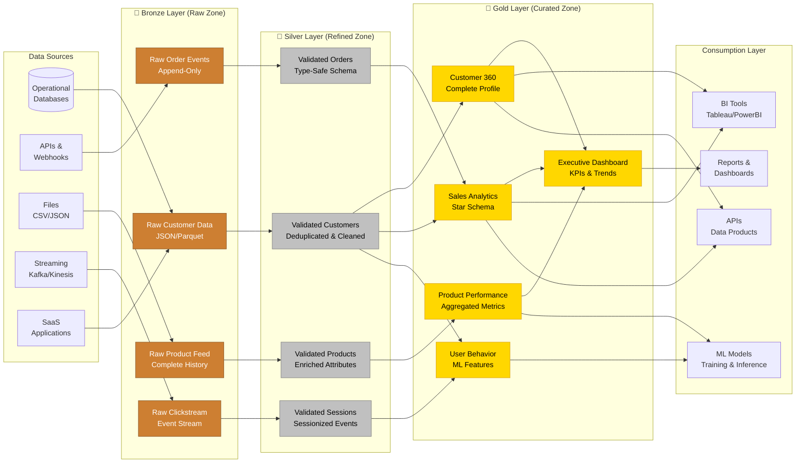
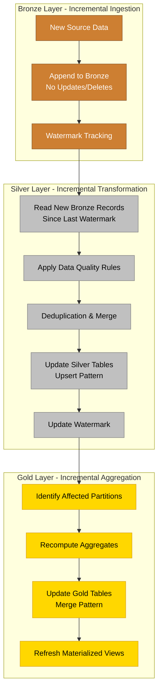
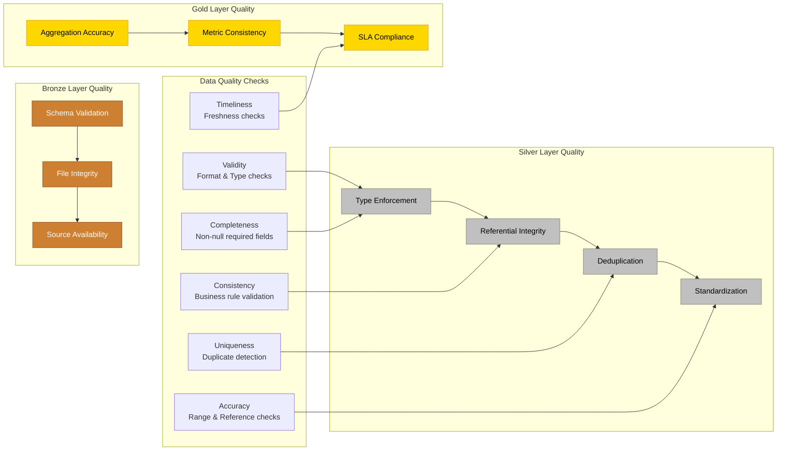

# Medallion Architecture

<div class="difficulty-badge difficulty-advanced">Advanced</div>

## Quick Reference

```sql
-- Bronze Layer: Raw data ingestion (append-only)
CREATE TABLE bronze_customer_events (
    event_id BIGSERIAL PRIMARY KEY,
    event_timestamp TIMESTAMP NOT NULL,
    event_type VARCHAR(50),
    source_system VARCHAR(100),
    raw_payload JSONB,
    ingestion_timestamp TIMESTAMP DEFAULT CURRENT_TIMESTAMP,
    file_name VARCHAR(500),
    file_row_number BIGINT
);

-- Silver Layer: Cleaned and validated data
CREATE TABLE silver_customers (
    customer_id VARCHAR(50) PRIMARY KEY,
    customer_name VARCHAR(200),
    email VARCHAR(200),
    phone VARCHAR(50),
    address VARCHAR(200),
    city VARCHAR(100),
    state VARCHAR(50),
    postal_code VARCHAR(20),
    country VARCHAR(50),
    segment VARCHAR(50),

    -- Audit columns
    valid_from TIMESTAMP NOT NULL,
    valid_to TIMESTAMP,
    is_current BOOLEAN DEFAULT true,
    created_at TIMESTAMP DEFAULT CURRENT_TIMESTAMP,
    updated_at TIMESTAMP DEFAULT CURRENT_TIMESTAMP,
    source_system VARCHAR(100),
    data_quality_score DECIMAL(5,2)
);

-- Gold Layer: Business-level aggregates and curated datasets
CREATE TABLE gold_customer_lifetime_value (
    customer_id VARCHAR(50) PRIMARY KEY,
    segment VARCHAR(50),
    first_purchase_date DATE,
    last_purchase_date DATE,
    total_orders INTEGER,
    total_revenue DECIMAL(12,2),
    total_profit DECIMAL(12,2),
    average_order_value DECIMAL(10,2),
    lifetime_value DECIMAL(12,2),
    customer_tenure_days INTEGER,
    churn_risk_score DECIMAL(5,2),
    preferred_category VARCHAR(100),

    -- Metadata
    calculated_at TIMESTAMP DEFAULT CURRENT_TIMESTAMP,
    calculation_version VARCHAR(20)
);

-- Query pattern: Bronze to Silver transformation
INSERT INTO silver_customers (
    customer_id, customer_name, email, phone,
    address, city, state, postal_code, country, segment,
    valid_from, source_system
)
SELECT DISTINCT ON (raw_payload->>'customer_id')
    raw_payload->>'customer_id' as customer_id,
    TRIM(raw_payload->>'name') as customer_name,
    LOWER(TRIM(raw_payload->>'email')) as email,
    regexp_replace(raw_payload->>'phone', '[^0-9]', '', 'g') as phone,
    raw_payload->>'address' as address,
    raw_payload->>'city' as city,
    raw_payload->>'state' as state,
    raw_payload->>'postal_code' as postal_code,
    COALESCE(raw_payload->>'country', 'USA') as country,
    raw_payload->>'segment' as segment,
    event_timestamp as valid_from,
    source_system
FROM bronze_customer_events
WHERE event_type = 'customer_created'
  AND raw_payload IS NOT NULL
  AND raw_payload->>'customer_id' IS NOT NULL
ORDER BY raw_payload->>'customer_id', event_timestamp DESC
ON CONFLICT (customer_id) DO UPDATE
SET customer_name = EXCLUDED.customer_name,
    email = EXCLUDED.email,
    updated_at = CURRENT_TIMESTAMP;

-- Query pattern: Silver to Gold aggregation
INSERT INTO gold_customer_lifetime_value
SELECT
    c.customer_id,
    c.segment,
    MIN(o.order_date) as first_purchase_date,
    MAX(o.order_date) as last_purchase_date,
    COUNT(DISTINCT o.order_id) as total_orders,
    SUM(o.total_amount) as total_revenue,
    SUM(o.profit_amount) as total_profit,
    AVG(o.total_amount) as average_order_value,
    SUM(o.total_amount) * 1.2 as lifetime_value,  -- Simple LTV calculation
    CURRENT_DATE - MIN(o.order_date) as customer_tenure_days,
    CASE
        WHEN MAX(o.order_date) < CURRENT_DATE - 90 THEN 0.8
        WHEN MAX(o.order_date) < CURRENT_DATE - 60 THEN 0.5
        ELSE 0.1
    END as churn_risk_score,
    MODE() WITHIN GROUP (ORDER BY p.category) as preferred_category,
    CURRENT_TIMESTAMP as calculated_at,
    'v1.0' as calculation_version
FROM silver_customers c
JOIN silver_orders o ON c.customer_id = o.customer_id
JOIN silver_order_items oi ON o.order_id = oi.order_id
JOIN silver_products p ON oi.product_id = p.product_id
WHERE c.is_current = true
GROUP BY c.customer_id, c.segment
ON CONFLICT (customer_id) DO UPDATE
SET total_orders = EXCLUDED.total_orders,
    total_revenue = EXCLUDED.total_revenue,
    last_purchase_date = EXCLUDED.last_purchase_date,
    calculated_at = CURRENT_TIMESTAMP;
```

## Overview

The **Medallion Architecture** (also known as **Bronze-Silver-Gold** or **Multi-Hop Architecture**) is a data design pattern used in modern data lakehouses to organize data in a progressive manner through multiple layers of refinement. This pattern was popularized by **Databricks** for use with Delta Lake and has become a standard approach for building robust, scalable data platforms.

The architecture progressively improves data quality and structure through three distinct layers:

- **Bronze Layer** (Raw): Ingests raw data from source systems in its original format with minimal transformation, preserving complete data lineage
- **Silver Layer** (Refined): Cleanses, validates, and standardizes data, applying business rules and deduplication
- **Gold Layer** (Curated): Aggregates and enriches data into business-level datasets optimized for analytics and reporting

This multi-tiered approach provides **incremental ETL**, **data quality gates**, **schema evolution**, and **reprocessing capabilities** while maintaining a clear separation of concerns between raw data preservation and business logic.



## Core Principles

### 1. Bronze Layer - Raw Data Preservation

The Bronze layer serves as the **landing zone** for all source data. Data is ingested in its original format with minimal transformation, creating an **immutable audit trail**.

**Characteristics:**
- **Append-only**: Never delete or update existing records
- **Schema-on-read**: Store data as-is (JSON, CSV, Parquet, etc.)
- **Complete lineage**: Track source system, file name, ingestion time
- **No business logic**: Preserve exactly what was received
- **Batch and streaming**: Support both ingestion patterns

```sql
-- Bronze table structure: Raw ingestion
CREATE TABLE bronze_orders_raw (
    -- Unique identifier
    bronze_id BIGSERIAL PRIMARY KEY,

    -- Raw data payload
    raw_data JSONB NOT NULL,

    -- Source tracking
    source_system VARCHAR(100) NOT NULL,
    source_file VARCHAR(500),
    source_row_number BIGINT,

    -- Ingestion metadata
    ingestion_timestamp TIMESTAMP DEFAULT CURRENT_TIMESTAMP,
    ingestion_batch_id VARCHAR(100),
    ingestion_method VARCHAR(50), -- 'batch', 'streaming', 'api'

    -- Data lineage
    source_timestamp TIMESTAMP,
    source_checksum VARCHAR(64)
);

-- Create index for efficient querying
CREATE INDEX idx_bronze_orders_ingestion
ON bronze_orders_raw(ingestion_timestamp);

CREATE INDEX idx_bronze_orders_source
ON bronze_orders_raw(source_system, ingestion_batch_id);

-- Insert raw data (example: batch ingestion from CSV)
INSERT INTO bronze_orders_raw (
    raw_data,
    source_system,
    source_file,
    source_row_number,
    ingestion_batch_id,
    ingestion_method,
    source_timestamp
)
SELECT
    row_to_json(staging_orders)::jsonb as raw_data,
    'ERP_SYSTEM' as source_system,
    'orders_20241120.csv' as source_file,
    row_number() OVER () as source_row_number,
    'batch_20241120_001' as ingestion_batch_id,
    'batch' as ingestion_method,
    CURRENT_TIMESTAMP as source_timestamp
FROM staging_orders;

-- Streaming ingestion pattern (Kafka, Kinesis, etc.)
CREATE TABLE bronze_events_stream (
    event_id BIGSERIAL PRIMARY KEY,
    event_type VARCHAR(100),
    event_payload JSONB,
    event_timestamp TIMESTAMP,
    partition_key VARCHAR(100),
    offset_position BIGINT,
    ingestion_timestamp TIMESTAMP DEFAULT CURRENT_TIMESTAMP
);

-- Partition by ingestion date for efficient querying
CREATE TABLE bronze_orders_partitioned (
    bronze_id BIGSERIAL,
    raw_data JSONB,
    source_system VARCHAR(100),
    ingestion_timestamp TIMESTAMP DEFAULT CURRENT_TIMESTAMP
) PARTITION BY RANGE (ingestion_timestamp);

-- Create monthly partitions
CREATE TABLE bronze_orders_202401
PARTITION OF bronze_orders_partitioned
FOR VALUES FROM ('2024-01-01') TO ('2024-02-01');

CREATE TABLE bronze_orders_202402
PARTITION OF bronze_orders_partitioned
FOR VALUES FROM ('2024-02-01') TO ('2024-03-01');
```

### 2. Silver Layer - Cleaned and Validated Data

The Silver layer contains **cleansed, validated, and deduplicated** data. This is where data quality rules are applied, types are enforced, and business keys are established.

**Characteristics:**
- **Strongly typed**: Enforce proper data types and schemas
- **Validated**: Apply data quality rules and constraints
- **Deduplicated**: Remove duplicates based on business keys
- **Standardized**: Normalize formats (dates, phone numbers, addresses)
- **Merged sources**: Combine data from multiple bronze sources
- **Change tracking**: Maintain history with SCD Type 2 or temporal tables

```sql
-- Silver table structure: Cleaned and validated
CREATE TABLE silver_customers (
    -- Surrogate key
    customer_key BIGSERIAL PRIMARY KEY,

    -- Business key
    customer_id VARCHAR(50) UNIQUE NOT NULL,

    -- Customer attributes (cleaned and validated)
    customer_name VARCHAR(200) NOT NULL,
    email VARCHAR(200),
    phone VARCHAR(20),  -- Standardized format

    -- Address (normalized)
    street_address VARCHAR(200),
    city VARCHAR(100),
    state VARCHAR(50),
    postal_code VARCHAR(20),
    country VARCHAR(50) DEFAULT 'USA',

    -- Business attributes
    segment VARCHAR(50),
    account_status VARCHAR(50),

    -- Data quality tracking
    data_quality_score DECIMAL(5,2),
    quality_checks_passed INTEGER,
    quality_checks_failed INTEGER,

    -- Change tracking (SCD Type 2)
    valid_from TIMESTAMP NOT NULL,
    valid_to TIMESTAMP,
    is_current BOOLEAN DEFAULT true,

    -- Audit columns
    created_at TIMESTAMP DEFAULT CURRENT_TIMESTAMP,
    updated_at TIMESTAMP DEFAULT CURRENT_TIMESTAMP,
    created_by VARCHAR(100) DEFAULT 'etl_process',

    -- Source tracking
    source_system VARCHAR(100),
    source_record_id VARCHAR(100),

    -- Constraints
    CONSTRAINT chk_email_format CHECK (email ~ '^[A-Za-z0-9._%+-]+@[A-Za-z0-9.-]+\.[A-Za-z]{2,}$'),
    CONSTRAINT chk_segment CHECK (segment IN ('Premium', 'Standard', 'Basic', 'Unknown')),
    CONSTRAINT chk_valid_period CHECK (valid_from < COALESCE(valid_to, '9999-12-31'))
);

-- Indexes for performance
CREATE INDEX idx_silver_customers_current
ON silver_customers(customer_id)
WHERE is_current = true;

CREATE INDEX idx_silver_customers_validity
ON silver_customers(valid_from, valid_to);

CREATE INDEX idx_silver_customers_segment
ON silver_customers(segment)
WHERE is_current = true;

-- Bronze to Silver transformation with data quality
CREATE OR REPLACE FUNCTION load_silver_customers()
RETURNS TABLE(
    inserted_count INTEGER,
    updated_count INTEGER,
    failed_count INTEGER
)
LANGUAGE plpgsql
AS $$
DECLARE
    v_inserted INTEGER := 0;
    v_updated INTEGER := 0;
    v_failed INTEGER := 0;
BEGIN
    -- Insert new customers from bronze
    WITH validated_data AS (
        SELECT
            raw_data->>'customer_id' as customer_id,
            TRIM(raw_data->>'name') as customer_name,
            LOWER(TRIM(raw_data->>'email')) as email,
            regexp_replace(raw_data->>'phone', '[^0-9]', '', 'g') as phone,
            raw_data->>'address' as street_address,
            raw_data->>'city' as city,
            UPPER(raw_data->>'state') as state,
            raw_data->>'postal_code' as postal_code,
            COALESCE(raw_data->>'country', 'USA') as country,
            CASE
                WHEN (raw_data->>'segment') IN ('Premium', 'Standard', 'Basic')
                THEN raw_data->>'segment'
                ELSE 'Unknown'
            END as segment,
            source_system,
            ingestion_timestamp,
            -- Data quality scoring
            (
                CASE WHEN raw_data->>'name' IS NOT NULL AND LENGTH(TRIM(raw_data->>'name')) > 0 THEN 20 ELSE 0 END +
                CASE WHEN raw_data->>'email' ~ '^[A-Za-z0-9._%+-]+@[A-Za-z0-9.-]+\.[A-Za-z]{2,}$' THEN 30 ELSE 0 END +
                CASE WHEN raw_data->>'phone' IS NOT NULL THEN 20 ELSE 0 END +
                CASE WHEN raw_data->>'city' IS NOT NULL THEN 15 ELSE 0 END +
                CASE WHEN raw_data->>'state' IS NOT NULL THEN 15 ELSE 0 END
            ) as quality_score
        FROM bronze_customer_events
        WHERE raw_data->>'customer_id' IS NOT NULL
          AND NOT EXISTS (
              SELECT 1 FROM silver_customers sc
              WHERE sc.customer_id = raw_data->>'customer_id'
                AND sc.is_current = true
          )
    )
    INSERT INTO silver_customers (
        customer_id, customer_name, email, phone,
        street_address, city, state, postal_code, country,
        segment, data_quality_score, source_system, valid_from
    )
    SELECT
        customer_id, customer_name, email, phone,
        street_address, city, state, postal_code, country,
        segment, quality_score, source_system, ingestion_timestamp
    FROM validated_data
    WHERE quality_score >= 50;  -- Minimum quality threshold

    GET DIAGNOSTICS v_inserted = ROW_COUNT;

    -- Handle updates (SCD Type 2)
    -- Expire current records that have changed
    WITH changed_records AS (
        SELECT DISTINCT
            sc.customer_key,
            b.raw_data->>'customer_id' as customer_id
        FROM silver_customers sc
        JOIN bronze_customer_events b
            ON sc.customer_id = b.raw_data->>'customer_id'
        WHERE sc.is_current = true
          AND (
              sc.customer_name != TRIM(b.raw_data->>'name')
              OR sc.email != LOWER(TRIM(b.raw_data->>'email'))
              OR sc.segment != b.raw_data->>'segment'
          )
    )
    UPDATE silver_customers sc
    SET is_current = false,
        valid_to = CURRENT_TIMESTAMP,
        updated_at = CURRENT_TIMESTAMP
    FROM changed_records cr
    WHERE sc.customer_key = cr.customer_key;

    GET DIAGNOSTICS v_updated = ROW_COUNT;

    RETURN QUERY SELECT v_inserted, v_updated, v_failed;
END;
$$;

-- Deduplication logic
CREATE TABLE silver_orders (
    order_key BIGSERIAL PRIMARY KEY,
    order_id VARCHAR(50) UNIQUE NOT NULL,
    customer_id VARCHAR(50) REFERENCES silver_customers(customer_id),
    order_date DATE NOT NULL,
    order_status VARCHAR(50),
    total_amount DECIMAL(12,2),

    -- Deduplication tracking
    source_record_count INTEGER DEFAULT 1,
    first_seen_at TIMESTAMP,
    last_seen_at TIMESTAMP,

    created_at TIMESTAMP DEFAULT CURRENT_TIMESTAMP,
    updated_at TIMESTAMP DEFAULT CURRENT_TIMESTAMP
);

-- Merge with deduplication
INSERT INTO silver_orders (
    order_id, customer_id, order_date,
    order_status, total_amount,
    first_seen_at, last_seen_at
)
SELECT
    raw_data->>'order_id',
    raw_data->>'customer_id',
    (raw_data->>'order_date')::DATE,
    raw_data->>'status',
    (raw_data->>'total')::DECIMAL,
    MIN(ingestion_timestamp),
    MAX(ingestion_timestamp)
FROM bronze_orders_raw
GROUP BY
    raw_data->>'order_id',
    raw_data->>'customer_id',
    raw_data->>'order_date',
    raw_data->>'status',
    raw_data->>'total'
ON CONFLICT (order_id) DO UPDATE
SET last_seen_at = EXCLUDED.last_seen_at,
    updated_at = CURRENT_TIMESTAMP;
```

### 3. Gold Layer - Business-Level Curated Data

The Gold layer contains **business-level aggregates, denormalized datasets, and feature stores** optimized for specific use cases like reporting, analytics, and machine learning.

**Characteristics:**
- **Business-oriented**: Organized by business domain or use case
- **Highly aggregated**: Pre-computed metrics and KPIs
- **Denormalized**: Optimized for query performance
- **Feature-rich**: Include calculated fields and derived metrics
- **Multi-source**: Combine data from multiple silver tables
- **Performance-optimized**: Materialized views, star schemas, OLAP cubes

```sql
-- Gold table: Customer 360 view
CREATE TABLE gold_customer_360 (
    customer_id VARCHAR(50) PRIMARY KEY,

    -- Profile information
    customer_name VARCHAR(200),
    email VARCHAR(200),
    phone VARCHAR(20),
    full_address TEXT,
    segment VARCHAR(50),

    -- Purchase behavior
    first_purchase_date DATE,
    last_purchase_date DATE,
    total_orders INTEGER,
    total_items_purchased INTEGER,
    total_revenue DECIMAL(12,2),
    total_profit DECIMAL(12,2),
    average_order_value DECIMAL(10,2),
    average_items_per_order DECIMAL(6,2),

    -- Customer value metrics
    lifetime_value DECIMAL(12,2),
    customer_tenure_days INTEGER,
    purchase_frequency_days DECIMAL(6,2),
    recency_days INTEGER,

    -- Product preferences
    preferred_category VARCHAR(100),
    preferred_brand VARCHAR(100),
    favorite_products TEXT[], -- Array of product names

    -- Engagement metrics
    email_open_rate DECIMAL(5,2),
    email_click_rate DECIMAL(5,2),
    support_tickets_count INTEGER,
    nps_score INTEGER,

    -- Predictive scores
    churn_risk_score DECIMAL(5,2),
    upsell_propensity_score DECIMAL(5,2),
    credit_risk_score DECIMAL(5,2),

    -- Metadata
    calculated_at TIMESTAMP DEFAULT CURRENT_TIMESTAMP,
    calculation_version VARCHAR(20),
    data_quality_rating VARCHAR(20)
);

-- Populate Customer 360 from Silver layer
INSERT INTO gold_customer_360
WITH customer_orders AS (
    SELECT
        o.customer_id,
        MIN(o.order_date) as first_purchase_date,
        MAX(o.order_date) as last_purchase_date,
        COUNT(DISTINCT o.order_id) as total_orders,
        SUM(oi.quantity) as total_items,
        SUM(o.total_amount) as total_revenue,
        SUM(o.profit_amount) as total_profit,
        AVG(o.total_amount) as avg_order_value
    FROM silver_orders o
    JOIN silver_order_items oi ON o.order_id = oi.order_id
    GROUP BY o.customer_id
),
product_preferences AS (
    SELECT
        o.customer_id,
        MODE() WITHIN GROUP (ORDER BY p.category) as preferred_category,
        MODE() WITHIN GROUP (ORDER BY p.brand) as preferred_brand,
        ARRAY_AGG(DISTINCT p.product_name ORDER BY p.product_name)
            FILTER (WHERE p.product_name IS NOT NULL) as favorite_products
    FROM silver_orders o
    JOIN silver_order_items oi ON o.order_id = oi.order_id
    JOIN silver_products p ON oi.product_id = p.product_id
    GROUP BY o.customer_id
),
engagement_metrics AS (
    SELECT
        customer_id,
        AVG(CASE WHEN email_opened THEN 1.0 ELSE 0.0 END) * 100 as email_open_rate,
        AVG(CASE WHEN email_clicked THEN 1.0 ELSE 0.0 END) * 100 as email_click_rate
    FROM silver_email_events
    GROUP BY customer_id
),
support_metrics AS (
    SELECT
        customer_id,
        COUNT(*) as support_tickets,
        AVG(satisfaction_score) as avg_satisfaction
    FROM silver_support_tickets
    GROUP BY customer_id
)
SELECT
    c.customer_id,
    c.customer_name,
    c.email,
    c.phone,
    CONCAT_WS(', ', c.street_address, c.city, c.state, c.postal_code) as full_address,
    c.segment,

    co.first_purchase_date,
    co.last_purchase_date,
    COALESCE(co.total_orders, 0) as total_orders,
    COALESCE(co.total_items, 0) as total_items_purchased,
    COALESCE(co.total_revenue, 0) as total_revenue,
    COALESCE(co.total_profit, 0) as total_profit,
    co.avg_order_value,
    COALESCE(co.total_items::DECIMAL / NULLIF(co.total_orders, 0), 0) as average_items_per_order,

    -- Customer value calculations
    COALESCE(co.total_revenue * 1.2, 0) as lifetime_value,
    CURRENT_DATE - co.first_purchase_date as customer_tenure_days,
    (CURRENT_DATE - co.first_purchase_date)::DECIMAL / NULLIF(co.total_orders, 0) as purchase_frequency_days,
    CURRENT_DATE - co.last_purchase_date as recency_days,

    pp.preferred_category,
    pp.preferred_brand,
    pp.favorite_products,

    COALESCE(em.email_open_rate, 0) as email_open_rate,
    COALESCE(em.email_click_rate, 0) as email_click_rate,
    COALESCE(sm.support_tickets, 0) as support_tickets_count,
    sm.avg_satisfaction::INTEGER as nps_score,

    -- Predictive scores (simplified examples)
    CASE
        WHEN CURRENT_DATE - co.last_purchase_date > 180 THEN 0.9
        WHEN CURRENT_DATE - co.last_purchase_date > 90 THEN 0.6
        WHEN CURRENT_DATE - co.last_purchase_date > 30 THEN 0.3
        ELSE 0.1
    END as churn_risk_score,

    CASE
        WHEN c.segment = 'Premium' AND co.total_orders > 10 THEN 0.8
        WHEN c.segment = 'Standard' AND co.total_orders > 5 THEN 0.5
        ELSE 0.2
    END as upsell_propensity_score,

    CASE
        WHEN co.total_orders > 20 AND co.avg_order_value > 100 THEN 0.9
        WHEN co.total_orders > 10 THEN 0.7
        ELSE 0.5
    END as credit_risk_score,

    CURRENT_TIMESTAMP as calculated_at,
    'v2.0' as calculation_version,
    CASE
        WHEN c.data_quality_score >= 90 THEN 'Excellent'
        WHEN c.data_quality_score >= 70 THEN 'Good'
        WHEN c.data_quality_score >= 50 THEN 'Fair'
        ELSE 'Poor'
    END as data_quality_rating
FROM silver_customers c
LEFT JOIN customer_orders co ON c.customer_id = co.customer_id
LEFT JOIN product_preferences pp ON c.customer_id = pp.customer_id
LEFT JOIN engagement_metrics em ON c.customer_id = em.customer_id
LEFT JOIN support_metrics sm ON c.customer_id = sm.customer_id
WHERE c.is_current = true
ON CONFLICT (customer_id) DO UPDATE
SET customer_name = EXCLUDED.customer_name,
    total_orders = EXCLUDED.total_orders,
    total_revenue = EXCLUDED.total_revenue,
    calculated_at = CURRENT_TIMESTAMP;

-- Gold table: Sales Analytics (Star Schema)
CREATE TABLE gold_sales_daily_summary (
    summary_date DATE,
    product_category VARCHAR(100),
    customer_segment VARCHAR(50),
    region VARCHAR(50),

    -- Metrics
    total_orders INTEGER,
    total_revenue DECIMAL(12,2),
    total_profit DECIMAL(12,2),
    total_units_sold INTEGER,
    unique_customers INTEGER,

    -- Calculated KPIs
    average_order_value DECIMAL(10,2),
    profit_margin_pct DECIMAL(5,2),
    revenue_per_customer DECIMAL(10,2),
    units_per_order DECIMAL(6,2),

    -- Year-over-year comparisons
    revenue_yoy_growth_pct DECIMAL(5,2),
    orders_yoy_growth_pct DECIMAL(5,2),

    calculated_at TIMESTAMP DEFAULT CURRENT_TIMESTAMP,

    PRIMARY KEY (summary_date, product_category, customer_segment, region)
);

-- Populate daily summary
INSERT INTO gold_sales_daily_summary
WITH daily_sales AS (
    SELECT
        o.order_date as summary_date,
        p.category as product_category,
        c.segment as customer_segment,
        c.state as region,
        COUNT(DISTINCT o.order_id) as total_orders,
        SUM(o.total_amount) as total_revenue,
        SUM(o.profit_amount) as total_profit,
        SUM(oi.quantity) as total_units,
        COUNT(DISTINCT o.customer_id) as unique_customers
    FROM silver_orders o
    JOIN silver_order_items oi ON o.order_id = oi.order_id
    JOIN silver_products p ON oi.product_id = p.product_id
    JOIN silver_customers c ON o.customer_id = c.customer_id
    WHERE c.is_current = true
    GROUP BY o.order_date, p.category, c.segment, c.state
),
prior_year AS (
    SELECT
        summary_date + INTERVAL '1 year' as current_date,
        product_category,
        customer_segment,
        region,
        total_revenue as prior_revenue,
        total_orders as prior_orders
    FROM gold_sales_daily_summary
    WHERE summary_date >= CURRENT_DATE - INTERVAL '2 years'
)
SELECT
    ds.summary_date,
    ds.product_category,
    ds.customer_segment,
    ds.region,
    ds.total_orders,
    ds.total_revenue,
    ds.total_profit,
    ds.total_units,
    ds.unique_customers,

    ds.total_revenue / NULLIF(ds.total_orders, 0) as average_order_value,
    (ds.total_profit / NULLIF(ds.total_revenue, 0)) * 100 as profit_margin_pct,
    ds.total_revenue / NULLIF(ds.unique_customers, 0) as revenue_per_customer,
    ds.total_units::DECIMAL / NULLIF(ds.total_orders, 0) as units_per_order,

    ((ds.total_revenue - py.prior_revenue) / NULLIF(py.prior_revenue, 0)) * 100 as revenue_yoy_growth_pct,
    ((ds.total_orders - py.prior_orders)::DECIMAL / NULLIF(py.prior_orders, 0)) * 100 as orders_yoy_growth_pct,

    CURRENT_TIMESTAMP as calculated_at
FROM daily_sales ds
LEFT JOIN prior_year py
    ON ds.summary_date = py.current_date
    AND ds.product_category = py.product_category
    AND ds.customer_segment = py.customer_segment
    AND ds.region = py.region
ON CONFLICT (summary_date, product_category, customer_segment, region) DO UPDATE
SET total_orders = EXCLUDED.total_orders,
    total_revenue = EXCLUDED.total_revenue,
    calculated_at = CURRENT_TIMESTAMP;

-- Gold table: ML Feature Store
CREATE TABLE gold_customer_features_ml (
    customer_id VARCHAR(50) PRIMARY KEY,
    feature_version VARCHAR(20),

    -- Demographic features
    customer_tenure_months INTEGER,
    account_age_days INTEGER,

    -- Behavioral features
    total_orders_lifetime INTEGER,
    orders_last_30d INTEGER,
    orders_last_90d INTEGER,
    orders_last_365d INTEGER,

    revenue_lifetime DECIMAL(12,2),
    revenue_last_30d DECIMAL(12,2),
    revenue_last_90d DECIMAL(12,2),
    revenue_last_365d DECIMAL(12,2),

    avg_order_value_lifetime DECIMAL(10,2),
    avg_order_value_last_90d DECIMAL(10,2),

    days_since_last_order INTEGER,
    avg_days_between_orders DECIMAL(6,2),

    -- Product affinity features
    unique_categories_purchased INTEGER,
    unique_products_purchased INTEGER,
    category_diversity_score DECIMAL(5,2),

    -- Engagement features
    email_engagement_score DECIMAL(5,2),
    website_visits_last_30d INTEGER,
    cart_abandonment_rate DECIMAL(5,2),

    -- Target variables
    churn_flag BOOLEAN,
    high_value_flag BOOLEAN,

    created_at TIMESTAMP DEFAULT CURRENT_TIMESTAMP,
    updated_at TIMESTAMP DEFAULT CURRENT_TIMESTAMP
);
```

## Data Flow and Processing Patterns

### Incremental Processing



```sql
-- Watermark table for incremental processing
CREATE TABLE processing_watermarks (
    pipeline_name VARCHAR(100) PRIMARY KEY,
    layer VARCHAR(20) NOT NULL, -- 'bronze', 'silver', 'gold'
    last_processed_timestamp TIMESTAMP NOT NULL,
    last_processed_id BIGINT,
    rows_processed BIGINT,
    updated_at TIMESTAMP DEFAULT CURRENT_TIMESTAMP
);

-- Incremental Bronze to Silver processing
CREATE OR REPLACE PROCEDURE process_bronze_to_silver_incremental(
    p_pipeline_name VARCHAR
)
LANGUAGE plpgsql
AS $$
DECLARE
    v_last_watermark TIMESTAMP;
    v_new_watermark TIMESTAMP;
    v_rows_processed BIGINT;
BEGIN
    -- Get last watermark
    SELECT last_processed_timestamp INTO v_last_watermark
    FROM processing_watermarks
    WHERE pipeline_name = p_pipeline_name
      AND layer = 'bronze';

    -- If no watermark, use beginning of time
    v_last_watermark := COALESCE(v_last_watermark, '1900-01-01'::TIMESTAMP);

    -- Process new bronze records
    WITH new_bronze_data AS (
        SELECT *
        FROM bronze_customer_events
        WHERE ingestion_timestamp > v_last_watermark
        ORDER BY ingestion_timestamp
    )
    INSERT INTO silver_customers (
        customer_id, customer_name, email,
        valid_from, source_system
    )
    SELECT DISTINCT ON (raw_payload->>'customer_id')
        raw_payload->>'customer_id',
        TRIM(raw_payload->>'name'),
        LOWER(TRIM(raw_payload->>'email')),
        event_timestamp,
        source_system
    FROM new_bronze_data
    WHERE raw_payload->>'customer_id' IS NOT NULL
    ORDER BY raw_payload->>'customer_id', event_timestamp DESC
    ON CONFLICT (customer_id) DO UPDATE
    SET customer_name = EXCLUDED.customer_name,
        email = EXCLUDED.email,
        updated_at = CURRENT_TIMESTAMP;

    GET DIAGNOSTICS v_rows_processed = ROW_COUNT;

    -- Get new watermark
    SELECT MAX(ingestion_timestamp) INTO v_new_watermark
    FROM bronze_customer_events;

    -- Update watermark
    INSERT INTO processing_watermarks (
        pipeline_name, layer, last_processed_timestamp, rows_processed
    )
    VALUES (p_pipeline_name, 'bronze', v_new_watermark, v_rows_processed)
    ON CONFLICT (pipeline_name) DO UPDATE
    SET last_processed_timestamp = EXCLUDED.last_processed_timestamp,
        rows_processed = EXCLUDED.rows_processed,
        updated_at = CURRENT_TIMESTAMP;

    RAISE NOTICE 'Processed % rows. New watermark: %', v_rows_processed, v_new_watermark;
END;
$$;

-- Incremental Silver to Gold processing
CREATE OR REPLACE PROCEDURE process_silver_to_gold_incremental()
LANGUAGE plpgsql
AS $$
DECLARE
    v_last_watermark TIMESTAMP;
BEGIN
    -- Get customers updated since last run
    SELECT last_processed_timestamp INTO v_last_watermark
    FROM processing_watermarks
    WHERE pipeline_name = 'silver_to_gold_customer360';

    v_last_watermark := COALESCE(v_last_watermark, '1900-01-01'::TIMESTAMP);

    -- Refresh only affected customer records in gold layer
    INSERT INTO gold_customer_360
    SELECT /* customer 360 calculation */
    FROM silver_customers c
    WHERE c.updated_at > v_last_watermark
    ON CONFLICT (customer_id) DO UPDATE
    SET total_orders = EXCLUDED.total_orders,
        total_revenue = EXCLUDED.total_revenue,
        calculated_at = CURRENT_TIMESTAMP;

    -- Update watermark
    UPDATE processing_watermarks
    SET last_processed_timestamp = CURRENT_TIMESTAMP
    WHERE pipeline_name = 'silver_to_gold_customer360';
END;
$$;
```

### Change Data Capture (CDC) Pattern

```sql
-- CDC tracking in Silver layer
CREATE TABLE silver_customers_cdc (
    cdc_id BIGSERIAL PRIMARY KEY,
    operation_type VARCHAR(10), -- 'INSERT', 'UPDATE', 'DELETE'
    customer_key BIGINT,
    customer_id VARCHAR(50),

    -- Before image (for updates/deletes)
    old_values JSONB,

    -- After image (for inserts/updates)
    new_values JSONB,

    -- Change metadata
    changed_at TIMESTAMP DEFAULT CURRENT_TIMESTAMP,
    changed_by VARCHAR(100),
    source_transaction_id VARCHAR(100)
);

-- Trigger to capture changes
CREATE OR REPLACE FUNCTION capture_customer_changes()
RETURNS TRIGGER AS $$
BEGIN
    IF TG_OP = 'INSERT' THEN
        INSERT INTO silver_customers_cdc (
            operation_type, customer_key, customer_id, new_values
        )
        VALUES (
            'INSERT',
            NEW.customer_key,
            NEW.customer_id,
            row_to_json(NEW)::jsonb
        );
        RETURN NEW;
    ELSIF TG_OP = 'UPDATE' THEN
        INSERT INTO silver_customers_cdc (
            operation_type, customer_key, customer_id, old_values, new_values
        )
        VALUES (
            'UPDATE',
            NEW.customer_key,
            NEW.customer_id,
            row_to_json(OLD)::jsonb,
            row_to_json(NEW)::jsonb
        );
        RETURN NEW;
    ELSIF TG_OP = 'DELETE' THEN
        INSERT INTO silver_customers_cdc (
            operation_type, customer_key, customer_id, old_values
        )
        VALUES (
            'DELETE',
            OLD.customer_key,
            OLD.customer_id,
            row_to_json(OLD)::jsonb
        );
        RETURN OLD;
    END IF;
END;
$$ LANGUAGE plpgsql;

CREATE TRIGGER trg_customer_cdc
AFTER INSERT OR UPDATE OR DELETE ON silver_customers
FOR EACH ROW EXECUTE FUNCTION capture_customer_changes();
```

## Data Quality Framework



```sql
-- Data quality rules table
CREATE TABLE data_quality_rules (
    rule_id SERIAL PRIMARY KEY,
    rule_name VARCHAR(100) UNIQUE NOT NULL,
    layer VARCHAR(20) NOT NULL, -- 'bronze', 'silver', 'gold'
    table_name VARCHAR(100) NOT NULL,
    rule_type VARCHAR(50) NOT NULL, -- 'completeness', 'validity', 'consistency', etc.
    rule_sql TEXT NOT NULL,
    severity VARCHAR(20) DEFAULT 'ERROR', -- 'WARNING', 'ERROR', 'CRITICAL'
    is_active BOOLEAN DEFAULT true,
    created_at TIMESTAMP DEFAULT CURRENT_TIMESTAMP
);

-- Data quality results table
CREATE TABLE data_quality_results (
    result_id BIGSERIAL PRIMARY KEY,
    rule_id INTEGER REFERENCES data_quality_rules(rule_id),
    execution_timestamp TIMESTAMP DEFAULT CURRENT_TIMESTAMP,
    passed BOOLEAN,
    records_checked BIGINT,
    records_failed BIGINT,
    failure_rate DECIMAL(5,2),
    sample_failures JSONB,
    execution_time_ms INTEGER
);

-- Insert quality rules
INSERT INTO data_quality_rules (rule_name, layer, table_name, rule_type, rule_sql, severity)
VALUES
-- Silver layer rules
('customer_email_format', 'silver', 'silver_customers', 'validity',
 'SELECT COUNT(*) FROM silver_customers WHERE is_current = true AND email IS NOT NULL AND email !~ ''^[A-Za-z0-9._%+-]+@[A-Za-z0-9.-]+\.[A-Za-z]{2,}$''',
 'ERROR'),

('customer_name_completeness', 'silver', 'silver_customers', 'completeness',
 'SELECT COUNT(*) FROM silver_customers WHERE is_current = true AND (customer_name IS NULL OR TRIM(customer_name) = '''')',
 'ERROR'),

('order_total_positive', 'silver', 'silver_orders', 'validity',
 'SELECT COUNT(*) FROM silver_orders WHERE total_amount <= 0',
 'ERROR'),

('order_customer_reference', 'silver', 'silver_orders', 'consistency',
 'SELECT COUNT(*) FROM silver_orders o WHERE NOT EXISTS (SELECT 1 FROM silver_customers c WHERE c.customer_id = o.customer_id AND c.is_current = true)',
 'CRITICAL'),

-- Gold layer rules
('customer360_revenue_consistency', 'gold', 'gold_customer_360', 'consistency',
 'SELECT COUNT(*) FROM gold_customer_360 WHERE total_revenue < 0 OR (total_orders > 0 AND total_revenue = 0)',
 'ERROR'),

('daily_summary_completeness', 'gold', 'gold_sales_daily_summary', 'completeness',
 'SELECT COUNT(*) FROM gold_sales_daily_summary WHERE summary_date >= CURRENT_DATE - 7 AND total_orders = 0',
 'WARNING');

-- Execute data quality checks
CREATE OR REPLACE FUNCTION execute_quality_checks(
    p_layer VARCHAR DEFAULT NULL
)
RETURNS TABLE (
    rule_name VARCHAR,
    passed BOOLEAN,
    records_failed BIGINT,
    severity VARCHAR
)
LANGUAGE plpgsql
AS $$
DECLARE
    v_rule RECORD;
    v_failed_count BIGINT;
    v_execution_start TIMESTAMP;
    v_execution_time INTEGER;
BEGIN
    FOR v_rule IN
        SELECT * FROM data_quality_rules
        WHERE is_active = true
          AND (p_layer IS NULL OR layer = p_layer)
        ORDER BY severity DESC, rule_id
    LOOP
        v_execution_start := CLOCK_TIMESTAMP();

        -- Execute the quality check SQL
        EXECUTE v_rule.rule_sql INTO v_failed_count;

        v_execution_time := EXTRACT(EPOCH FROM (CLOCK_TIMESTAMP() - v_execution_start)) * 1000;

        -- Log results
        INSERT INTO data_quality_results (
            rule_id, passed, records_failed,
            failure_rate, execution_time_ms
        )
        VALUES (
            v_rule.rule_id,
            v_failed_count = 0,
            v_failed_count,
            0, -- Would calculate based on total records
            v_execution_time
        );

        -- Return results
        RETURN QUERY SELECT
            v_rule.rule_name,
            v_failed_count = 0,
            v_failed_count,
            v_rule.severity;

        -- If critical failure, raise exception
        IF v_rule.severity = 'CRITICAL' AND v_failed_count > 0 THEN
            RAISE EXCEPTION 'CRITICAL data quality failure in rule: %. % records failed.',
                v_rule.rule_name, v_failed_count;
        END IF;
    END LOOP;
END;
$$;

-- Run quality checks
SELECT * FROM execute_quality_checks('silver');
```

## Benefits

### 1. Incremental ETL and Reprocessing

The layered architecture enables efficient incremental processing and easy reprocessing when logic changes.

```sql
-- Reprocess specific time period in Silver layer
DELETE FROM silver_customers
WHERE valid_from >= '2024-01-01'
  AND valid_from < '2024-02-01';

-- Reload from Bronze
INSERT INTO silver_customers
SELECT /* transformation logic */
FROM bronze_customer_events
WHERE ingestion_timestamp >= '2024-01-01'
  AND ingestion_timestamp < '2024-02-01';

-- Gold layer automatically picks up changes via incremental processing
CALL process_silver_to_gold_incremental();
```

### 2. Data Lineage and Auditability

Complete traceability from source to consumption layer.

```sql
-- Trace data lineage for a specific customer
WITH gold_record AS (
    SELECT customer_id, calculated_at
    FROM gold_customer_360
    WHERE customer_id = 'CUST-12345'
),
silver_records AS (
    SELECT customer_key, customer_id, valid_from, source_system
    FROM silver_customers
    WHERE customer_id = 'CUST-12345'
),
bronze_records AS (
    SELECT bronze_id, ingestion_timestamp, source_file, raw_data
    FROM bronze_customer_events
    WHERE raw_data->>'customer_id' = 'CUST-12345'
)
SELECT
    'Gold' as layer,
    g.customer_id,
    NULL as valid_from,
    g.calculated_at as timestamp
FROM gold_record g
UNION ALL
SELECT
    'Silver' as layer,
    s.customer_id,
    s.valid_from,
    NULL as timestamp
FROM silver_records s
UNION ALL
SELECT
    'Bronze' as layer,
    b.raw_data->>'customer_id',
    NULL as valid_from,
    b.ingestion_timestamp as timestamp
FROM bronze_records b
ORDER BY layer, timestamp;
```

### 3. Schema Evolution

Each layer can evolve independently without breaking downstream consumers.

```sql
-- Add new column to Silver layer
ALTER TABLE silver_customers
ADD COLUMN customer_lifetime_status VARCHAR(50);

-- Update transformation logic
UPDATE silver_customers
SET customer_lifetime_status =
    CASE
        WHEN /* some calculation */ THEN 'VIP'
        WHEN /* some calculation */ THEN 'Standard'
        ELSE 'New'
    END;

-- Gold layer can optionally use new field
-- Existing Gold tables continue to work unchanged
```

### 4. Multiple Consumption Patterns

Gold layer supports diverse use cases from same Silver layer.

```sql
-- Gold for BI/Reporting: Star schema
CREATE TABLE gold_sales_star_schema AS
SELECT /* denormalized for reporting */
FROM silver_orders o
JOIN silver_customers c ON o.customer_id = c.customer_id;

-- Gold for ML: Feature store with different grain
CREATE TABLE gold_ml_features AS
SELECT /* engineered features for ML */
FROM silver_orders o
JOIN silver_customers c ON o.customer_id = c.customer_id;

-- Gold for Real-time API: Latest snapshot
CREATE MATERIALIZED VIEW gold_api_customer_current AS
SELECT /* optimized for API queries */
FROM silver_customers
WHERE is_current = true;
```

## Challenges & Considerations

### 1. Storage Costs

Storing multiple copies of data across layers increases storage requirements.

```sql
-- Monitor storage by layer
SELECT
    schemaname,
    tablename,
    pg_size_pretty(pg_total_relation_size(schemaname||'.'||tablename)) as total_size,
    pg_size_pretty(pg_relation_size(schemaname||'.'||tablename)) as data_size,
    pg_size_pretty(pg_total_relation_size(schemaname||'.'||tablename) - pg_relation_size(schemaname||'.'||tablename)) as index_size
FROM pg_tables
WHERE tablename LIKE 'bronze_%'
   OR tablename LIKE 'silver_%'
   OR tablename LIKE 'gold_%'
ORDER BY pg_total_relation_size(schemaname||'.'||tablename) DESC;

-- Solution: Implement retention policies
DELETE FROM bronze_customer_events
WHERE ingestion_timestamp < CURRENT_DATE - INTERVAL '90 days';

-- Archive to cheaper storage
CREATE TABLE bronze_customer_events_archive
PARTITION OF bronze_customer_events_partitioned
FOR VALUES FROM ('2020-01-01') TO ('2023-01-01')
TABLESPACE archive_tablespace;
```

### 2. Processing Complexity

Managing dependencies between layers requires orchestration.

```sql
-- Pipeline dependency tracking
CREATE TABLE pipeline_dependencies (
    pipeline_name VARCHAR(100) PRIMARY KEY,
    depends_on VARCHAR(100)[] NOT NULL,
    layer VARCHAR(20),
    schedule_cron VARCHAR(100)
);

INSERT INTO pipeline_dependencies VALUES
('bronze_ingest_customers', '{}', 'bronze', '0 * * * *'),  -- Hourly
('silver_process_customers', '{bronze_ingest_customers}', 'silver', '30 * * * *'),
('gold_customer360', '{silver_process_customers}', 'gold', '0 2 * * *');  -- Daily at 2 AM
```

### 3. Data Consistency

Ensuring consistency when reading across layers during updates.

```sql
-- Use transactions for multi-layer updates
BEGIN;

-- Update Silver
UPDATE silver_customers SET segment = 'Premium' WHERE customer_id = 'CUST-123';

-- Immediately update Gold to maintain consistency
UPDATE gold_customer_360 SET segment = 'Premium' WHERE customer_id = 'CUST-123';

COMMIT;

-- Or use read-consistent views
CREATE VIEW consistent_customer_view AS
SELECT
    s.*,
    g.total_orders,
    g.lifetime_value
FROM silver_customers s
LEFT JOIN gold_customer_360 g ON s.customer_id = g.customer_id
WHERE s.is_current = true;
```

### 4. Query Performance

Querying Bronze layer (especially JSON) can be slow.

```sql
-- ❌ Slow: Querying raw JSON in Bronze
SELECT COUNT(*)
FROM bronze_customer_events
WHERE raw_payload->>'segment' = 'Premium';

-- ✅ Fast: Query structured Silver layer
SELECT COUNT(*)
FROM silver_customers
WHERE segment = 'Premium'
  AND is_current = true;

-- Solution: Create indexes on frequently queried JSON paths
CREATE INDEX idx_bronze_customer_segment
ON bronze_customer_events ((raw_payload->>'segment'));

-- Or use generated columns
ALTER TABLE bronze_customer_events
ADD COLUMN segment_extracted VARCHAR(50)
GENERATED ALWAYS AS (raw_payload->>'segment') STORED;

CREATE INDEX idx_bronze_segment_extracted
ON bronze_customer_events(segment_extracted);
```

## Best Practices

### 1. Establish Clear Layer Boundaries

Define what belongs in each layer and enforce separation.

```sql
-- ❌ Bad: Business logic in Bronze
CREATE TABLE bronze_orders (
    raw_data JSONB,
    calculated_profit DECIMAL(10,2) -- Don't calculate in Bronze!
);

-- ✅ Good: Keep Bronze raw, calculate in Silver/Gold
CREATE TABLE bronze_orders (
    raw_data JSONB,
    ingestion_timestamp TIMESTAMP
);

CREATE TABLE silver_orders (
    order_id VARCHAR(50),
    revenue DECIMAL(10,2),
    cost DECIMAL(10,2)
);

CREATE TABLE gold_order_analytics (
    order_id VARCHAR(50),
    revenue DECIMAL(10,2),
    cost DECIMAL(10,2),
    profit DECIMAL(10,2) GENERATED ALWAYS AS (revenue - cost) STORED
);
```

### 2. Implement Idempotent Pipelines

Ensure pipelines can be safely re-run without duplicating data.

```sql
-- Use UPSERT patterns in Silver
INSERT INTO silver_customers (customer_id, customer_name, email)
SELECT
    raw_data->>'customer_id',
    raw_data->>'name',
    raw_data->>'email'
FROM bronze_customer_events
WHERE ingestion_timestamp >= :last_watermark
ON CONFLICT (customer_id) DO UPDATE
SET customer_name = EXCLUDED.customer_name,
    email = EXCLUDED.email,
    updated_at = CURRENT_TIMESTAMP;

-- Use MERGE patterns in Gold
MERGE INTO gold_customer_360 AS target
USING (SELECT /* aggregation from silver */) AS source
ON target.customer_id = source.customer_id
WHEN MATCHED THEN
    UPDATE SET total_orders = source.total_orders,
               updated_at = CURRENT_TIMESTAMP
WHEN NOT MATCHED THEN
    INSERT (customer_id, total_orders, created_at)
    VALUES (source.customer_id, source.total_orders, CURRENT_TIMESTAMP);
```

### 3. Version Your Transformations

Track transformation logic versions for reproducibility.

```sql
-- Add version tracking to Gold tables
CREATE TABLE gold_customer_360 (
    customer_id VARCHAR(50) PRIMARY KEY,
    /* other columns */,
    transformation_version VARCHAR(20),
    calculated_at TIMESTAMP,
    calculation_logic_hash VARCHAR(64)
);

-- Track transformation code
CREATE TABLE transformation_versions (
    version VARCHAR(20) PRIMARY KEY,
    layer VARCHAR(20),
    table_name VARCHAR(100),
    transformation_sql TEXT,
    deployed_at TIMESTAMP,
    deployed_by VARCHAR(100)
);
```

### 4. Monitor Data Quality Metrics

Track quality across all layers.

```sql
-- Quality monitoring dashboard
CREATE VIEW v_data_quality_dashboard AS
SELECT
    'Bronze' as layer,
    COUNT(*) as total_records,
    COUNT(*) FILTER (WHERE raw_data IS NULL) as null_records,
    (COUNT(*) FILTER (WHERE raw_data IS NULL)::DECIMAL / COUNT(*)) * 100 as null_pct
FROM bronze_customer_events
WHERE ingestion_timestamp >= CURRENT_DATE - 7
UNION ALL
SELECT
    'Silver' as layer,
    COUNT(*) as total_records,
    COUNT(*) FILTER (WHERE data_quality_score < 50) as poor_quality_records,
    (COUNT(*) FILTER (WHERE data_quality_score < 50)::DECIMAL / COUNT(*)) * 100 as poor_quality_pct
FROM silver_customers
WHERE is_current = true
UNION ALL
SELECT
    'Gold' as layer,
    COUNT(*) as total_records,
    COUNT(*) FILTER (WHERE calculated_at < CURRENT_DATE - 1) as stale_records,
    (COUNT(*) FILTER (WHERE calculated_at < CURRENT_DATE - 1)::DECIMAL / COUNT(*)) * 100 as stale_pct
FROM gold_customer_360;
```

### 5. Use Partitioning for Performance

Partition large tables by date for efficient querying and maintenance.

```sql
-- Partition Bronze by ingestion date
CREATE TABLE bronze_events (
    event_id BIGSERIAL,
    event_data JSONB,
    ingestion_timestamp TIMESTAMP
) PARTITION BY RANGE (ingestion_timestamp);

CREATE TABLE bronze_events_2024_01
PARTITION OF bronze_events
FOR VALUES FROM ('2024-01-01') TO ('2024-02-01');

-- Partition Silver by logical date
CREATE TABLE silver_orders (
    order_id VARCHAR(50),
    order_date DATE,
    /* other columns */
) PARTITION BY RANGE (order_date);

-- Partition Gold by calculation date
CREATE TABLE gold_daily_summary (
    summary_date DATE,
    /* metrics */
) PARTITION BY RANGE (summary_date);
```

## Medallion vs. Traditional Architectures

| Aspect | Medallion | Data Warehouse (Kimball) | Data Lake |
|--------|-----------|-------------------------|-----------|
| **Structure** | Multi-layered (Bronze/Silver/Gold) | Star/Snowflake schemas | Flat storage |
| **Schema** | Schema-on-write (Silver+) | Schema-on-write | Schema-on-read |
| **Data Format** | Mixed (JSON → Tables → Aggregates) | Relational tables | Files (Parquet, CSV, JSON) |
| **Processing** | Incremental, layered | Batch ETL | Batch/Stream |
| **Flexibility** | High (evolve each layer) | Medium (schema changes hard) | Very High (no schema) |
| **Query Performance** | Gold: Fast, Bronze: Slow | Fast (optimized for BI) | Slow (full scans) |
| **Data Quality** | Progressive refinement | High (enforced at load) | Variable |
| **Use Cases** | ML + BI + Analytics | Business reporting | Data science, exploration |
| **Cost** | Medium-High (storage x3) | Medium | Low (cheap storage) |
| **Governance** | Layer-based | Centralized | Minimal |

## See Also

- [Kimball Data Warehouse Architecture](/architectures/kimball/) - Dimensional modeling approach
- [Inmon Data Warehouse Architecture](/architectures/inmon/) - Normalized enterprise approach
- [Data Vault Architecture](/architectures/data-vault/) - Hub-Link-Satellite modeling
- [ETL Patterns](/patterns/etl/) - Extract, Transform, Load best practices
- [Data Quality Patterns](/patterns/data-quality/) - Ensuring data quality
