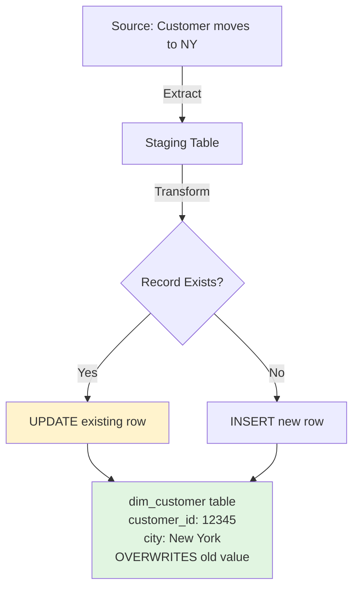
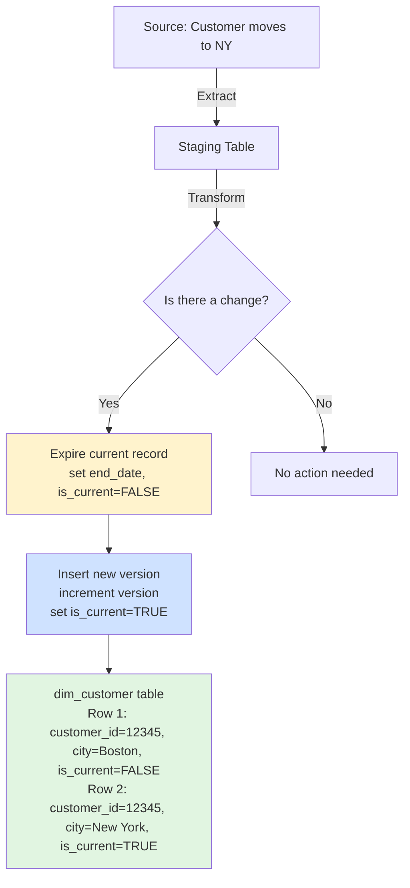
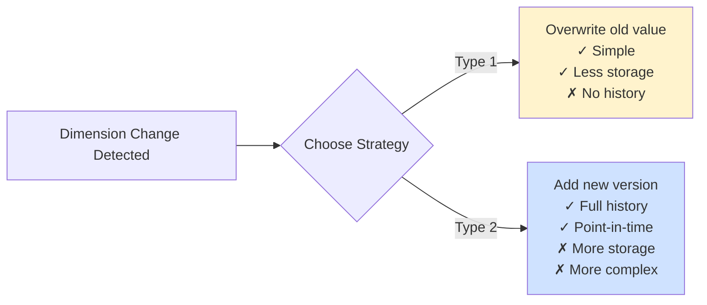

# ETL Patterns in SQL

<div class="difficulty-badge difficulty-intermediate">Intermediate</div>

## Quick Reference

```sql
-- Type 1 SCD: Overwrite (no history)
UPDATE dim_customer
SET
  email = 'new.email@example.com',
  city = 'New York',
  updated_at = CURRENT_TIMESTAMP
WHERE customer_id = 12345;

-- Type 2 SCD: Insert new row with versioning
-- Step 1: Expire current record
UPDATE dim_customer
SET
  end_date = CURRENT_TIMESTAMP,
  is_current = FALSE
WHERE customer_id = 12345
  AND is_current = TRUE;

-- Step 2: Insert new version
INSERT INTO dim_customer (
  customer_id,
  email,
  city,
  start_date,
  end_date,
  is_current,
  version
)
VALUES (
  12345,
  'new.email@example.com',
  'New York',
  CURRENT_TIMESTAMP,
  '9999-12-31',
  TRUE,
  2
);
```

## Overview

Extract, Transform, Load (ETL) patterns are essential techniques for building and maintaining data warehouses and analytical databases. One of the most critical challenges in ETL is handling **Slowly Changing Dimensions (SCDs)** - dimensional data that changes over time, such as customer addresses, product prices, or employee roles.

This guide covers the two most common SCD patterns:
- **Type 1 SCD**: Overwrite strategy with no historical tracking
- **Type 2 SCD**: Historical tracking with versioned records

Understanding when and how to use each pattern is crucial for building effective data warehouses that balance storage costs, query performance, and analytical requirements.

## Slowly Changing Dimensions (SCD)

Slowly Changing Dimensions refer to dimension tables in a data warehouse where attribute values change over time, but at a relatively slow rate. For example:
- A customer's address might change when they move
- A product's category might be reclassified
- An employee's department might change due to reorganization

The challenge is deciding how to handle these changes while maintaining data integrity and supporting analytical needs.

## SCD Type 1: Overwrite Strategy

Type 1 SCD is the simplest approach - when a dimension attribute changes, simply overwrite the old value with the new one. **No history is maintained.**

### When to Use Type 1

- You don't need to track historical changes
- Storage space is a concern
- The old value has no analytical value
- Changes are corrections rather than true changes (e.g., fixing typos)
- Real-time reporting requirements where history isn't needed

### Type 1 Example



### Type 1 Implementation

#### Basic Type 1 Update

```sql
-- Simple overwrite - no history preserved
UPDATE dim_customer
SET
  email = 'john.new@example.com',
  phone = '555-0199',
  city = 'New York',
  state = 'NY',
  updated_at = CURRENT_TIMESTAMP,
  updated_by = 'ETL_PROCESS'
WHERE customer_id = 12345;
```

#### Type 1 with Merge/Upsert (PostgreSQL)

```sql
-- Insert or update based on whether record exists
INSERT INTO dim_customer (
  customer_id,
  first_name,
  last_name,
  email,
  phone,
  city,
  state,
  created_at,
  updated_at
)
VALUES (
  12345,
  'John',
  'Doe',
  'john.new@example.com',
  '555-0199',
  'New York',
  'NY',
  CURRENT_TIMESTAMP,
  CURRENT_TIMESTAMP
)
ON CONFLICT (customer_id)
DO UPDATE SET
  email = EXCLUDED.email,
  phone = EXCLUDED.phone,
  city = EXCLUDED.city,
  state = EXCLUDED.state,
  updated_at = EXCLUDED.updated_at;
```

#### Type 1 with MERGE (SQL Server, Oracle)

```sql
-- SQL Server / Oracle MERGE statement
MERGE INTO dim_customer AS target
USING staging_customer AS source
ON target.customer_id = source.customer_id
WHEN MATCHED THEN
  UPDATE SET
    target.email = source.email,
    target.phone = source.phone,
    target.city = source.city,
    target.state = source.state,
    target.updated_at = CURRENT_TIMESTAMP
WHEN NOT MATCHED THEN
  INSERT (
    customer_id,
    first_name,
    last_name,
    email,
    phone,
    city,
    state,
    created_at,
    updated_at
  )
  VALUES (
    source.customer_id,
    source.first_name,
    source.last_name,
    source.email,
    source.phone,
    source.city,
    source.state,
    CURRENT_TIMESTAMP,
    CURRENT_TIMESTAMP
  );
```

#### Type 1 Batch Processing Pattern

```sql
-- ETL pattern: Load from staging to dimension table
WITH source_data AS (
  SELECT
    customer_id,
    first_name,
    last_name,
    email,
    phone,
    city,
    state,
    CURRENT_TIMESTAMP as process_timestamp
  FROM staging_customer
  WHERE load_date = CURRENT_DATE
),
updated_records AS (
  UPDATE dim_customer d
  SET
    first_name = s.first_name,
    last_name = s.last_name,
    email = s.email,
    phone = s.phone,
    city = s.city,
    state = s.state,
    updated_at = s.process_timestamp
  FROM source_data s
  WHERE d.customer_id = s.customer_id
  RETURNING d.customer_id
)
-- Insert new records that weren't updated
INSERT INTO dim_customer (
  customer_id,
  first_name,
  last_name,
  email,
  phone,
  city,
  state,
  created_at,
  updated_at
)
SELECT
  s.customer_id,
  s.first_name,
  s.last_name,
  s.email,
  s.phone,
  s.city,
  s.state,
  s.process_timestamp,
  s.process_timestamp
FROM source_data s
WHERE NOT EXISTS (
  SELECT 1
  FROM updated_records u
  WHERE u.customer_id = s.customer_id
);
```

### Type 1 Schema

```sql
-- Simple Type 1 dimension table
CREATE TABLE dim_customer (
  customer_id INTEGER PRIMARY KEY,
  first_name VARCHAR(100),
  last_name VARCHAR(100),
  email VARCHAR(255),
  phone VARCHAR(20),
  city VARCHAR(100),
  state VARCHAR(2),
  postal_code VARCHAR(10),
  created_at TIMESTAMP DEFAULT CURRENT_TIMESTAMP,
  updated_at TIMESTAMP DEFAULT CURRENT_TIMESTAMP
);

-- Index for ETL lookups
CREATE INDEX idx_customer_updated ON dim_customer(updated_at);
```

## SCD Type 2: Historical Tracking

Type 2 SCD maintains a complete history of changes by creating a new row for each change. This allows you to see what the dimension looked like at any point in time.

### When to Use Type 2

- You need to track historical changes for analytical purposes
- Regulatory compliance requires maintaining audit trails
- Business users need to see "point-in-time" reporting
- Understanding trends and changes over time is important
- Facts need to be associated with dimension values as they existed at the time

### Type 2 Example



### Type 2 Implementation

#### Type 2 Schema with Versioning

```sql
-- Type 2 dimension table with full history
CREATE TABLE dim_customer (
  -- Surrogate key (unique for each version)
  customer_key SERIAL PRIMARY KEY,

  -- Natural key (same for all versions of a customer)
  customer_id INTEGER NOT NULL,

  -- Dimension attributes
  first_name VARCHAR(100),
  last_name VARCHAR(100),
  email VARCHAR(255),
  phone VARCHAR(20),
  city VARCHAR(100),
  state VARCHAR(2),
  postal_code VARCHAR(10),

  -- Type 2 tracking fields
  start_date TIMESTAMP DEFAULT CURRENT_TIMESTAMP,
  end_date TIMESTAMP DEFAULT '9999-12-31 23:59:59',
  is_current BOOLEAN DEFAULT TRUE,
  version INTEGER DEFAULT 1,

  -- Audit fields
  created_at TIMESTAMP DEFAULT CURRENT_TIMESTAMP,
  created_by VARCHAR(50) DEFAULT 'ETL_PROCESS'
);

-- Indexes for Type 2 queries
CREATE INDEX idx_customer_natural_key ON dim_customer(customer_id);
CREATE INDEX idx_customer_current ON dim_customer(customer_id, is_current);
CREATE INDEX idx_customer_dates ON dim_customer(start_date, end_date);
CREATE UNIQUE INDEX idx_customer_unique_current
  ON dim_customer(customer_id)
  WHERE is_current = TRUE;
```

#### Type 2 Insert Pattern

```sql
-- Complete Type 2 SCD pattern
WITH source_data AS (
  SELECT
    customer_id,
    first_name,
    last_name,
    email,
    phone,
    city,
    state,
    postal_code
  FROM staging_customer
  WHERE load_date = CURRENT_DATE
),
changed_records AS (
  -- Find records that have actually changed
  SELECT
    s.customer_id,
    s.first_name,
    s.last_name,
    s.email,
    s.phone,
    s.city,
    s.state,
    s.postal_code,
    d.customer_key,
    d.version
  FROM source_data s
  INNER JOIN dim_customer d
    ON s.customer_id = d.customer_id
    AND d.is_current = TRUE
  WHERE
    -- Compare all tracked attributes
    s.email != d.email
    OR s.phone != d.phone
    OR s.city != d.city
    OR s.state != d.state
    OR s.postal_code != d.postal_code
),
expired_records AS (
  -- Expire (close out) current records that changed
  UPDATE dim_customer
  SET
    end_date = CURRENT_TIMESTAMP,
    is_current = FALSE
  FROM changed_records c
  WHERE dim_customer.customer_key = c.customer_key
  RETURNING dim_customer.customer_id, dim_customer.version
)
-- Insert new versions for changed records
INSERT INTO dim_customer (
  customer_id,
  first_name,
  last_name,
  email,
  phone,
  city,
  state,
  postal_code,
  start_date,
  end_date,
  is_current,
  version
)
SELECT
  c.customer_id,
  c.first_name,
  c.last_name,
  c.email,
  c.phone,
  c.city,
  c.state,
  c.postal_code,
  CURRENT_TIMESTAMP as start_date,
  '9999-12-31 23:59:59' as end_date,
  TRUE as is_current,
  c.version + 1 as version
FROM changed_records c;
```

#### Type 2 with Transaction Wrapper

```sql
-- Production-ready Type 2 SCD with error handling
DO $$
DECLARE
  v_batch_id INTEGER;
  v_records_expired INTEGER := 0;
  v_records_inserted INTEGER := 0;
BEGIN
  -- Start transaction log
  INSERT INTO etl_batch_log (process_name, start_time, status)
  VALUES ('dim_customer_type2', CURRENT_TIMESTAMP, 'RUNNING')
  RETURNING batch_id INTO v_batch_id;

  -- Step 1: Expire changed records
  WITH changed_records AS (
    SELECT
      d.customer_key,
      d.customer_id
    FROM staging_customer s
    INNER JOIN dim_customer d
      ON s.customer_id = d.customer_id
      AND d.is_current = TRUE
    WHERE
      s.load_date = CURRENT_DATE
      AND (
        s.email != d.email
        OR s.phone != d.phone
        OR s.city != d.city
        OR s.state != d.state
      )
  )
  UPDATE dim_customer d
  SET
    end_date = CURRENT_TIMESTAMP,
    is_current = FALSE
  FROM changed_records c
  WHERE d.customer_key = c.customer_key;

  GET DIAGNOSTICS v_records_expired = ROW_COUNT;

  -- Step 2: Insert new versions
  WITH source_changed AS (
    SELECT DISTINCT
      s.*,
      d.version
    FROM staging_customer s
    INNER JOIN dim_customer d
      ON s.customer_id = d.customer_id
      AND d.end_date = CURRENT_TIMESTAMP  -- Just expired
      AND d.is_current = FALSE
    WHERE s.load_date = CURRENT_DATE
  )
  INSERT INTO dim_customer (
    customer_id,
    first_name,
    last_name,
    email,
    phone,
    city,
    state,
    postal_code,
    start_date,
    end_date,
    is_current,
    version
  )
  SELECT
    customer_id,
    first_name,
    last_name,
    email,
    phone,
    city,
    state,
    postal_code,
    CURRENT_TIMESTAMP,
    '9999-12-31 23:59:59',
    TRUE,
    version + 1
  FROM source_changed;

  GET DIAGNOSTICS v_records_inserted = ROW_COUNT;

  -- Step 3: Insert completely new records
  INSERT INTO dim_customer (
    customer_id,
    first_name,
    last_name,
    email,
    phone,
    city,
    state,
    postal_code,
    start_date,
    end_date,
    is_current,
    version
  )
  SELECT
    s.customer_id,
    s.first_name,
    s.last_name,
    s.email,
    s.phone,
    s.city,
    s.state,
    s.postal_code,
    CURRENT_TIMESTAMP,
    '9999-12-31 23:59:59',
    TRUE,
    1
  FROM staging_customer s
  WHERE s.load_date = CURRENT_DATE
    AND NOT EXISTS (
      SELECT 1
      FROM dim_customer d
      WHERE d.customer_id = s.customer_id
    );

  -- Update batch log
  UPDATE etl_batch_log
  SET
    end_time = CURRENT_TIMESTAMP,
    status = 'SUCCESS',
    records_processed = v_records_expired + v_records_inserted,
    details = jsonb_build_object(
      'expired', v_records_expired,
      'inserted', v_records_inserted
    )
  WHERE batch_id = v_batch_id;

  RAISE NOTICE 'Type 2 SCD completed: % expired, % inserted',
    v_records_expired, v_records_inserted;

EXCEPTION
  WHEN OTHERS THEN
    -- Log error and rollback
    UPDATE etl_batch_log
    SET
      end_time = CURRENT_TIMESTAMP,
      status = 'FAILED',
      error_message = SQLERRM
    WHERE batch_id = v_batch_id;

    RAISE;
END $$;
```

### Type 2 Querying Patterns

```sql
-- Get current version of all customers
SELECT
  customer_id,
  first_name,
  last_name,
  email,
  city,
  state
FROM dim_customer
WHERE is_current = TRUE;

-- Get customer as they existed on a specific date
SELECT
  customer_id,
  first_name,
  last_name,
  email,
  city,
  state
FROM dim_customer
WHERE customer_id = 12345
  AND '2024-06-15' BETWEEN start_date AND end_date;

-- Get all historical versions of a customer
SELECT
  customer_key,
  customer_id,
  email,
  city,
  state,
  start_date,
  end_date,
  version,
  is_current
FROM dim_customer
WHERE customer_id = 12345
ORDER BY version;

-- Join fact table with dimension as of fact date
SELECT
  f.order_id,
  f.order_date,
  f.amount,
  d.customer_id,
  d.city,
  d.state
FROM fact_orders f
INNER JOIN dim_customer d
  ON f.customer_id = d.customer_id
  AND f.order_date BETWEEN d.start_date AND d.end_date;

-- Analyze customer changes over time
SELECT
  customer_id,
  COUNT(*) - 1 as number_of_changes,
  MIN(start_date) as first_seen,
  MAX(CASE WHEN is_current THEN NULL ELSE end_date END) as last_changed,
  array_agg(
    city ORDER BY version
  ) as city_history
FROM dim_customer
GROUP BY customer_id
HAVING COUNT(*) > 1
ORDER BY number_of_changes DESC;
```

## Type 1 vs Type 2 Comparison



### Decision Matrix

| Factor | Type 1 | Type 2 |
|--------|--------|--------|
| **Storage Requirements** | Low - single row per entity | High - multiple rows per entity |
| **Query Complexity** | Simple - direct lookup | Moderate - date range joins |
| **Historical Analysis** | Not possible | Full history available |
| **Data Volume** | Minimal growth | Grows with changes |
| **Use Case** | Current state reporting | Trend analysis, compliance |
| **Example Attributes** | Phone number, email (non-critical) | Address, status, pricing |

### Hybrid Approach

Many real-world implementations use a combination:

```sql
-- Hybrid dimension: Some Type 1, some Type 2 attributes
CREATE TABLE dim_customer (
  customer_key SERIAL PRIMARY KEY,
  customer_id INTEGER NOT NULL,

  -- Type 1 attributes (overwrite, no history needed)
  email VARCHAR(255),              -- Current email
  phone VARCHAR(20),               -- Current phone
  marketing_opt_in BOOLEAN,        -- Current preference

  -- Type 2 attributes (track history)
  address_line1 VARCHAR(255),      -- Historical address
  city VARCHAR(100),               -- Historical city
  state VARCHAR(2),                -- Historical state
  customer_status VARCHAR(50),     -- Historical status
  customer_segment VARCHAR(50),    -- Historical segment

  -- Type 2 tracking
  start_date TIMESTAMP DEFAULT CURRENT_TIMESTAMP,
  end_date TIMESTAMP DEFAULT '9999-12-31 23:59:59',
  is_current BOOLEAN DEFAULT TRUE,
  version INTEGER DEFAULT 1
);
```

## Advanced Patterns

### Type 2 with Change Data Capture (CDC)

```sql
-- Track what changed using CDC pattern
CREATE TABLE dim_customer (
  customer_key SERIAL PRIMARY KEY,
  customer_id INTEGER NOT NULL,
  first_name VARCHAR(100),
  last_name VARCHAR(100),
  email VARCHAR(255),
  city VARCHAR(100),
  state VARCHAR(2),

  -- Type 2 tracking
  start_date TIMESTAMP DEFAULT CURRENT_TIMESTAMP,
  end_date TIMESTAMP DEFAULT '9999-12-31 23:59:59',
  is_current BOOLEAN DEFAULT TRUE,

  -- Change tracking
  change_reason VARCHAR(100),      -- Why did it change?
  changed_columns TEXT[],          -- Which columns changed?
  change_hash VARCHAR(64)          -- Hash of all tracked columns
);

-- Insert with change tracking
WITH source_data AS (
  SELECT
    *,
    md5(
      COALESCE(email, '') || '|' ||
      COALESCE(city, '') || '|' ||
      COALESCE(state, '')
    ) as current_hash
  FROM staging_customer
),
changed_records AS (
  SELECT
    s.*,
    d.customer_key,
    d.change_hash as old_hash,
    ARRAY(
      SELECT column_name
      FROM (
        VALUES
          ('email', s.email != d.email),
          ('city', s.city != d.city),
          ('state', s.state != d.state)
      ) AS changes(column_name, has_changed)
      WHERE has_changed
    ) as changed_columns
  FROM source_data s
  INNER JOIN dim_customer d
    ON s.customer_id = d.customer_id
    AND d.is_current = TRUE
  WHERE s.current_hash != d.change_hash
)
-- Continue with Type 2 insert pattern...
SELECT * FROM changed_records;
```

### Late-Arriving Dimensions

```sql
-- Handle facts that arrive before dimension updates
-- Example: Order placed yesterday, but customer address
-- updated today - need to backdate the dimension change

WITH late_dimension_change AS (
  SELECT
    customer_id,
    new_city,
    new_state,
    effective_date,  -- Date when change actually occurred
    load_date        -- Date when we learned about it
  FROM staging_customer_updates
  WHERE effective_date < load_date  -- Late-arriving
)
-- Close current record and reopen from effective_date
UPDATE dim_customer d
SET
  end_date = ldc.effective_date - INTERVAL '1 second',
  is_current = FALSE
FROM late_dimension_change ldc
WHERE d.customer_id = ldc.customer_id
  AND d.is_current = TRUE
  AND d.start_date < ldc.effective_date;

-- Insert new version with backdated effective date
INSERT INTO dim_customer (
  customer_id,
  city,
  state,
  start_date,
  end_date,
  is_current
)
SELECT
  customer_id,
  new_city,
  new_state,
  effective_date,
  '9999-12-31 23:59:59',
  TRUE
FROM late_dimension_change;
```

### Temporal Bi-Temporal Tracking

```sql
-- Track both transaction time and valid time
CREATE TABLE dim_product_bitemporal (
  product_key SERIAL PRIMARY KEY,
  product_id INTEGER NOT NULL,
  product_name VARCHAR(255),
  price DECIMAL(10, 2),
  category VARCHAR(100),

  -- Valid time (business time - when fact was true in reality)
  valid_from DATE,
  valid_to DATE DEFAULT '9999-12-31',

  -- Transaction time (when we recorded it in the database)
  transaction_from TIMESTAMP DEFAULT CURRENT_TIMESTAMP,
  transaction_to TIMESTAMP DEFAULT '9999-12-31 23:59:59',

  is_current BOOLEAN DEFAULT TRUE
);

-- Query: What did we know about product pricing on 2024-01-15?
SELECT
  product_id,
  product_name,
  price
FROM dim_product_bitemporal
WHERE product_id = 100
  AND '2024-01-15' BETWEEN valid_from AND valid_to
  AND '2024-01-15' BETWEEN transaction_from AND transaction_to;

-- Query: What do we know NOW about product pricing on 2024-01-15?
SELECT
  product_id,
  product_name,
  price
FROM dim_product_bitemporal
WHERE product_id = 100
  AND '2024-01-15' BETWEEN valid_from AND valid_to
  AND is_current = TRUE;
```

## Performance Optimization

### Partitioning for Type 2 Tables

```sql
-- Partition by is_current flag for faster current lookups
CREATE TABLE dim_customer (
  customer_key BIGSERIAL,
  customer_id INTEGER NOT NULL,
  first_name VARCHAR(100),
  last_name VARCHAR(100),
  email VARCHAR(255),
  city VARCHAR(100),
  start_date TIMESTAMP DEFAULT CURRENT_TIMESTAMP,
  end_date TIMESTAMP DEFAULT '9999-12-31 23:59:59',
  is_current BOOLEAN DEFAULT TRUE
) PARTITION BY LIST (is_current);

-- Current records partition (most queried)
CREATE TABLE dim_customer_current
  PARTITION OF dim_customer
  FOR VALUES IN (TRUE);

-- Historical records partition
CREATE TABLE dim_customer_historical
  PARTITION OF dim_customer
  FOR VALUES IN (FALSE);

-- Indexes on current partition only (smaller, faster)
CREATE INDEX idx_customer_current_id
  ON dim_customer_current(customer_id);
CREATE INDEX idx_customer_current_email
  ON dim_customer_current(email);
```

### Materialized Views for Common Queries

```sql
-- Materialized view for current dimension state
CREATE MATERIALIZED VIEW mv_customer_current AS
SELECT
  customer_id,
  first_name,
  last_name,
  email,
  city,
  state,
  start_date
FROM dim_customer
WHERE is_current = TRUE;

CREATE UNIQUE INDEX idx_mv_customer_current
  ON mv_customer_current(customer_id);

-- Refresh after ETL
REFRESH MATERIALIZED VIEW CONCURRENTLY mv_customer_current;
```

## Best Practices

### 1. Use Surrogate Keys for Type 2

```sql
-- ✅ Good: Surrogate key allows multiple versions
CREATE TABLE dim_customer (
  customer_key SERIAL PRIMARY KEY,      -- Surrogate key
  customer_id INTEGER NOT NULL,         -- Natural key
  email VARCHAR(255),
  is_current BOOLEAN
);

-- Fact table references surrogate key
CREATE TABLE fact_orders (
  order_id INTEGER PRIMARY KEY,
  customer_key INTEGER REFERENCES dim_customer(customer_key),
  order_date DATE,
  amount DECIMAL(10, 2)
);
```

### 2. Always Include Audit Columns

```sql
-- ✅ Good: Complete audit trail
CREATE TABLE dim_customer (
  customer_key SERIAL PRIMARY KEY,
  customer_id INTEGER NOT NULL,
  -- ... dimension attributes ...

  -- Audit columns
  created_at TIMESTAMP DEFAULT CURRENT_TIMESTAMP,
  created_by VARCHAR(50) DEFAULT CURRENT_USER,
  updated_at TIMESTAMP DEFAULT CURRENT_TIMESTAMP,
  updated_by VARCHAR(50) DEFAULT CURRENT_USER,
  source_system VARCHAR(50),
  batch_id INTEGER
);
```

### 3. Implement Change Detection Efficiently

```sql
-- ✅ Good: Use hash for efficient change detection
CREATE TABLE dim_customer (
  customer_key SERIAL PRIMARY KEY,
  customer_id INTEGER NOT NULL,
  email VARCHAR(255),
  city VARCHAR(100),
  state VARCHAR(2),

  -- Hash of all Type 2 tracked columns
  row_hash VARCHAR(64) GENERATED ALWAYS AS (
    md5(
      COALESCE(email, '') || '|' ||
      COALESCE(city, '') || '|' ||
      COALESCE(state, '')
    )
  ) STORED,

  is_current BOOLEAN
);

-- Compare hashes instead of individual columns
SELECT s.customer_id
FROM staging_customer s
INNER JOIN dim_customer d
  ON s.customer_id = d.customer_id
  AND d.is_current = TRUE
WHERE s.row_hash != d.row_hash;
```

### 4. Handle NULL Values Consistently

```sql
-- ✅ Good: Consistent NULL handling in comparisons
WHERE
  COALESCE(source.email, '') != COALESCE(target.email, '')
  OR COALESCE(source.city, '') != COALESCE(target.city, '')
  OR COALESCE(source.state, '') != COALESCE(target.state, '');
```

### 5. Document Your SCD Strategy

```sql
-- ✅ Good: Clear documentation
COMMENT ON TABLE dim_customer IS
  'Customer dimension using Type 2 SCD for address/status, Type 1 for contact info';

COMMENT ON COLUMN dim_customer.email IS
  'Type 1 attribute - always shows current value';

COMMENT ON COLUMN dim_customer.city IS
  'Type 2 attribute - historical tracking enabled';
```

## Common Pitfalls

### 1. Forgetting to Expire Old Records

```sql
-- ❌ Bad: Inserting new version without expiring old one
INSERT INTO dim_customer (...) VALUES (...);

-- ✅ Good: Always expire before inserting
UPDATE dim_customer SET is_current = FALSE, end_date = NOW()
WHERE customer_id = 12345 AND is_current = TRUE;

INSERT INTO dim_customer (...) VALUES (...);
```

### 2. Incorrect Date Range Queries

```sql
-- ❌ Bad: Might miss edge cases
WHERE fact_date >= start_date AND fact_date <= end_date;

-- ✅ Good: Use BETWEEN for inclusive ranges
WHERE fact_date BETWEEN start_date AND end_date;
```

### 3. Not Handling Duplicate Detection

```sql
-- ❌ Bad: No check for duplicates in staging
INSERT INTO dim_customer SELECT * FROM staging_customer;

-- ✅ Good: Deduplicate staging data first
WITH deduped_staging AS (
  SELECT DISTINCT ON (customer_id)
    customer_id,
    email,
    city
  FROM staging_customer
  ORDER BY customer_id, load_timestamp DESC
)
-- Then process Type 2 SCD...
SELECT * FROM deduped_staging;
```

## Try It Yourself

<SQLAssistant mode="generate" default-dialect="postgresql" :show-model-selector="false" />

## See Also

- [Window Functions](/concepts/window-functions/) - Useful for analyzing dimension changes over time
- [CTEs](/concepts/ctes/) - Essential for complex SCD logic
- [Performance](/concepts/performance/) - Optimizing large dimension tables
- [Transactions](/concepts/transactions/) - Ensuring SCD consistency
- [Analytics Patterns](/patterns/analytics/) - Using dimensions for analysis
