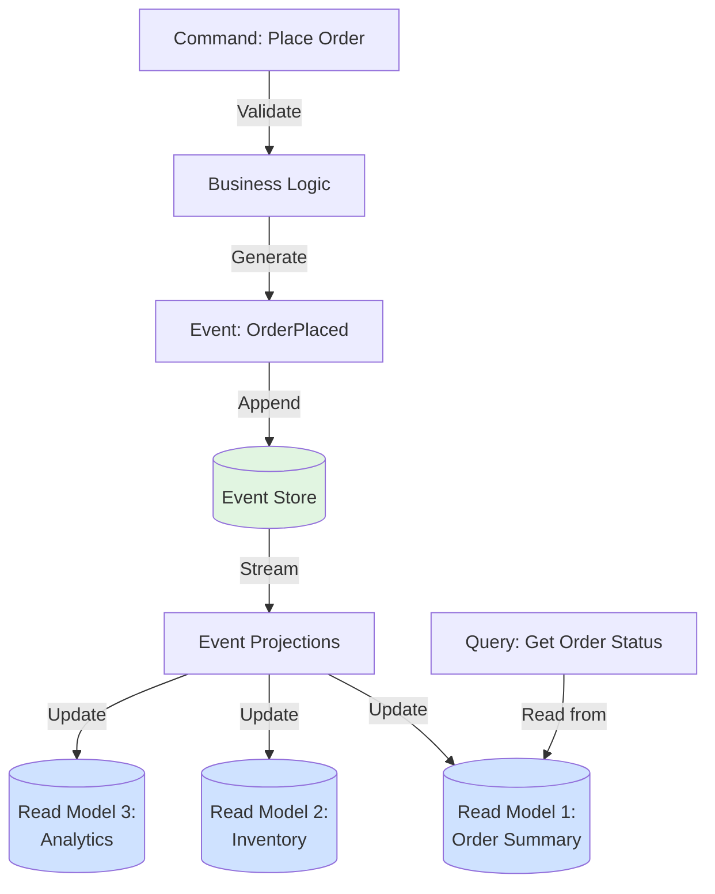
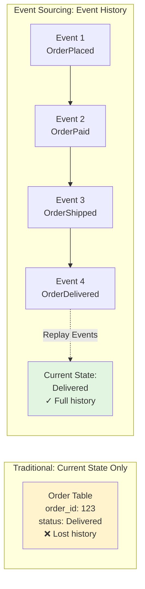
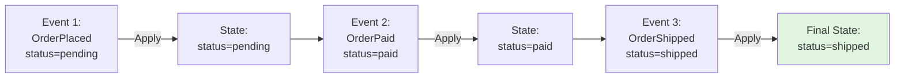
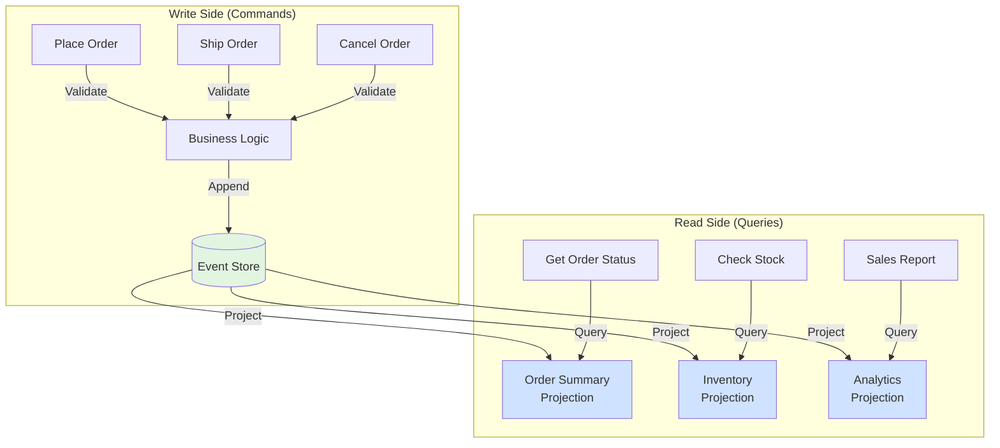
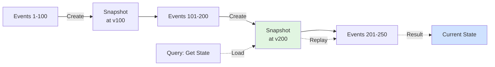

# Event Sourcing Patterns in SQL

<div class="difficulty-badge difficulty-advanced">Advanced</div>

## Quick Reference

```sql
-- Append an event to the event store
INSERT INTO event_store (
  aggregate_id,
  event_type,
  event_data,
  event_version,
  created_at
)
VALUES (
  'order-12345',
  'OrderPlaced',
  '{"items": [{"sku": "ABC", "qty": 2}], "total": 99.99}'::jsonb,
  1,
  CURRENT_TIMESTAMP
);

-- Rebuild current state from events
SELECT
  aggregate_id,
  jsonb_object_agg(key, value) as current_state
FROM (
  SELECT
    aggregate_id,
    event_data->>'status' as key,
    event_data->>'value' as value
  FROM event_store
  WHERE aggregate_id = 'order-12345'
  ORDER BY event_version
) events
GROUP BY aggregate_id;

-- Create a projection (read model)
CREATE MATERIALIZED VIEW order_summary AS
SELECT
  aggregate_id,
  MAX(CASE WHEN event_type = 'OrderPlaced' THEN created_at END) as placed_at,
  MAX(CASE WHEN event_type = 'OrderShipped' THEN created_at END) as shipped_at,
  MAX(CASE WHEN event_type = 'OrderDelivered' THEN created_at END) as delivered_at,
  (array_agg(event_data ORDER BY event_version DESC))[1]->>'status' as current_status
FROM event_store
WHERE event_type IN ('OrderPlaced', 'OrderShipped', 'OrderDelivered')
GROUP BY aggregate_id;
```

## Overview

Event Sourcing is a powerful architectural pattern where state changes are stored as a sequence of events rather than storing just the current state. Instead of updating records in place, every change is captured as an immutable event that describes what happened.

This pattern provides:
- **Complete audit trail** - Every change is recorded with full context
- **Temporal queries** - Query state as it existed at any point in time
- **Event replay** - Rebuild state from events for debugging or migration
- **Event-driven architecture** - Events can trigger workflows and integrations
- **Compliance** - Meet regulatory requirements for data lineage

Event Sourcing is particularly valuable in domains like financial transactions, order processing, inventory management, and any system requiring comprehensive audit trails.

## Core Concepts

### Event Sourcing Architecture



### Event Sourcing vs Traditional State



## Event Store Schema

The event store is the single source of truth in event sourcing. All events are appended to this immutable log.

### Basic Event Store

```sql
-- Core event store table
CREATE TABLE event_store (
  -- Primary key
  event_id BIGSERIAL PRIMARY KEY,

  -- Aggregate identification
  aggregate_id VARCHAR(255) NOT NULL,
  aggregate_type VARCHAR(100) NOT NULL,

  -- Event metadata
  event_type VARCHAR(100) NOT NULL,
  event_version INTEGER NOT NULL,

  -- Event payload
  event_data JSONB NOT NULL,

  -- Metadata
  created_at TIMESTAMP DEFAULT CURRENT_TIMESTAMP,
  created_by VARCHAR(100),
  correlation_id UUID,
  causation_id UUID,

  -- Ensure events are ordered correctly
  CONSTRAINT unique_aggregate_version
    UNIQUE (aggregate_id, event_version)
);

-- Indexes for common queries
CREATE INDEX idx_event_store_aggregate
  ON event_store(aggregate_id, event_version);

CREATE INDEX idx_event_store_type
  ON event_store(aggregate_type, created_at);

CREATE INDEX idx_event_store_event_type
  ON event_store(event_type, created_at);

CREATE INDEX idx_event_store_created
  ON event_store(created_at);

CREATE INDEX idx_event_store_correlation
  ON event_store(correlation_id);
```

### Event Store with Metadata

```sql
-- Enhanced event store with rich metadata
CREATE TABLE event_store_enhanced (
  event_id BIGSERIAL PRIMARY KEY,

  -- Stream identification
  stream_id VARCHAR(255) NOT NULL,
  stream_type VARCHAR(100) NOT NULL,

  -- Event identification
  event_type VARCHAR(100) NOT NULL,
  event_version INTEGER NOT NULL,

  -- Event payload and metadata
  event_data JSONB NOT NULL,
  event_metadata JSONB DEFAULT '{}'::jsonb,

  -- Causality tracking
  correlation_id UUID NOT NULL,
  causation_id UUID,

  -- Temporal tracking
  event_timestamp TIMESTAMP NOT NULL DEFAULT CURRENT_TIMESTAMP,
  ingestion_timestamp TIMESTAMP NOT NULL DEFAULT CURRENT_TIMESTAMP,

  -- User context
  user_id VARCHAR(100),
  ip_address INET,
  user_agent TEXT,

  -- Partitioning key (for scaling)
  partition_key INTEGER GENERATED ALWAYS AS (
    ('x' || substr(md5(stream_id), 1, 8))::bit(32)::int
  ) STORED,

  CONSTRAINT unique_stream_version
    UNIQUE (stream_id, event_version)
);

-- Partition by date for better performance
CREATE TABLE event_store_enhanced_2024_11
  PARTITION OF event_store_enhanced
  FOR VALUES FROM ('2024-11-01') TO ('2024-12-01');
```

## Appending Events

Events are immutable - they are only ever appended, never updated or deleted.

### Basic Event Append

```sql
-- Append a new event to the event store
WITH next_version AS (
  SELECT COALESCE(MAX(event_version), 0) + 1 as version
  FROM event_store
  WHERE aggregate_id = 'order-12345'
)
INSERT INTO event_store (
  aggregate_id,
  aggregate_type,
  event_type,
  event_version,
  event_data,
  created_by,
  correlation_id
)
SELECT
  'order-12345',
  'Order',
  'OrderPlaced',
  nv.version,
  jsonb_build_object(
    'customer_id', 'customer-789',
    'items', jsonb_build_array(
      jsonb_build_object('sku', 'WIDGET-A', 'quantity', 2, 'price', 29.99),
      jsonb_build_object('sku', 'GADGET-B', 'quantity', 1, 'price', 49.99)
    ),
    'total', 109.97,
    'currency', 'USD'
  ),
  'user-456',
  gen_random_uuid()
FROM next_version nv
RETURNING event_id, event_version, created_at;
```

### Optimistic Concurrency Control

```sql
-- Prevent concurrent modifications using optimistic locking
DO $$
DECLARE
  v_expected_version INTEGER := 5;  -- Version we read
  v_actual_version INTEGER;
BEGIN
  -- Get current version
  SELECT COALESCE(MAX(event_version), 0)
  INTO v_actual_version
  FROM event_store
  WHERE aggregate_id = 'order-12345';

  -- Check for concurrency conflict
  IF v_actual_version != v_expected_version THEN
    RAISE EXCEPTION 'Concurrency conflict: expected version %, found %',
      v_expected_version, v_actual_version
    USING ERRCODE = '40001';  -- Serialization failure
  END IF;

  -- Append new event
  INSERT INTO event_store (
    aggregate_id,
    aggregate_type,
    event_type,
    event_version,
    event_data,
    correlation_id
  )
  VALUES (
    'order-12345',
    'Order',
    'OrderCancelled',
    v_expected_version + 1,
    jsonb_build_object(
      'reason', 'Customer request',
      'refund_amount', 109.97
    ),
    gen_random_uuid()
  );
END $$;
```

### Batch Event Append

```sql
-- Append multiple events atomically
WITH event_batch AS (
  SELECT * FROM (VALUES
    ('order-12345', 'Order', 'OrderPaid',
     '{"payment_method": "credit_card", "amount": 109.97}'::jsonb),
    ('order-12345', 'Order', 'OrderShipped',
     '{"carrier": "FedEx", "tracking": "123456789"}'::jsonb),
    ('inventory-widget-a', 'Inventory', 'StockReduced',
     '{"sku": "WIDGET-A", "quantity": 2, "reason": "order-12345"}'::jsonb)
  ) AS events(aggregate_id, aggregate_type, event_type, event_data)
),
versioned_events AS (
  SELECT
    eb.*,
    ROW_NUMBER() OVER (PARTITION BY eb.aggregate_id ORDER BY eb.event_type) +
    COALESCE((
      SELECT MAX(e.event_version)
      FROM event_store e
      WHERE e.aggregate_id = eb.aggregate_id
    ), 0) as event_version
  FROM event_batch eb
)
INSERT INTO event_store (
  aggregate_id,
  aggregate_type,
  event_type,
  event_version,
  event_data,
  correlation_id
)
SELECT
  aggregate_id,
  aggregate_type,
  event_type,
  event_version,
  event_data,
  gen_random_uuid()
FROM versioned_events
RETURNING aggregate_id, event_type, event_version;
```

## State Reconstruction

One of the key features of event sourcing is the ability to rebuild state from events.

### Rebuild Current State



```sql
-- Rebuild order state from events
WITH order_events AS (
  SELECT
    event_id,
    event_type,
    event_data,
    event_version,
    created_at
  FROM event_store
  WHERE aggregate_id = 'order-12345'
  ORDER BY event_version
),
state_changes AS (
  -- Extract state from each event type
  SELECT
    event_version,
    event_type,
    CASE event_type
      WHEN 'OrderPlaced' THEN jsonb_build_object(
        'status', 'placed',
        'customer_id', event_data->>'customer_id',
        'total', event_data->>'total',
        'items', event_data->'items'
      )
      WHEN 'OrderPaid' THEN jsonb_build_object(
        'status', 'paid',
        'payment_method', event_data->>'payment_method'
      )
      WHEN 'OrderShipped' THEN jsonb_build_object(
        'status', 'shipped',
        'carrier', event_data->>'carrier',
        'tracking_number', event_data->>'tracking'
      )
      WHEN 'OrderDelivered' THEN jsonb_build_object(
        'status', 'delivered',
        'delivered_at', event_data->>'delivered_at'
      )
      WHEN 'OrderCancelled' THEN jsonb_build_object(
        'status', 'cancelled',
        'reason', event_data->>'reason'
      )
    END as state_delta
  FROM order_events
)
-- Merge all state changes into final state
SELECT
  'order-12345' as order_id,
  jsonb_object_agg(
    key,
    value ORDER BY event_version DESC
  ) FILTER (WHERE key IS NOT NULL) as current_state
FROM state_changes,
LATERAL jsonb_each(state_delta)
GROUP BY order_id;
```

### Point-in-Time State Reconstruction

```sql
-- Reconstruct state as it existed at a specific point in time
WITH historical_events AS (
  SELECT
    event_type,
    event_data,
    event_version
  FROM event_store
  WHERE aggregate_id = 'order-12345'
    AND created_at <= '2024-11-15 10:30:00'
  ORDER BY event_version
)
SELECT
  'order-12345' as order_id,
  jsonb_object_agg(
    key,
    value ORDER BY event_version DESC
  ) as state_at_timestamp
FROM historical_events,
LATERAL jsonb_each(
  CASE event_type
    WHEN 'OrderPlaced' THEN jsonb_build_object('status', 'placed')
    WHEN 'OrderPaid' THEN jsonb_build_object('status', 'paid')
    WHEN 'OrderShipped' THEN jsonb_build_object('status', 'shipped')
  END
)
GROUP BY order_id;
```

### Aggregate State Function

```sql
-- Function to rebuild aggregate state
CREATE OR REPLACE FUNCTION get_order_state(
  p_order_id VARCHAR,
  p_as_of_timestamp TIMESTAMP DEFAULT NULL
)
RETURNS JSONB
LANGUAGE plpgsql
AS $$
DECLARE
  v_state JSONB := '{}'::jsonb;
  v_event RECORD;
BEGIN
  FOR v_event IN
    SELECT event_type, event_data
    FROM event_store
    WHERE aggregate_id = p_order_id
      AND (p_as_of_timestamp IS NULL OR created_at <= p_as_of_timestamp)
    ORDER BY event_version
  LOOP
    -- Apply each event to state
    CASE v_event.event_type
      WHEN 'OrderPlaced' THEN
        v_state := v_state || jsonb_build_object(
          'status', 'placed',
          'customer_id', v_event.event_data->>'customer_id',
          'items', v_event.event_data->'items',
          'total', v_event.event_data->'total'
        );

      WHEN 'OrderPaid' THEN
        v_state := v_state || jsonb_build_object(
          'status', 'paid',
          'payment_method', v_event.event_data->>'payment_method'
        );

      WHEN 'OrderShipped' THEN
        v_state := v_state || jsonb_build_object(
          'status', 'shipped',
          'carrier', v_event.event_data->>'carrier',
          'tracking_number', v_event.event_data->>'tracking'
        );

      WHEN 'OrderDelivered' THEN
        v_state := v_state || jsonb_build_object(
          'status', 'delivered'
        );

      WHEN 'OrderCancelled' THEN
        v_state := v_state || jsonb_build_object(
          'status', 'cancelled',
          'cancellation_reason', v_event.event_data->>'reason'
        );
    END CASE;
  END LOOP;

  RETURN v_state;
END;
$$;

-- Usage
SELECT get_order_state('order-12345');
SELECT get_order_state('order-12345', '2024-11-15 10:30:00');
```

## Event Projections (Read Models)

Projections are materialized views of events optimized for specific queries. This implements the CQRS (Command Query Responsibility Segregation) pattern.

### CQRS Pattern



### Order Summary Projection

```sql
-- Create projection for order queries
CREATE TABLE projection_order_summary (
  order_id VARCHAR(255) PRIMARY KEY,
  customer_id VARCHAR(255),

  -- Order lifecycle timestamps
  placed_at TIMESTAMP,
  paid_at TIMESTAMP,
  shipped_at TIMESTAMP,
  delivered_at TIMESTAMP,
  cancelled_at TIMESTAMP,

  -- Current state
  current_status VARCHAR(50),

  -- Order details
  total_amount DECIMAL(10, 2),
  item_count INTEGER,
  items JSONB,

  -- Shipping info
  carrier VARCHAR(100),
  tracking_number VARCHAR(100),

  -- Metadata
  last_event_version INTEGER,
  last_updated_at TIMESTAMP
);

CREATE INDEX idx_order_summary_customer
  ON projection_order_summary(customer_id);
CREATE INDEX idx_order_summary_status
  ON projection_order_summary(current_status);
CREATE INDEX idx_order_summary_placed
  ON projection_order_summary(placed_at);

-- Populate projection from events
INSERT INTO projection_order_summary (
  order_id,
  customer_id,
  placed_at,
  paid_at,
  shipped_at,
  delivered_at,
  cancelled_at,
  current_status,
  total_amount,
  item_count,
  items,
  carrier,
  tracking_number,
  last_event_version,
  last_updated_at
)
SELECT
  aggregate_id as order_id,
  MAX(CASE WHEN event_type = 'OrderPlaced' THEN event_data->>'customer_id' END) as customer_id,
  MAX(CASE WHEN event_type = 'OrderPlaced' THEN created_at END) as placed_at,
  MAX(CASE WHEN event_type = 'OrderPaid' THEN created_at END) as paid_at,
  MAX(CASE WHEN event_type = 'OrderShipped' THEN created_at END) as shipped_at,
  MAX(CASE WHEN event_type = 'OrderDelivered' THEN created_at END) as delivered_at,
  MAX(CASE WHEN event_type = 'OrderCancelled' THEN created_at END) as cancelled_at,
  (array_agg(
    CASE event_type
      WHEN 'OrderPlaced' THEN 'placed'
      WHEN 'OrderPaid' THEN 'paid'
      WHEN 'OrderShipped' THEN 'shipped'
      WHEN 'OrderDelivered' THEN 'delivered'
      WHEN 'OrderCancelled' THEN 'cancelled'
    END
    ORDER BY event_version DESC
  ))[1] as current_status,
  MAX(CASE WHEN event_type = 'OrderPlaced' THEN (event_data->>'total')::decimal END) as total_amount,
  MAX(CASE WHEN event_type = 'OrderPlaced' THEN jsonb_array_length(event_data->'items') END) as item_count,
  MAX(CASE WHEN event_type = 'OrderPlaced' THEN event_data->'items' END) as items,
  MAX(CASE WHEN event_type = 'OrderShipped' THEN event_data->>'carrier' END) as carrier,
  MAX(CASE WHEN event_type = 'OrderShipped' THEN event_data->>'tracking' END) as tracking_number,
  MAX(event_version) as last_event_version,
  MAX(created_at) as last_updated_at
FROM event_store
WHERE aggregate_type = 'Order'
GROUP BY aggregate_id
ON CONFLICT (order_id) DO UPDATE SET
  paid_at = EXCLUDED.paid_at,
  shipped_at = EXCLUDED.shipped_at,
  delivered_at = EXCLUDED.delivered_at,
  cancelled_at = EXCLUDED.cancelled_at,
  current_status = EXCLUDED.current_status,
  carrier = EXCLUDED.carrier,
  tracking_number = EXCLUDED.tracking_number,
  last_event_version = EXCLUDED.last_event_version,
  last_updated_at = EXCLUDED.last_updated_at;
```

### Real-Time Projection Updates

```sql
-- Trigger to update projections when events are added
CREATE OR REPLACE FUNCTION update_order_projection()
RETURNS TRIGGER
LANGUAGE plpgsql
AS $$
BEGIN
  -- Only process Order events
  IF NEW.aggregate_type != 'Order' THEN
    RETURN NEW;
  END IF;

  -- Insert or update projection
  INSERT INTO projection_order_summary (
    order_id,
    customer_id,
    placed_at,
    paid_at,
    shipped_at,
    delivered_at,
    cancelled_at,
    current_status,
    total_amount,
    item_count,
    items,
    carrier,
    tracking_number,
    last_event_version,
    last_updated_at
  )
  VALUES (
    NEW.aggregate_id,
    CASE WHEN NEW.event_type = 'OrderPlaced'
      THEN NEW.event_data->>'customer_id' END,
    CASE WHEN NEW.event_type = 'OrderPlaced'
      THEN NEW.created_at END,
    CASE WHEN NEW.event_type = 'OrderPaid'
      THEN NEW.created_at END,
    CASE WHEN NEW.event_type = 'OrderShipped'
      THEN NEW.created_at END,
    CASE WHEN NEW.event_type = 'OrderDelivered'
      THEN NEW.created_at END,
    CASE WHEN NEW.event_type = 'OrderCancelled'
      THEN NEW.created_at END,
    CASE NEW.event_type
      WHEN 'OrderPlaced' THEN 'placed'
      WHEN 'OrderPaid' THEN 'paid'
      WHEN 'OrderShipped' THEN 'shipped'
      WHEN 'OrderDelivered' THEN 'delivered'
      WHEN 'OrderCancelled' THEN 'cancelled'
    END,
    CASE WHEN NEW.event_type = 'OrderPlaced'
      THEN (NEW.event_data->>'total')::decimal END,
    CASE WHEN NEW.event_type = 'OrderPlaced'
      THEN jsonb_array_length(NEW.event_data->'items') END,
    CASE WHEN NEW.event_type = 'OrderPlaced'
      THEN NEW.event_data->'items' END,
    CASE WHEN NEW.event_type = 'OrderShipped'
      THEN NEW.event_data->>'carrier' END,
    CASE WHEN NEW.event_type = 'OrderShipped'
      THEN NEW.event_data->>'tracking' END,
    NEW.event_version,
    NEW.created_at
  )
  ON CONFLICT (order_id) DO UPDATE SET
    paid_at = COALESCE(EXCLUDED.paid_at, projection_order_summary.paid_at),
    shipped_at = COALESCE(EXCLUDED.shipped_at, projection_order_summary.shipped_at),
    delivered_at = COALESCE(EXCLUDED.delivered_at, projection_order_summary.delivered_at),
    cancelled_at = COALESCE(EXCLUDED.cancelled_at, projection_order_summary.cancelled_at),
    current_status = COALESCE(EXCLUDED.current_status, projection_order_summary.current_status),
    carrier = COALESCE(EXCLUDED.carrier, projection_order_summary.carrier),
    tracking_number = COALESCE(EXCLUDED.tracking_number, projection_order_summary.tracking_number),
    last_event_version = EXCLUDED.last_event_version,
    last_updated_at = EXCLUDED.last_updated_at
  WHERE projection_order_summary.last_event_version < EXCLUDED.last_event_version;

  RETURN NEW;
END;
$$;

CREATE TRIGGER trg_update_order_projection
  AFTER INSERT ON event_store
  FOR EACH ROW
  EXECUTE FUNCTION update_order_projection();
```

## Snapshots for Performance

As event streams grow, replaying thousands of events becomes slow. Snapshots capture state at a point in time.

### Snapshot Pattern



### Snapshot Schema

```sql
-- Snapshot table for performance optimization
CREATE TABLE aggregate_snapshots (
  snapshot_id BIGSERIAL PRIMARY KEY,
  aggregate_id VARCHAR(255) NOT NULL,
  aggregate_type VARCHAR(100) NOT NULL,

  -- Snapshot data
  snapshot_data JSONB NOT NULL,
  snapshot_version INTEGER NOT NULL,

  -- Metadata
  created_at TIMESTAMP DEFAULT CURRENT_TIMESTAMP,

  CONSTRAINT unique_snapshot
    UNIQUE (aggregate_id, snapshot_version)
);

CREATE INDEX idx_snapshots_aggregate
  ON aggregate_snapshots(aggregate_id, snapshot_version DESC);

-- Create snapshot every N events (e.g., every 100 events)
CREATE OR REPLACE FUNCTION create_snapshot(
  p_aggregate_id VARCHAR,
  p_snapshot_interval INTEGER DEFAULT 100
)
RETURNS VOID
LANGUAGE plpgsql
AS $$
DECLARE
  v_current_version INTEGER;
  v_last_snapshot_version INTEGER;
  v_state JSONB;
BEGIN
  -- Get current version
  SELECT COALESCE(MAX(event_version), 0)
  INTO v_current_version
  FROM event_store
  WHERE aggregate_id = p_aggregate_id;

  -- Get last snapshot version
  SELECT COALESCE(MAX(snapshot_version), 0)
  INTO v_last_snapshot_version
  FROM aggregate_snapshots
  WHERE aggregate_id = p_aggregate_id;

  -- Create snapshot if interval reached
  IF v_current_version - v_last_snapshot_version >= p_snapshot_interval THEN
    -- Rebuild state
    SELECT get_order_state(p_aggregate_id)
    INTO v_state;

    -- Save snapshot
    INSERT INTO aggregate_snapshots (
      aggregate_id,
      aggregate_type,
      snapshot_data,
      snapshot_version
    )
    VALUES (
      p_aggregate_id,
      'Order',
      v_state,
      v_current_version
    );

    RAISE NOTICE 'Created snapshot for % at version %',
      p_aggregate_id, v_current_version;
  END IF;
END;
$$;
```

### Load State with Snapshot

```sql
-- Efficiently load state using snapshot + recent events
CREATE OR REPLACE FUNCTION get_order_state_optimized(
  p_order_id VARCHAR
)
RETURNS JSONB
LANGUAGE plpgsql
AS $$
DECLARE
  v_snapshot RECORD;
  v_state JSONB;
  v_event RECORD;
BEGIN
  -- Get latest snapshot
  SELECT snapshot_data, snapshot_version
  INTO v_snapshot
  FROM aggregate_snapshots
  WHERE aggregate_id = p_order_id
  ORDER BY snapshot_version DESC
  LIMIT 1;

  -- Start with snapshot or empty state
  v_state := COALESCE(v_snapshot.snapshot_data, '{}'::jsonb);

  -- Apply events since snapshot
  FOR v_event IN
    SELECT event_type, event_data
    FROM event_store
    WHERE aggregate_id = p_order_id
      AND event_version > COALESCE(v_snapshot.snapshot_version, 0)
    ORDER BY event_version
  LOOP
    -- Apply event to state (same logic as before)
    CASE v_event.event_type
      WHEN 'OrderPlaced' THEN
        v_state := v_state || jsonb_build_object(
          'status', 'placed',
          'total', v_event.event_data->'total'
        );
      -- ... other event types ...
    END CASE;
  END LOOP;

  RETURN v_state;
END;
$$;
```

## Temporal Queries

Event sourcing enables powerful temporal queries - understanding how data changed over time.

### Audit Trail Query

```sql
-- Complete audit trail for an order
SELECT
  event_id,
  event_type,
  event_version,
  event_data,
  created_at,
  created_by,
  LAG(created_at) OVER (ORDER BY event_version) as previous_event_at,
  created_at - LAG(created_at) OVER (ORDER BY event_version) as time_since_last_event
FROM event_store
WHERE aggregate_id = 'order-12345'
ORDER BY event_version;
```

### Time-Travel Query

```sql
-- See all orders that were "shipped" on a specific date
WITH orders_at_timestamp AS (
  SELECT DISTINCT
    aggregate_id,
    (array_agg(
      CASE event_type
        WHEN 'OrderPlaced' THEN 'placed'
        WHEN 'OrderPaid' THEN 'paid'
        WHEN 'OrderShipped' THEN 'shipped'
        WHEN 'OrderDelivered' THEN 'delivered'
      END
      ORDER BY event_version DESC
    ) FILTER (WHERE created_at <= '2024-11-15 23:59:59'))[1] as status
  FROM event_store
  WHERE aggregate_type = 'Order'
    AND created_at <= '2024-11-15 23:59:59'
  GROUP BY aggregate_id
)
SELECT
  aggregate_id as order_id,
  status
FROM orders_at_timestamp
WHERE status = 'shipped';
```

### Change Analysis

```sql
-- Analyze how long orders take to ship
WITH order_lifecycle AS (
  SELECT
    aggregate_id,
    MAX(CASE WHEN event_type = 'OrderPlaced' THEN created_at END) as placed_at,
    MAX(CASE WHEN event_type = 'OrderPaid' THEN created_at END) as paid_at,
    MAX(CASE WHEN event_type = 'OrderShipped' THEN created_at END) as shipped_at
  FROM event_store
  WHERE aggregate_type = 'Order'
    AND created_at >= CURRENT_DATE - INTERVAL '30 days'
  GROUP BY aggregate_id
)
SELECT
  DATE(placed_at) as order_date,
  COUNT(*) as orders,
  AVG(EXTRACT(EPOCH FROM (shipped_at - placed_at)) / 3600) as avg_hours_to_ship,
  PERCENTILE_CONT(0.5) WITHIN GROUP (
    ORDER BY EXTRACT(EPOCH FROM (shipped_at - placed_at)) / 3600
  ) as median_hours_to_ship,
  PERCENTILE_CONT(0.95) WITHIN GROUP (
    ORDER BY EXTRACT(EPOCH FROM (shipped_at - placed_at)) / 3600
  ) as p95_hours_to_ship
FROM order_lifecycle
WHERE shipped_at IS NOT NULL
GROUP BY DATE(placed_at)
ORDER BY order_date;
```

## Event Replay and Migration

One of event sourcing's superpowers is the ability to replay events to rebuild state or migrate systems.

### Rebuild All Projections

```sql
-- Rebuild projection from scratch
TRUNCATE TABLE projection_order_summary;

INSERT INTO projection_order_summary (
  order_id,
  customer_id,
  placed_at,
  current_status,
  total_amount,
  last_event_version,
  last_updated_at
)
SELECT
  aggregate_id,
  MAX(CASE WHEN event_type = 'OrderPlaced' THEN event_data->>'customer_id' END),
  MAX(CASE WHEN event_type = 'OrderPlaced' THEN created_at END),
  (array_agg(
    CASE event_type
      WHEN 'OrderPlaced' THEN 'placed'
      WHEN 'OrderShipped' THEN 'shipped'
    END
    ORDER BY event_version DESC
  ))[1],
  MAX(CASE WHEN event_type = 'OrderPlaced' THEN (event_data->>'total')::decimal END),
  MAX(event_version),
  MAX(created_at)
FROM event_store
WHERE aggregate_type = 'Order'
GROUP BY aggregate_id;
```

### Event Upcasting (Schema Evolution)

```sql
-- Migrate old event format to new format
CREATE TABLE event_migrations (
  migration_id SERIAL PRIMARY KEY,
  from_version VARCHAR(50),
  to_version VARCHAR(50),
  event_type VARCHAR(100),
  migration_function VARCHAR(255),
  applied_at TIMESTAMP DEFAULT CURRENT_TIMESTAMP
);

-- Upcast old OrderPlaced events to new schema
CREATE OR REPLACE FUNCTION upcast_order_placed_v1_to_v2(
  old_event JSONB
)
RETURNS JSONB
LANGUAGE plpgsql
AS $$
BEGIN
  -- Old format: {"total": 99.99, "items": [...]}
  -- New format: {"total": 99.99, "currency": "USD", "items": [...]}
  RETURN old_event || jsonb_build_object('currency', 'USD');
END;
$$;

-- Apply migration
UPDATE event_store
SET
  event_data = upcast_order_placed_v1_to_v2(event_data),
  event_metadata = event_metadata || jsonb_build_object(
    'upcasted', true,
    'from_version', 'v1',
    'to_version', 'v2'
  )
WHERE event_type = 'OrderPlaced'
  AND NOT (event_data ? 'currency');
```

## Best Practices

### 1. Design Events Carefully

```sql
-- ✅ Good: Descriptive event with rich context
INSERT INTO event_store (
  aggregate_id,
  event_type,
  event_data
)
VALUES (
  'order-12345',
  'OrderPlaced',
  jsonb_build_object(
    'customer_id', 'customer-789',
    'items', jsonb_build_array(
      jsonb_build_object(
        'sku', 'WIDGET-A',
        'quantity', 2,
        'unit_price', 29.99,
        'total_price', 59.98
      )
    ),
    'subtotal', 59.98,
    'tax', 4.80,
    'shipping', 9.99,
    'total', 74.77,
    'currency', 'USD',
    'shipping_address', jsonb_build_object(
      'street', '123 Main St',
      'city', 'Boston',
      'state', 'MA',
      'zip', '02101'
    )
  )
);

-- ❌ Bad: Minimal context
INSERT INTO event_store (aggregate_id, event_type, event_data)
VALUES ('order-12345', 'OrderPlaced', '{"total": 74.77}'::jsonb);
```

### 2. Use Correlation IDs

```sql
-- ✅ Good: Track related events across aggregates
WITH order_correlation AS (
  SELECT gen_random_uuid() as correlation_id
)
INSERT INTO event_store (
  aggregate_id,
  aggregate_type,
  event_type,
  event_version,
  event_data,
  correlation_id,
  causation_id
)
SELECT
  'order-12345',
  'Order',
  'OrderPlaced',
  1,
  '{"total": 99.99}'::jsonb,
  oc.correlation_id,
  NULL
FROM order_correlation oc
UNION ALL
SELECT
  'inventory-widget-a',
  'Inventory',
  'StockReserved',
  1,
  '{"quantity": 2, "order_id": "order-12345"}'::jsonb,
  oc.correlation_id,
  NULL
FROM order_correlation oc;
```

### 3. Keep Events Immutable

```sql
-- ✅ Good: Never update or delete events
-- If correction needed, append a compensating event
INSERT INTO event_store (
  aggregate_id,
  event_type,
  event_data
)
VALUES (
  'order-12345',
  'OrderAmountCorrected',
  jsonb_build_object(
    'old_total', 99.99,
    'new_total', 109.99,
    'reason', 'Pricing error correction'
  )
);

-- ❌ Bad: Never do this!
-- UPDATE event_store SET event_data = ... WHERE event_id = 123;
-- DELETE FROM event_store WHERE event_id = 123;
```

### 4. Version Your Events

```sql
-- ✅ Good: Include schema version in event metadata
INSERT INTO event_store (
  aggregate_id,
  event_type,
  event_data,
  event_metadata
)
VALUES (
  'order-12345',
  'OrderPlaced',
  '{"total": 99.99, "currency": "USD"}'::jsonb,
  jsonb_build_object(
    'schema_version', '2.0',
    'event_source', 'web-app',
    'client_version', '1.5.3'
  )
);
```

### 5. Optimize for Read Patterns

```sql
-- ✅ Good: Multiple projections for different use cases
CREATE TABLE projection_order_summary (
  -- Optimized for: "Show me order details"
  order_id VARCHAR PRIMARY KEY,
  customer_id VARCHAR,
  current_status VARCHAR,
  total_amount DECIMAL
);

CREATE TABLE projection_customer_orders (
  -- Optimized for: "Show customer's order history"
  customer_id VARCHAR,
  order_id VARCHAR,
  placed_at TIMESTAMP,
  total_amount DECIMAL,
  PRIMARY KEY (customer_id, placed_at DESC)
);

CREATE TABLE projection_daily_revenue (
  -- Optimized for: "Show daily revenue"
  date DATE PRIMARY KEY,
  total_revenue DECIMAL,
  order_count INTEGER
);
```

## Common Pitfalls

### 1. Events Too Large

```sql
-- ❌ Bad: Storing entire document in event
INSERT INTO event_store (aggregate_id, event_type, event_data)
VALUES (
  'document-123',
  'DocumentUpdated',
  jsonb_build_object('full_document', '<10MB of data>')
);

-- ✅ Good: Store only changes
INSERT INTO event_store (aggregate_id, event_type, event_data)
VALUES (
  'document-123',
  'DocumentTitleChanged',
  jsonb_build_object(
    'old_title', 'Draft',
    'new_title', 'Final Report',
    'changed_by', 'user-456'
  )
);
```

### 2. Missing Idempotency

```sql
-- ✅ Good: Idempotent event processing
CREATE OR REPLACE FUNCTION process_event_idempotent(
  p_event_id BIGINT
)
RETURNS VOID
LANGUAGE plpgsql
AS $$
BEGIN
  -- Check if already processed
  IF EXISTS (
    SELECT 1 FROM processed_events WHERE event_id = p_event_id
  ) THEN
    RETURN;
  END IF;

  -- Process event
  -- ... projection update logic ...

  -- Mark as processed
  INSERT INTO processed_events (event_id, processed_at)
  VALUES (p_event_id, CURRENT_TIMESTAMP);
END;
$$;
```

### 3. Snapshot Inconsistency

```sql
-- ❌ Bad: Snapshot doesn't match event replay
-- ✅ Good: Validate snapshots
CREATE OR REPLACE FUNCTION validate_snapshot(
  p_aggregate_id VARCHAR
)
RETURNS BOOLEAN
LANGUAGE plpgsql
AS $$
DECLARE
  v_snapshot_state JSONB;
  v_rebuilt_state JSONB;
BEGIN
  -- Get snapshot state
  SELECT snapshot_data INTO v_snapshot_state
  FROM aggregate_snapshots
  WHERE aggregate_id = p_aggregate_id
  ORDER BY snapshot_version DESC
  LIMIT 1;

  -- Rebuild state from events
  SELECT get_order_state(p_aggregate_id) INTO v_rebuilt_state;

  -- Compare
  IF v_snapshot_state != v_rebuilt_state THEN
    RAISE WARNING 'Snapshot inconsistency for %: snapshot=%, rebuilt=%',
      p_aggregate_id, v_snapshot_state, v_rebuilt_state;
    RETURN FALSE;
  END IF;

  RETURN TRUE;
END;
$$;
```

## Try It Yourself

<SQLAssistant mode="generate" default-dialect="postgresql" :show-model-selector="false" />

## See Also

- [Analytics Patterns](/patterns/analytics/) - Analyzing event data over time
- [ETL Patterns](/patterns/etl/) - Building projections from events
- [Window Functions](/concepts/window-functions/) - Time-series analysis of events
- [JSONB](/concepts/jsonb/) - Storing flexible event payloads
- [Triggers](/concepts/triggers/) - Automated projection updates
- [Transactions](/concepts/transactions/) - Ensuring event consistency
