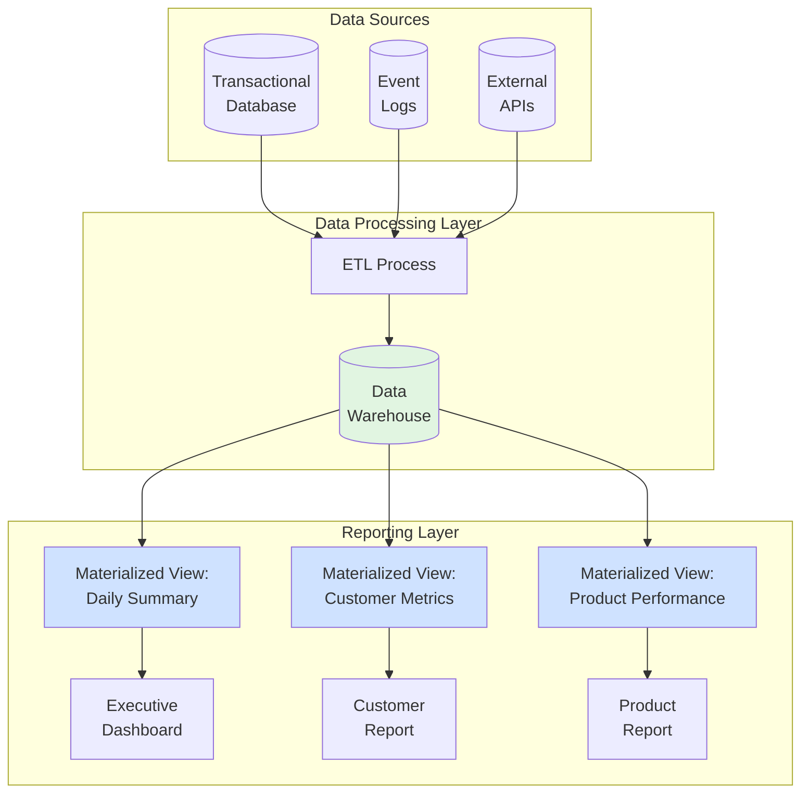
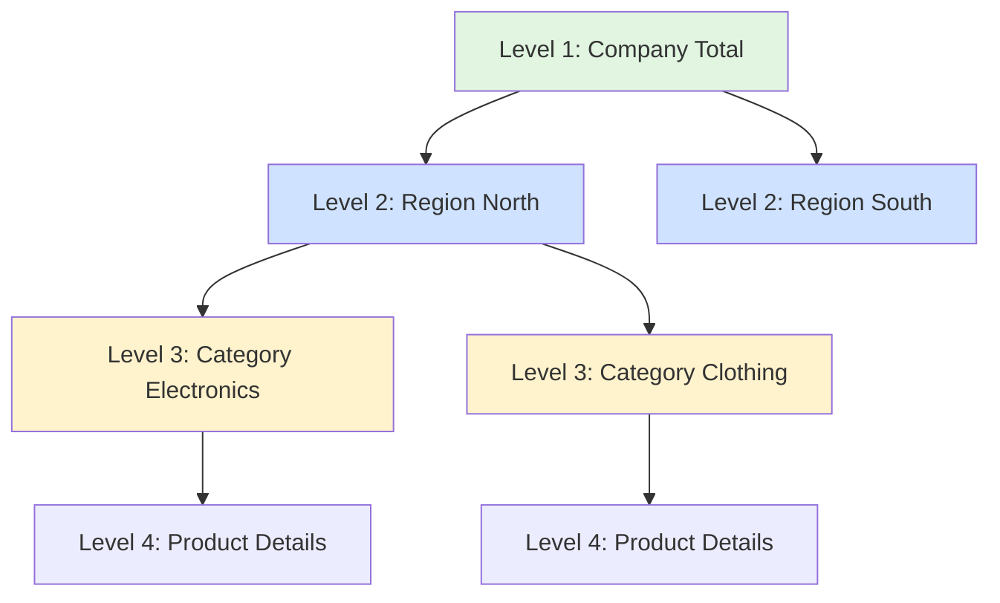

# Reporting Patterns in SQL

<div class="difficulty-badge difficulty-intermediate">Intermediate</div>

## Quick Reference

```sql
-- Executive Summary Report
SELECT
  DATE_TRUNC('month', order_date) as month,
  COUNT(DISTINCT customer_id) as active_customers,
  COUNT(*) as total_orders,
  SUM(amount) as total_revenue,
  ROUND(AVG(amount), 2) as avg_order_value
FROM orders
WHERE order_date >= CURRENT_DATE - INTERVAL '12 months'
GROUP BY DATE_TRUNC('month', order_date)
ORDER BY month DESC;

-- KPI Dashboard Query
WITH kpis AS (
  SELECT
    COUNT(DISTINCT customer_id) as total_customers,
    COUNT(*) as total_orders,
    SUM(amount) as revenue,
    COUNT(*) FILTER (WHERE status = 'completed') as completed_orders
  FROM orders
  WHERE order_date >= CURRENT_DATE - INTERVAL '30 days'
)
SELECT
  total_customers,
  total_orders,
  completed_orders,
  ROUND(100.0 * completed_orders / NULLIF(total_orders, 0), 2) as completion_rate,
  ROUND(revenue, 2) as total_revenue,
  ROUND(revenue / NULLIF(total_orders, 0), 2) as revenue_per_order
FROM kpis;

-- Parameterized Report with Dynamic Filters
SELECT
  product_category,
  product_name,
  SUM(quantity) as units_sold,
  SUM(revenue) as total_revenue
FROM sales
WHERE sale_date BETWEEN :start_date AND :end_date
  AND (:category IS NULL OR product_category = :category)
  AND (:region IS NULL OR region = :region)
GROUP BY product_category, product_name
ORDER BY total_revenue DESC;
```

## Overview

Reporting patterns are SQL query templates designed to extract, transform, and present data for business decision-making. These patterns power dashboards, operational reports, executive summaries, and analytics tools that help organizations understand their performance and make data-driven decisions.

This guide covers essential reporting patterns used in modern business intelligence, from simple KPI dashboards to complex multi-dimensional reports. Whether you're building executive dashboards, operational reports, or ad-hoc analytics, these patterns provide a foundation for effective data reporting.

## Report Architecture

Understanding the reporting data flow is crucial for building efficient, scalable reporting systems.



## Executive Dashboards

Executive dashboards provide high-level KPIs and metrics for leadership decision-making.

### Company Performance Dashboard

```sql
-- Comprehensive executive dashboard with key business metrics
WITH monthly_metrics AS (
  SELECT
    DATE_TRUNC('month', order_date) as month,
    COUNT(DISTINCT customer_id) as active_customers,
    COUNT(DISTINCT CASE
      WHEN order_date >= DATE_TRUNC('month', order_date)
      THEN customer_id
    END) as new_customers,
    COUNT(*) as orders,
    SUM(amount) as revenue,
    AVG(amount) as avg_order_value
  FROM orders
  WHERE order_date >= CURRENT_DATE - INTERVAL '13 months'
    AND status = 'completed'
  GROUP BY DATE_TRUNC('month', order_date)
),
with_growth AS (
  SELECT
    month,
    active_customers,
    new_customers,
    orders,
    revenue,
    avg_order_value,
    -- Month-over-month growth
    LAG(revenue) OVER (ORDER BY month) as prev_month_revenue,
    LAG(active_customers) OVER (ORDER BY month) as prev_month_customers,
    LAG(orders) OVER (ORDER BY month) as prev_month_orders
  FROM monthly_metrics
)
SELECT
  month,
  active_customers,
  new_customers,
  orders,
  ROUND(revenue, 2) as revenue,
  ROUND(avg_order_value, 2) as avg_order_value,
  -- Growth rates
  ROUND(
    100.0 * (revenue - prev_month_revenue) / NULLIF(prev_month_revenue, 0),
    1
  ) as revenue_growth_pct,
  ROUND(
    100.0 * (active_customers - prev_month_customers) / NULLIF(prev_month_customers, 0),
    1
  ) as customer_growth_pct,
  ROUND(
    100.0 * (orders - prev_month_orders) / NULLIF(prev_month_orders, 0),
    1
  ) as order_growth_pct,
  -- Running totals
  SUM(revenue) OVER (ORDER BY month) as cumulative_revenue,
  SUM(new_customers) OVER (ORDER BY month) as cumulative_customers
FROM with_growth
WHERE month >= CURRENT_DATE - INTERVAL '12 months'
ORDER BY month DESC;
```

### Real-Time KPI Dashboard

```sql
-- Real-time KPI dashboard with current vs target metrics
WITH current_period AS (
  SELECT
    COUNT(DISTINCT customer_id) as customers,
    COUNT(*) as orders,
    SUM(amount) as revenue,
    AVG(amount) as avg_order_value,
    COUNT(*) FILTER (WHERE order_date >= CURRENT_DATE) as orders_today
  FROM orders
  WHERE order_date >= DATE_TRUNC('month', CURRENT_DATE)
    AND status = 'completed'
),
targets AS (
  SELECT
    50000 as target_revenue,
    1000 as target_orders,
    500 as target_customers,
    50 as target_avg_order_value
),
last_year_same_period AS (
  SELECT
    SUM(amount) as ly_revenue,
    COUNT(*) as ly_orders,
    COUNT(DISTINCT customer_id) as ly_customers
  FROM orders
  WHERE order_date >= DATE_TRUNC('month', CURRENT_DATE - INTERVAL '1 year')
    AND order_date < DATE_TRUNC('month', CURRENT_DATE - INTERVAL '1 year') + INTERVAL '1 month'
    AND status = 'completed'
)
SELECT
  -- Current metrics
  cp.revenue,
  cp.orders,
  cp.customers,
  ROUND(cp.avg_order_value, 2) as avg_order_value,
  cp.orders_today,

  -- Targets
  t.target_revenue,
  t.target_orders,
  t.target_customers,

  -- Progress to target
  ROUND(100.0 * cp.revenue / NULLIF(t.target_revenue, 0), 1) as revenue_progress_pct,
  ROUND(100.0 * cp.orders / NULLIF(t.target_orders, 0), 1) as orders_progress_pct,
  ROUND(100.0 * cp.customers / NULLIF(t.target_customers, 0), 1) as customers_progress_pct,

  -- Year-over-year comparison
  ROUND(100.0 * (cp.revenue - ly.ly_revenue) / NULLIF(ly.ly_revenue, 0), 1) as yoy_revenue_growth,
  ROUND(100.0 * (cp.orders - ly.ly_orders) / NULLIF(ly.ly_orders, 0), 1) as yoy_order_growth,

  -- Status indicators
  CASE
    WHEN cp.revenue >= t.target_revenue THEN 'On Target'
    WHEN cp.revenue >= t.target_revenue * 0.9 THEN 'At Risk'
    ELSE 'Below Target'
  END as revenue_status
FROM current_period cp
CROSS JOIN targets t
CROSS JOIN last_year_same_period ly;
```

### Multi-Dimensional Executive Summary

```sql
-- Executive summary with breakdowns by multiple dimensions
SELECT
  DATE_TRUNC('quarter', order_date) as quarter,
  region,
  product_category,

  -- Volume metrics
  COUNT(*) as orders,
  COUNT(DISTINCT customer_id) as unique_customers,
  SUM(quantity) as units_sold,

  -- Revenue metrics
  SUM(amount) as revenue,
  ROUND(AVG(amount), 2) as avg_order_value,

  -- Market share within category
  ROUND(
    100.0 * SUM(amount) / SUM(SUM(amount)) OVER (
      PARTITION BY DATE_TRUNC('quarter', order_date), product_category
    ),
    2
  ) as region_share_of_category,

  -- Growth metrics
  ROUND(
    100.0 * (SUM(amount) - LAG(SUM(amount)) OVER (
      PARTITION BY region, product_category
      ORDER BY DATE_TRUNC('quarter', order_date)
    )) / NULLIF(LAG(SUM(amount)) OVER (
      PARTITION BY region, product_category
      ORDER BY DATE_TRUNC('quarter', order_date)
    ), 0),
    1
  ) as qoq_growth_pct,

  -- Ranking
  RANK() OVER (
    PARTITION BY DATE_TRUNC('quarter', order_date)
    ORDER BY SUM(amount) DESC
  ) as revenue_rank
FROM orders
WHERE order_date >= CURRENT_DATE - INTERVAL '2 years'
  AND status = 'completed'
GROUP BY
  DATE_TRUNC('quarter', order_date),
  region,
  product_category
ORDER BY quarter DESC, revenue DESC;
```

## Operational Reports

Operational reports focus on day-to-day business operations and tactical decision-making.

### Daily Operations Dashboard

```sql
-- Daily operations report with hourly breakdown
WITH hourly_data AS (
  SELECT
    DATE(created_at) as date,
    EXTRACT(HOUR FROM created_at) as hour,
    COUNT(*) as orders,
    SUM(amount) as revenue,
    AVG(amount) as avg_order_value,
    COUNT(DISTINCT customer_id) as unique_customers
  FROM orders
  WHERE created_at >= CURRENT_DATE - INTERVAL '7 days'
  GROUP BY DATE(created_at), EXTRACT(HOUR FROM created_at)
)
SELECT
  date,
  hour,
  orders,
  ROUND(revenue, 2) as revenue,
  ROUND(avg_order_value, 2) as avg_order_value,
  unique_customers,

  -- Running totals for the day
  SUM(orders) OVER (
    PARTITION BY date
    ORDER BY hour
  ) as cumulative_daily_orders,

  SUM(revenue) OVER (
    PARTITION BY date
    ORDER BY hour
  ) as cumulative_daily_revenue,

  -- Comparison to average for this hour
  ROUND(
    orders - AVG(orders) OVER (PARTITION BY hour),
    1
  ) as variance_from_avg_hour,

  -- Hour-over-hour change
  orders - LAG(orders) OVER (PARTITION BY date ORDER BY hour) as hour_over_hour_change
FROM hourly_data
ORDER BY date DESC, hour DESC;
```

### Inventory Status Report

```sql
-- Inventory status with reorder recommendations
WITH inventory_metrics AS (
  SELECT
    i.product_id,
    p.product_name,
    p.category,
    i.current_stock,
    i.reorder_point,
    i.reorder_quantity,

    -- Calculate average daily sales
    COALESCE(
      (SELECT AVG(daily_qty)
       FROM (
         SELECT
           DATE(order_date) as date,
           SUM(quantity) as daily_qty
         FROM order_items oi
         WHERE oi.product_id = i.product_id
           AND order_date >= CURRENT_DATE - INTERVAL '30 days'
         GROUP BY DATE(order_date)
       ) daily_sales
      ),
      0
    ) as avg_daily_sales,

    -- Last order date
    (SELECT MAX(order_date)
     FROM order_items oi
     WHERE oi.product_id = i.product_id
    ) as last_order_date,

    -- Pending incoming stock
    COALESCE(
      (SELECT SUM(quantity)
       FROM purchase_orders po
       WHERE po.product_id = i.product_id
         AND po.status = 'pending'
      ),
      0
    ) as pending_stock
  FROM inventory i
  JOIN products p ON i.product_id = p.product_id
)
SELECT
  product_id,
  product_name,
  category,
  current_stock,
  pending_stock,
  current_stock + pending_stock as projected_stock,
  reorder_point,
  avg_daily_sales,

  -- Days of inventory remaining
  CASE
    WHEN avg_daily_sales > 0 THEN
      ROUND(current_stock / avg_daily_sales, 1)
    ELSE NULL
  END as days_of_stock,

  -- Reorder recommendation
  CASE
    WHEN current_stock <= reorder_point AND pending_stock = 0 THEN 'REORDER NOW'
    WHEN current_stock + pending_stock <= reorder_point THEN 'REORDER SOON'
    WHEN avg_daily_sales > 0 AND current_stock / avg_daily_sales < 7 THEN 'LOW STOCK'
    WHEN last_order_date < CURRENT_DATE - INTERVAL '90 days' THEN 'SLOW MOVING'
    ELSE 'ADEQUATE'
  END as stock_status,

  -- Recommended order quantity
  CASE
    WHEN current_stock <= reorder_point THEN reorder_quantity
    ELSE 0
  END as recommended_order_qty,

  last_order_date,
  CURRENT_DATE - last_order_date as days_since_last_order
FROM inventory_metrics
ORDER BY
  CASE
    WHEN current_stock <= reorder_point AND pending_stock = 0 THEN 1
    WHEN current_stock + pending_stock <= reorder_point THEN 2
    ELSE 3
  END,
  avg_daily_sales DESC;
```

### Sales Pipeline Report

```sql
-- Sales pipeline report with conversion tracking
WITH pipeline_stages AS (
  SELECT
    opportunity_id,
    customer_name,
    sales_rep,
    stage,
    estimated_value,
    probability,
    created_date,
    expected_close_date,

    -- Calculate weighted value
    estimated_value * probability / 100.0 as weighted_value,

    -- Days in current stage
    CURRENT_DATE - stage_changed_date as days_in_stage,

    -- Days until expected close
    expected_close_date - CURRENT_DATE as days_to_close,

    -- Total cycle time
    CASE
      WHEN stage = 'Closed Won' THEN closed_date - created_date
      ELSE CURRENT_DATE - created_date
    END as cycle_time_days
  FROM opportunities
  WHERE created_date >= CURRENT_DATE - INTERVAL '90 days'
)
SELECT
  stage,
  COUNT(*) as opportunities,
  COUNT(DISTINCT sales_rep) as active_reps,

  -- Value metrics
  SUM(estimated_value) as total_value,
  SUM(weighted_value) as total_weighted_value,
  ROUND(AVG(estimated_value), 2) as avg_deal_size,
  ROUND(AVG(probability), 1) as avg_probability,

  -- Time metrics
  ROUND(AVG(days_in_stage), 1) as avg_days_in_stage,
  ROUND(AVG(cycle_time_days), 1) as avg_cycle_time,

  -- Distribution
  PERCENTILE_CONT(0.5) WITHIN GROUP (ORDER BY estimated_value) as median_deal_size,

  -- Aging analysis
  COUNT(*) FILTER (WHERE days_in_stage > 30) as aging_over_30_days,
  COUNT(*) FILTER (WHERE days_in_stage > 60) as aging_over_60_days,

  -- Close date analysis
  COUNT(*) FILTER (WHERE expected_close_date < CURRENT_DATE) as overdue,
  COUNT(*) FILTER (
    WHERE expected_close_date BETWEEN CURRENT_DATE AND CURRENT_DATE + INTERVAL '7 days'
  ) as closing_this_week,

  -- Conversion rate (for closed stages)
  CASE stage
    WHEN 'Closed Won' THEN 100.0
    WHEN 'Closed Lost' THEN 0.0
    ELSE NULL
  END as conversion_rate
FROM pipeline_stages
GROUP BY stage
ORDER BY
  CASE stage
    WHEN 'Prospecting' THEN 1
    WHEN 'Qualification' THEN 2
    WHEN 'Proposal' THEN 3
    WHEN 'Negotiation' THEN 4
    WHEN 'Closed Won' THEN 5
    WHEN 'Closed Lost' THEN 6
    ELSE 7
  END;
```

## Parameterized Reports

Parameterized reports allow users to customize report output based on input parameters.

### Flexible Date Range Report

```sql
-- Sales report with flexible date range and filters
-- Parameters: :start_date, :end_date, :region, :category, :min_amount

WITH filtered_sales AS (
  SELECT
    s.sale_id,
    s.sale_date,
    s.customer_id,
    c.customer_name,
    s.product_id,
    p.product_name,
    p.category,
    s.region,
    s.quantity,
    s.unit_price,
    s.quantity * s.unit_price as total_amount
  FROM sales s
  JOIN customers c ON s.customer_id = c.customer_id
  JOIN products p ON s.product_id = p.product_id
  WHERE s.sale_date BETWEEN
    COALESCE(:start_date, CURRENT_DATE - INTERVAL '30 days')
    AND COALESCE(:end_date, CURRENT_DATE)
    AND (:region IS NULL OR s.region = :region)
    AND (:category IS NULL OR p.category = :category)
),
sales_summary AS (
  SELECT
    sale_date,
    region,
    category,
    COUNT(*) as transaction_count,
    SUM(quantity) as total_units,
    SUM(total_amount) as total_sales,
    AVG(total_amount) as avg_transaction_value,
    COUNT(DISTINCT customer_id) as unique_customers
  FROM filtered_sales
  WHERE total_amount >= COALESCE(:min_amount, 0)
  GROUP BY sale_date, region, category
)
SELECT
  sale_date,
  region,
  category,
  transaction_count,
  total_units,
  ROUND(total_sales, 2) as total_sales,
  ROUND(avg_transaction_value, 2) as avg_transaction_value,
  unique_customers,

  -- Running totals
  SUM(total_sales) OVER (
    PARTITION BY region, category
    ORDER BY sale_date
  ) as cumulative_sales,

  -- Percentage of total
  ROUND(
    100.0 * total_sales / SUM(total_sales) OVER (PARTITION BY region),
    2
  ) as pct_of_region_sales
FROM sales_summary
ORDER BY sale_date DESC, total_sales DESC;
```

### Dynamic Grouping Report

```sql
-- Report with dynamic grouping based on parameter
-- Parameters: :group_by ('day', 'week', 'month', 'quarter', 'year')

WITH date_grouped_sales AS (
  SELECT
    CASE :group_by
      WHEN 'day' THEN DATE(order_date)
      WHEN 'week' THEN DATE_TRUNC('week', order_date)::date
      WHEN 'month' THEN DATE_TRUNC('month', order_date)::date
      WHEN 'quarter' THEN DATE_TRUNC('quarter', order_date)::date
      WHEN 'year' THEN DATE_TRUNC('year', order_date)::date
      ELSE DATE(order_date)
    END as period,

    region,
    COUNT(*) as orders,
    SUM(amount) as revenue,
    COUNT(DISTINCT customer_id) as customers
  FROM orders
  WHERE order_date >= CURRENT_DATE - INTERVAL '2 years'
    AND status = 'completed'
  GROUP BY
    CASE :group_by
      WHEN 'day' THEN DATE(order_date)
      WHEN 'week' THEN DATE_TRUNC('week', order_date)::date
      WHEN 'month' THEN DATE_TRUNC('month', order_date)::date
      WHEN 'quarter' THEN DATE_TRUNC('quarter', order_date)::date
      WHEN 'year' THEN DATE_TRUNC('year', order_date)::date
      ELSE DATE(order_date)
    END,
    region
)
SELECT
  period,
  region,
  orders,
  ROUND(revenue, 2) as revenue,
  customers,
  ROUND(revenue / NULLIF(orders, 0), 2) as avg_order_value,

  -- Period-over-period growth
  ROUND(
    100.0 * (revenue - LAG(revenue) OVER (PARTITION BY region ORDER BY period)) /
    NULLIF(LAG(revenue) OVER (PARTITION BY region ORDER BY period), 0),
    1
  ) as growth_pct
FROM date_grouped_sales
ORDER BY period DESC, revenue DESC;
```

## Cross-Tab and Pivot Reports

Cross-tab reports display data in a matrix format for easy comparison across dimensions.

### Product Category Performance Matrix

```sql
-- Cross-tab report: Categories vs Regions
SELECT
  category,

  -- Revenue by region
  ROUND(SUM(amount) FILTER (WHERE region = 'North'), 2) as north_revenue,
  ROUND(SUM(amount) FILTER (WHERE region = 'South'), 2) as south_revenue,
  ROUND(SUM(amount) FILTER (WHERE region = 'East'), 2) as east_revenue,
  ROUND(SUM(amount) FILTER (WHERE region = 'West'), 2) as west_revenue,

  -- Total
  ROUND(SUM(amount), 2) as total_revenue,

  -- Units by region
  SUM(quantity) FILTER (WHERE region = 'North') as north_units,
  SUM(quantity) FILTER (WHERE region = 'South') as south_units,
  SUM(quantity) FILTER (WHERE region = 'East') as east_units,
  SUM(quantity) FILTER (WHERE region = 'West') as west_units,

  -- Total units
  SUM(quantity) as total_units,

  -- Best performing region
  (array_agg(region ORDER BY SUM(amount) DESC))[1] as top_region,

  -- Regional concentration (Herfindahl index)
  ROUND(
    SUM(POWER(
      SUM(amount) FILTER (WHERE region = region) / NULLIF(SUM(amount), 0),
      2
    )),
    3
  ) as regional_concentration
FROM sales s
JOIN products p ON s.product_id = p.product_id
WHERE sale_date >= CURRENT_DATE - INTERVAL '90 days'
GROUP BY category
ORDER BY total_revenue DESC;
```

### Time-Based Cross-Tab

```sql
-- Monthly performance by product line
WITH monthly_sales AS (
  SELECT
    DATE_TRUNC('month', sale_date) as month,
    product_line,
    SUM(amount) as revenue
  FROM sales s
  JOIN products p ON s.product_id = p.product_id
  WHERE sale_date >= CURRENT_DATE - INTERVAL '12 months'
  GROUP BY DATE_TRUNC('month', sale_date), product_line
)
SELECT
  month,

  -- Revenue by product line (pivot)
  SUM(revenue) FILTER (WHERE product_line = 'Electronics') as electronics,
  SUM(revenue) FILTER (WHERE product_line = 'Clothing') as clothing,
  SUM(revenue) FILTER (WHERE product_line = 'Home & Garden') as home_garden,
  SUM(revenue) FILTER (WHERE product_line = 'Sports') as sports,
  SUM(revenue) FILTER (WHERE product_line = 'Books') as books,

  -- Total
  SUM(revenue) as total,

  -- Month-over-month change for each product line
  ROUND(
    100.0 * (
      SUM(revenue) FILTER (WHERE product_line = 'Electronics') -
      LAG(SUM(revenue) FILTER (WHERE product_line = 'Electronics')) OVER (ORDER BY month)
    ) / NULLIF(
      LAG(SUM(revenue) FILTER (WHERE product_line = 'Electronics')) OVER (ORDER BY month),
      0
    ),
    1
  ) as electronics_mom_pct
FROM monthly_sales
GROUP BY month
ORDER BY month DESC;
```

### Dynamic Pivot with JSON

```sql
-- Dynamic pivot report using JSON aggregation
-- Useful when pivot columns are not known in advance
SELECT
  category,

  -- Aggregate revenue by region into JSON object
  jsonb_object_agg(
    region,
    ROUND(total_revenue, 2)
  ) as revenue_by_region,

  -- Aggregate units by region into JSON object
  jsonb_object_agg(
    region,
    total_units
  ) as units_by_region,

  -- Overall metrics
  SUM(total_revenue) as total_revenue,
  SUM(total_units) as total_units
FROM (
  SELECT
    p.category,
    s.region,
    SUM(s.amount) as total_revenue,
    SUM(s.quantity) as total_units
  FROM sales s
  JOIN products p ON s.product_id = p.product_id
  WHERE s.sale_date >= CURRENT_DATE - INTERVAL '30 days'
  GROUP BY p.category, s.region
) regional_sales
GROUP BY category
ORDER BY total_revenue DESC;
```

## Drill-Down Reports

Drill-down reports allow users to navigate from summary to detail level.

### Hierarchical Drill-Down Report



```sql
-- Multi-level drill-down report with ROLLUP
SELECT
  region,
  category,
  product_name,

  -- Metrics
  COUNT(*) as transaction_count,
  SUM(quantity) as total_units,
  ROUND(SUM(amount), 2) as total_revenue,
  ROUND(AVG(amount), 2) as avg_transaction_value,

  -- Level indicator
  CASE
    WHEN region IS NULL THEN 'GRAND TOTAL'
    WHEN category IS NULL THEN 'Region Total'
    WHEN product_name IS NULL THEN 'Category Total'
    ELSE 'Product Detail'
  END as report_level,

  -- Percentage of parent
  ROUND(
    100.0 * SUM(amount) / NULLIF(
      SUM(SUM(amount)) OVER (
        PARTITION BY region, category
      ),
      0
    ),
    2
  ) as pct_of_category
FROM sales s
JOIN products p ON s.product_id = p.product_id
WHERE sale_date >= CURRENT_DATE - INTERVAL '30 days'
GROUP BY ROLLUP(region, category, product_name)
ORDER BY
  COALESCE(region, 'ZZZZZ'),
  COALESCE(category, 'ZZZZZ'),
  COALESCE(product_name, 'ZZZZZ'),
  total_revenue DESC;
```

### Click-Through Drill-Down

```sql
-- Summary level (first view)
CREATE VIEW sales_summary_by_region AS
SELECT
  region,
  COUNT(*) as orders,
  SUM(amount) as revenue,
  COUNT(DISTINCT customer_id) as customers,
  ROUND(AVG(amount), 2) as avg_order_value
FROM orders
WHERE order_date >= CURRENT_DATE - INTERVAL '30 days'
  AND status = 'completed'
GROUP BY region
ORDER BY revenue DESC;

-- Drill-down level 1: Region details
CREATE OR REPLACE FUNCTION get_region_details(p_region VARCHAR)
RETURNS TABLE (
  category VARCHAR,
  orders BIGINT,
  revenue DECIMAL,
  customers BIGINT,
  avg_order_value DECIMAL
) AS $$
BEGIN
  RETURN QUERY
  SELECT
    p.category,
    COUNT(*)::BIGINT as orders,
    SUM(o.amount)::DECIMAL as revenue,
    COUNT(DISTINCT o.customer_id)::BIGINT as customers,
    ROUND(AVG(o.amount), 2)::DECIMAL as avg_order_value
  FROM orders o
  JOIN order_items oi ON o.order_id = oi.order_id
  JOIN products p ON oi.product_id = p.product_id
  WHERE o.region = p_region
    AND o.order_date >= CURRENT_DATE - INTERVAL '30 days'
    AND o.status = 'completed'
  GROUP BY p.category
  ORDER BY revenue DESC;
END;
$$ LANGUAGE plpgsql;

-- Drill-down level 2: Category details
CREATE OR REPLACE FUNCTION get_category_details(
  p_region VARCHAR,
  p_category VARCHAR
)
RETURNS TABLE (
  product_name VARCHAR,
  sku VARCHAR,
  units_sold BIGINT,
  revenue DECIMAL,
  avg_price DECIMAL
) AS $$
BEGIN
  RETURN QUERY
  SELECT
    p.product_name,
    p.sku,
    SUM(oi.quantity)::BIGINT as units_sold,
    SUM(oi.quantity * oi.unit_price)::DECIMAL as revenue,
    ROUND(AVG(oi.unit_price), 2)::DECIMAL as avg_price
  FROM orders o
  JOIN order_items oi ON o.order_id = oi.order_id
  JOIN products p ON oi.product_id = p.product_id
  WHERE o.region = p_region
    AND p.category = p_category
    AND o.order_date >= CURRENT_DATE - INTERVAL '30 days'
    AND o.status = 'completed'
  GROUP BY p.product_name, p.sku
  ORDER BY revenue DESC;
END;
$$ LANGUAGE plpgsql;

-- Usage
SELECT * FROM sales_summary_by_region;
SELECT * FROM get_region_details('North');
SELECT * FROM get_category_details('North', 'Electronics');
```

## Report Performance Optimization

Optimizing report performance is critical for large datasets and complex queries.

### Materialized Views for Report Tables

```sql
-- Create materialized view for frequently accessed report
CREATE MATERIALIZED VIEW mv_daily_sales_summary AS
SELECT
  DATE(order_date) as sale_date,
  region,
  category,
  COUNT(*) as order_count,
  SUM(quantity) as total_units,
  SUM(amount) as total_revenue,
  AVG(amount) as avg_order_value,
  COUNT(DISTINCT customer_id) as unique_customers,

  -- Pre-calculate percentiles for performance
  PERCENTILE_CONT(0.5) WITHIN GROUP (ORDER BY amount) as median_order_value,
  PERCENTILE_CONT(0.95) WITHIN GROUP (ORDER BY amount) as p95_order_value
FROM orders o
JOIN order_items oi ON o.order_id = oi.order_id
JOIN products p ON oi.product_id = p.product_id
WHERE o.status = 'completed'
GROUP BY DATE(order_date), region, category;

-- Create indexes on materialized view
CREATE INDEX idx_mv_daily_sales_date ON mv_daily_sales_summary(sale_date DESC);
CREATE INDEX idx_mv_daily_sales_region ON mv_daily_sales_summary(region, sale_date DESC);
CREATE INDEX idx_mv_daily_sales_category ON mv_daily_sales_summary(category, sale_date DESC);

-- Refresh strategy (incremental)
CREATE OR REPLACE FUNCTION refresh_daily_sales_summary()
RETURNS VOID AS $$
BEGIN
  -- Delete recent data
  DELETE FROM mv_daily_sales_summary
  WHERE sale_date >= CURRENT_DATE - INTERVAL '7 days';

  -- Re-insert recent data
  INSERT INTO mv_daily_sales_summary
  SELECT
    DATE(order_date) as sale_date,
    region,
    category,
    COUNT(*) as order_count,
    SUM(quantity) as total_units,
    SUM(amount) as total_revenue,
    AVG(amount) as avg_order_value,
    COUNT(DISTINCT customer_id) as unique_customers,
    PERCENTILE_CONT(0.5) WITHIN GROUP (ORDER BY amount) as median_order_value,
    PERCENTILE_CONT(0.95) WITHIN GROUP (ORDER BY amount) as p95_order_value
  FROM orders o
  JOIN order_items oi ON o.order_id = oi.order_id
  JOIN products p ON oi.product_id = p.product_id
  WHERE o.status = 'completed'
    AND DATE(order_date) >= CURRENT_DATE - INTERVAL '7 days'
  GROUP BY DATE(order_date), region, category;
END;
$$ LANGUAGE plpgsql;

-- Schedule refresh (PostgreSQL with pg_cron)
-- SELECT cron.schedule('refresh-sales-summary', '0 1 * * *', 'SELECT refresh_daily_sales_summary()');
```

### Pre-Aggregated Reporting Tables

```sql
-- Create pre-aggregated table for fast reporting
CREATE TABLE report_monthly_metrics (
  report_month DATE NOT NULL,
  region VARCHAR(50) NOT NULL,
  category VARCHAR(100) NOT NULL,

  -- Volume metrics
  order_count INTEGER,
  customer_count INTEGER,
  units_sold INTEGER,

  -- Revenue metrics
  total_revenue DECIMAL(15, 2),
  avg_order_value DECIMAL(10, 2),
  median_order_value DECIMAL(10, 2),

  -- Growth metrics
  revenue_mom_pct DECIMAL(5, 2),
  orders_mom_pct DECIMAL(5, 2),

  -- Metadata
  last_updated_at TIMESTAMP DEFAULT CURRENT_TIMESTAMP,

  PRIMARY KEY (report_month, region, category)
);

-- Create indexes
CREATE INDEX idx_report_monthly_month ON report_monthly_metrics(report_month DESC);
CREATE INDEX idx_report_monthly_region ON report_monthly_metrics(region, report_month DESC);

-- Populate pre-aggregated table
INSERT INTO report_monthly_metrics (
  report_month,
  region,
  category,
  order_count,
  customer_count,
  units_sold,
  total_revenue,
  avg_order_value,
  median_order_value,
  revenue_mom_pct,
  orders_mom_pct
)
WITH monthly_data AS (
  SELECT
    DATE_TRUNC('month', order_date)::DATE as month,
    region,
    category,
    COUNT(*) as orders,
    COUNT(DISTINCT customer_id) as customers,
    SUM(quantity) as units,
    SUM(amount) as revenue,
    AVG(amount) as avg_value,
    PERCENTILE_CONT(0.5) WITHIN GROUP (ORDER BY amount) as median_value
  FROM orders o
  JOIN order_items oi ON o.order_id = oi.order_id
  JOIN products p ON oi.product_id = p.product_id
  WHERE o.status = 'completed'
  GROUP BY DATE_TRUNC('month', order_date)::DATE, region, category
),
with_growth AS (
  SELECT
    *,
    ROUND(
      100.0 * (revenue - LAG(revenue) OVER (
        PARTITION BY region, category ORDER BY month
      )) / NULLIF(LAG(revenue) OVER (
        PARTITION BY region, category ORDER BY month
      ), 0),
      2
    ) as rev_growth,
    ROUND(
      100.0 * (orders - LAG(orders) OVER (
        PARTITION BY region, category ORDER BY month
      )) / NULLIF(LAG(orders) OVER (
        PARTITION BY region, category ORDER BY month
      ), 0),
      2
    ) as ord_growth
  FROM monthly_data
)
SELECT
  month,
  region,
  category,
  orders,
  customers,
  units,
  revenue,
  ROUND(avg_value, 2),
  ROUND(median_value, 2),
  rev_growth,
  ord_growth
FROM with_growth
ON CONFLICT (report_month, region, category) DO UPDATE SET
  order_count = EXCLUDED.order_count,
  customer_count = EXCLUDED.customer_count,
  units_sold = EXCLUDED.units_sold,
  total_revenue = EXCLUDED.total_revenue,
  avg_order_value = EXCLUDED.avg_order_value,
  median_order_value = EXCLUDED.median_order_value,
  revenue_mom_pct = EXCLUDED.revenue_mom_pct,
  orders_mom_pct = EXCLUDED.orders_mom_pct,
  last_updated_at = CURRENT_TIMESTAMP;
```

### Query Optimization for Reports

```sql
-- ❌ Inefficient: Repeated subqueries
SELECT
  customer_id,
  (SELECT COUNT(*) FROM orders o WHERE o.customer_id = c.customer_id) as order_count,
  (SELECT SUM(amount) FROM orders o WHERE o.customer_id = c.customer_id) as total_spent,
  (SELECT MAX(order_date) FROM orders o WHERE o.customer_id = c.customer_id) as last_order
FROM customers c;

-- ✅ Efficient: Single join with aggregation
SELECT
  c.customer_id,
  c.customer_name,
  COALESCE(o.order_count, 0) as order_count,
  COALESCE(o.total_spent, 0) as total_spent,
  o.last_order
FROM customers c
LEFT JOIN (
  SELECT
    customer_id,
    COUNT(*) as order_count,
    SUM(amount) as total_spent,
    MAX(order_date) as last_order
  FROM orders
  GROUP BY customer_id
) o ON c.customer_id = o.customer_id;

-- ❌ Inefficient: Multiple passes over data
SELECT region, SUM(amount) FROM orders GROUP BY region;
SELECT category, SUM(amount) FROM orders o JOIN products p ON o.product_id = p.product_id GROUP BY category;

-- ✅ Efficient: Single pass with GROUPING SETS
SELECT
  CASE WHEN GROUPING(region) = 0 THEN region END as region,
  CASE WHEN GROUPING(category) = 0 THEN category END as category,
  SUM(amount) as total_revenue,
  CASE
    WHEN GROUPING(region) = 0 AND GROUPING(category) = 1 THEN 'By Region'
    WHEN GROUPING(region) = 1 AND GROUPING(category) = 0 THEN 'By Category'
    ELSE 'Grand Total'
  END as grouping_level
FROM orders o
JOIN products p ON o.product_id = p.product_id
GROUP BY GROUPING SETS (
  (region),
  (category),
  ()
);
```

## Report Scheduling and Delivery

Automate report generation and delivery for regular business needs.

### Scheduled Report Metadata

```sql
-- Table to track scheduled reports
CREATE TABLE scheduled_reports (
  report_id SERIAL PRIMARY KEY,
  report_name VARCHAR(255) NOT NULL,
  report_query TEXT NOT NULL,
  schedule_expression VARCHAR(100), -- Cron expression
  output_format VARCHAR(20) DEFAULT 'CSV', -- CSV, JSON, Excel
  delivery_method VARCHAR(50) DEFAULT 'Email', -- Email, S3, SFTP
  delivery_config JSONB, -- Email addresses, S3 bucket, etc.
  enabled BOOLEAN DEFAULT TRUE,
  created_at TIMESTAMP DEFAULT CURRENT_TIMESTAMP,
  created_by VARCHAR(100),
  last_run_at TIMESTAMP,
  next_run_at TIMESTAMP
);

-- Table to track report execution history
CREATE TABLE report_execution_log (
  execution_id SERIAL PRIMARY KEY,
  report_id INTEGER REFERENCES scheduled_reports(report_id),
  started_at TIMESTAMP DEFAULT CURRENT_TIMESTAMP,
  completed_at TIMESTAMP,
  status VARCHAR(20), -- 'Running', 'Success', 'Failed'
  row_count INTEGER,
  error_message TEXT,
  output_location VARCHAR(500)
);

-- Insert scheduled report
INSERT INTO scheduled_reports (
  report_name,
  report_query,
  schedule_expression,
  output_format,
  delivery_method,
  delivery_config
)
VALUES (
  'Daily Sales Summary',
  'SELECT * FROM mv_daily_sales_summary WHERE sale_date = CURRENT_DATE - 1',
  '0 6 * * *', -- Every day at 6 AM
  'CSV',
  'Email',
  '{"recipients": ["sales@company.com", "managers@company.com"], "subject": "Daily Sales Report"}'::jsonb
);
```

### Incremental Report Generation

```sql
-- Track last report generation time per report type
CREATE TABLE report_watermarks (
  report_name VARCHAR(255) PRIMARY KEY,
  last_processed_timestamp TIMESTAMP NOT NULL,
  last_processed_id BIGINT,
  updated_at TIMESTAMP DEFAULT CURRENT_TIMESTAMP
);

-- Incremental report: New customers since last run
CREATE OR REPLACE FUNCTION generate_new_customers_report()
RETURNS TABLE (
  customer_id VARCHAR,
  customer_name VARCHAR,
  email VARCHAR,
  signup_date TIMESTAMP,
  first_order_date TIMESTAMP,
  total_orders INTEGER,
  total_spent DECIMAL
) AS $$
DECLARE
  v_last_processed TIMESTAMP;
BEGIN
  -- Get last processed timestamp
  SELECT last_processed_timestamp INTO v_last_processed
  FROM report_watermarks
  WHERE report_name = 'new_customers_report';

  -- Default to 24 hours ago if not found
  v_last_processed := COALESCE(v_last_processed, CURRENT_TIMESTAMP - INTERVAL '24 hours');

  -- Return incremental data
  RETURN QUERY
  SELECT
    c.customer_id,
    c.customer_name,
    c.email,
    c.created_at as signup_date,
    MIN(o.order_date) as first_order_date,
    COUNT(o.order_id)::INTEGER as total_orders,
    COALESCE(SUM(o.amount), 0)::DECIMAL as total_spent
  FROM customers c
  LEFT JOIN orders o ON c.customer_id = o.customer_id
  WHERE c.created_at > v_last_processed
  GROUP BY c.customer_id, c.customer_name, c.email, c.created_at
  ORDER BY c.created_at DESC;

  -- Update watermark
  INSERT INTO report_watermarks (report_name, last_processed_timestamp)
  VALUES ('new_customers_report', CURRENT_TIMESTAMP)
  ON CONFLICT (report_name) DO UPDATE
  SET last_processed_timestamp = CURRENT_TIMESTAMP,
      updated_at = CURRENT_TIMESTAMP;
END;
$$ LANGUAGE plpgsql;
```

## Best Practices

### 1. Use Appropriate Aggregation Levels

```sql
-- ✅ Good: Pre-aggregate at appropriate level
CREATE MATERIALIZED VIEW mv_hourly_metrics AS
SELECT
  DATE_TRUNC('hour', created_at) as hour,
  COUNT(*) as events,
  SUM(amount) as revenue
FROM transactions
GROUP BY DATE_TRUNC('hour', created_at);

-- ❌ Bad: Over-granular (row-level) for aggregate reports
SELECT * FROM transactions; -- Then aggregate in application layer
```

### 2. Implement Data Freshness Indicators

```sql
-- ✅ Good: Show when data was last updated
SELECT
  'Sales Dashboard' as report_name,
  MAX(order_date) as latest_data_date,
  CURRENT_TIMESTAMP as report_generated_at,
  EXTRACT(EPOCH FROM (CURRENT_TIMESTAMP - MAX(order_date))) / 3600 as data_age_hours
FROM orders;
```

### 3. Use Consistent Naming Conventions

```sql
-- ✅ Good: Clear, consistent naming
SELECT
  report_month,
  total_revenue,
  revenue_mom_pct as revenue_growth_mom,
  revenue_yoy_pct as revenue_growth_yoy
FROM monthly_reports;

-- ❌ Bad: Inconsistent naming
SELECT
  month,
  rev,
  mom as growth1,
  yoy_pct as growth2
FROM monthly_reports;
```

### 4. Include Metadata in Reports

```sql
-- ✅ Good: Include report metadata
SELECT
  -- Data
  *,
  -- Metadata
  CURRENT_TIMESTAMP as report_generated_at,
  'v2.1' as report_version,
  USER as generated_by
FROM sales_summary;
```

### 5. Handle NULL Values Explicitly

```sql
-- ✅ Good: Explicit NULL handling
SELECT
  product_name,
  COALESCE(units_sold, 0) as units_sold,
  COALESCE(revenue, 0.00) as revenue,
  CASE
    WHEN last_sale_date IS NULL THEN 'Never Sold'
    ELSE TO_CHAR(last_sale_date, 'YYYY-MM-DD')
  END as last_sale_date
FROM product_summary;

-- ❌ Bad: NULLs in report output
SELECT
  product_name,
  units_sold,
  revenue,
  last_sale_date
FROM product_summary;
```

## Common Pitfalls

### 1. Not Considering Time Zones

```sql
-- ❌ Problem: UTC vs local time confusion
SELECT
  DATE(order_timestamp) as order_date,
  COUNT(*) as orders
FROM orders
GROUP BY DATE(order_timestamp);

-- ✅ Solution: Convert to business timezone
SELECT
  DATE(order_timestamp AT TIME ZONE 'America/New_York') as order_date,
  COUNT(*) as orders
FROM orders
GROUP BY DATE(order_timestamp AT TIME ZONE 'America/New_York');
```

### 2. Cartesian Product in Joins

```sql
-- ❌ Problem: Unintended cartesian product
SELECT
  c.customer_name,
  COUNT(*) as order_count, -- Wrong!
  SUM(oi.quantity) as total_items -- Wrong!
FROM customers c
JOIN orders o ON c.customer_id = o.customer_id
JOIN order_items oi ON o.order_id = oi.order_id
GROUP BY c.customer_name;

-- ✅ Solution: Aggregate before joining
SELECT
  c.customer_name,
  o.order_count,
  oi.total_items
FROM customers c
LEFT JOIN (
  SELECT customer_id, COUNT(*) as order_count
  FROM orders
  GROUP BY customer_id
) o ON c.customer_id = o.customer_id
LEFT JOIN (
  SELECT o.customer_id, SUM(oi.quantity) as total_items
  FROM orders o
  JOIN order_items oi ON o.order_id = oi.order_id
  GROUP BY o.customer_id
) oi ON c.customer_id = oi.customer_id;
```

### 3. Missing Performance Indexes

```sql
-- ❌ Problem: No indexes on filter/join columns
SELECT *
FROM orders
WHERE customer_id = 12345
  AND order_date >= '2024-01-01';

-- ✅ Solution: Create appropriate indexes
CREATE INDEX idx_orders_customer_date
  ON orders(customer_id, order_date DESC);
CREATE INDEX idx_orders_date
  ON orders(order_date DESC);
```

### 4. Inefficient Date Range Queries

```sql
-- ❌ Problem: Function on indexed column prevents index use
SELECT *
FROM orders
WHERE DATE(order_timestamp) = '2024-11-20';

-- ✅ Solution: Use range query
SELECT *
FROM orders
WHERE order_timestamp >= '2024-11-20'
  AND order_timestamp < '2024-11-21';
```

### 5. Not Handling Division by Zero

```sql
-- ❌ Problem: Division by zero errors
SELECT
  category,
  total_revenue / total_orders as avg_order_value
FROM category_summary;

-- ✅ Solution: Use NULLIF
SELECT
  category,
  ROUND(total_revenue / NULLIF(total_orders, 0), 2) as avg_order_value
FROM category_summary;
```

## Try It Yourself

<SQLAssistant mode="generate" default-dialect="postgresql" :show-model-selector="false" />

## See Also

- [Analytics Patterns](/patterns/analytics/) - Advanced analytics and cohort analysis
- [Window Functions](/concepts/window-functions/) - Window functions for reporting
- [Aggregations](/concepts/aggregations/) - Grouping and aggregating data
- [CTEs](/concepts/ctes/) - Common Table Expressions for complex reports
- [Performance](/concepts/performance/) - Optimizing report queries
- [ETL Patterns](/patterns/etl/) - Building data pipelines for reporting
